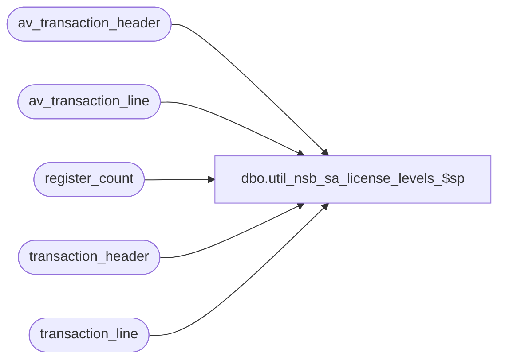

# dbo.util_nsb_sa_license_levels_$sp

**Database:** auditworks  
**Server:** bedrockdb01  

## Architecture Diagram



## Table Dependencies

| Referenced Table |
|---|
| av_transaction_header |
| av_transaction_line |
| register_count |
| transaction_header |
| transaction_line |

## Stored Procedure Code

```sql
CREATE proc [dbo].[util_nsb_sa_license_levels_$sp] AS
 
DECLARE	
@from_date		smalldatetime,
@to_date		smalldatetime,
@reg_count		integer,
@store_count		integer,
@days			integer

--Author Shapoor Marolia Oct. 17, 2007
--Use this utilitity to Count the number of Store/Reg combinations used in the past 2 weeks.
--A register is defined by the fact that it has a "Sale" or a "Return" transaction assosiated to it.

SELECT @days = 7  --SET the number of days you need

SELECT @to_date = CONVERT(smalldatetime,CONVERT(char(10),dateadd(dd,-1,getdate()),103),103)
SELECT @from_date = CONVERT(smalldatetime,CONVERT(char(10),dateadd(dd,(@days*-1),getdate()),103),103)


IF EXISTS (SELECT * FROM dbo.sysobjects WHERE id = Object_id('dbo.register_count') and type in ('U','S'))
BEGIN
  DROP TABLE dbo.register_count
END


--Get a list of store/reg combos that have a Sale or a Return transaction.
SELECT th.store_no,
       th.register_no,
       Max(transaction_date) as transaction_date, 
       1 as curr 
  INTO register_count
  FROM transaction_line tl, transaction_header th
 WHERE th.transaction_id = tl.transaction_id
   AND th.transaction_void_flag in (0,8)
   AND th.date_reject_id = 0
   AND tl.line_void_flag = 0
   AND transaction_date BETWEEN @from_date and @to_date
   AND tl.line_action IN (1,2)
GROUP BY store_no,register_no


INSERT INTO register_count (store_no,register_no,transaction_date,curr)
SELECT th.store_no, th.register_no, Max(th.transaction_date) as transaction_date,0 as curr 
  FROM av_transaction_line tl,  av_transaction_header th 
 WHERE th.av_transaction_id = tl.av_transaction_id 
   AND th.transaction_void_flag in (0,8)
   AND th.date_reject_id = 0
   AND tl.line_void_flag = 0
   AND th.transaction_date BETWEEN @from_date and @to_date
   AND tl.line_action in (1,2) 
GROUP BY th.store_no,th.register_no

SELECT @reg_count = count(*)
  FROM (SELECT store_no,register_no
          FROM register_count
        GROUP BY store_no,register_no) table_a

SELECT @store_count = count(*)
  FROM (SELECT distinct store_no
          FROM register_count) table_a


SELECT 'Report to get a count of Store and Store/Reg combinations that had Sales/Return Transactions:'
SELECT 'Report was run on: ' + convert(char,getdate()) + 'For Period '+ convert(char,@from_date) + ' to ' + convert(char,@to_date)

SELECT 'Total number of Stores Used is : ' + convert(char,@store_count)
SELECT 'Total number of Store/Register Combinations Used is : ' + convert(char,@reg_count)


dbo,dt_generateansiname,/* 
**	Generate an ansi name that is unique in the dtproperties.value column 
*/ 
create procedure dbo.dt_generateansiname(@name varchar(255) output) 
as 
	declare @prologue varchar(20) 
	declare @indexstring varchar(20) 
	declare @index integer 
 
	set @prologue = 'MSDT-A-' 
	set @index = 1 
 
	while 1 = 1 
	begin 
		set @indexstring = cast(@index as varchar(20)) 
		set @name = @prologue + @indexstring 
		if not exists (select value from dtproperties where value = @name) 
			break 
		 
		set @index = @index + 1 
 
		if (@index = 10000) 
			goto TooMany 
	end 
 
Leave: 
 
	return 
 
TooMany: 
 
	set @name = 'DIAGRAM' 
	goto Leave
```

