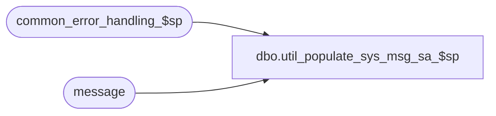

# dbo.util_populate_sys_msg_sa_$sp

**Database:** auditworks  
**Server:** bedrockdb01  

## Architecture Diagram



## Table Dependencies

| Referenced Table |
|---|
| common_error_handling_$sp |
| message |

## Stored Procedure Code

```sql
create proc dbo.util_populate_sys_msg_sa_$sp 
AS

/* Proc Name: util_populate_sys_msg_sa_$sp
   DESC: Populate a general mask into the sys.messages table for each row that exists in the SA message table
         for rows that are used by backend raiserror.
   

HISTORY
Date     Name         Defect# Desc
Dec20,13 Paul          147019 author.
*/


DECLARE
	@errmsg			nvarchar(2000),
	@errmsg2			nvarchar(2000),
	@errmsg3			nvarchar(2000),
	@errline			int,
	@errno			int,
	@lang_id			smallint,
	@rows				int,
	@process_id			int,
	@process_name		        nvarchar(100),
	@process_no			smallint,
	@message_id		        int,	
	@object_name			nvarchar(255),
	@operation_name			nvarchar(255),
	@sql_command 			nvarchar(2000),
	@cursor_open			tinyint,
	@row_counter			int;

SELECT @process_name = 'util_populate_sys_msg_sa_$sp',
       @process_no = 0,
       @message_id = 201068,
       @process_id = @@spid,
       @object_name = 'sys.message',
       @operation_name = 'INSERT',
       @cursor_open = 0,
       @rows = 0;

BEGIN TRY

SELECT @lang_id = msglangid
      FROM sys.syslanguages
     WHERE name = @@language;

-- Create rows in sys.messages for messages in the backend raiserror range

-- add the messages using the default lang_id 1033 (US English)

PRINT 'Searching for messages';

DECLARE msg_cursor CURSOR FAST_FORWARD
    FOR
 SELECT m.id as message_id 
   FROM message m
  WHERE NOT EXISTS (SELECT 1 from sys.messages s
                    WHERE s.message_id = m.id
                      AND language_id = 1033)
    AND m.id >= 201500
    AND m.id <= 202499;

OPEN msg_cursor;
 SELECT @cursor_open = 1;
 
 FETCH msg_cursor
  INTO @message_id;

 WHILE @@fetch_status = 0 
 BEGIN

  IF NOT EXISTS (SELECT 1 FROM sys.messages
                  WHERE message_id = @message_id
                    AND language_id = 1033)
    BEGIN
    SELECT @sql_command = 
     N'sp_addmessage @msgnum = ' + CONVERT(nvarchar,@message_id) 
      + N', @severity = 16, @msgtext = ''%s'', @lang = ''us_english''',
     @row_counter = @row_counter + 1;

    EXEC sp_executesql @sql_command;
    END;

  FETCH msg_cursor
  INTO @message_id;
 END; /* while not end of cursor */

CLOSE msg_cursor;
DEALLOCATE msg_cursor;
SELECT @cursor_open = 0;


/* Repeat for current language if it is not us_english */


/* If the system or session language is not US English, then also add the messages using the session language */

IF @lang_id <> 1033 -- not 'us_english'
BEGIN

DECLARE msg_cursor2 CURSOR FAST_FORWARD
    FOR
 SELECT m.id as message_id 
   FROM message m
  WHERE NOT EXISTS (SELECT 1 from sys.messages s
                    WHERE s.message_id = m.id
                      AND language_id = @lang_id)
    AND m.id >= 201500
    AND m.id <= 202499;

OPEN msg_cursor2;
 SELECT @cursor_open = 2;
 
 FETCH msg_cursor2
  INTO @message_id;

 WHILE @@fetch_status = 0 
 BEGIN

  IF NOT EXISTS (SELECT 1 FROM sys.messages
                  WHERE message_id = @message_id
                    AND language_id = @lang_id)
    BEGIN
    SELECT @sql_command = 
     N'sp_addmessage @msgnum = ' + CONVERT(nvarchar,@message_id) 
      + N', @severity = 16, @msgtext = ''%s'', @replace = ''replace''',
     @row_counter = @row_counter + 1;

    EXEC sp_executesql @sql_command;
    END;
	
  FETCH msg_cursor2
  INTO @message_id;
 END; /* while not end of cursor */

CLOSE msg_cursor2;
DEALLOCATE msg_cursor2;
SELECT @cursor_open = 0;

END; -- If @lang_id <> 1033 


SELECT @errmsg = 'Populate completed. ' + CONVERT(nvarchar,@row_counter) + ' message rows were inserted to sys.message.';
PRINT @errmsg;

RETURN;

END TRY

BEGIN CATCH; -- trap system errors
    /* common error handling. Appending proc name here because a rollback could occur if called within a transaction. */

        SELECT @errno = ERROR_NUMBER(),
		@errline = ERROR_LINE();

        SELECT @errmsg = @process_name + ':' + CONVERT(nvarchar, @errline) + ':'
           + COALESCE(@errmsg, ' ') + ':' + ERROR_MESSAGE()

        IF @cursor_open = 1
        BEGIN
	  CLOSE msg_cursor;
	  DEALLOCATE msg_cursor;
	END;

        IF @cursor_open = 2
        BEGIN
	  CLOSE msg_cursor2;
	  DEALLOCATE msg_cursor2;
	END;

	EXEC common_error_handling_$sp @process_no, @errno, @errmsg, 0, @message_id, 
	@process_name, @object_name, @operation_name, 1;

	RETURN;
END CATCH;
```

