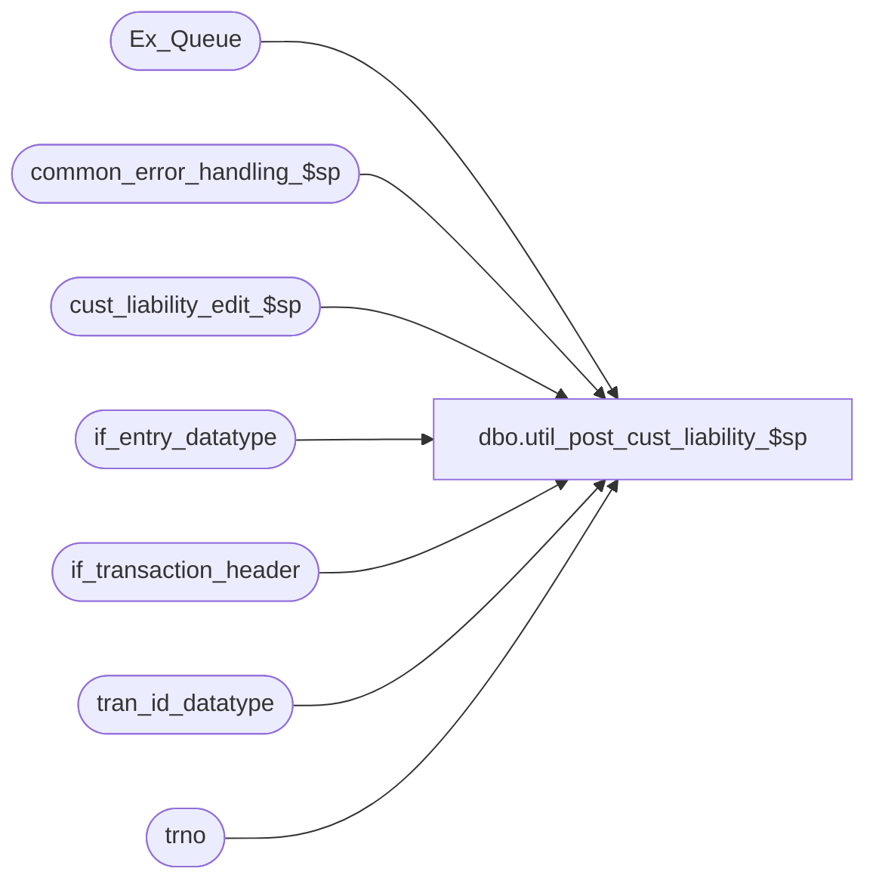

# dbo.util_post_cust_liability_$sp

**Database:** auditworks  
**Server:** bedrockdb01  

## Architecture Diagram



## Table Dependencies

| Referenced Table |
|---|
| Ex_Queue |
| common_error_handling_$sp |
| cust_liability_edit_$sp |
| if_entry_datatype |
| if_transaction_header |
| tran_id_datatype |
| trno |

## Stored Procedure Code

```sql
create proc dbo.util_post_cust_liability_$sp 

@source_process_no		tinyint -- function_no to post tran for
 
AS

/* 
PROC NAME: util_post_cust_liability_$sp
     DESC: Attempt to post any unposted customer liability transactions that were created by the passed in
      @source_process_no. Will post one tran at a time or one  store-date at a time, depending on @source_process_no.
      If necessary, could customize cursor to exclude certain transactions.

  To find a list of functions that may have left unposted transactions for interface 28:

SELECT key_1 as if_entry_no, h.transaction_id, h.source_process_no, h.store_no, h.transaction_date, h.transaction_no
  FROM Ex_Queue ex, if_transaction_header h WITH (NOLOCK)
WHERE ex.queue_id = 28
  AND ex.key_2 < 50
  AND ex.key_1 = h.if_entry_no
 ORDER BY key_1

HISTORY
Date     Name        Defect# Desc
Oct01,10 Paul         115834 author

*/			

DECLARE
	@cursor_open			tinyint,
	@date_limit			smalldatetime,
	@error_code 			int,
	@errmsg 			varchar(255),
	@errno				int,
	@function_no 			tinyint,
	@if_entry_no			if_entry_datatype,
	@message_id			int,
	@object_name			varchar(255),
	@operation_name			varchar(100),
	@process_id 			binary(16),
	@process_name			varchar(100),
	@rows_found			int,
	@store_no			int,
	@transaction_date		smalldatetime,
	@transaction_id			tran_id_datatype,
	@transaction_no			trno,
	@user_id			smallint

-- needed for scaleout
SET NOCOUNT ON
SET ANSI_NULLS ON
SET ANSI_WARNINGS ON

SELECT  @process_name = 'util_post_cust_liability_$sp',
	@message_id = 201068,
	@function_no = 1,
	@user_id = -1,
	@process_id = newid(),
	@rows_found = 0

-- set a date-time limit to avoid finding transactions for which posting may be in progress

SELECT @date_limit = DATEADD(mi, -240, getdate())

-- Search for unposted tran where the source_process_no matches the requested @source_process_no
DECLARE tran_crsr CURSOR FAST_FORWARD
FOR
SELECT key_1 as if_entry_no, h.transaction_id, h.store_no, h.transaction_date, h.transaction_no
  FROM Ex_Queue ex, if_transaction_header h WITH (NOLOCK)
WHERE ex.queue_id = 28
  AND ex.key_2 < 50
  AND ex.key_1 = h.if_entry_no
  AND h.source_process_no = @source_process_no
  AND (ex.key_11 < @date_limit OR ex.key_11 IS NULL)
 ORDER BY key_1

OPEN tran_crsr
SELECT @errno = @@error
IF @errno != 0
  BEGIN
    SELECT @errmsg = 'Failed to open tran_crsr',
          @object_name = 'tran_crsr',
          @operation_name = 'OPEN'
    GOTO error
  END

SELECT @cursor_open = 1

WHILE 1=1
BEGIN
  FETCH tran_crsr INTO
	@if_entry_no, @transaction_id, @store_no, @transaction_date, @transaction_no

  IF @@fetch_status <> 0
    BREAK

  SELECT @if_entry_no, @transaction_id, @store_no, @transaction_date, @transaction_no

  SELECT @rows_found = @rows_found + 1

   /* pass in variables as null as required by cust_liab_populate_$sp.
      Otherwise, the populate will not find the rows.
      The first execution for a function where @transaction_id is null will find all unposted tran
       for the store-date for that @source_process_no */

  IF @source_process_no IN (100,101,150,35,40)
    SELECT @store_no = NULL, @transaction_date = NULL
  ELSE
    SELECT @transaction_id = NULL

  IF @source_process_no IN (1,4,5)
    SELECT @store_no = NULL, @transaction_date = NULL

   -- Returns error 201648 if validations fail.
  EXEC cust_liability_edit_$sp  
               @process_id = @process_id,
               @current_user_id = @user_id,
               @function_no = @source_process_no, 
               @transaction_id = @transaction_id,
               @store_no = @store_no,
               @transaction_date = @transaction_date,
               @errmsg = @errmsg OUTPUT 
               
  SELECT @errno = @@error
  IF @errno != 0
          BEGIN
            SELECT @errmsg = 'Failed to execute cust_liability_edit_$sp'
            SELECT @object_name = 'cust_liability_edit_$sp',
                   @operation_name = 'EXECUTE'
            GOTO error
          END

END -- WHILE 1=1

CLOSE tran_crsr
DEALLOCATE tran_crsr

SELECT @cursor_open = 0
SET NOCOUNT OFF

IF @rows_found = 0
  SELECT 'No unposted transactions were found'

RETURN

error:   /* Common error handler */

	IF @cursor_open = 1
	  BEGIN
	   CLOSE tran_crsr
	   DEALLOCATE tran_crsr
	  END

	SET NOCOUNT OFF

	EXEC common_error_handling_$sp @function_no, @errno, @errmsg, 0, @message_id, 
	@process_name, @object_name, @operation_name, 0, 1, 0, null, 0, null, null, null, null, null,
        null, 0, @process_id, @user_id
       
	RETURN
```

