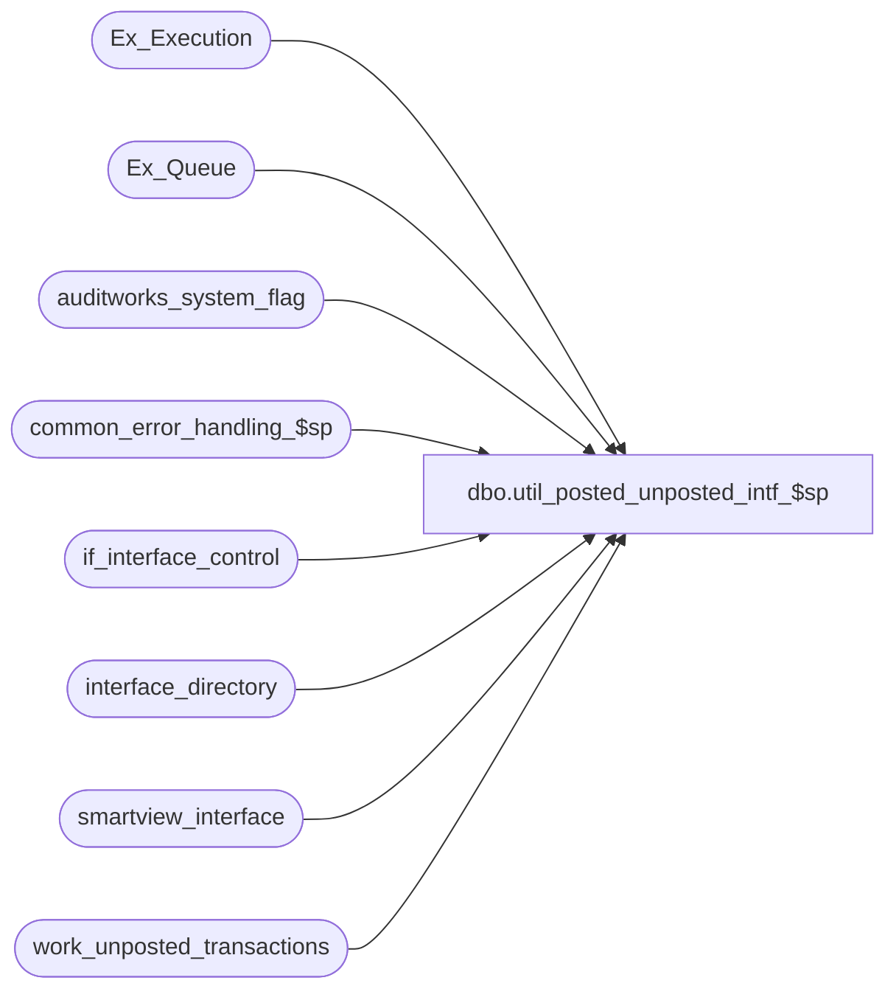

# dbo.util_posted_unposted_intf_$sp

**Database:** auditworks  
**Server:** bedrockdb01  

## Architecture Diagram



## Table Dependencies

| Referenced Table |
|---|
| Ex_Execution |
| Ex_Queue |
| auditworks_system_flag |
| common_error_handling_$sp |
| if_interface_control |
| interface_directory |
| smartview_interface |
| work_unposted_transactions |

## Stored Procedure Code

```sql
create proc dbo.util_posted_unposted_intf_$sp @process_id binary(16) = 0,
@user_id    int = 0

AS 

DECLARE
 @count_posted			numeric(12,0), 
 @count_unposted		numeric(12,0), 
 @cursor_open			tinyint,
 @errmsg			nvarchar(255),
 @errno				int,
 @instance_id			smallint,
 @interface_description		nvarchar(30),
 @interface_id			tinyint,
 @max_posted_serial_no		numeric(14,0),
 @message_id			int,
 @min_posted_serial_no		numeric(14,0),
 @object_id			integer,
 @object_name			nvarchar(255),
 @operation_name		nvarchar(100),
 @process_name			nvarchar(100),
 @process_no			smallint,
 @rows				int


/*
**  Proc Name: util_posted_unposted_intf_$sp
**  Description: Reports number of posted and unposted transactions for each interface.
		Supports Ex_Queue table. Called by frontend (@process_id > 0) or can be run manually.

  HISTORY:
Date      Name        Def# Description
Aug21,15  Vicci TFS-137263 In addition to interfaces using old "update to flag to 50" method, Include 
                           ALL live interfaces not using Ex_Execution, not just those register in SmartLook.
Nov08,06  Paul     DV-1335 use substring to avoid truncation warning
Dec21,05  Paul     DV-1325 allow calling by frontend by using table work_unposted_transactions
Jul05,05  Paul     DV-1239 Use numeric(14,0)
Nov01,00  ShuZ	      6929 Change @@fetch_status > 0 to @@fetch_status <> 0 for MS SQL compatibility
Oct03,00  Paul        6783 Correct the datatype declarations in select into to avoid overflow error
Jan11,00  Seb              Author
*/

SELECT @object_id = NULL,
	@process_name  = 'util_posted_unposted_intf_$sp',
	@message_id    = 201068,
	@process_no    = 118

IF @process_id != 0 -- If called by frontend then avoid null
  SELECT @object_id = 0

SELECT @instance_id = CONVERT(int,flag_numeric_value)
  FROM auditworks_system_flag
 WHERE flag_name = 'instance_id'

SELECT @rows = @@rowcount, @errno = @@error
IF @errno != 0 OR @rows = 0
   BEGIN
    SELECT @errmsg = 'Failed to select instance_id from auditworks_system_flag',
           @object_name = 'auditworks_system_flag',
           @operation_name = 'SELECT'
    GOTO error
  END

DELETE work_unposted_transactions
 WHERE process_id = @process_id

SELECT @errno = @@error
IF @errno != 0
  BEGIN
   SELECT @errmsg = 'Failed to delete work_unposted_transactions',
          @object_name = 'work_unposted_transactions',
          @operation_name = 'DELETE'
   GOTO error
  END

/* populate non-smartview interfaces (use 50=posted mechanism)  */

INSERT INTO work_unposted_transactions (
	instance_id,
	process_id,
	interface_id,
	interface_description,
	object_id,
	posted_transaction,
	unposted_transaction,
	min_posted_serial_no,
	max_posted_serial_no)
SELECT	@instance_id,
	@process_id,
	ic.interface_id,
	SUBSTRING(interface_description,1,30),
	@object_id,
	ISNULL(SUM(SIGN(SIGN(interface_control_flag - 50) + 1)),0),
	ISNULL(SUM(SIGN(50 - interface_control_flag)),0),
	0,
	0
  FROM interface_directory id, if_interface_control ic
 WHERE id.interface_id = ic.interface_id
   AND update_timing > 0
   AND object_id IS NULL 
GROUP BY ic.interface_id,interface_description

/* populate smartview interfaces */

DECLARE interface_crsr CURSOR FAST_FORWARD FOR
SELECT id.interface_id, sv.object_id, SUBSTRING(ISNULL(sv.description, id.interface_description),1,30)
  FROM interface_directory id WITH (NOLOCK)
       LEFT OUTER JOIN smartview_interface sv WITH (NOLOCK)
         ON sv.queue_id = id.interface_id
 WHERE id.object_id IS NOT NULL
   AND id.update_timing > 0
ORDER BY interface_id

OPEN interface_crsr

SELECT @errno = @@error
IF @errno != 0
   BEGIN
    SELECT @errmsg = 'Failed to open cursor interface_crsr',
           @object_name = 'interface_crsr',
           @operation_name = 'OPEN'
    GOTO error
  END

SELECT @cursor_open = 1

WHILE 1 = 1
BEGIN
  FETCH interface_crsr INTO
	@interface_id,
	@object_id,
	@interface_description

  IF @@fetch_status <> 0 --defect 6929
	BREAK

  SELECT @min_posted_serial_no = MIN(from_serial_no)
    FROM Ex_Execution 
   WHERE queue_id = @interface_id
     AND object_id = COALESCE(@object_id, object_id)

  IF @min_posted_serial_no IS NULL
  BEGIN
    SELECT @count_posted = 0, @min_posted_serial_no = 0, @max_posted_serial_no = 0

    SELECT @count_unposted = ISNULL(COUNT(serial_no),0)
      FROM Ex_Queue
     WHERE queue_id = @interface_id
   END
  ELSE
   BEGIN
      SELECT @max_posted_serial_no = ISNULL(MAX(to_serial_no),0)
	FROM Ex_Execution 
       WHERE queue_id = @interface_id
	 AND object_id = COALESCE(@object_id, object_id)

      SELECT @count_posted = ISNULL(COUNT(serial_no),0)
	FROM Ex_Queue
       WHERE queue_id = @interface_id
	 AND serial_no >= @min_posted_serial_no
	 AND serial_no <= @max_posted_serial_no
      
      SELECT @count_unposted = ISNULL(COUNT(serial_no),0)
	FROM Ex_Queue
       WHERE queue_id = @interface_id
	 AND (serial_no < @min_posted_serial_no
	  OR serial_no > @max_posted_serial_no)
   END

  INSERT INTO work_unposted_transactions (
	instance_id,process_id,interface_id,interface_description,object_id,posted_transaction,unposted_transaction,
	min_posted_serial_no,max_posted_serial_no)
  VALUES (@instance_id,@process_id,@interface_id,@interface_description,@object_id,@count_posted,@count_unposted,
        @min_posted_serial_no,@max_posted_serial_no)

  SELECT @errno = @@error
  IF @errno != 0
     BEGIN
      SELECT @errmsg = 'Failed to insert smartview to #posted_int',
           @object_name = '#posted_int',
           @operation_name = 'INSERT'
      GOTO error
     END

END -- WHILE 1=1

CLOSE interface_crsr
DEALLOCATE interface_crsr

IF @process_id = 0x0 -- If not called by frontend then display to screen
   SELECT interface_id,
	object_id,
	interface_description,
	unposted=CONVERT(nvarchar(14),unposted_transaction),
	posted=CONVERT(nvarchar(14),posted_transaction),
	mini=CONVERT(nvarchar(14),min_posted_serial_no),
	maxi=CONVERT(nvarchar(14),max_posted_serial_no)
   FROM work_unposted_transactions
   WHERE process_id = @process_id
   ORDER BY interface_id

RETURN

error:
  IF @cursor_open = 1
  BEGIN
    CLOSE interface_crsr
    DEALLOCATE interface_crsr   
  END

  EXEC common_error_handling_$sp @process_no, @errno, @errmsg, 0, @message_id, @process_name,
       @object_name, @operation_name, 1, 1, 0, null, 0, null, null, null, null, null, null,
       0, @process_id, @user_id
  
  RETURN
```

