# dbo.util_qa_repop_if_tables_$sp

**Database:** auditworks  
**Server:** bedrockdb01  

## Architecture Diagram

```mermaid
flowchart LR
    SP["dbo.util_qa_repop_if_tables_$sp"]
    authorization_detail(["authorization_detail"]) --> SP
    customer(["customer"]) --> SP
    customer_detail(["customer_detail"]) --> SP
    discount_detail(["discount_detail"]) --> SP
    if_authorization_detail(["if_authorization_detail"]) --> SP
    if_customer(["if_customer"]) --> SP
    if_customer_detail(["if_customer_detail"]) --> SP
    if_discount_detail(["if_discount_detail"]) --> SP
    if_entry_datatype(["if_entry_datatype"]) --> SP
    if_interface_control(["if_interface_control"]) --> SP
    if_line_note(["if_line_note"]) --> SP
    if_merchandise_detail(["if_merchandise_detail"]) --> SP
    if_payroll_detail(["if_payroll_detail"]) --> SP
    if_post_void_detail(["if_post_void_detail"]) --> SP
    if_return_detail(["if_return_detail"]) --> SP
    if_special_order_detail(["if_special_order_detail"]) --> SP
    if_stock_control_detail(["if_stock_control_detail"]) --> SP
    if_tax_detail(["if_tax_detail"]) --> SP
    if_tax_override_detail(["if_tax_override_detail"]) --> SP
    if_transaction_header(["if_transaction_header"]) --> SP
    if_transaction_line(["if_transaction_line"]) --> SP
    if_transaction_line_link(["if_transaction_line_link"]) --> SP
    interface_control(["interface_control"]) --> SP
    interface_directory(["interface_directory"]) --> SP
    line_note(["line_note"]) --> SP
    merchandise_detail(["merchandise_detail"]) --> SP
    payroll_detail(["payroll_detail"]) --> SP
    post_void_detail(["post_void_detail"]) --> SP
    return_detail(["return_detail"]) --> SP
    special_order_detail(["special_order_detail"]) --> SP
    stock_control_detail(["stock_control_detail"]) --> SP
    tax_detail(["tax_detail"]) --> SP
    tax_override_detail(["tax_override_detail"]) --> SP
    tran_id_datatype(["tran_id_datatype"]) --> SP
    transaction_header(["transaction_header"]) --> SP
    transaction_line(["transaction_line"]) --> SP
    transaction_line_link(["transaction_line_link"]) --> SP
```



## Table Dependencies

| Referenced Table |
|---|
| authorization_detail |
| customer |
| customer_detail |
| discount_detail |
| if_authorization_detail |
| if_customer |
| if_customer_detail |
| if_discount_detail |
| if_entry_datatype |
| if_interface_control |
| if_line_note |
| if_merchandise_detail |
| if_payroll_detail |
| if_post_void_detail |
| if_return_detail |
| if_special_order_detail |
| if_stock_control_detail |
| if_tax_detail |
| if_tax_override_detail |
| if_transaction_header |
| if_transaction_line |
| if_transaction_line_link |
| interface_control |
| interface_directory |
| line_note |
| merchandise_detail |
| payroll_detail |
| post_void_detail |
| return_detail |
| special_order_detail |
| stock_control_detail |
| tax_detail |
| tax_override_detail |
| tran_id_datatype |
| transaction_header |
| transaction_line |
| transaction_line_link |

## Stored Procedure Code

```sql
create proc dbo.util_qa_repop_if_tables_$sp 


 AS

/* Proc Name:  util_qa_repop_if_tables_$sp
   Desc: repopulate interface tables from CURRENT tables to allow reprocessing.
      This version inserts only the transactions which are needed in the interface tables.

   IF interface_control is already populated, then remove insert to interface_control

HISTORY
Date     Name       Def# Desc
Apr28,05 Maryam  DV-1202 Insert if_transaction_line_link. Rename from_line_id to line_id.
                         expand transaction_id to use tran_id_datatype
Sep24,04 Paul    DV-1146 use user_id, add columns to inserts
Jun28,04 ShuZ    DV-1071 Add without_receipt_flag when populating return_detail tables.
Dec19,02 Phu        5327 Retrieve gl_effect
Dec06,02 Winnie  1-H4466 Move declaration of cursor for MSSQL
Apr25,02 Phu     1-C9P5S Create entry in if_tax_detail
Sep24,01 ShuZ       8288 Add an originating_store_no to the stock_control_detail table for use
                         when head-office(or another store) enters a transacion on behalf of
                         another store
Jul25,01 David C    8413 Add transaction_id to if_transaction_header
May28,01 Winnie	    8019 Log pos_deptclass and upc_lookup_division to if_stock_control_detail table
May16,01 Shapoor    7813 Add column originating_store_no to merchandise* tables to attribute 
		         the sale/return to the store where the sale originated.
*/

DECLARE

@date_to_reprocess	smalldatetime,
@errmsg                VARCHAR(200),
@errno                 int,
@rows                  int,
@transactions_inserted int,
@interface_id          tinyint,
@interface_status_flag		smallint,
@from_transaction_date	smalldatetime,
@to_transaction_date	smalldatetime,
@transaction_id	        tran_id_datatype,
@transaction_count	int,
@if_entry_no            if_entry_datatype


SELECT @interface_id = 50, -- change this
	@from_transaction_date = '07/23/2000', -- starting date
	@to_transaction_date = '08/23/2000', -- ending date
	@transaction_count = 0,
	@transactions_inserted = 0

SELECT @interface_status_flag = update_timing
FROM interface_directory
WHERE interface_id = @interface_id

IF (@interface_status_flag IS NULL OR @interface_status_flag NOT IN (1,2))
  RETURN

/* custom code for qa purpose :
   copy all transactions in current to interface 50 */

SELECT @from_transaction_date = MIN(transaction_date)
  FROM transaction_header

SELECT @to_transaction_date = MAX(transaction_date)
  FROM transaction_header

SELECT @date_to_reprocess = @from_transaction_date

DECLARE reprocess_trans CURSOR
  FOR
    SELECT ic.transaction_id
      FROM interface_control ic, transaction_header th
     WHERE ic.interface_id = @interface_id
       AND ic.transaction_id = th.transaction_id
       AND transaction_date = @date_to_reprocess
FOR READ ONLY

WHILE 0=0
 BEGIN
  IF @date_to_reprocess > @to_transaction_date
    BREAK

/*  insert interface_control first, if necessary */
/* insert all transactions for qa purpose */

  INSERT interface_control (
                transaction_id,           
                interface_id,
                interface_status_flag)
  SELECT DISTINCT
                th.transaction_id,           
                @interface_id,
                @interface_status_flag
   FROM transaction_header th
  WHERE th.transaction_date = @date_to_reprocess
    AND th.transaction_void_flag IN (0,8)

  SELECT @rows = @@rowcount
  SELECT @transaction_count = @transaction_count + @rows

SELECT @date_to_reprocess, @rows, ' transactions found.'

  OPEN reprocess_trans
 
  WHILE 1=1
  BEGIN
  
     FETCH reprocess_trans
      INTO @transaction_id
  
  IF @@fetch_status <> 0
    BREAK
    
  begin transaction 
  INSERT INTO if_transaction_header (
              store_no,
              register_no,
		transaction_date,
		transaction_series,
		transaction_no,
		entry_date_time,
		cashier_no,
		transaction_category,
		tender_total,
		transaction_void_flag,
		customer_info_exists,
		exception_flag,
		deposit_declaration_flag,
		closeout_flag,
		media_count_flag,
		customer_modified_flag,
		tax_override_flag,
		pos_tax_jurisdiction,
		edit_timestamp,
		employee_no,
		transaction_remark,
		source_process_no,
		last_modified_date_time,
		in_use_timestamp,
		updated_by_user_id,
		transaction_id )
	SELECT
	        store_no,
		register_no,
		transaction_date,
		transaction_series,
		transaction_no,
		entry_date_time,
		cashier_no,
		transaction_category,
		tender_total,
		transaction_void_flag,
		customer_info_exists,
		exception_flag,
		deposit_declaration_flag,
		closeout_flag,
		media_count_flag,
		0,
		tax_override_flag,
		pos_tax_jurisdiction,
		edit_timestamp,
		employee_no,
		transaction_remark,
		101,
		last_modified_date_time,
		in_use_timestamp,
		updated_by_user_id,
		transaction_id
	 FROM transaction_header
	WHERE transaction_id = @transaction_id

  SELECT @if_entry_no = @@identity,
  	@transactions_inserted = @transactions_inserted + @@rowcount

  INSERT INTO if_transaction_line (
              if_entry_no,
		line_id,
		line_sequence,
		line_object_type,
		line_object,
		line_action,
		gross_line_amount,
		pos_discount_amount,
		db_cr_none,
		attachment_qty,
		exception_flag,
		interface_rejection_flag,
		line_void_flag,
		voiding_reversal_flag,
		edit_timestamp,
		reference_type,
		reference_no)
	SELECT @if_entry_no,
		line_id,
		line_sequence,
		line_object_type,
		line_object,
		line_action,
		gross_line_amount,
		pos_discount_amount,
		db_cr_none,
		attachment_qty,
		exception_flag,
		interface_rejection_flag,
		line_void_flag,
		voiding_reversal_flag,
		edit_timestamp,
		reference_type,
		reference_no
	 FROM transaction_line
	WHERE transaction_id = @transaction_id

    INSERT INTO if_return_detail (
		if_entry_no,
		line_id,
		return_reason_message,
		return_reason_code,
		mdse_disposition_code,
		via_warehouse_flag,
		return_from_store,
		return_from_reg,
		return_from_date,
		return_from_transno,
		without_receipt_flag)
	SELECT @if_entry_no,
		line_id,
		return_reason_message,
		return_reason_code,
		mdse_disposition_code,
		via_warehouse_flag,
		return_from_store,
		return_from_reg,
		return_from_date,
		return_from_transno,
		without_receipt_flag
	 FROM return_detail
	WHERE transaction_id = @transaction_id

    INSERT INTO if_post_void_detail (
		if_entry_no,
		line_id,
		post_voided_register,
		post_voided_trans_no,
		post_void_successful)
	SELECT @if_entry_no,
		line_id,
		post_voided_register,
		post_voided_trans_no,
		post_void_successful
	 FROM post_void_detail
	WHERE transaction_id = @transaction_id

    INSERT INTO if_discount_detail (
		if_entry_no,
		line_id,
		applied_by_line_id,
		pos_discount_level,
		pos_discount_type,
		pos_discount_amount,
		applied_flag,
		pos_discount_serial_no)
	SELECT @if_entry_no,
		line_id,
		applied_by_line_id,
		pos_discount_level,
		pos_discount_type,
		pos_discount_amount,
		applied_flag,
		pos_discount_serial_no
	 FROM discount_detail
	WHERE transaction_id = @transaction_id

    INSERT INTO if_merchandise_detail (
		if_entry_no,
		line_id,
		merchandise_category,
		upc_lookup_division,
		upc_no,
		units,
		salesperson,
		salesperson2,
		sku_id,
		style_reference_id,
		class_code,
		subclass_code,
		price_override,
		pos_iplu_missing,
		upc_on_file_flag,
		pos_deptclass,
		ticket_price,
		sold_at_price,
                scanned,
                pos_identifier,
                pos_identifier_type,
                plu_price,
                originating_store_no,
                source_store_no,
                fulfillment_store_no)
	SELECT  @if_entry_no,
		line_id,
		merchandise_category,
		upc_lookup_division,
		upc_no,
		units,
		salesperson,
		salesperson2,
		sku_id,
		style_reference_id,
		class_code,
		subclass_code,
		price_override,
		pos_iplu_missing,
		upc_on_file_flag,
		pos_deptclass,
		ticket_price,
		sold_at_price,
           scanned,
                pos_identifier,
                pos_identifier_type,
                plu_price,
                originating_store_no,
                source_store_no,
                fulfillment_store_no
	 FROM merchandise_detail
	WHERE transaction_id = @transaction_id

    INSERT INTO if_tax_override_detail (
		if_entry_no,
		line_id,
		tax_level,
		taxable,
		exception_tax_jurisdiction,
		tax_exempt_no)
	SELECT @if_entry_no,
		line_id,
		tax_level,
		taxable,
		exception_tax_jurisdiction,
		tax_exempt_no
	 FROM tax_override_detail
	WHERE transaction_id = @transaction_id

    INSERT INTO if_customer (
		if_entry_no,
		line_id,
		customer_role,
		title,
		first_name,
		last_name,
		address_1,
		address_2,
		city,
		county,
		state,
		country,
		post_code,
		telephone_no1,
		telephone_no2,
		customer_no)
	SELECT @if_entry_no,
		line_id,
		customer_role,
		title,
		first_name,
		last_name,
		address_1,
		address_2,
		city,
		county,
		state,
		country,
		post_code,
		telephone_no1,
		telephone_no2,
		customer_no
	 FROM customer
	WHERE transaction_id = @transaction_id

    INSERT INTO if_customer_detail (
		if_entry_no,
		line_id,
		customer_role,
		customer_info_type,
		customer_info)
	SELECT @if_entry_no,
		line_id,
		customer_role,
		customer_info_type,
		customer_info
	 FROM customer_detail
	WHERE transaction_id = @transaction_id

    INSERT INTO if_special_order_detail (
		if_entry_no,
		line_id,
		units,
		merchandise_description,
		expecting_delivery_on,
		color_description,
		size_description,
		width_description,
		vendor_name,
		vendor_style_description,
		spo_class_description)
	SELECT @if_entry_no,
		line_id,
		units,
		merchandise_description,
		expecting_delivery_on,
		color_description,
		size_description,
		width_description,
		vendor_name,
		vendor_style_description,
		spo_class_description
	 FROM special_order_detail
	WHERE transaction_id = @transaction_id

    INSERT INTO if_stock_control_detail (
		if_entry_no,
		line_id,
		upc_no,
		merchandise_key,
		initiated_by_host,
		units,
		other_store_no,
		location_no,
		vendor_no,
		count_date,
		pos_identifier,
		pos_identifier_type,
		pos_deptclass,
		upc_lookup_division,
		originating_store_no)
	SELECT @if_entry_no,
		line_id,
		upc_no,
		merchandise_key,
		initiated_by_host,
		units,
		other_store_no,
		location_no,
		vendor_no,
		count_date,
		pos_identifier,
		pos_identifier_type,
		pos_deptclass,
		upc_lookup_division,
		originating_store_no
	 FROM stock_control_detail
	WHERE transaction_id = @transaction_id

    INSERT INTO if_authorization_detail (
		if_entry_no,
		line_id,
		card_type,
		authorization_no,
		expiry_date,
		swipe_indicator,
		approval_message,
		license_no,
		pos_state_code,
		other_id_type,
		other_id,
		deferred_billing_date,
		deferred_billing_plan,
		signature,
		customer_signature_obtained,
		offline_flag)
	SELECT @if_entry_no,
		line_id,
		card_type,
		authorization_no,
		expiry_date,
		swipe_indicator,
		approval_message,
		license_no,
		pos_state_code,
		other_id_type,
		other_id,
		deferred_billing_date,
		deferred_billing_plan,
		signature,
		customer_signature_obtained,
		offline_flag
	 FROM authorization_detail
	WHERE transaction_id = @transaction_id

    INSERT INTO if_payroll_detail (
		if_entry_no,
		line_id,
		employee_payroll_id,
		employee_type,
		payroll_entry_type)
	SELECT @if_entry_no,
		line_id,
		employee_payroll_id,
		employee_type,
		payroll_entry_type
	 FROM payroll_detail
	WHERE transaction_id = @transaction_id

    INSERT if_tax_detail (
	if_entry_no,
	line_id,
	tax_level,
	tax_jurisdiction,
	tax_category,
	tax_rate_code,
	taxable_amount,
	tax_amount,
	combined_rate,
	nontaxable_amount,
	tax_amount_expected,
	tax_on_tax_level,
	tax_on_combined_rate,
	line_object_type,
	tax_strip_flag,
	gl_effect )
    SELECT
	@if_entry_no,
	line_id,
	tax_level,
	tax_jurisdiction,
	tax_category,
	tax_rate_code,
	taxable_amount,
	tax_amount,
	combined_rate,
	nontaxable_amount,
	tax_amount_expected,
	tax_on_tax_level,
	tax_on_combined_rate,
	line_object_type,
	tax_strip_flag,
	gl_effect
     FROM tax_detail
     WHERE transaction_id = @transaction_id

    INSERT INTO if_line_note (
	    if_entry_no,
	    line_id,
	    note_type,
	    line_note)
    SELECT  @if_entry_no,
	    line_id,
	    note_type,
	    line_note	
      FROM  line_note	
     WHERE  transaction_id = @transaction_id
    
    INSERT INTO if_transaction_line_link (
		if_entry_no,
		line_id,
		linked_line_id)
	SELECT @if_entry_no,
		line_id,
		linked_line_id
	 FROM transaction_line_link
	WHERE transaction_id = @transaction_id     

    INSERT INTO if_interface_control (
		if_entry_no,           
                interface_id,
                interface_control_flag,
                effective_date,
                interface_posting_date)
         SELECT @if_entry_no,
		@interface_id,
		10,
		getdate(),
		getdate()
           FROM interface_control
          WHERE transaction_id = @transaction_id
            AND interface_id = @interface_id
  
  
    COMMIT

  END
  CLOSE reprocess_trans  

  SELECT @date_to_reprocess = DATEADD(dd, 1, @date_to_reprocess)

 END -- While 0=0

 SELECT ' total transactions inserted to if_interface_control : ', @transaction_count
 SELECT ' total transactions inserted to if_transaction_header : ', @transactions_inserted

  DEALLOCATE reprocess_trans
 
 RETURN
```

