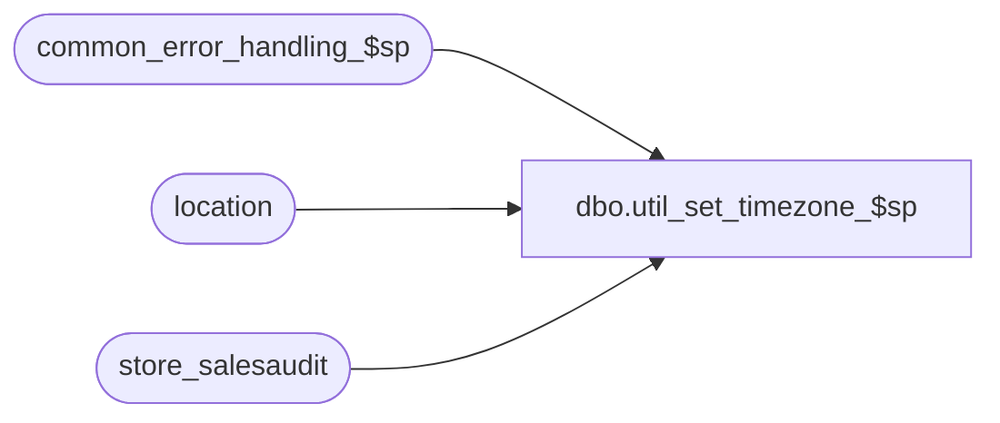

# dbo.util_set_timezone_$sp

**Database:** auditworks  
**Server:** bedrockdb01  

## Architecture Diagram



## Table Dependencies

| Referenced Table |
|---|
| common_error_handling_$sp |
| location |
| store_salesaudit |

## Stored Procedure Code

```sql
create proc dbo.util_set_timezone_$sp @time_type tinyint = 1, --1=Standard, 2=Daylight Savings Time
@server_location_type tinyint = 3,  --2=Province, 3=State
@server_location_code char(2),  --from location table, standard 2 letter state or province codes, example: 'QC',
@preview_only tinyint = 1 --1=Preview Only, to display the changes to be made, 0=update store_salesaudit
AS

/* Proc Name: util_set_timezone_$sp
   DESC: Set the timezone offset in the store master based on the state code or the first 2
         characters of the tax jurisdiction if the state code is not set.
   

HISTORY
Date     Name         Defect# Desc
Aug15,08 Paul          104042 Uplift to SA5 and make sql2005 compatible
JUN16,06 Vicci	        73648 author
*/


DECLARE
@server_gmt_offset_hrs		smallint,
@errmsg				VARCHAR(225),
@errno				INT,
@rows				INT,
@process_no			int,
@process_id			int,
@process_name		        varchar(100),
@message_id		        int,	
@object_name			varchar(255),
@operation_name			varchar(255)

SELECT @process_name = 'util_set_timezone_$sp',
       @process_no = 36,
       @message_id = 201068,
       @process_id = @@spid,
       @object_name = 'unknown',
       @operation_name = 'unknown'

IF @time_type = 2
BEGIN
  SELECT @server_gmt_offset_hrs = 1 -- gmt_offset_hrs_daylight
    FROM location
   WHERE location_type = @server_location_type
     AND location_code = @server_location_code
  SELECT @errno = @@error, @rows = @@rowcount
  IF @errno <> 0
  BEGIN
    SELECT @errmsg = 'Unable to determine location timezone offset -daylight savings time',
	   @object_name = 'location',
	   @operation_name = 'SELECT'
    GOTO error
  END
END
ELSE
BEGIN
  SELECT @server_gmt_offset_hrs = 2 -- gmt_offset_hrs_standard
    FROM location
   WHERE location_type = @server_location_type
     AND location_code = @server_location_code
  SELECT @errno = @@error, @rows = @@rowcount
  IF @errno <> 0
  BEGIN
    SELECT @errmsg = 'Unable to determine location timezone offset -standard time',
	   @object_name = 'location',
	   @operation_name = 'SELECT'
    GOTO error
  END
END

IF @rows = 0  
BEGIN
  SELECT @errmsg = 'Unknown server location specified',
	 @object_name = 'location',
	 @operation_name = 'SELECT'
  GOTO error
END

IF @time_type = 2
BEGIN
  PRINT 'Store updates to be made:'
/*
  SELECT s.store_no, ss.store_name, IsNull(s.state_code, substring(s.tax_jurisdiction, 1, 2)) as location_code, timezone_offset_hours as old_timezone_offset_hours, @server_gmt_offset_hrs - l.gmt_offset_hrs_daylight as new_timezone_offset_hours
    FROM store_salesaudit s, store_sa ss, location l
   WHERE s.store_no = ss.store_no
     AND IsNull(s.state_code, substring(s.tax_jurisdiction, 1, 2)) *= l.location_code
     AND l.location_type in (2, 3)
*/
  SELECT @errno = @@error
  IF @errno <> 0
  BEGIN
    SELECT @errmsg = 'Unable to display store timezone offset -daylight savings time',
	   @object_name = 'location',
	   @operation_name = 'SELECT'
    GOTO error
  END
  
  IF @preview_only <> 1  
  BEGIN
    UPDATE store_salesaudit
       SET timezone_offset_hours = @server_gmt_offset_hrs /* - l.gmt_offset_hrs_daylight */
      FROM store_salesaudit s, location l
     WHERE IsNull(s.state_code, substring(s.tax_jurisdiction, 1, 2)) = l.location_code
       AND l.location_type in (2, 3)
    SELECT @errno = @@error
    IF @errno <> 0
    BEGIN
      SELECT @errmsg = 'Unable to set store timezone offset -daylight savings time',
  	     @object_name = 'store_salesaudit',
	     @operation_name = 'UPDATE'
      GOTO error
    END
    PRINT convert(varchar, @rows) + ' stores were updated.'
  END
END
ELSE
BEGIN
  PRINT 'Store updates to be made:'
/*
  SELECT s.store_no, ss.store_name, IsNull(s.state_code, substring(s.tax_jurisdiction, 1, 2)) as location_code, timezone_offset_hours as old_timezone_offset_hours, @server_gmt_offset_hrs - l.gmt_offset_hrs_standard as new_timezone_offset_hours
    FROM store_salesaudit s, store_sa ss, location l
   WHERE s.store_no = ss.store_no
     AND IsNull(s.state_code, substring(s.tax_jurisdiction, 1, 2)) *= l.location_code
     AND l.location_type in (2, 3)
*/
  SELECT @errno = @@error
  IF @errno <> 0
  BEGIN
    SELECT @errmsg = 'Unable to display store timezone offset -standard time',
	   @object_name = 'location',
	   @operation_name = 'SELECT'
    GOTO error
  END
  
  IF @preview_only <> 1  
  BEGIN
    UPDATE store_salesaudit
       SET timezone_offset_hours = @server_gmt_offset_hrs /* - l.gmt_offset_hrs_standard */
      FROM store_salesaudit s, location l
     WHERE IsNull(s.state_code, substring(s.tax_jurisdiction, 1, 2)) = l.location_code
       AND l.location_type in (2, 3)
    SELECT @errno = @@error, @rows = @@rowcount
    IF @errno <> 0
    BEGIN
      SELECT @errmsg = 'Unable to set store timezone offset -standard time',
  	     @object_name = 'store_salesaudit',
	     @operation_name = 'UPDATE'
      GOTO error
    END
    PRINT convert(varchar, @rows) + ' stores were updated.'
  END
END   

RETURN

error:
	EXEC common_error_handling_$sp @process_no, @errno, @errmsg, 0, @message_id, 
	@process_name, @object_name, @operation_name, 1
	RETURN
```

