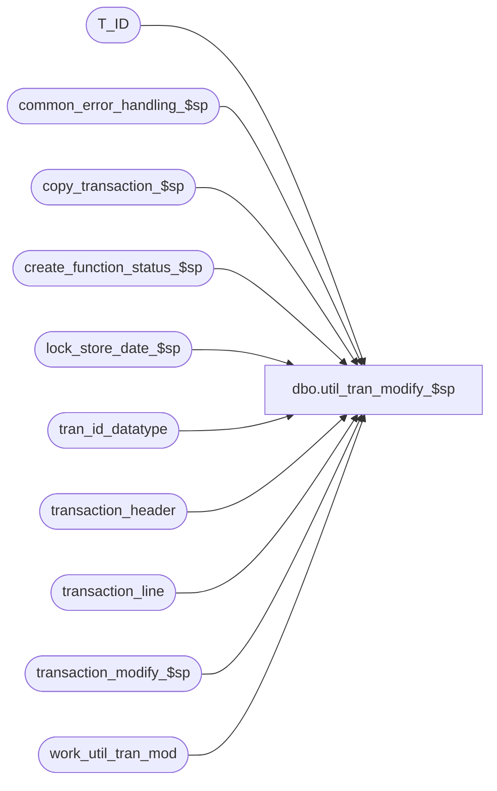

# dbo.util_tran_modify_$sp

**Database:** auditworks  
**Server:** bedrockdb01  

## Architecture Diagram



## Table Dependencies

| Referenced Table |
|---|
| T_ID |
| common_error_handling_$sp |
| copy_transaction_$sp |
| create_function_status_$sp |
| lock_store_date_$sp |
| tran_id_datatype |
| transaction_header |
| transaction_line |
| transaction_modify_$sp |
| work_util_tran_mod |

## Stored Procedure Code

```sql
create proc dbo.util_tran_modify_$sp AS

/* Proc name:   util_tran_modify_$sp
   Description:	Simulate transaction modification without using front end.

History:
Date     Name           Def# Description
Nov09,12 Vicci      SMACHADO Add creation of function status and locking of store/date.
Oct27,10 Paul         121798 create a general purpose utility as a base for customization
Oct19,10 Phu                 SA5 compatible.
         Shapoor             Initial development.

*/

DECLARE
	@cursor_open		tinyint,
	@errmsg			nvarchar(1000),
	@errno			int,
	@errnum			int,
	@ENTRY_ID		T_ID,  -- binary(16)
	@function_no		tinyint,
	@function_status	tinyint,
	@if_entry_no		tran_id_datatype,
	@process_id		T_ID,
	@rec_process_id		numeric(12,0),
	@transaction_id		tran_id_datatype,
	@user_id		int,
	@message_id			int,	
	@object_name			nvarchar(255),	
	@operation_name			nvarchar(100),
	@process_name			nvarchar(100),
	@store_no		int,
	@transaction_date	smalldatetime,
	@date_reject_id		tinyint


SELECT @process_id = NEWID(),
	@user_id = 1,
	@function_no = 100,
	@function_status = 1,
	@process_name = 'util_tran_modify_$sp',
	@message_id = 201068

SELECT @ENTRY_ID = @process_id

/* 1) Customize the opoulate query below to find the desired transactions, clear table work_util_tran_mod
   and then populate it before running this proc.

   2) customize the update query inside the loop to apply the desired changes to each transaction

   3) Delete rows from work_util_tran_mod after running this utility.
   
   4) If any errors occur, run function_cleanup_main_$sp for any values of process_id
       in table function_status where function_no = 100 
       
   5) If a transaction fails validation (e.g. out of balance), then the util will abort
      (workaround would be to remove the rejected tran from the work_util_tran_mod table and resume).
      Can also clean up the aborted transaction modify using function_cleanup_main_$sp, passing in function_no = 100.
       

   The populate code below excludes all sa rejected transactions.
   It is recommended to process only non-sa rejected trans and then to examine any remaining
   sa rejects afterwards using the gui. Otherwise, if the transaction_modify_$sp tries to validate a transaction
   and finds a reason to sa reject (e.g. out of balance), then the utility will abort on that transaction, leaving
   a halted process to be cleaned up later.
   The list of sa rejection reasons can be found using select * from code_description where code_type = 9. */

/*
INSERT INTO work_util_tran_mod (transaction_id, line_id, corr_done)
SELECT DISTINCT tl.transaction_id, tl.line_id, 0
  FROM transaction_header th, transaction_line tl
 WHERE th.transaction_id = tl.transaction_id
   AND tl.line_object = 999
   AND NOT EXISTS (SELECT 1 FROM sa_rejection_reason sr
   		WHERE sr.transaction_id = th.transaction_id)

*/

/* to clear the work table of processed transactions:

   DELETE FROM work_util_tran_mod
   WHERE corr_done = 1
 */

SELECT DISTINCT transaction_id
  INTO #work_tran_list
  FROM work_util_tran_mod
  WHERE corr_done = 0 OR corr_done IS NULL

SELECT @errno = @@error
IF @errno != 0
  BEGIN
   SELECT @errmsg = 'Failed to populate #work_tran_list',
          @object_name = '#work_tran_list',
          @operation_name = 'INSERT'   
   GOTO error
  END

DECLARE util_tran_mod_crsr CURSOR FAST_FORWARD
FOR
SELECT transaction_id
  FROM #work_tran_list
 ORDER BY transaction_id
  
OPEN util_tran_mod_crsr

SELECT @errno = @@error
IF @errno != 0
  BEGIN
   SELECT @errmsg = 'Failed to open util_tran_mod_crsr',
          @object_name = 'util_tran_mod_crsr',
          @operation_name = 'OPEN'   
   GOTO error
  END

SELECT @cursor_open = 1

WHILE 1=1
  BEGIN
    FETCH util_tran_mod_crsr INTO
	@transaction_id

    IF @@fetch_status <> 0
      BREAK

     EXEC create_function_status_$sp @process_id, @user_id, @function_no, @transaction_id, @errmsg OUTPUT
     SELECT @errno = @@error
     IF @errno != 0
     BEGIN
       SELECT @errmsg = COALESCE(@errmsg, '') + ' -failed to exec create_function_status_$sp',
	      @object_name = 'create_function_status_$sp',
	      @operation_name = 'EXECUTE'   
       GOTO error
     END
     
     SELECT @store_no = store_no,
            @transaction_date = transaction_date,
            @date_reject_id = date_reject_id
       FROM transaction_header
      WHERE transaction_id = @transaction_id
     SELECT @errno = @@error
     IF @errno != 0
     BEGIN
       SELECT @errmsg = 'Failed to identify store/date',
	      @object_name = 'transaction_header',
	      @operation_name = 'SELECT'   
       GOTO error
     END
      
     EXEC lock_store_date_$sp @process_id = @process_id,
  			      @user_id = @user_id, 
  			      @store_no = @store_no,
  			      @sales_date = @transaction_date,
  			      @date_reject_id = @date_reject_id,
  			      @update_in_progress = @function_no,
  			      @error_code = @errno OUTPUT  
     SELECT @errnum = @@error
     IF @errnum <> 0
     BEGIN
       SELECT @errmsg = 'Failed to execute lock_store_date_$sp',
      	      @errno = @errnum,
      	      @object_name = 'lock_store_date_$sp',
              @operation_name = 'EXECUTE'
       GOTO error
     END

    IF @errno = 201550
    BEGIN
      SELECT @errmsg = 'store_date is currently in use',
             @message_id = 201550
      GOTO error
    END
    ELSE
    IF @errno <> 0 /* System error */
    BEGIN
      SELECT @errmsg = 'lock_store_date_$sp is unable to update store_audit_status',
             @object_name = 'store_audit_status',
             @operation_name = 'UPDATE'
      GOTO error
    END

     /* copy original tran to i/f tables. used for corrections/reversals and error recovery */
     EXEC copy_transaction_$sp @process_id, @user_id, @transaction_id, @errmsg OUTPUT, @if_entry_no OUTPUT
     SELECT @errno = @@error
     IF @errno != 0
     BEGIN
       SELECT @errmsg = COALESCE(@errmsg, '') + ' -failed to exec copy_transaction_$sp',
	      @object_name = 'copy_transaction_$sp',
	      @operation_name = 'EXECUTE'   
       GOTO error
     END

     /* Customize logic here to update the transaction_line with the desired changes to be saved */

     /*
      UPDATE transaction_line
         SET  = 
        FROM work_util_tran_mod w, transaction_line tl
       WHERE w.transaction_id = @transaction_id
         AND w.transaction_id = tl.transaction_id
         AND w.line_id = tl.line_id

     SELECT @errno = @@error
     IF @errno != 0
	  BEGIN
	   SELECT @errmsg = 'Failed to update with user changes',
	          @object_name = 'transaction_line',
	          @operation_name = 'UPDATE'   
	   GOTO error
	  END
     */

     /* update line_modified_flag to indicate which changes will affect interfaces */

     UPDATE transaction_line
       SET line_modified_flag = 1
      FROM work_util_tran_mod w, transaction_line tl
     WHERE w.transaction_id = @transaction_id
       AND w.transaction_id = tl.transaction_id
       AND w.line_id = tl.line_id

     SELECT @errno = @@error
     IF @errno != 0
	  BEGIN
	   SELECT @errmsg = 'Failed to set line_modified_flag',
	          @object_name = 'transaction_line',
	          @operation_name = 'UPDATE'   
	   GOTO error
	  END

     /* Now save the changes and update the interfaces. If fails, can use function_cleanup_main_$sp afterwards. */

     EXEC transaction_modify_$sp @process_id, @user_id, @transaction_id, @errmsg OUTPUT, @ENTRY_ID, @function_no, @function_status, @rec_process_id

     SELECT @errno = @@error
     IF @errno != 0
	  BEGIN
	   SELECT @errmsg = COALESCE(@errmsg, '') + ' -failed to exec transaction_modify_$sp',
	          @object_name = 'transaction_modify_$sp',
	          @operation_name = 'EXECUTE'   
	   GOTO error
	  END

  UPDATE work_util_tran_mod
       SET corr_done = 1
      WHERE transaction_id = @transaction_id

     SELECT @errno = @@error
     IF @errno != 0
	  BEGIN
	   SELECT @errmsg = 'Failed to set corr_done',
	          @object_name = 'work_util_tran_mod',
	          @operation_name = 'UPDATE'   
	   GOTO error
	  END

  END /* WHILE 1=1 */

CLOSE util_tran_mod_crsr
DEALLOCATE util_tran_mod_crsr

SELECT @cursor_open = 0

DROP TABLE #work_tran_line_list

RETURN

error:
	IF @cursor_open = 1
		BEGIN
		 CLOSE util_tran_mod_crsr
		 DEALLOCATE util_tran_mod_crsr
		END
	DROP TABLE #work_tran_line_list
  
	EXEC common_error_handling_$sp 100, @errno, @errmsg, 0, @message_id, 
	@process_name, @object_name, @operation_name, 1, 1 

	RETURN
```

