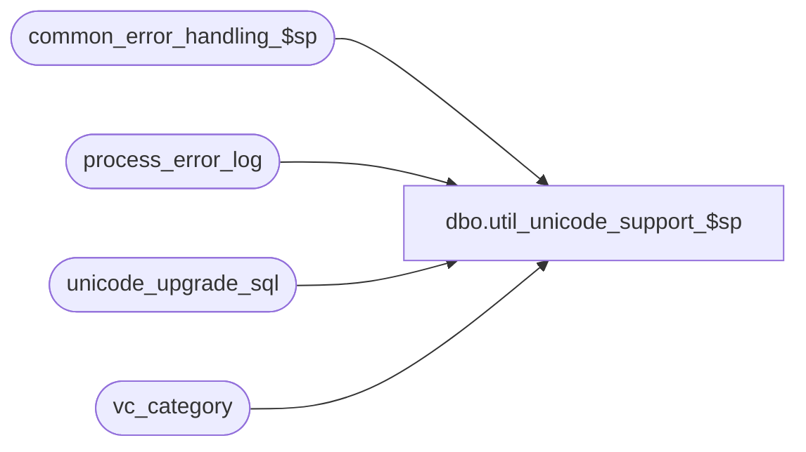

# dbo.util_unicode_support_$sp

**Database:** auditworks  
**Server:** bedrockdb01  

## Architecture Diagram



## Table Dependencies

| Referenced Table |
|---|
| common_error_handling_$sp |
| process_error_log |
| unicode_upgrade_sql |
| vc_category |

## Stored Procedure Code

```sql
CREATE proc  dbo.util_unicode_support_$sp AS

/* Proc Name: util_unicode_support_$sp
   Desc : Modify the datatype for any char or nvarchar S/A tables (as identified in vc_category) to support unicode
          Called from SA_EDIT 5.0t520 release_no_edit_$upgr.
          Progress may be monitored via SELECT * FROM unicode_upgrade_sql
          WARNING:  does not support partitioned indexes being drop/recreated.
          WARNING:  does not support columns with "check" constraints being altered.
          

HISTORY
Date     Name         Def# Desc
Jul05,16 Vicci             Fix recovery logic to use the right _done flag;  handle varchar > 4000 as nvarchar(max).
                           do UNION instead of UNION ALL to avoid unexplained dup default drop that occurred for currency table at 1 client site.
Sep04,15 Vicci             Author
*/

DECLARE @errmsg 		nvarchar(2000),
	@errno				int,
	@rows				int,
	@message_id			int,	
	@object_name		nvarchar(255),	
	@operation_name		nvarchar(100),
	@process_name		nvarchar(100),
	@errmsg2			nvarchar(2000),
	@cursor_open		tinyint,
	
	@current_datetime	datetime,
	@table_name			nvarchar(100),
	@table_type			nvarchar(255),
	@table_object_name	nvarchar(100),
    @column_list		nvarchar(4000),
	@sql_cmd			nvarchar(4000),
	@sql_cmd_type		nvarchar(100),
	@sql_seq			nvarchar(1000),
	@recover			tinyint;

SELECT 	@process_name = 'util_unicode_support_$sp',
	@message_id = 201068,
	@recover = 0,
	@current_datetime = getdate();

BEGIN TRY

  SELECT @errmsg = 'Determine if recovery required. ',
         @object_name = 'unicode_upgrade_sql',
         @operation_name = 'SELECT';
  IF EXISTS (SELECT 1 FROM unicode_upgrade_sql)
  BEGIN
    IF NOT EXISTS (SELECT 1 FROM unicode_upgrade_sql WHERE create_done IS NOT NULL OR drop_done IS NOT NULL OR alter_done IS NOT NULL)
    BEGIN
      DELETE unicode_upgrade_sql  --clean up if nothing was started
    END
    ELSE
    BEGIN
      IF EXISTS (SELECT 1 FROM unicode_upgrade_sql 
                  WHERE (create_sql_cmd IS NOT NULL AND create_done IS NULL) 
                     OR (alter_sql_cmd IS NOT NULL AND alter_done IS NULL) 
                     OR (drop_sql_cmd IS NOT NULL AND drop_done IS NULL) )
      BEGIN  --something is incomplete
        SELECT @recover = 1;  
      END;
    END;
  END;  --if prior attempt failed.

repeat:
IF @recover = 0
BEGIN
  SELECT @errmsg = 'Failed to log foreign keys that will need to be dropped before conversion process begins and recreated once full conversion process done. ',
         @object_name = 'unicode_upgrade_sql',
         @operation_name = 'INSERT';
  INSERT INTO unicode_upgrade_sql( 
         table_name, table_type, table_object_name, drop_sql_cmd, create_sql_cmd, create_sql_cmd_suffix)
  SELECT DISTINCT t.name, 'FK', i.name,
        'ALTER TABLE ' + t.name + ' DROP CONSTRAINT ' + i.name drop_sql_cmd,
        'ALTER TABLE ' + t.name + ' ADD CONSTRAINT ' + i.name + ' FOREIGN KEY ' create_sql_cmd,
         ')' create_sql_cmd_suffix
    FROM sys.foreign_keys i
         INNER JOIN sys.foreign_key_columns ic
            ON i.object_id = ic.constraint_object_id
         INNER JOIN sys.columns tc 
            ON ic.parent_object_id = tc.object_id
           AND ic.parent_column_id = tc.column_id
           AND type_name(tc.system_type_id) in ('varchar', 'char') 
         INNER JOIN sysobjects t
            ON i.parent_object_id = t.id
         INNER JOIN vc_category vc
            ON lower(t.name) = lower(vc.tb_name) 
   ORDER BY t.name, i.name

  SELECT @errmsg = 'Failed to log indexes, primary keys, unique creates that will need to be dropped and recreated. ',
         @object_name = 'unicode_upgrade_sql',
         @operation_name = 'INSERT';
  INSERT INTO unicode_upgrade_sql(
         table_name, table_type, table_object_name, drop_sql_cmd, drop_sequence, create_sql_cmd, create_sql_cmd_suffix, create_sequence)
  -- Syntax valid as of MSSQL 2005 and up only
  SELECT DISTINCT t.name, vc.tb_type, i.name,
         CASE WHEN is_primary_key = 1 OR is_unique_constraint = 1 
              THEN 'ALTER TABLE ' + t.name + ' DROP CONSTRAINT ' + i.name
              ELSE 'DROP INDEX ' + t.name + '.' + i.name END drop_sql_cmd,
         CASE WHEN i.type_desc = 'CLUSTERED' THEN 1 ELSE 0 END drop_sequence, 
         CASE WHEN is_primary_key = 1 THEN 'ALTER TABLE ' + t.name + ' ADD CONSTRAINT ' + i.name + ' PRIMARY KEY ' + CASE WHEN i.type_desc = 'CLUSTERED' THEN 'CLUSTERED' ELSE '' END 
              ELSE CASE WHEN is_unique_constraint = 1 THEN 'ALTER TABLE ' + t.name + ' ADD CONSTRAINT ' + i.name + ' UNIQUE ' + CASE WHEN i.type_desc = 'CLUSTERED' THEN 'CLUSTERED' ELSE '' END
                        ELSE CASE WHEN is_unique = 1 THEN 'CREATE UNIQUE ' + CASE WHEN i.type_desc = 'CLUSTERED' THEN 'CLUSTERED' ELSE '' END + ' INDEX ' + i.name + ' ON ' + t.name
                                  ELSE 'CREATE ' + CASE WHEN i.type_desc = 'CLUSTERED' THEN 'CLUSTERED' ELSE '' END + ' INDEX '+ i.name + ' ON ' + t.name END END END create_sql_cmd,
         CASE WHEN i.ignore_dup_key = 1 THEN ') WITH IGNORE_DUP_KEY' ELSE ')' END create_sql_cmd_suffix,
         CASE WHEN i.type_desc = 'CLUSTERED' THEN 6 ELSE 7 END create_sequence
    FROM sys.indexes i
         INNER JOIN sys.index_columns ic
            ON i.object_id = ic.object_id
           AND i.index_id = ic.index_id
         INNER JOIN sys.columns tc
            ON ic.object_id = tc.object_id
           AND ic.column_id = tc.column_id
           AND type_name(tc.system_type_id) in ('varchar', 'char')
         INNER JOIN sysobjects t
            ON i.object_id = t.id
         INNER JOIN vc_category vc
            ON lower(t.name) = lower(vc.tb_name)
--          LEFT OUTER JOIN sys.partition_schemes ps
--            ON ps.data_space_id = i.data_space_id
   WHERE i.type > 0
--     AND ps.data_space_id IS NULL to exclude partitionned tables
   ORDER BY t.name
/*
 --Syntax for backwards compatibility with MSSQL 2000
  SELECT DISTINCT t.name, vc.tb_type, i.name,
         CASE WHEN CONVERT(INT,i.status & 0x800) / 2048 --is_primary_key
                    = 1 OR CONVERT(INT,i.status & 0x1000) / 4096 --is_unique_constraint
                    = 1 
              THEN 'ALTER TABLE ' + t.name + ' DROP CONSTRAINT ' + i.name
              ELSE 'DROP INDEX ' + t.name + '.' + i.name END drop_sql_cmd,
         INDEXPROPERTY (i.id,i.name,'IsClustered') --i.type_desc = 'CLUSTERED' 
              drop_sequence, 
         CASE WHEN CONVERT(INT,i.status & 0x800) / 2048 --is_primary_key
              = 1 THEN 'ALTER TABLE ' + t.name + ' ADD CONSTRAINT ' + i.name + ' PRIMARY KEY ' + CASE WHEN INDEXPROPERTY (i.id,i.name,'IsClustered') = 1 --i.type_desc = 'CLUSTERED'
              THEN 'CLUSTERED' ELSE '' END 
              ELSE CASE WHEN CONVERT(INT,i.status & 0x1000) / 4096 --is_unique_constraint
              = 1 THEN 'ALTER TABLE ' + t.name + ' ADD CONSTRAINT ' + i.name + ' UNIQUE ' + CASE WHEN INDEXPROPERTY (i.id,i.name,'IsClustered') = 1 --i.type_desc = 'CLUSTERED'
                  THEN 'CLUSTERED' ELSE '' END
                        ELSE CASE WHEN INDEXPROPERTY (i.id,i.name,'IsUnique') --is_unique
              = 1 THEN 'CREATE UNIQUE ' + CASE WHEN INDEXPROPERTY (i.id,i.name,'IsClustered') = 1 --i.type_desc = 'CLUSTERED'
                 THEN 'CLUSTERED' ELSE '' END + ' INDEX ' + i.name + ' ON ' + t.name
                                  ELSE 'CREATE ' + CASE WHEN INDEXPROPERTY (i.id,i.name,'IsClustered') = 1 --i.type_desc = 'CLUSTERED'
                                 THEN 'CLUSTERED' ELSE '' END + ' INDEX '+ i.name + ' ON ' + t.name END END END create_sql_cmd,
         CASE WHEN CONVERT(INT,i.status & 0x1) / 1 --i.ignore_dup_key
              = 1 THEN ') WITH IGNORE_DUP_KEY' ELSE ')' END create_sql_cmd_suffix,
         CASE WHEN INDEXPROPERTY (i.id,i.name,'IsClustered') = 1 --i.type_desc = 'CLUSTERED'
              THEN 6 ELSE 7 END create_sequence
    FROM sysindexes i 
         INNER JOIN sysindexkeys ic
            ON i.id = ic.id
           AND i.indid = ic.indid
         INNER JOIN syscolumns tc
            ON ic.id = tc.id
          AND ic.colid = tc.colid
           AND type_name(tc.xtype) in ('varchar', 'char') 
         INNER JOIN sysobjects t
            ON i.id = t.id
         INNER JOIN vc_category vc
            ON lower(t.name) = lower(vc.tb_name)
--          LEFT OUTER JOIN sys.partition_schemes ps
--            ON ps.data_space_id = i.data_space_id
   WHERE INDEXPROPERTY (i.id,i.name,'IsHypothetical') = 0
--AND ps.data_space_id IS NULL to exclude partitionned tables
   ORDER BY t.name
*/
  SELECT @errmsg = 'Failed to log defaults to be dropped and recreated and columns to be altered. ',
         @object_name = 'unicode_upgrade_sql',
         @operation_name = 'INSERT';
  INSERT INTO unicode_upgrade_sql(
         table_name, table_type, table_object_name, alter_sql_cmd, drop_sql_cmd, create_sql_cmd)
  SELECT t.name, vc.tb_type, 
         c.name, 
         'ALTER TABLE ' + t.name + ' ALTER COLUMN ' + c.name + ' n' + type_name(c.xtype) + '(' + CASE WHEN c.prec = -1 OR c.prec > 4000 THEN 'max' ELSE convert(nvarchar,c.prec) END + ')' + CASE WHEN c.isnullable = 1 THEN ' NULL' ELSE ' NOT NULL' END alter_sql_cmd,
         CASE WHEN dflt.name IS NOT NULL THEN 'ALTER TABLE ' + t.name + ' DROP CONSTRAINT ' + dflt.name ELSE NULL END drop_sql_cmd, 
         CASE WHEN dflt.name IS NOT NULL THEN 'ALTER TABLE ' + t.name + ' ADD CONSTRAINT ' + dflt.name + ' DEFAULT ' + convert(nvarchar(53), CASE WHEN SUBSTRING(d.text, 1, 1) = '(' THEN SUBSTRING(d.text, 2, len(d.text) - 2) ELSE d.text END) + ' FOR ' + c.name ELSE NULL END create_sql_cmd
    FROM sysobjects t
         INNER JOIN vc_category vc
            ON lower(t.name) = lower(vc.tb_name)
         INNER JOIN syscolumns c
            ON t.id = c.id
           AND type_name(c.xtype) in ('varchar', 'char')
          LEFT OUTER JOIN syscomments d
            ON c.cdefault = d.id
          LEFT OUTER JOIN sysobjects dflt
            ON c.cdefault = dflt.id
    WHERE t.type = 'U'
   ORDER BY t.name
      
  SELECT @errmsg = 'Failed to log views to be dropped and recreated and columns to be altered. ',
         @object_name = 'unicode_upgrade_sql',
         @operation_name = 'INSERT';
  --No need to limit to views that belong to S/A.  Any view that still has old datatype should be refreshed (don't drop/recreate since sql > 4000)
  INSERT INTO unicode_upgrade_sql(
         table_name, table_type, table_object_name, create_sql_cmd)
  SELECT DISTINCT 'N/A', 'VIEW', 
         t.name, 
         'sp_refreshview ' + t.name create_sql_cmd
    FROM sysobjects t
         INNER JOIN syscolumns c
            ON t.id = c.id
           AND type_name(c.xtype) in ('varchar', 'char')
   WHERE t.type = 'V'
   ORDER BY t.name

  SELECT @errmsg = 'Failed to process sa_key_column_cursor. ',
         @object_name = 'sa_key_column_cursor',
         @operation_name = 'DECLARE';
  DECLARE sa_key_column_cursor CURSOR FAST_FORWARD
      FOR
   SELECT u.table_name table_name, u.table_object_name, u.table_type
     FROM unicode_upgrade_sql u
    WHERE unicode_upgrade_entry_datetime >= @current_datetime  --not old stuff already done in prior run
      AND create_sql_cmd_suffix IS NOT NULL  --foreign_key, primary_key, indexes
    ORDER BY u.table_name, u.table_object_name

  SELECT @operation_name = 'OPEN';
  OPEN sa_key_column_cursor;
  SELECT @cursor_open = 1;

  SELECT @operation_name = 'FETCH';
  FETCH sa_key_column_cursor
   INTO @table_name,
        @table_object_name,
        @table_type;

  WHILE @@fetch_status = 0 
  BEGIN

    SELECT @errmsg = 'Failed to set column list for index/key. ',
           @object_name = 'sys.index_columns',
           @operation_name = 'SELECT';
    SELECT @column_list = ' (';
    
    IF @table_type = 'FK'
    BEGIN

      --Syntax for MSSQL 2005+
      SELECT @column_list = @column_list + tc.name + ','
        FROM sys.foreign_keys i  
             INNER JOIN sys.foreign_key_columns ic
                ON i.object_id = ic.constraint_object_id
             INNER JOIN sys.columns tc
                ON ic.parent_object_id = tc.object_id
               AND ic.parent_column_id = tc.column_id
       WHERE @table_object_name = i.name
         AND @table_name = object_name(i.parent_object_id)
       ORDER BY ic.constraint_column_id;
/*    
      --Syntax for MSSQL 2000 compatibility 
      SELECT @column_list = @column_list + tc.name + ','
        FROM sysobjects i  
             INNER JOIN sysforeignkeys ic
                ON i.id = ic.constid
             INNER JOIN syscolumns tc
                ON ic.fkeyid = tc.id
               AND ic.fkey = tc.colid
       WHERE i.type = 'F'
         AND @table_object_name = i.name
         AND @table_name = object_name(i.parent_obj)
       ORDER BY ic.keyno;
*/
    SELECT @column_list = SUBSTRING(@column_list, 1, LEN(@column_list) - 1) + ') REFERENCES ';

      --Syntax for MSSQL 2005+
      SELECT @column_list = @column_list + t.name + ' ('
        FROM sys.foreign_keys i
             INNER JOIN sysobjects t
                ON i.referenced_object_id = t.id
       WHERE @table_object_name = i.name;
/*    
      --Syntax for MSSQL 2000 compatibility 
      SELECT @column_list = @column_list + q.reference_tb_name + ' ('
      FROM (
      SELECT DISTINCT object_name(rkeyid) reference_tb_name
        FROM sysobjects i  
             INNER JOIN sysforeignkeys ic
                ON i.id = ic.constid
       WHERE i.type = 'F'
         AND @table_object_name = i.name
         AND @table_name = object_name(i.parent_obj)) q;
*/

      --Syntax for MSSQL 2005+
      SELECT @column_list = @column_list + tc.name + ','
        FROM sys.foreign_keys i
             INNER JOIN sys.foreign_key_columns ic
                ON i.object_id = ic.constraint_object_id
             INNER JOIN sys.columns tc
                ON ic.referenced_object_id = tc.object_id
               AND ic.referenced_column_id = tc.column_id
       WHERE @table_object_name = i.name
       ORDER BY ic.constraint_column_id;
/*    
      --Syntax for MSSQL 2000 compatibility 
      SELECT @column_list = @column_list + tc.name + ','
        FROM sysobjects i  
             INNER JOIN sysforeignkeys ic
                ON i.id = ic.constid
             INNER JOIN syscolumns tc
                ON ic.rkeyid = tc.id
               AND ic.rkey = tc.colid
       WHERE i.type = 'F'
         AND @table_object_name = i.name
         AND @table_name = object_name(i.parent_obj)
       ORDER BY ic.keyno;
*/

    END;
    ELSE
    BEGIN
      --Syntax for MSSQL2005+
      SELECT @column_list = @column_list + tc.name + ','
        FROM sys.indexes i
             INNER JOIN sys.index_columns ic
                ON i.object_id = ic.object_id
               AND i.index_id = ic.index_id
             INNER JOIN sys.columns tc
                ON ic.object_id = tc.object_id
               AND ic.column_id = tc.column_id
       WHERE @table_object_name = i.name
         AND @table_name = object_name(i.object_id)
       ORDER BY ic.index_column_id;
       
       /*
       --Syntax for backwards compatibility with MSSQL2000
      SELECT @column_list = @column_list + tc.name + ','
        FROM sysindexes i
             INNER JOIN sysindexkeys ic
                ON i.id = ic.id
               AND i.indid = ic.indid
             INNER JOIN syscolumns tc
                ON ic.id = tc.id
               AND ic.colid= tc.colid
       WHERE @table_object_name = i.name
         AND @table_name = object_name(i.id)
       ORDER BY ic.key_no;
       */
    END;

    SELECT @column_list = SUBSTRING(@column_list, 1, LEN(@column_list) - 1);
    
    SELECT @errmsg = 'Failed to set create_sql_cmd_suffix for index/key creation. ',
           @object_name = 'unicode_upgrade_sql',
           @operation_name = 'UPDATE';
    UPDATE unicode_upgrade_sql
       SET create_sql_cmd_suffix = @column_list + create_sql_cmd_suffix
     WHERE unicode_upgrade_entry_datetime >= @current_datetime  --not old stuff already done in prior run
       AND table_name = @table_name
       AND table_object_name = @table_object_name;
     
	
    SELECT @errmsg = 'Failed to fetch next entry from sa_key_column_cursor. ',
           @object_name = 'sa_key_column_cursor',
           @operation_name = 'FETCH';
    FETCH sa_key_column_cursor
    INTO @table_name,
         @table_object_name,
         @table_type;

  END; /* while not end of sa_key_column_cursor */

  SELECT @errmsg = 'Failed to process sa_key_column_cursor. ',
         @object_name = 'sa_key_column_cursor',
         @operation_name = 'CLOSE';
  CLOSE sa_key_column_cursor;
  SELECT @operation_name = 'DEALLOCATE';
  DEALLOCATE sa_key_column_cursor;

END;  --If @recover = 0

  SELECT @errmsg = 'Failed to process unicode_conversion_cursor. ',
         @object_name = 'unicode_conversion_cursor',
         @operation_name = 'DECLARE';
  DECLARE unicode_conversion_cursor CURSOR FAST_FORWARD
      FOR
   SELECT table_name, 
          drop_sql_cmd sql_cmd, 
          table_object_name,
          'DROP' sql_cmd_type,
          CASE WHEN table_type = 'FK' THEN '0' ELSE CASE WHEN table_type = 'VIEW' THEN '3' ELSE CASE WHEN table_type = 'Data' THEN '2' ELSE '1' END END END
           + LEFT(CASE WHEN table_name = 'N/A' THEN table_object_name ELSE table_name END + '                              ', 30) 
           + CASE WHEN alter_sql_cmd IS NOT NULL THEN LEFT(table_object_name + '                              ', 30) ELSE '                              ' END
           + CASE WHEN alter_sql_cmd IS NOT NULL THEN '003' ELSE RIGHT('000' + convert(nvarchar, drop_sequence), 3) END seq
     FROM unicode_upgrade_sql
    WHERE (    unicode_upgrade_entry_datetime >= @current_datetime  --not old stuff already done in prior run
           OR (@recover = 1 AND drop_done IS NULL))
      AND drop_sql_cmd IS NOT NULL
   UNION
   SELECT table_name, 
          alter_sql_cmd sql_cmd, 
          table_object_name,
          'ALTER' sql_cmd_type,
          CASE WHEN table_type = 'Data' THEN '2' ELSE '1' END
           + LEFT(CASE WHEN table_name = 'N/A' THEN table_object_name ELSE table_name END + '                              ', 30) 
           + LEFT(table_object_name + '                              ', 30) 
           + '004' seq
     FROM unicode_upgrade_sql
    WHERE (    unicode_upgrade_entry_datetime >= @current_datetime  --not old stuff already done in prior run
           OR (@recover = 1 AND alter_done IS NULL))
      AND alter_sql_cmd IS NOT NULL
   UNION
   SELECT table_name, 
          create_sql_cmd + COALESCE(create_sql_cmd_suffix, '') sql_cmd, 
          table_object_name,
          'CREATE' sql_cmd_type,
          CASE WHEN table_type = 'FK' THEN '9' ELSE CASE WHEN table_type = 'VIEW' THEN '3' ELSE CASE WHEN table_type = 'Data' THEN '2' ELSE '1' END END END
           + LEFT(CASE WHEN table_name = 'N/A' THEN table_object_name ELSE table_name END + '                              ', 30) 
           + CASE WHEN alter_sql_cmd IS NOT NULL THEN LEFT(table_object_name + '                              ', 30) ELSE 'zzzzzzzzzzzzzzzzzzzzzzzzzzzzzz' END
           + CASE WHEN alter_sql_cmd IS NOT NULL THEN '005' ELSE CASE WHEN table_type = 'VIEW' THEN '255' ELSE RIGHT('000' + convert(nvarchar, create_sequence), 3) END END seq
     FROM unicode_upgrade_sql
    WHERE (    unicode_upgrade_entry_datetime >= @current_datetime  --not old stuff already done in prior run
           OR (@recover = 1 AND create_done IS NULL))
      AND create_sql_cmd IS NOT NULL
    ORDER BY 5;

  SELECT @operation_name = 'OPEN';
  OPEN unicode_conversion_cursor;
 SELECT @cursor_open = 2;

  SELECT @operation_name = 'FETCH';
  FETCH unicode_conversion_cursor
   INTO @table_name,
        @sql_cmd,
        @table_object_name,
        @sql_cmd_type,
        @sql_seq;

  WHILE @@fetch_status = 0 
BEGIN
    
    SELECT @errmsg = LEFT('Failed:' + @sql_cmd, 2000),
           @object_name = 'sp_executesql',
           @operation_name = 'EXECUTE';  
    IF @table_name = 'N/A' AND @sql_cmd LIKE 'sp_refreshview%'  
    BEGIN
      BEGIN TRY
        EXEC sp_executesql @sql_cmd;
      END TRY
      BEGIN CATCH
        INSERT into process_error_log(
               process_no,
               error_code,
               error_timestamp,
               process_id,
               error_msg,
               user_id,
               object_name,
               operation_name,
               process_name)  
        VALUES(11,  --conversion/upgrade
               201500,
               getdate(),
               NEWID(),
               @process_name + ':  ' + COALESCE(@errmsg, '') + ' Line: ' + CONVERT(nvarchar, ERROR_LINE()) + ', ' + ERROR_MESSAGE(),
               SUSER_ID(SUSER_SNAME()),
               @table_object_name,
               'sp_refreshview',
               @process_name)  
      END CATCH;
    END;
    ELSE
     EXEC sp_executesql @sql_cmd;
     
    SELECT @errmsg = 'Failed to mark unicode conversion task for ' + @table_name + ' ' + @table_object_name + ' ' + @sql_cmd_type + ' as done. ',
           @object_name = 'unicode_upgrade_sql',
           @operation_name = 'UPDATE';
    IF @sql_cmd_type = 'CREATE'
    BEGIN
      UPDATE unicode_upgrade_sql
         SET create_done = getdate()
       WHERE (   unicode_upgrade_entry_datetime >= @current_datetime  --not old stuff already done in prior run
              OR (@recover = 1 AND create_done IS NULL))
         AND table_name = @table_name
         AND table_object_name = @table_object_name;
    END;
    ELSE
    BEGIN
      IF @sql_cmd_type = 'DROP'
      BEGIN
        UPDATE unicode_upgrade_sql
           SET drop_done = getdate()
         WHERE (   unicode_upgrade_entry_datetime >= @current_datetime  --not old stuff already done in prior run
                OR (@recover = 1 AND drop_done IS NULL))
           AND table_name = @table_name
           AND table_object_name = @table_object_name;
      END;
      ELSE
      BEGIN
        UPDATE unicode_upgrade_sql
           SET alter_done = getdate()
         WHERE (   unicode_upgrade_entry_datetime >= @current_datetime  --not old stuff already done in prior run
                OR (@recover = 1 AND alter_done IS NULL))
           AND table_name = @table_name
           AND table_object_name = @table_object_name;
      END;
    END;
	
    SELECT @errmsg = 'Failed to fetch next entry from unicode_conversion_cursor. ',
           @object_name = 'unicode_conversion_cursor',
           @operation_name = 'FETCH';
    FETCH unicode_conversion_cursor
     INTO @table_name,
          @sql_cmd,
          @table_object_name,
          @sql_cmd_type,
          @sql_seq;

  END; /* while not end of unicode_conversion_cursor */

  SELECT @errmsg = 'Failed to process unicode_conversion_cursor. ',
         @object_name = 'unicode_conversion_cursor',
         @operation_name = 'CLOSE';
  CLOSE unicode_conversion_cursor;
  SELECT @operation_name = 'DEALLOCATE';
  DEALLOCATE unicode_conversion_cursor;

IF @recover = 1
BEGIN
  SELECT @recover = 0
  GOTO repeat
END
RETURN;

general_error:
  SELECT @errno = ERROR_NUMBER(),
         @errmsg2 = @process_name + ':  ' + COALESCE(@errmsg, '') + ' Line: ' + CONVERT(nvarchar, ERROR_LINE()) + ', ' + ERROR_MESSAGE() ;
  IF @cursor_open = 1
  BEGIN
    CLOSE sa_key_column_cursor;
    DEALLOCATE sa_key_column_cursor;
  END
  ELSE
  BEGIN
    IF @cursor_open = 2
    BEGIN
      CLOSE unicode_conversion_cursor;
      DEALLOCATE unicode_conversion_cursor;
    END
 END
  EXEC common_error_handling_$sp 4, @errno, @errmsg2, 0, @message_id, @process_name, @object_name, @operation_name, 1, 1;
  RETURN;

END TRY

BEGIN CATCH
  SELECT @errno = ERROR_NUMBER();
  IF @errmsg2 IS NULL
  BEGIN
    SELECT @errmsg2 = @process_name + ':  ' + COALESCE(@errmsg, '') + ' Line: ' + CONVERT(nvarchar, ERROR_LINE()) + ', ' + ERROR_MESSAGE();
  END;
  SELECT @errmsg = @errmsg2;  
  IF @cursor_open = 1
  BEGIN
    CLOSE sa_key_column_cursor;
    DEALLOCATE sa_key_column_cursor;
  END
  ELSE
  BEGIN
    IF @cursor_open = 2
    BEGIN
      CLOSE unicode_conversion_cursor;
      DEALLOCATE unicode_conversion_cursor;
    END
  END
  EXEC common_error_handling_$sp 4, @errno, @errmsg2, 0, @message_id, @process_name, @object_name, @operation_name, 1, 1;
  
  RETURN;
END CATCH;
```

