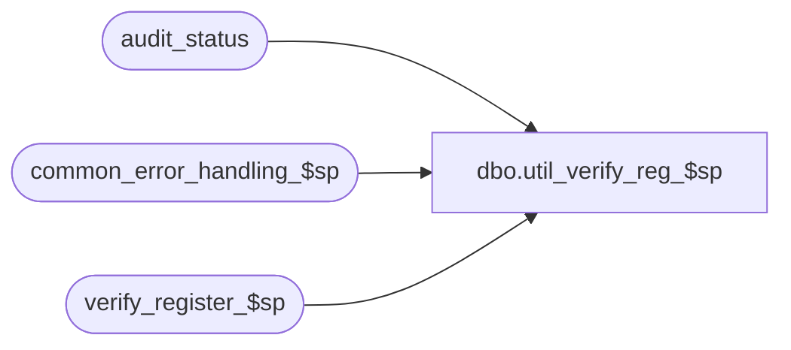

# dbo.util_verify_reg_$sp

**Database:** auditworks  
**Server:** bedrockdb01  

## Architecture Diagram



## Table Dependencies

| Referenced Table |
|---|
| audit_status |
| common_error_handling_$sp |
| verify_register_$sp |

## Stored Procedure Code

```sql
create proc dbo.util_verify_reg_$sp    
AS

/*
  PROC NAME: util_verify_reg_$sp  5.0/5.1
  Desc: Attempt to verify all register-dates with audit_status = 100 (edited).
    Store-date will become verified/autoaccepted if all reg are verified/accepted. 

HISTORY:
Date       Name         Def# Desc
Aug15,13   Paul       145958 call common_error_handling_$sp, use try .. catch
Aug13,10   Paul       120038 pass an additional variable to verify_register_$sp
Sep24,04   Paul      DV-1146 use user_id
May07,04   Maryam    DV-1071 Modified the call to verify_register_$sp to pass @process_id
Jan17,03   ShuZ      1-HZ3U2 Change double quote to single quote
Dec10,00   Paul         6828 author

*/

DECLARE
	@errno 				int,
	@cursor_open			tinyint,
	@register_no			smallint,
	@store_no 			int,
	@transaction_date 		smalldatetime,
	@date_reject_id 			tinyint,
	@errmsg				nvarchar(1024),
	@user_id                        int,
	@process_id                     binary(16),
	@object_name		nvarchar(255),
	@process_name		nvarchar(100),
	@operation_name		nvarchar(100),
	@message_id		int


SELECT @process_name = 'util_verify_reg_$sp',
	@message_id = 201068,
	@process_id = 0, -- only used for logging errors in sub procs
	@user_id = null;

BEGIN TRY

SELECT @errmsg = 'Failed to open store_list_cursor on audit_status',
	@operation_name = 'OPEN',
	@object_name = 'store_list_crsr';
       
DECLARE store_list_crsr CURSOR FAST_FORWARD
 FOR
SELECT store_no,
	sales_date,
	register_no
 FROM audit_status
 WHERE audit_status = 100
   AND date_reject_id = 0
ORDER BY sales_date,store_no, register_no;

OPEN store_list_crsr;
SELECT @cursor_open = 1,
	@operation_name = 'FETCH';


WHILE 1=1
BEGIN

FETCH store_list_crsr INTO
	@store_no,
	@transaction_date,
	@register_no;

IF @@fetch_status <> 0
  BREAK;

  SELECT @errmsg = 'Unable to execute stored procedure verify_register_$sp',
	@operation_name = 'EXECUTE',
	@object_name = 'verify_register_$sp';

EXEC verify_register_$sp @process_id, @user_id, @store_no, @register_no,
   @transaction_date, 0, @errmsg OUTPUT, 1;

  SELECT @operation_name = 'FETCH',
	@object_name = 'store_list_crsr';

END; /* While 1=1 */

SELECT @operation_name = 'CLOSE',
	@object_name = 'store_list_crsr';

CLOSE store_list_crsr;
DEALLOCATE store_list_crsr;
SELECT @cursor_open = 0;

RETURN;

END TRY

BEGIN CATCH;

     /* Common error handler. */

	SELECT @errno = ERROR_NUMBER(),
		@errmsg = COALESCE(@errmsg, ' ') + ERROR_MESSAGE();

	IF @cursor_open = 1
	  BEGIN
		CLOSE store_list_crsr;
		DEALLOCATE store_list_crsr;
	  END

	EXEC common_error_handling_$sp 0, @errno, @errmsg, 0, @message_id, 
	  @process_name, @object_name, @operation_name, 0, 1, 0, null, 0, null, null, 
	  null, null, null, null, 0, null, 0;

	RETURN;
END CATCH;
```

