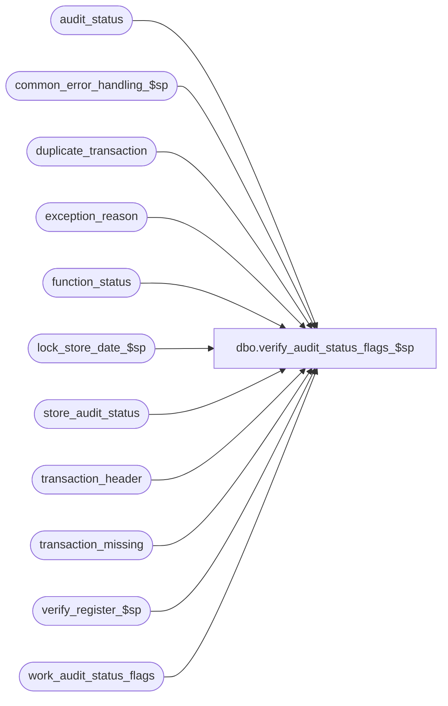

# dbo.verify_audit_status_flags_$sp

**Database:** auditworks  
**Server:** bedrockdb01  

## Architecture Diagram



## Table Dependencies

| Referenced Table |
|---|
| audit_status |
| common_error_handling_$sp |
| duplicate_transaction |
| exception_reason |
| function_status |
| lock_store_date_$sp |
| store_audit_status |
| transaction_header |
| transaction_missing |
| verify_register_$sp |
| work_audit_status_flags |

## Stored Procedure Code

```sql
create proc dbo.verify_audit_status_flags_$sp 

 ( @process_id		binary(16),
   @user_id		int,
   @function_no	        tinyint, 
   @recovery_flag	tinyint = 1 
 )

AS

/* Proc Name: verify_audit_status_flags_$sp
   Description:  Recalculate the verified flags and the status in table audit_status for the stores and registers
		 specified in table work_audit_status_flags (populated by function_cleanup_$sp). 
		 Ignore date_reject > 0 except for duplicates.
   Called by function_cleanup_$sp to recover failed process verifying/unverifying duplicates, exceptions, missing trans.

   Same version for SA5.0 and SA5.1

HISTORY:
  Date   Name          Def# Desc
Jan21,11 Vicci        124247 Correct error handling following call to lock_store_date_$sp to recognize the fact that it
                             is normal to receive an @@error of 266 along with a return code of 201550 given the common
                             error handling rollback with will already have occurred and the proc is being called within
                             a begin tran.
Feb15,10 Vicci       115915 Corrected description to reflect the fact that the front end does not populate
                            work_audit_status_flags nor call this procedure.  
                            Removed ORG_CHN_HRCHY_LVL_GRP.GRP_MBR_CHNG setting since this is already done in
                            store_audit_status trigger.  Don't clean up the work_audit_status_flags and function_status 
                            entries if a store/date has been skipped.  Don't try to lock if in recovery mode and 
                            store/date already locked by process being recovered.     
Nov16,05 Paul       DV-1323 corrected function numbers to match code_description, select distinct in case of frontend errors
Nov03,05 Paul       DV-1321 corrected join on exceptions, simplified cursor
Sep17,04 Paul       DV-1146 use user_id
Aug23,04 Paul       DV-1120 change refresh logic
Jun04 04 ShuZ       DV-1071 CDM changes for features and store_feature tables.
Apr19,04 Maryam     DV-1071 Modified to pass @user_name and @process_id to sub procs.
Apr16,04 Sab        DV-1068 Remove unused variables
May01,02 Paul S.    1-CD0IX added R3 error handling
May25,00 John G        5864 Change '= NULL' to 'IS NULL' where applicable to mirror Oracle.         
Mar01,00 Phu           5900 Change @@fetch_status > 0 to @@fetch_status <> 0 for MS SQL compatibility
Jun14,99 Louise M.     4526 Added code to handle trickle processing.
Jul29,98 Paul S.
Jun29,98 Henry W
*/


DECLARE

@cursor_open			tinyint,
@date_reject_id			tinyint,
@errmsg				varchar(255),
@errno				int,
@rows_updated			int,
@register_no			smallint,
@register_trickle_flag		tinyint,
@ret				int,
@store_no			int,
@transaction_date		smalldatetime,
@trickle_in_progress_flag	tinyint,
@verified_new			tinyint,
@object_name			varchar(255),
@process_name			varchar(100),
@operation_name			varchar(100),
@message_id			int,
@locked_by_function_no 		tinyint,
@locked_by_process_id  		binary(16)


SELECT @trickle_in_progress_flag = 0,
       @register_trickle_flag = 0,
       @rows_updated = 0,
       @process_name = 'verify_audit_status_flags_$sp',
       @message_id = 201068,
       @ret = -1 

DECLARE verify_audit_status_flag_crsr CURSOR FAST_FORWARD
FOR
SELECT DISTINCT
	store_no,
	register_no,
	transaction_date,
	date_reject_id
  FROM work_audit_status_flags WITH (NOLOCK)
 WHERE process_id = @process_id
   AND function_no = @function_no

OPEN verify_audit_status_flag_crsr

SELECT @errno = @@error
IF @errno <> 0
  BEGIN
    SELECT @errmsg = 'Unable to open cursor verify_audit_status_flag_crsr',
           @object_name = 'verify_audit_status_flag_crsr',
           @operation_name = 'OPEN'
    GOTO error
  END

SELECT @cursor_open = 1

WHILE 1 = 1
BEGIN

  FETCH verify_audit_status_flag_crsr INTO
	@store_no,
	@register_no,
	@transaction_date,
	@date_reject_id

  IF @@fetch_status <> 0
    BREAK
    
  SELECT @trickle_in_progress_flag = 0,
       @register_trickle_flag = 0,
       @rows_updated = 0
        
  SELECT @trickle_in_progress_flag = ISNULL(trickle_in_progress_flag,0),
         @locked_by_function_no = update_in_progress, 
         @locked_by_process_id = process_id
    FROM store_audit_status
   WHERE store_no = @store_no
     AND sales_date = @transaction_date
     AND date_reject_id = 0

  SELECT @errno = @@error
  IF @errno != 0
  BEGIN
    SELECT @errmsg = 'Unable to select from store_audit_status',
           @object_name = 'store_audit_status',
           @operation_name = 'SELECT'
    GOTO error
  END

 IF @trickle_in_progress_flag = 1
 BEGIN
  SELECT @register_trickle_flag = ISNULL(trickle_in_progress_flag ,0)  
    FROM audit_status
   WHERE store_no = @store_no
     AND register_no = @register_no
     AND sales_date = @transaction_date
     AND date_reject_id = 0

  SELECT @errno = @@error
  IF @errno != 0
  BEGIN
    SELECT @errmsg = 'Unable to select from audit_status',
           @object_name = 'audit_status',
           @operation_name = 'SELECT'
    GOTO error
  END    
 END        

/* Verify DUPLICATE transactions */

IF @function_no = 224
  BEGIN
    SELECT @verified_new = MIN(verified)
      FROM duplicate_transaction WITH (NOLOCK)
     WHERE store_no = @store_no
       AND transaction_date = @transaction_date
       AND register_no = @register_no
       AND date_reject_id = @date_reject_id
    SELECT @errno = @@error
    IF @errno != 0
    BEGIN
      SELECT @errmsg = 'Unable to select from duplicate_transaction',
           @object_name = 'duplicate_transaction',
           @operation_name = 'SELECT'
      GOTO error
    END

    UPDATE audit_status
       SET duplicate_verified = @verified_new
     WHERE store_no = @store_no
       AND sales_date = @transaction_date
       AND date_reject_id = @date_reject_id
       AND register_no = @register_no
       AND duplicate_verified != @verified_new
       AND (audit_status <= 300 OR audit_status >= 900) -- safety check

    SELECT @errno = @@error,
  	  @rows_updated = @@rowcount
    IF @errno != 0
    BEGIN
      SELECT @errmsg = 'Unable to update audit_status (224)',
           @object_name = 'audit_status',
           @operation_name = 'UPDATE'
      GOTO error
    END  
  END /* IF @function = 224 */

  /* Verify MISSING transactions */

  IF @function_no = 115 AND @date_reject_id = 0
  BEGIN
    SELECT @verified_new = MIN(verified)
      FROM transaction_missing WITH (NOLOCK)
     WHERE store_no = @store_no
       AND sales_date = @transaction_date
       AND register_no = @register_no

    SELECT @errno = @@error
    IF @errno != 0
    BEGIN
      SELECT @errmsg = 'Unable to select from transaction_missing',
           @object_name = 'transaction_missing',
           @operation_name = 'SELECT'
      GOTO error
    END

    UPDATE audit_status
       SET missing_verified = @verified_new
     WHERE store_no = @store_no
       AND sales_date = @transaction_date
       AND date_reject_id = 0
       AND register_no = @register_no
       AND missing_verified != @verified_new
       AND (audit_status <= 300 OR audit_status >= 900) -- safety check

    SELECT @errno = @@error,
	  @rows_updated = @@rowcount
    IF @errno != 0
    BEGIN
      SELECT @errmsg = 'Unable to update audit_status (115)',
           @object_name = 'audit_status',
           @operation_name = 'UPDATE'
      GOTO error
    END 
  END /* IF @function = 115 */

  /* Verify EXCEPTION transactions */

  IF @function_no = 223 AND @date_reject_id = 0
  BEGIN
      SELECT @verified_new = ISNULL(MIN(verified),0)
        FROM exception_reason er WITH (NOLOCK), transaction_header th WITH (NOLOCK)
       WHERE th.store_no = @store_no
         AND th.transaction_date = @transaction_date
         AND th.register_no = @register_no
   AND th.date_reject_id = 0
         AND th.exception_flag = 1
         AND th.transaction_id = er.transaction_id
         AND er.exception_type = 1

      SELECT @errno = @@error
      IF @errno != 0
      BEGIN
        SELECT @errmsg = 'Unable to select from exception_reason',
           @object_name = 'exception_reason',
           @operation_name = 'SELECT'
        GOTO error
      END

      UPDATE audit_status
         SET exceptions_verified = @verified_new
       WHERE store_no = @store_no
         AND sales_date = @transaction_date
         AND date_reject_id = 0
         AND register_no = @register_no
         AND exceptions_verified != @verified_new
         AND (audit_status <= 300 OR audit_status >= 900) -- safety check

      SELECT @errno = @@error,
             @rows_updated = @@rowcount
      IF @errno != 0
      BEGIN
        SELECT @errmsg = 'Unable to update audit_status (223)',
           @object_name = 'audit_status',
           @operation_name = 'UPDATE'
        GOTO error
      END 
  END /* IF @function = 223 */

  IF (@locked_by_function_no = @function_no AND @locked_by_process_id = @process_id)   --recovery mode past locking point
    SELECT @ret = 0

  IF @rows_updated > 0 OR @recovery_flag = 1
  BEGIN
   IF @register_trickle_flag = 0
   BEGIN
    BEGIN TRAN

    IF @ret = -1  --i.e. not in recovery mode and already locked
    BEGIN
      EXEC lock_store_date_$sp @process_id, @user_id, @store_no, @transaction_date, @date_reject_id, @function_no, @ret OUTPUT
      SELECT @errno = @@error
      IF @errno != 0
      BEGIN
        IF @errno = 201550 OR @ret = 201550
          SELECT @ret = 1
        ELSE
        BEGIN
          SELECT @errmsg = 'Failed to execute lock_store_date_$sp',
	         @object_name = 'lock_store_date_$sp',
	         @operation_name = 'EXEC'
          GOTO error
        END
      END
    END --IF @ret = -1 i.e. not in recovery mode and already locked

    /* If unable to lock store-date then do not verify register since the function holding the lock will do it later */

    IF @ret = 0
    BEGIN -- verify_register_$sp will update audit_status for store-reg-date then unlock
	  -- store_audit_status trigger will update ORG_CHN_HRCHY_LVL_GRP.GRP_MBR_CHNG
      EXEC verify_register_$sp @process_id, @user_id, @store_no, @register_no, @transaction_date, @date_reject_id,
	  @errmsg OUTPUT, 3

      SELECT @errno = @@error
      IF @errno != 0
      BEGIN
        IF @errmsg IS NULL  
          SELECT @errmsg = 'Failed to execute stored procedure verify_register_$sp'
 	SELECT @object_name = 'verify_register_$sp',
               @operation_name = 'EXECUTE'
        GOTO error
      END
    END -- IF @ret = 0

    COMMIT
   END -- If @register_trickle_flag = 0 
   ELSE  --ELSE of IF @register_trickle_flag = 0
   BEGIN
     SELECT @ret = 0
   END

  END /* IF @rows_updated > 0 OR @recovery_flag = 1 */

  IF @ret = 0
  BEGIN
    DELETE work_audit_status_flags
     WHERE process_id = @process_id
       AND function_no = @function_no
       AND store_no = @store_no
       AND register_no = @register_no
       AND transaction_date = @transaction_date
       AND date_reject_id = @date_reject_id
    SELECT @errno = @@error
    IF @errno != 0
    BEGIN
      SELECT @errmsg = 'Unable to delete work_audit_status_flags',
           @object_name = 'work_audit_status_flags',
           @operation_name = 'DELETE'
      GOTO error
    END
  END  --IF @ret = 0
END -- WHILE 1 = 1

CLOSE verify_audit_status_flag_crsr
DEALLOCATE verify_audit_status_flag_crsr
SELECT @cursor_open = 0

IF EXISTS (SELECT 1 
             FROM work_audit_status_flags
            WHERE function_no = @function_no
              AND process_id = @process_id)
BEGIN
  SELECT @errno= 201550,
         @message_id = 201550,
         @errmsg = 'Could not lock certain store/dates.  Please try again later.',
         @object_name = 'lock_store_date_$sp',
         @operation_name = 'EXECUTE'
  GOTO error
END
ELSE
BEGIN
  DELETE function_status
   WHERE process_id = @process_id
     AND function_no = @function_no
  SELECT @errno = @@error
  IF @errno != 0
  BEGIN
    SELECT @errmsg = 'Unable to delete function_status',
           @object_name = 'function_status',
           @operation_name = 'DELETE'
    GOTO error
  END 
END

RETURN

error:   /* Common error handler */

	IF @cursor_open = 1
	  BEGIN
	   CLOSE verify_audit_status_flag_crsr
	   DEALLOCATE verify_audit_status_flag_crsr
	  END

	EXEC common_error_handling_$sp @function_no, @errno, @errmsg, 0, @message_id, 
	  @process_name, @object_name, @operation_name, 0, 1, 0, null, 0, null, null, null,
	  null, null, null, 0, @process_id, @user_id


	RETURN
```

