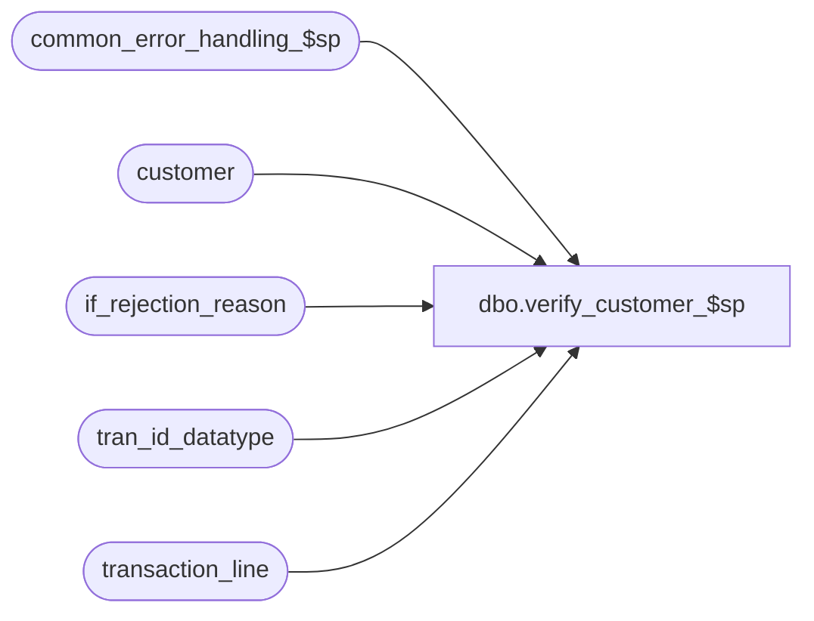

# dbo.verify_customer_$sp

**Database:** auditworks  
**Server:** bedrockdb01  

## Architecture Diagram



## Table Dependencies

| Referenced Table |
|---|
| common_error_handling_$sp |
| customer |
| if_rejection_reason |
| tran_id_datatype |
| transaction_line |

## Stored Procedure Code

```sql
create proc dbo.verify_customer_$sp @process_id	 	binary(16),
@user_id                int,
@transaction_id		tran_id_datatype,
@errmsg			nvarchar(255) OUTPUT
AS

/* Proc Name: verify_customer_$sp
   Description : Verify that all transaction mail-check customer attachments contain sufficient mailing information 
                 and that if no mail-check customer attachment exists that all other customer attachments have sufficient mailing information.
                 If a transaction does not have sufficient customer mailing info, then return 1 else return 0.
HISTORY
Date     Name      Def#  Desc
Oct10,14 Vicci TFS-88075 Ensure that an "insufficient customer info" rejection is not logged when the mail-check customer is absent but
                         other customer attachments exist and all have sufficient mailing information.
Dec19,05 Paul      64546 apply 64259, 61838 to SA5
Aug03,05 David   DV-1294 Expand last_name to nvarchar(40).
Jul05,05 Paul    DV-1239 Use tran_id_datatype
Jun01,05 Paul    DV-1254 add nolock hints
Mar22,05 Maryam  DV-1202 Rename from_line_id to line_id.
Sep22,04 Paul    DV-1146 receive user_id
Apr23,04 Maryam  DV-1071 Modified to receive @user_name and @process_id as input parameters
			  and pass it to common_error_handling_$sp.
Dec07,05 Daphna    61838 log customer_role into memo for IF reject insufficient cust data
Dec02,05 Vicci	   64259	Make validation consistent with that of edit and don't reject if complete
		 	 mail-check customer exists.
OCT15,02 Daphna  1-F8GOD log IF reject when customer attachment is expected (ie cust_info_sufficient
                         check is turned on for interface affected by this txn) but does not exist
May10,02 Paul    1-CD0IX added R3 error handling
Jan15,01 Paul       7242 Correctly verify customer info when there is more than one cust role.
                         Also removed work table.
Mar03,96 Seb             author
*/

DECLARE
  @address_1		nvarchar(40),
  @address_2		nvarchar(40),
  @city			nvarchar(40),
  @create_reject	tinyint,
  @cursor_open		tinyint,
  @customer_info_exists	tinyint,
  @customer_role	smallint,
  @errno		int,
  @first_fetch          tinyint,  -- DEF 1-F8GOD
  @line_id		numeric(5,0),
  @last_name		nvarchar(40),
  @post_code		nvarchar(40),
  @return_code		tinyint,
  @state		nvarchar(40),
  @message_id		int,
  @object_name		nvarchar(255),
  @process_name		nvarchar(100),
  @operation_name	nvarchar(100)

SELECT @return_code = 0,
	@process_name = 'verify_customer_$sp',
	@message_id = 201068,
	@first_fetch = 1  

DECLARE customer_crsr CURSOR FAST_FORWARD
FOR
SELECT last_name,
 	address_1,
 	address_2,
 	city,
 	state,
 	post_code,
	line_id,
	customer_role
   FROM customer WITH (NOLOCK)
  WHERE transaction_id = @transaction_id 

OPEN customer_crsr

SELECT @errno = @@error
IF @errno != 0
BEGIN
  SELECT @errmsg = 'Failed to open customer_crsr',
         @object_name = 'customer_crsr',
         @operation_name = 'OPEN'
  GOTO error
END

SELECT @cursor_open = 1

WHILE 1=1
BEGIN

  FETCH customer_crsr INTO
	@last_name,
 	@address_1,
 	@address_2,
 	@city,
 	@state,
 	@post_code,
	@line_id,
	@customer_role

  IF @@fetch_status <> 0
  BEGIN
    IF @first_fetch = 0
      BREAK
    ELSE  
      SELECT @line_id = 0,
             @last_name = NULL,
             @customer_role = NULL
  END  

  IF @last_name IS NOT NULL 
     AND (@address_1 IS NOT NULL OR @address_2 IS NOT NULL)
     AND ((@city IS NOT NULL AND @state IS NOT NULL)
           OR @post_code IS NOT NULL)
  BEGIN
     SELECT @create_reject = 0 -- dummy command
  END
  ELSE
  BEGIN
    IF    @customer_role = 3 
       OR (    COALESCE(@customer_role, 0) <> 3 
           AND NOT EXISTS (SELECT 1 
    		             FROM customer 
		            WHERE transaction_id = @transaction_id 
                              AND customer_role = 3 ))
    BEGIN
      SELECT @create_reject = 1,
  	     @return_code = 1
    END 
    	   
    IF @create_reject = 1
    BEGIN
      INSERT if_rejection_reason (
		transaction_id,
		line_id,
		if_reject_reason,
		memo3)
      VALUES (@transaction_id,
	      @line_id,
	      6,
	      @customer_role)
      SELECT @errno = @@error
      IF @errno != 0
      BEGIN
        SELECT @errmsg = 'Failed to insert if_rejection_reason',
               @object_name = 'if_rejection_reason',
               @operation_name = 'INSERT'
        GOTO error
      END

      UPDATE transaction_line
         SET interface_rejection_flag = 1
       WHERE transaction_id = @transaction_id
         AND line_id = @line_id
      SELECT @errno = @@error
      IF @errno != 0
      BEGIN
        SELECT @errmsg = 'Failed to update transaction_line',
               @object_name = 'transaction_line',
               @operation_name = 'UPDATE'
        GOTO error
      END
    END -- If @create_reject = 1
  END -- else of if @last_name ...
  SELECT @first_fetch = 0  
END -- While 1=1

CLOSE customer_crsr
DEALLOCATE customer_crsr

RETURN @return_code

error:   /* Common error handler. */

	IF @cursor_open = 1
	  BEGIN
	   CLOSE customer_crsr
	   DEALLOCATE customer_crsr
	  END

	EXEC common_error_handling_$sp 100, @errno, @errmsg, 0, @message_id, 
	  @process_name, @object_name, @operation_name, 0, 1, 0, null, 0,
	  null, null, null, null, null, null, 0, @process_id, @user_id
	RETURN
```

