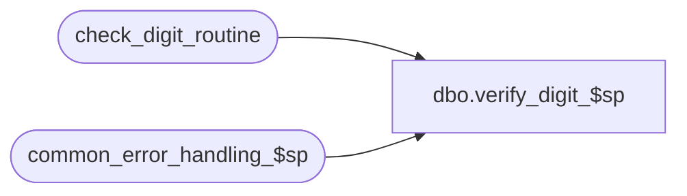

# dbo.verify_digit_$sp

**Database:** auditworks  
**Server:** bedrockdb01  

## Architecture Diagram



## Table Dependencies

| Referenced Table |
|---|
| check_digit_routine |
| common_error_handling_$sp |

## Stored Procedure Code

```sql
create proc dbo.verify_digit_$sp 
@process_id	        binary(16),
@user_id                int,
@card_no		nvarchar(20),
@check_digit_routine_no tinyint,
@function_no		smallint = 250,
@errmsg 		nvarchar(255) OUTPUT

AS

/* Proc Name: verify_digit_$sp 
   Desc: Subroutine to verify the check digit on a credit card.
         return status = 1 indicates that card no is invalid.
         Called by verify_card_number_$sp. 
         Called directly by Service Desk Module

HISTORY
 Date    Name            Defect Desc
Jan04,11 Paul            105313 Use unicode datatypes
Sep22,04 Paul           DV-1146 receive user_id
Apr29,04 Maryam         DV-1071 Receive @process_id and pass it to the common_error_handling_$sp
Mar28,03 Vicci           7300   Prevent arithmetic overflow. Was casting value to be put in
				@sum_of_digits as tinyint.
Mar03,03 Maryam          6478   Change the function no to be 250 for Voucher Service.
JUL18,02 Daphna         AW-8812 Author
*/

DECLARE 
  @abort_flag		tinyint,
  @digit1		smallint,
  @digit2		tinyint,
  @digit3		tinyint,
  @digit4		tinyint,
  @digit5		tinyint,
  @digit6		tinyint,
  @digit7		tinyint,
  @digit8		tinyint,
  @digit9		tinyint,
  @digit10		tinyint,
  @digit11		tinyint,
  @digit12		tinyint,
  @digit13		tinyint,
  @digit14		tinyint,
  @digit15		tinyint,
  @digit16		tinyint,
  @digit17		tinyint,
  @digit18		tinyint,
  @digit19		tinyint,
  @digit20		tinyint,
  @divisor		tinyint,
  @errno		int,
  @remainder_value	tinyint,
  @sum_of_digits	smallint,
  @sum_of_products	bit, 
  @object_name		nvarchar(255),
  @process_name		nvarchar(100),
  @operation_name	nvarchar(100),
  @message_id		int


IF @check_digit_routine_no = 0
  RETURN 0


SELECT  @card_no = RIGHT('00000000000000000000' + LTRIM(RTRIM(@card_no)),20),
	@process_name = 'verify_digit_$sp',
	@message_id = 201068

IF  @function_no = 250  -- called by Voucher Service
  SELECT @abort_flag = 3  -- skip raiserror
ELSE
  SELECT @abort_flag = 0 

/* Validate Card - Check digit routine */
SELECT @digit20 = ISNULL(CONVERT(tinyint, SUBSTRING(@card_no, 20, 1 )),0) * multiplier20,
    @digit19 = (ISNULL(CONVERT(tinyint, SUBSTRING(@card_no, 19, 1 )),0) * multiplier19)
	- (sum_of_product_digits * SIGN(SIGN(ISNULL(CONVERT(tinyint, SUBSTRING(@card_no, 19, 1 )),0) - 5)+1)),
    @digit18 = ISNULL(CONVERT(tinyint, SUBSTRING(@card_no, 18, 1 )),0) * multiplier18,
    @digit17 = (ISNULL(CONVERT(tinyint, SUBSTRING(@card_no, 17, 1 )),0) * multiplier17)
	- (sum_of_product_digits * SIGN(SIGN(ISNULL(CONVERT(tinyint, SUBSTRING(@card_no, 17, 1 )),0) - 5)+1)),
    @digit16 = ISNULL(CONVERT(tinyint, SUBSTRING(@card_no, 16, 1 )),0) * multiplier16,
    @digit15 = (ISNULL(CONVERT(tinyint, SUBSTRING(@card_no, 15, 1 )),0) * multiplier15)
	- (sum_of_product_digits * SIGN(SIGN(ISNULL(CONVERT(tinyint, SUBSTRING(@card_no, 15, 1 )),0) - 5)+1)),
    @digit14 = ISNULL(CONVERT(tinyint, SUBSTRING(@card_no, 14, 1 )),0) * multiplier14,
    @digit13 = (ISNULL(CONVERT(tinyint, SUBSTRING(@card_no, 13, 1 )),0) * multiplier13)
	- (sum_of_product_digits * SIGN(SIGN(ISNULL(CONVERT(tinyint, SUBSTRING(@card_no, 13, 1 )),0) - 5)+1)),
    @digit12 = ISNULL(CONVERT(tinyint, SUBSTRING(@card_no, 12, 1 )),0) * multiplier12,
    @digit11 = (ISNULL(CONVERT(tinyint, SUBSTRING(@card_no, 11, 1 )),0) * multiplier11)
	- (sum_of_product_digits * SIGN(SIGN(ISNULL(CONVERT(tinyint, SUBSTRING(@card_no, 11, 1 )),0) - 5)+1))
  FROM check_digit_routine
 WHERE check_digit_routine_no = @check_digit_routine_no

SELECT @errno = @@error
IF @errno != 0
BEGIN
  SELECT @errmsg = 'Unable to select from check_digit_routine (1)',
         @object_name = 'check_digit_routine',
         @operation_name = 'SELECT'
  GOTO error
END

SELECT @digit10 = ISNULL(CONVERT(tinyint, SUBSTRING(@card_no, 10, 1 )),0) * multiplier10,
    @digit9 = (ISNULL(CONVERT(tinyint, SUBSTRING(@card_no, 9, 1 )),0) * multiplier9)
	- (sum_of_product_digits * SIGN(SIGN(ISNULL(CONVERT(tinyint, SUBSTRING(@card_no, 9, 1 )),0) - 5)+1)),
    @digit8 = ISNULL(CONVERT(tinyint, SUBSTRING(@card_no, 8, 1 )),0) * multiplier8,
    @digit7 = (ISNULL(CONVERT(tinyint, SUBSTRING(@card_no, 7, 1 )),0) * multiplier7)
	- (sum_of_product_digits * SIGN(SIGN(ISNULL(CONVERT(tinyint, SUBSTRING(@card_no, 7, 1 )),0) - 5)+1)),
    @digit6 = ISNULL(CONVERT(tinyint, SUBSTRING(@card_no, 6, 1 )),0) * multiplier6,
    @digit5 = (ISNULL(CONVERT(tinyint, SUBSTRING(@card_no, 5, 1 )),0) * multiplier5)
	- (sum_of_product_digits * SIGN(SIGN(ISNULL(CONVERT(tinyint, SUBSTRING(@card_no, 5, 1 )),0) - 5)+1)),
    @digit4 = ISNULL(CONVERT(tinyint, SUBSTRING(@card_no, 4, 1 )),0) * multiplier4,
    @digit3 = (ISNULL(CONVERT(tinyint, SUBSTRING(@card_no, 3, 1 )),0) * multiplier3)
	- (sum_of_product_digits * SIGN(SIGN(ISNULL(CONVERT(tinyint, SUBSTRING(@card_no, 3, 1 )),0) - 5)+1)),
    @digit2 = ISNULL(CONVERT(tinyint, SUBSTRING(@card_no, 2, 1 )),0) * multiplier2,
    @digit1 = (ISNULL(CONVERT(tinyint, SUBSTRING(@card_no, 1, 1 )),0) * multiplier1)
	- (sum_of_product_digits * SIGN(SIGN(ISNULL(CONVERT(tinyint, SUBSTRING(@card_no, 1, 1 )),0) - 5)+1))
  FROM check_digit_routine
 WHERE check_digit_routine_no = @check_digit_routine_no

SELECT @errno = @@error
IF @errno != 0
BEGIN
  SELECT @errmsg = 'Unable to select from check_digit_routine (2)',
         @object_name = 'check_digit_routine',
         @operation_name = 'SELECT'
   GOTO error
END

SELECT @sum_of_digits = @digit1 + @digit2 + @digit3 + @digit4 + @digit5 + @digit6
	+ @digit7 + @digit8 + @digit9 + @digit10 + @digit11 + @digit12 + @digit13
	+ @digit14 + @digit15 + @digit16 + @digit17 + @digit18 + @digit19 + @digit20

SELECT @sum_of_products = sum_of_products,
	@divisor = divisor                                    
  FROM check_digit_routine
 WHERE check_digit_routine_no = @check_digit_routine_no

SELECT @errno = @@error
IF @errno != 0
BEGIN
  SELECT @errmsg = 'Unable to select from check_digit_routine (3)',
         @object_name = 'check_digit_routine',
         @operation_name = 'SELECT'
  GOTO error
END

IF @divisor = 0
  RETURN 1

IF @sum_of_products = 1
  SELECT @remainder_value = @sum_of_digits % @divisor

IF @remainder_value <> 0
BEGIN
  RETURN 1
END

RETURN 0

error:   /* Common error handler */

	EXEC common_error_handling_$sp @function_no, @errno, @errmsg, @abort_flag, @message_id, 
	  @process_name, @object_name, @operation_name, 0, 1, 0, null, 0, null, null, 
	  null, null, null, null, 0, @process_id, @user_id


        SELECT @errmsg = @process_name + ' - ' + @errmsg
        
	RETURN @errno
```

