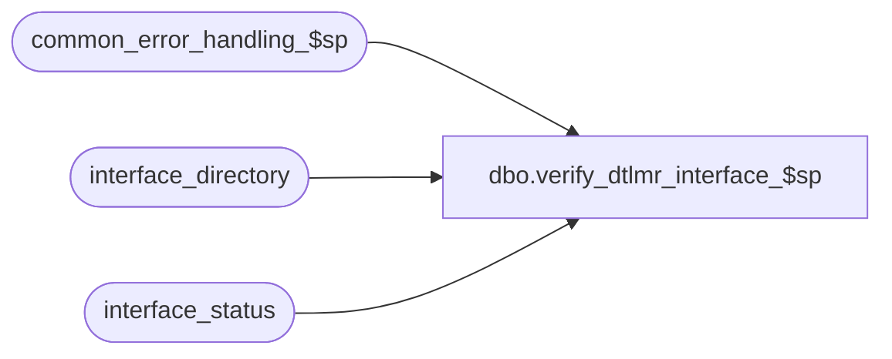

# dbo.verify_dtlmr_interface_$sp

**Database:** auditworks  
**Server:** bedrockdb01  

## Architecture Diagram



## Table Dependencies

| Referenced Table |
|---|
| common_error_handling_$sp |
| interface_directory |
| interface_status |

## Stored Procedure Code

```sql
create proc dbo.verify_dtlmr_interface_$sp 

 AS

/* 
Proc Name:  verify_dtlmr_interface_$sp
DESCRIPTION:  Verify if the company has the option to export dtlmr interface ASCII 
		file and if the basic_dtlmr_interface_$sp procedure has terminated 
		normally. Called by smartload script bscintface.ict
HISTORY
Date   	  Name    Defect# Description
Jan04,11 Paul      105313 Use unicode datatypes
May10,02 Paul     1-CD0IX added R3 error handling
May25,00 John G      5864 Change '= NULL' to 'IS NULL' where applicable to mirror Oracle.         
*/

DECLARE
	@ascii_export 			tinyint,
	@errmsg 			nvarchar(255),
	@errno 				int,
	@retrieval_in_progress 		tinyint,
	@message_id			int,
	@object_name			nvarchar(255),
	@process_name			nvarchar(100),
	@operation_name			nvarchar(100)

SELECT 	@process_name = 'verify_dtlmr_interface_$sp',
	@message_id = 201068

SELECT  @ascii_export = MAX (ascii_export),
	@retrieval_in_progress = MAX (CONVERT (tinyint, retrieval_in_progress))
  FROM interface_status s, interface_directory d
 WHERE s.interface_id = d.interface_id
   AND basic_dtlmr_subsystem IS NOT NULL
 AND ascii_export = 1

SELECT @errno = @@error
IF @errno <> 0
  BEGIN
   SELECT @errmsg = 'Failed to select from interface_status',
           @object_name = 'interface_status',
           @operation_name = 'SELECT'
   GOTO error
  END

IF @ascii_export <> 1
OR @retrieval_in_progress IS NULL --
  RETURN
ELSE
IF @retrieval_in_progress = 1
  BEGIN
   SELECT @errmsg = 'Retrieval dtlmr in progress/terminated abnormally. Please verify',
          @message_id = 201535,
          @errno = 201535
   GOTO error
  END

/* Result of this SELECT is in the file /work/ICT_SAP/sql.out
** which is used by smartload script bscintface.ict to create *DTLMRVFY file 
*/

SELECT 'process_dtlmr_interface'
  FROM interface_status s, interface_directory d
 WHERE s.interface_id = d.interface_id
   AND basic_dtlmr_subsystem IS NOT NULL
AND ascii_export = 1

RETURN


error:   /* Common error handler */

	EXEC common_error_handling_$sp 203, @errno, @errmsg, 0, @message_id, 
	  @process_name, @object_name, @operation_name, 1
	RETURN
```

