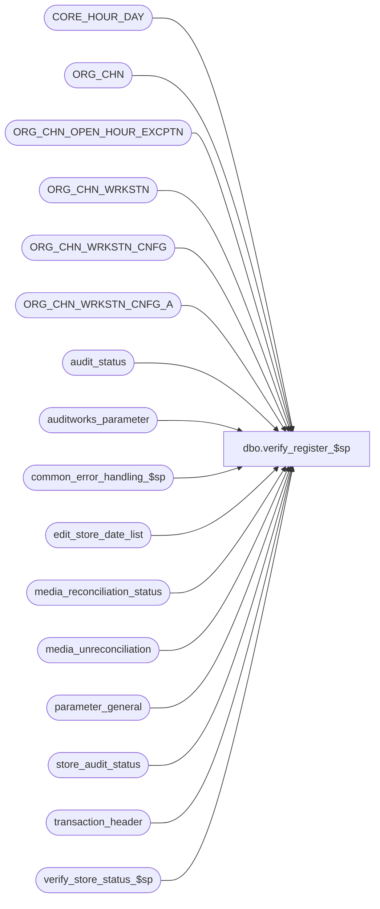

# dbo.verify_register_$sp

**Database:** auditworks  
**Server:** bedrockdb01  

## Architecture Diagram



## Table Dependencies

| Referenced Table |
|---|
| CORE_HOUR_DAY |
| ORG_CHN |
| ORG_CHN_OPEN_HOUR_EXCPTN |
| ORG_CHN_WRKSTN |
| ORG_CHN_WRKSTN_CNFG |
| ORG_CHN_WRKSTN_CNFG_A |
| audit_status |
| auditworks_parameter |
| common_error_handling_$sp |
| edit_store_date_list |
| media_reconciliation_status |
| media_unreconciliation |
| parameter_general |
| store_audit_status |
| transaction_header |
| verify_store_status_$sp |

## Stored Procedure Code

```sql
CREATE proc  dbo.verify_register_$sp 
@process_id             binary(16),
@user_id                int,
@store_no 		int,
@register_no 		smallint,
@transaction_date 	smalldatetime,
@date_reject_id 	tinyint,
@errmsg			nvarchar(2000) OUTPUT,
@verify_store_status    tinyint = 1 /* normally 1.
 				      0 = don't call verify_store_status_$sp
					because calling proc will do it later
				      1 = call verify_store_status_$sp
				      2 = called by move (acts like 1)
				      3 = call verify_store_status_$sp and unlock store-date (new media rec) */

AS

/* Proc name: verify_register_$sp

** Description: Set status of a store/reg/sales_date in audit_status
** 		 to verified (200) if it meets verification criteria
** 		and if the status was originally = edited (100).
**		Will also autoaccept if already verified and autoaccept_flag >= 1.
** 		Sets status of store/sales_date in store_audit_status
** 		to verified/accepted as well if all registers of that particular
** 		store/sales_date are all set to verified/accepted.
** 		Called by many procs (manual functions) and media rec/edit.
** Unicode version.

HISTORY:
Date     Name       Def# Desc
Aug19,16 Vicci DAOM-1293 Take store closeout (store completion date/time) into account in auto-accept when logical trading date handling is active too.
May09,16 Vicci  DAOM-730 Set @edit_running (before was just selecting the value not setting the variable).
Dec04,14 Vicci TFS-93499 In a trickle audit environment, if the UI has not prevented a manual function from being executed against a store/date 
                         that is trickling in, ensure that the store/date is not left locked indefinitely (but instead delegates the assessment of 
                         its status to the Edit Phase2).  Also, handle the situation where the store/reg/date has not been unaccepted prior to 
                         the verify_register_$sp having been called by downgrading its status if necessary.
Jan27,14 Vicci    141621 Leave status at Edited if unreconciled media beyond tolerance already exists.
Feb17,12 Vicci    133087 Remove references to CRDM datatypes from procs installed in multi-stream S/A databases where CRDM is not installed.
Oct21,10 Vicci    121948 Since unreconciled FLOAT rec-type amounts are now considered activity too, ensure they
                         only prevent auto-accept if the drawer fund has changed
Mar26,10 Vicci    116807 Don't run auto-accept/missing vs unused vs closed evaluation if it is an invalid date.
Mar11,10 Vicci    116526 For consistency with the Edit and with Oracle, take the current_day_autoaccept_time parameter 
			 into account when avoiding auto-accepting the current date.
Oct06,09 Vicci    113373 For the purpose of the Auto-Accept, ignore closeouts which do not fall within the defined 
			 pre/post midnight times when logical trading date handling is in use.
Jun03,09 Vicci    110616 Log non-servers as unused not as missing when config set to request that;
                         Look up configuration associated with PARENT workstation if any, not just workstation in question
                         since configurations are attached to servers.  Don't reset a "deleted" status to closed.
Mar12,09 Vicci    106158 Corrected call to verify_store_status_$sp to pass process_id/user_id expected.
Apr29,08 Paul      98023 Uplift 1-3WGK0B to SA5
Oct02,07 Paul      91395 Apply 1-3T96D8 to SA5
Apr05,07 Daphna  DV-1360 uplift 84045 to SA5 
Jan05,07 Paul      81764 Uplift 80656 and 81557 to SA5
Jul19,06 Tim     DV-1340 Uplift Defect 73021 to SA5
Nov15,05 Paul    DV-1323 allow unlocking store-date if @date_reject_id > 0
Oct26,05 Paul      61345 If already verified then reset audit_status to edited before attempting to verify 
Sep09,05 Paul    DV-1312 apply 51057 to SA5
Dec02,04 Maryam  DV-1181 Active flag was missing for one query.
Nov19,04 Maryam  DV-1167 Check the active flag for ORG_CHN_WRKSTN.  
Oct28,04 David   DV-1159 Handle multiple configs for the same workstations.
Oct06,04 David   DV-1146 Remove reference to org_chn.rpn_date. Handle param RPRT_UNSD_WRKSTNS, receive user_id.
Jun22,04 David   DV-1071 New logic to determine closed vs missing status, use ORG_CHN table as new the Store table.
Feb06,08 Paul   1-3WGK0B avoid setting audit_status to 900 ('unused') when the edit is still running.
Nov09,07 Paul   1-3T1BWL update audit_status to 100 before re-evaluating
Oct02,07 Paul   1-3T96D8 unlock store date by passing @verify_store_status to verify_store_status_$sp
Mar12.07 Daphna    84045  update other registers in verify_store_status for all stores
Dec21.06 Daphna    81557 Don't set status of non-server registers to missing (leave as unused)
Nov29,06 Vicci     80656 Don't set status of not-live registers on second loop to missing.
Jun02,06 Vicci     73021 When called by delete of invalid store/reg don't set status to missing
Apr08,05 David     51057 Revalidate missing status in case trnx have been received for another register.
Apr07,05 ShuZ      51029 Do not reset audit_status to Missing if audit_status is Moved Invalid Store.
Aug14,03 Paul      11627 do not set audit_status to 900 for registers in closed stores
Jul10,03 Maryam  1-KL08H Support new auto-accept flag of 3 and 4. Modified options 1
                         and 2 to additionally verify that no reconciliations are 
                         missing for the store/date. Add option 3 to @verify_store_status flag
Oct29,02 Winnie	 1-FGESD Add logic for Moved Invalid Register.
May30,02 Henry	 1-D92B1 Do not reset audit_status to Missing, if register already has audit_status of Moved.
Jan15,02 Winnie  1-9X3EH Correctly set store_audit_status for undefer I/F rejects and error handling.  
Jul12,01 Paul       7504 do not verify if audit_status = missing (not disallowed by frontend)
Jul06,01 ShuZ       8234 move begin tran before @valid_qty > 0  
Jun19,01 Paul       8188 fix begin ... end in defect 7310
May04,01 ShuZ       7310 If a status record has no transactions ensure that its status is
                       set to Missing.
Feb07,01 Sab	    7304 Prevent audit_status field from changing if between 301 and 500
Dec08,00 Paul       7109 Do not try to verify/autoaccept invalid dates
Jun05,00 Maryam     6244 Standardized the store status calculation.
Mar30,00 Daphna F   6090 call verify_store_status_$sp when future date 
Sep03,99 Daphna F   5277 add condition if @store_audit_status = 200
 				before resetting to 100 for store overshort not	verified
 				put back condition @short_by_tender_over_limit = 0
 				and @opening_drawer_discrepancy = 0 for update of
 				store_audit_status to min(audit_status). 	
				ensure storewide closeout flag (2) will always accept but
 				register closeout flag (1) will only accept that register.
Aug03,99 Shapoor    4918 to fix the disappearence of a row from 
              guided audit when deposit over/short exists.
Jun14,99 Louise M.  4526 Added code to handle trickle processing.
Feb03,99 Matthew                
Sep15,98 Shapoor  
Sep10,97 Phu        Author

*/

DECLARE
	@audit_status 			smallint,
	@autoaccept_flag		tinyint,
	@closeout_exists		tinyint,
	@closeout_flag                  tinyint,
	@current_date			smalldatetime,
	@duplicate_qty 			smallint,
	@duplicate_verified 		tinyint,
	@edit_running			tinyint,
	@errno				int,
	@exception_qty 			smallint,
	@exceptions_verified 		tinyint,
	@if_reject_qty 			smallint,
	@media_rec_verified 		tinyint,
	@minimum_audit_status 		smallint,
	@missing_qty 			numeric(12,0),
	@missing_verified 		tinyint,
	@opening_drawer_discrepancy 	tinyint,
	@post_midnight_time		datetime,
	@register_trickle_flag		tinyint,	
	@ret				int,
	@rows				int,
	@sa_reject_qty 			smallint,
	@short_by_tender_over_limit 	tinyint,
	@store_audit_status 		smallint,
	@translate_error_qty		smallint,
	@translate_error_verified	tinyint,
	@trickle_in_progress_flag	tinyint,
	@valid_qty			smallint,
	@message_id		        int,	
	@object_name			nvarchar(255),
	@operation_name			nvarchar(100),
	@process_name		        nvarchar(100),
	@unreconciled_media_present	tinyint,
	@unrec_media_beyond_tolerance   tinyint,
	@update_required		tinyint,
	@PRNT_WRKSTN_ID                 binary(16),
	@WRKSTN_ID			binary(16),
	@RPRT_UNSD_WRKSTNS              numeric(1,0),
	@default_post_midnight_time	int,
	@default_pre_midnight_time	int,
	@completion_date_time		datetime,
	@current_day_autoaccept_time    smallint,
	@latest_date_to_accept          smalldatetime

SELECT @current_date = getdate(),
       @trickle_in_progress_flag = 0,
       @register_trickle_flag = 0,
       @update_required = 0,
       @edit_running = 0,
       @process_name = 'verify_register_$sp',
       @message_id = 201068,
       @latest_date_to_accept = CONVERT(smalldatetime, CONVERT(nchar(6),getdate(),12))

SELECT @current_day_autoaccept_time = ISNULL(current_day_autoaccept_time, 2100)
  FROM parameter_general
  -- If current time < @current_day_autoaccept_time then don't allow autoaccepting sales
  -- with the same sales_date as the current system date. Prevents manual polls from
  -- autoaccepting sales for the current date.
IF DATEPART(hh, @current_date) * 100
   + DATEPART(mi, @current_date) < @current_day_autoaccept_time
  SELECT @latest_date_to_accept = DATEADD(dd, -1, @latest_date_to_accept)

SELECT
	@audit_status = audit_status,
	@sa_reject_qty = sa_reject_qty,
	@if_reject_qty = if_reject_qty,
	@missing_qty = missing_qty,
	@missing_verified = missing_verified,
	@exception_qty = exception_qty,
	@exceptions_verified = exceptions_verified,
	@duplicate_qty = duplicate_qty,
	@duplicate_verified = duplicate_verified,
	@valid_qty = valid_qty,
	@short_by_tender_over_limit = short_by_tender_over_limit,
	@media_rec_verified = media_rec_verified,
	@opening_drawer_discrepancy = opening_drawer_discrepancy,
	@translate_error_qty = translate_error_qty,
	@translate_error_verified = translate_error_verified,
	@register_trickle_flag = ISNULL(trickle_in_progress_flag,0),
	@unreconciled_media_present = ISNULL(unreconciled_media_present,0),
	@completion_date_time = completion_date_time
  FROM audit_status
 WHERE store_no = @store_no
   AND register_no = @register_no
   AND sales_date = @transaction_date
   AND date_reject_id = @date_reject_id

  SELECT @errno = @@error
  IF @errno != 0
    BEGIN
      SELECT @errmsg = 'Failed to select from audit_status',
             @object_name = 'audit_status',
             @operation_name = 'SELECT'      
      GOTO error
    END

IF (@audit_status >= 301 AND @audit_status <= 899)
  RETURN -- compensate for lack of validation in front-end
   
IF @date_reject_id != 0 /* invalid date */
BEGIN
  IF @verify_store_status >= 1
  BEGIN
   EXEC verify_store_status_$sp @process_id, NULL, @store_no, @transaction_date, @date_reject_id, @errmsg OUTPUT, @verify_store_status
   SELECT @errno = @@error
   IF @errno <> 0
    BEGIN
     IF @errmsg IS NULL /* then */
       SELECT @errmsg = 'Unable to exec verify_store_status_$sp'
     SELECT @object_name = 'verify_store_status_$sp',
            @operation_name = 'EXECUTE'      
     GOTO error
    END				
  END
  RETURN
END
 
IF @audit_status IN (200, 300) -- If already verified/accepted then reset to edited before attempting to reverify
  SELECT @audit_status = 100, @update_required = 1

/*{ verify register */
BEGIN TRAN

IF  @sa_reject_qty = 0
  AND @if_reject_qty = 0
  AND (  @short_by_tender_over_limit = 0
	OR @media_rec_verified = 1 )
  AND (  @opening_drawer_discrepancy = 0
	OR @media_rec_verified = 1 )
  AND (  @missing_qty = 0
	OR @missing_verified = 1 )
  AND (  @exception_qty = 0
	OR @exceptions_verified = 1 )
  AND (  @duplicate_qty = 0
	OR @duplicate_verified = 1 )
  AND (  @translate_error_qty = 0
        OR @translate_error_verified = 1 )
  AND @date_reject_id = 0 
BEGIN

  SELECT @unrec_media_beyond_tolerance = 0;

  --141621
  IF @unreconciled_media_present = 1 AND @date_reject_id = 0
     AND EXISTS (SELECT 1
                   FROM media_unreconciliation mu WITH (NOLOCK)
                        INNER JOIN media_reconciliation_status ms WITH (NOLOCK)
                           ON ms.balancing_entity_id = mu.balancing_entity_id
                          AND ms.first_unreconciled_date_time is not null AND ms.unreconciled_activity_amount <> 0 
                          AND (   ABS(ms.unreconciled_activity_amount) > ms.unrec_tolerance_amount 
                               OR DATEDIFF(dd, ms.first_unreconciled_date_time, getdate()) > ms.unrec_tolerance_days) 
                  WHERE mu.store_no = @store_no
                    AND mu.register_no = @register_no
                    AND mu.transaction_date = @transaction_date
                    AND mu.unrec_activity_flag > 0
                    AND (   DATEDIFF(dd, mu.transaction_date, getdate()) > ms.unrec_tolerance_days --If the unreconciled amount for the balancing entity is NOT beyond tolerance we want the store/reg/dates that are beyond tolerance days.
                         OR ABS(ms.unreconciled_activity_amount) > ms.unrec_tolerance_amount) --If the unreconciled amount for the balancing entity is beyond tolerance we want all store/reg/dates that contributed not just those that are beyond tolerance themselves  
                )
  BEGIN
    SELECT @unrec_media_beyond_tolerance = 1;
  END;

  IF @unrec_media_beyond_tolerance = 0
  BEGIN
    IF @valid_qty > 0 --7310
    BEGIN --7310
      SELECT @audit_status = 200
    
      IF @register_trickle_flag = 0  ---- the auto-accept code is skipped if register is trickling in since Edit Phase 2 will do it later.  
      BEGIN
        SELECT @autoaccept_flag = AUTO_ACPT
          FROM ORG_CHN
         WHERE ORG_CHN_NUM = @store_no
        SELECT @errno = @@error
        IF @errno != 0
        BEGIN
          SELECT @errmsg = 'Failed to select from ORG_CHN',
                 @object_name = 'ORG_CHN',
                 @operation_name = 'SELECT'      
          GOTO error
        END

        IF (@autoaccept_flag >= 1 AND @valid_qty >= 1
        AND @audit_status = 200 AND @date_reject_id = 0) 
        BEGIN
          IF @transaction_date <= @latest_date_to_accept
          BEGIN
            SELECT @closeout_exists = 0,
                   @closeout_flag = 0
               
	    SELECT @default_pre_midnight_time = CONVERT(int, par_value)
	      FROM auditworks_parameter
	     WHERE par_name = 'default_pre_midnight_time'
	    SELECT @errno = @@error
	    IF @errno != 0
	    BEGIN
	      SELECT @errmsg = 'Failed to select default_pre_midnight_time from auditworks_parameter',
                     @object_name = 'auditworks_parameter',
                   @operation_name = 'SELECT'
              GOTO error
            END

            SELECT @default_post_midnight_time = CONVERT(int, par_value)
              FROM auditworks_parameter      
             WHERE par_name = 'default_post_midnight_time'
            SELECT @errno = @@error
            IF @errno != 0
            BEGIN
              SELECT @errmsg = 'Failed to select default_post_midnight_time from auditworks_parameter',
                     @object_name = 'auditworks_parameter',
                     @operation_name = 'SELECT'
             GOTO error
            END

            IF @autoaccept_flag in (1, 2) AND @unreconciled_media_present > 0
            BEGIN
              IF EXISTS (SELECT 1 FROM media_reconciliation_status m WHERE m.store_no = @store_no AND (m.register_no = @register_no OR m.register_no = 0) AND m.rec_type = 3)
              AND NOT EXISTS (SELECT 1 FROM media_reconciliation_status m, media_unreconciliation u
                                 WHERE m.store_no = @store_no
     		    	           AND (m.register_no = @register_no OR m.register_no = 0)
     			           AND m.first_unreconciled_date_time < dateadd(hh, 6, dateadd(dd, 1, @transaction_date))  --include contribution to expected of counts entered between midnight and 6AM
     			           AND (m.rec_type <> 3 OR m.unreconciled_activity_amount <> 0)
     			         AND @store_no = u.store_no 
     			           AND @register_no = u.register_no 
     			           AND @transaction_date = u.transaction_date
     			           AND u.unrec_activity_flag > 0)
                SELECT @unreconciled_media_present = 0
            END  --in the case of FLOAT rec, check if unreconciled activity is <> 0

            IF ((@autoaccept_flag = 1 AND @unreconciled_media_present= 0) OR @autoaccept_flag = 3)    
            --look for register level closeout
            BEGIN
              IF @default_pre_midnight_time <> 2359 OR @default_post_midnight_time <> 0
              BEGIN
                IF @completion_date_time IS NOT NULL
                  SELECT @closeout_exists = 1, @closeout_flag = 1
                
                IF @closeout_exists = 0  --reg level closeout not found so look for store level closeout 
                BEGIN
                  IF EXISTS (SELECT completion_date_time
                               FROM store_audit_status WITH (NOLOCK)
                              WHERE sales_date = @transaction_date
                                AND store_no = @store_no
                                AND date_reject_id   = @date_reject_id
                                AND completion_date_time IS NOT NULL)
                    SELECT @closeout_exists = 1
                END
              END
              ELSE  --ELSE of IF i_default_pre_midnight_time <> 2359 OR i_default_post_midnight_time <> 0
	      BEGIN
                IF EXISTS (SELECT transaction_id
                             FROM transaction_header
                            WHERE transaction_date = @transaction_date
                              AND store_no = @store_no
                              AND register_no = @register_no  
                              AND closeout_flag >= 1
                              AND date_reject_id = @date_reject_id )
                  SELECT @closeout_exists = 1, @closeout_flag = 1
           
                IF @closeout_flag = 0 --reg level closeout not found so look for store level closeout 
                BEGIN  
                  IF EXISTS (SELECT transaction_id
                               FROM transaction_header
                              WHERE transaction_date = @transaction_date
                                AND store_no = @store_no
                                AND date_reject_id = @date_reject_id
                                AND closeout_flag = 2 )
                    SELECT @closeout_exists = 1
                END  /* @closeout_flag = 0 */      
              END --ELSE of IF i_default_pre_midnight_time <> 2359 OR i_default_post_midnight_time <> 0
            END  --IF ((@autoaccept_flag = 1 AND @unreconciled_media_present= 0) OR @autoaccept_flag = 3)
            ELSE
              IF ((@autoaccept_flag = 2 AND @unreconciled_media_present= 0) OR @autoaccept_flag = 4)  
              -- look for store level closeout 
              BEGIN
                IF @default_pre_midnight_time <> 2359 OR @default_post_midnight_time <> 0
                BEGIN
                  IF EXISTS (SELECT completion_date_time
                               FROM store_audit_status WITH (NOLOCK)
                              WHERE sales_date = @transaction_date
                                AND store_no = @store_no
                                AND date_reject_id   = @date_reject_id
                                AND completion_date_time IS NOT NULL)
                    SELECT @closeout_exists = 1           
                END
                ELSE  --ELSE of IF @default_pre_midnight_time <> 2359 OR @default_post_midnight_time <> 0
       BEGIN
                  IF EXISTS (SELECT transaction_id
                               FROM transaction_header
                              WHERE transaction_date = @transaction_date
                                AND store_no = @store_no
                                AND date_reject_id = @date_reject_id
                                AND closeout_flag = 2 )
                    SELECT @closeout_exists = 1
                END --ELSE of IF @default_pre_midnight_time <> 2359 OR @default_post_midnight_time <> 0
              END --IF ((@autoaccept_flag = 2 AND @unreconciled_media_present= 0) OR @autoaccept_flag = 4)

            IF @closeout_exists = 1
              SELECT @audit_status = 300

          END --IF @transaction_date <= @latest_date_to_accept
        END --IF @autoaccept_flag >= 1
      END --IF @register_trickle_flag = 0
    END -- @valid_qty > 0
    ELSE
    BEGIN -- ELSE of @valid_qty > 0, i.e. no valid transactions exist. Need to check for missing/unused/closed.
      IF @valid_qty = 0 AND @sa_reject_qty = 0 AND @audit_status NOT IN (902,904,903,905,906)
      BEGIN
        IF EXISTS (SELECT 1 
                     FROM edit_store_date_list 
                    WHERE store_no = @store_no 
                      AND register_no = @register_no
                      AND transaction_date = @transaction_date
                      AND date_reject_id = @date_reject_id)
          SELECT @edit_running = 1
      END --IF @valid_qty = 0 AND @sa_reject_qty = 0 AND @audit_status NOT IN (902,904,903,905,906)

      SELECT @WRKSTN_ID = WRKSTN_ID
        FROM ORG_CHN_WRKSTN O
       WHERE ORG_CHN_NUM = @store_no
         AND WRKSTN_NUM = @register_no
      SELECT @errno = @@error
      IF @errno <> 0
      BEGIN
        SELECT @errmsg = 'Failed to select the WRKSTN_ID.',
               @object_name = 'ORG_CHN_WRKSTN',
              @operation_name = 'SELECT'      
        GOTO error
      END   

      SELECT @RPRT_UNSD_WRKSTNS = MAX(IsNull(C.RPRT_UNSD_WRKSTNS, 1)),
             @PRNT_WRKSTN_ID = ISNULL(O.PRNT_WRKSTN_ID, O.WRKSTN_ID)  
        FROM ORG_CHN_WRKSTN O, ORG_CHN_WRKSTN_CNFG_A A, ORG_CHN_WRKSTN_CNFG C
       WHERE ORG_CHN_NUM = @store_no
         AND WRKSTN_NUM = @register_no
         AND ISNULL(O.PRNT_WRKSTN_ID, O.WRKSTN_ID) = A.WRKSTN_ID
         AND A.WRKSTN_CNFG_CODE = C.WRKSTN_CNFG_CODE
         AND @transaction_date >= A.EFCTV_DATE 
         AND (@transaction_date < EXPRTN_DATE OR EXPRTN_DATE IS NULL)
         AND ISNULL(C.TRAN_TRNSLT_VRSN_NUM,0) <> 0
         AND PLNG_FILE_NAME IS NOT NULL
       GROUP BY ISNULL(O.PRNT_WRKSTN_ID, O.WRKSTN_ID)
      SELECT @errno = @@error
      IF @errno <> 0
      BEGIN
        SELECT @errmsg = 'Failed to select the PRNT_WRKSTN_ID.',
               @object_name = 'ORG_CHN_WRKSTN',
               @operation_name = 'SELECT'      
        GOTO error
      END   

      -- Values for rprt_unsd_wrkstns:
      -- 0: Do not log missing transactions. 
      -- 1: Log server-workstation as missing (if no trnx is polled for that loop), and workstations as unused. 
      -- 2: Log server-workstation and workstations as unused. 
      -- 3: Log server-workstation and workstations as missing.
      IF @RPRT_UNSD_WRKSTNS > 0 
      BEGIN
        SELECT @post_midnight_time = CONVERT(datetime, '01/01/1900 ' + LEFT(RIGHT('0000' + LTRIM(par_value),4),2) + ':' + RIGHT(par_value,2))
          FROM auditworks_parameter
         WHERE par_name = 'default_post_midnight_time'
        SELECT @errno = @@error
        IF @errno != 0
        BEGIN
          SELECT @errmsg         = 'Failed to get default_post_midnight_time.',
                 @object_name    = 'auditworks_parameter',
                 @operation_name = 'SELECT'
          GOTO error
        END

        -- If the edit is not currently processing the store-reg-date, then re-evaluate the status
        IF (@audit_status NOT IN (902,904,903,905,906) OR (@audit_status = 902 AND @missing_qty <> 0))
        AND @edit_running = 0
        AND EXISTS (SELECT 1 FROM ORG_CHN_WRKSTN
	  	     WHERE ORG_CHN_NUM = @store_no
		       AND WRKSTN_NUM = @register_no
		       AND ISNULL(PRNT_WRKSTN_ID, WRKSTN_ID) = PRNT_WRKSTN_ID) -- all registers
          SELECT @audit_status = 0 -- temporary value to cause re-evaluation of audit_status
        
        IF @audit_status = 0
        BEGIN       
          IF EXISTS ( SELECT 1
                        FROM ORG_CHN
                       WHERE ORG_CHN_NUM = @store_no
                         AND CLS_DATE <= @transaction_date
                         AND CLS_DATE IS NOT NULL )
            SELECT @audit_status = 901 -- closed 
        END          

    IF @audit_status = 0
        BEGIN       
          IF EXISTS ( SELECT 1
                        FROM ORG_CHN
                       WHERE ORG_CHN_NUM = @store_no
                         AND OPEN_DATE > @transaction_date
                         AND OPEN_DATE IS NOT NULL )
            SELECT @audit_status = 901       
        END          

        IF @audit_status = 0
        BEGIN 
          IF EXISTS (SELECT 1
                       FROM ORG_CHN_OPEN_HOUR_EXCPTN
                      WHERE ORG_CHN_NUM = @store_no
                        AND EXCPTN_DATE = @transaction_date
                        AND CLSD = 1)
            SELECT @audit_status = 901       
        END      
    
        IF @audit_status = 0
        BEGIN       
          IF EXISTS (SELECT 1
                       FROM ORG_CHN_OPEN_HOUR_EXCPTN
                      WHERE ORG_CHN_NUM = @store_no
                        AND EXCPTN_DATE = @transaction_date
                        AND CLSD = 0
                        AND (START_TIME <> '01/01/1900 12:00am' OR END_TIME  > @post_midnight_time))
            SELECT @audit_status = 5 -- missing  
        END      

        IF @audit_status = 0
        BEGIN       
          IF EXISTS ( SELECT 1
                        FROM ORG_CHN
                       WHERE ORG_CHN_NUM = @store_no
                         AND OPEN_HOUR_ID IS NULL )
            SELECT @audit_status = 5
        END          
    
        IF @audit_status = 0
        BEGIN       
          IF NOT EXISTS (SELECT 1
                           FROM ORG_CHN o, CORE_HOUR_DAY c
                          WHERE o.ORG_CHN_NUM = @store_no
                            AND o.OPEN_HOUR_ID = c.HOUR_ID
                            AND c.DAY_NUM = (datepart (dw, @transaction_date) + @@datefirst - 1) % 7 
                            AND (START_TIME <> '01/01/1900 12:00am' OR END_TIME > @post_midnight_time ) )
            SELECT @audit_status = 901       
        END      

        IF @audit_status = 0 -- set to missing by default when none of the above conditions were met
          SELECT @audit_status = 5
      
        IF @audit_status = 5 AND @RPRT_UNSD_WRKSTNS = 2
          SELECT @audit_status = 900 -- unused
      
        IF @audit_status = 5 AND @RPRT_UNSD_WRKSTNS = 1 AND @PRNT_WRKSTN_ID <> @WRKSTN_ID 
          SELECT @audit_status = 900 -- unused

        -- Do not create the status as missing if any other register for the same loop exists in audit_status.
        -- Not checking actv flag in case user makes register inactive after data came in.
        IF @audit_status = 5
        AND @RPRT_UNSD_WRKSTNS = 1
        AND EXISTS (SELECT audit_status
                      FROM audit_status a, ORG_CHN_WRKSTN r
                     WHERE store_no = @store_no
                       AND sales_date = @transaction_date
                       AND date_reject_id = 0
                       AND audit_status >= 100
                       AND audit_status < 900
                       AND register_no != @register_no 
                       AND store_no = ORG_CHN_NUM
                       AND register_no = WRKSTN_NUM
                       AND ISNULL(PRNT_WRKSTN_ID, WRKSTN_ID) = @PRNT_WRKSTN_ID) -- same parent wrkstn
          SELECT @audit_status = 900 -- unused

      END -- IF @RPRT_UNSD_WRKSTNS > 0
    END -- ELSE of IF @valid_qty > 0

    SELECT @update_required = 0

    UPDATE audit_status
       SET audit_status = @audit_status,
           status_date = @current_date
     WHERE store_no = @store_no
       AND register_no = @register_no 
       AND sales_date = @transaction_date
       AND date_reject_id = @date_reject_id
       AND audit_status <> @audit_status --7310
    SELECT @errno = @@error, @update_required = 0
    IF @errno <> 0
    BEGIN
      SELECT @errmsg = 'Failed to update audit_status',
             @object_name = 'audit_status',
             @operation_name = 'UPDATE'     
      GOTO error
    END
  END --IF @unrec_media_beyond_tolerance = 0			
END /* @sa_reject_qty = 0 ... */


IF @update_required = 1
BEGIN
  UPDATE audit_status
     SET audit_status = @audit_status,
         status_date = @current_date
   WHERE store_no = @store_no
     AND register_no = @register_no 
     AND sales_date = @transaction_date
     AND date_reject_id = @date_reject_id    
  SELECT @errno = @@error
  IF @errno <> 0
  BEGIN
    SELECT @errmsg = 'Failed to update audit_status to 100',
           @object_name = 'audit_status',
           @operation_name = 'UPDATE'     
    GOTO error
  END 
END -- If @update_required = 1

IF @verify_store_status >= 1
BEGIN
  EXEC verify_store_status_$sp @process_id, NULL, @store_no, @transaction_date, @date_reject_id, @errmsg OUTPUT, @verify_store_status
  SELECT @errno = @@error
  IF @errno <> 0
  BEGIN
    IF @errmsg IS NULL /* then */
      SELECT @errmsg = 'Failed to execute stored proc verify_store_status_$sp'
    SELECT @object_name = 'verify_store_status_$sp',
           @operation_name = 'EXECUTE'           
    GOTO error
  END
END  --@verify_store_status = 1 

COMMIT TRAN

RETURN

error:
	EXEC common_error_handling_$sp 36, @errno, @errmsg, 0, @message_id, 
	@process_name, @object_name, @operation_name, 0, 1, 0, null, 0, null, null, null,
	  null, null, null, 0, @process_id, @user_id

	RETURN
```

