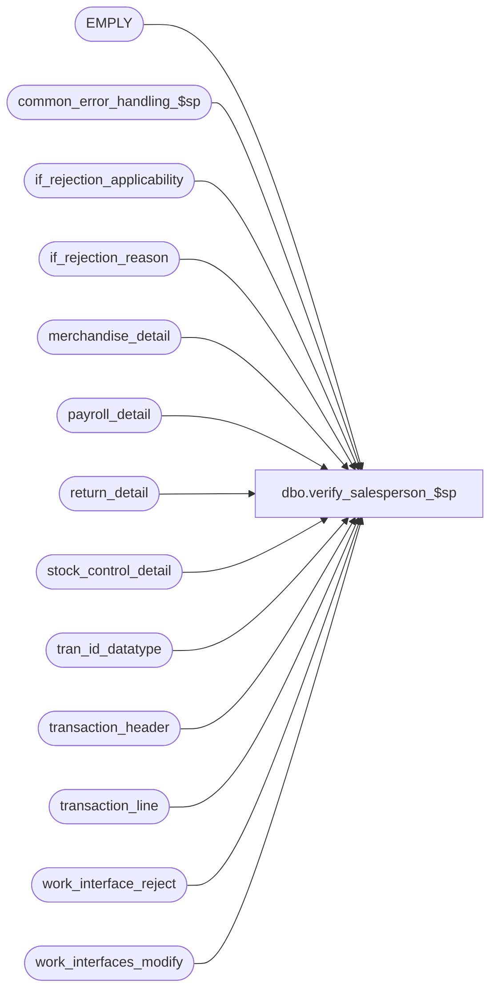

# dbo.verify_salesperson_$sp

**Database:** auditworks  
**Server:** bedrockdb01  

## Architecture Diagram



## Table Dependencies

| Referenced Table |
|---|
| EMPLY |
| common_error_handling_$sp |
| if_rejection_applicability |
| if_rejection_reason |
| merchandise_detail |
| payroll_detail |
| return_detail |
| stock_control_detail |
| tran_id_datatype |
| transaction_header |
| transaction_line |
| work_interface_reject |
| work_interfaces_modify |

## Stored Procedure Code

```sql
create proc dbo.verify_salesperson_$sp @process_id                     binary(16),
@user_id                        int, 
@transaction_id			tran_id_datatype,
@errmsg				nvarchar(255) OUTPUT,
@employee_check			tinyint, -- 0:no validation, 1:merch(salesperson), 2:return(salesperson), or 3:both
@purchasing_employee_check	tinyint,
@cashier_check			tinyint,
@payroll_employee_check		tinyint		

AS

/*
PROC NAME: verify_salesperson_$sp
     DESC: This routine will verify if the salesperson exists or not
           in the employee table. If all salesperson/employee are valid, then return 0.
           Called by modify_interface_$sp and verify_transaction_$sp. 

  HISTORY:
Date     Name        Def# Desc
Jan12,15 Vicci  TFS-99599 Handle I/F Rejection Rule 83 (invalid cashier) same as rule 80 (invalid/missing cashier) except that
                          absent cashier (i.e. cashier 0) is OK.  Note that if rule 80 exists the cashier_check will be 2.
Apr20,11 Vicci     105917 Log memo2 of I/F reject 82 (invalid payroll employee) and 3.
Apr18,08 Phu        96766 Separate merch and return salespersons validations
Jul19,07 Paul     DV-1363 apply 89160 to SA5
Oct25,06 Phu        77931 Fix outer join for SQL 2005 Mode 90.
Sep07,05 Paul     DV-1312 apply 49080 to SA5
Jul05,05 Paul     DV-1239 Use tran_id_datatype
Jun27,05 Paul     DV-1282 rename column
Jun07,05 Paul     DV-1254 improve performance by removing cursors, add nolock hints
Nov29,04 David    DV-1181 Fix typo on ACTV = 11
Nov18,04 Maryam   DV-1167 Check active flag for EMPLY.
Sep22,04 Paul     DV-1146 receive user_id
Sep02,04 David    DV-1129 apply 38630 to SA5 
Apr28,04 Brett    DV-1071 change employee table to EMPLY
Apr23,04 Maryam   DV-1071 Modified to receive @process_id as input parameter
			  and pass it to common_error_handling_$sp.
Jul17,07 Paul       89160 Check whether return validation is inactive
Apr06,05 Maryam     49080 Validate cashier no 0.
Jul16,04 Daphna     38630 Validate purchasing employee_no = 0, (use IS NOT NULL) 
May10,02 Paul     1-CD0IX added R3 error handling, update tran line for payroll rejects
Oct01,01 Maryam      8723 Create an interface reject when a null salesperson is entered.
Jan16,01 David M     7077 changed logic for invalid salespersons so that 4 separate flags 
                          are used for salesperson/original_salesperson, cashier, 
                          purchasing employee and payroll employee checks
Mar14,00 Daphna      5994 prevent void lines from being listed as IF rejects
Mar01,00 Phu         5900 Change @@fetch_status > 0 to @@fetch_status <> 0 for MS SQL compatibility
Apr30,98 Yin           ?? last modified
Aug28,96 Seb         n/a  author version 1.01      	
*/

DECLARE
  @cashier_no		int,
  @employee_flag	tinyint,
  @employee_no		int,
  @errno		int,
  @if_reject_flag	tinyint,
  @if_reject_reason	smallint,
  @reject_count		int,
  @rows			int,
  @rows_inserted	int,
  @message_id		int,
  @object_name		nvarchar(255),
  @process_name		nvarchar(100),
  @operation_name	nvarchar(100)

SELECT 	@if_reject_flag = 0,
	@process_name = 'verify_salesperson_$sp',
	@message_id = 201068,
	@reject_count = 0,
	@rows_inserted = 0,
	@rows = 0

IF @purchasing_employee_check >= 1 OR @cashier_check >= 1
BEGIN
  SELECT @employee_no = employee_no,
	@cashier_no = cashier_no
    FROM transaction_header WITH (NOLOCK)
   WHERE transaction_id = @transaction_id
  SELECT @errno = @@error
  IF @errno != 0
    BEGIN
     SELECT @errmsg = 'Failed to select from transaction_header',
           @object_name = 'transaction_header',
           @operation_name = 'SELECT'
     GOTO error
    END 
END

CREATE TABLE #emply_validation
(line_id        numeric(5,0) not null,
 employee_no    int null,
 salesperson2   int null,
 employee_found int null,
 valid_flag     tinyint,
 if_reject_reason smallint)

SELECT @errno = @@error
IF @errno != 0
BEGIN
  SELECT @errmsg = 'Failed to create temporary table',
         @object_name = '#emply_validation',
         @operation_name = 'CREATE'
  GOTO error
END


IF @employee_check IN (1, 3)
BEGIN
  INSERT #emply_validation (
	line_id, employee_no, salesperson2, employee_found, valid_flag, if_reject_reason)
  SELECT line_id, md.salesperson, md.salesperson2, e.EMPLY_NUM, 0, 3
    FROM merchandise_detail md WITH (NOLOCK)
         LEFT JOIN EMPLY e WITH (NOLOCK) ON (md.salesperson = e.EMPLY_NUM AND e.ACTV = 1)
   WHERE md.transaction_id = @transaction_id
     AND (md.salesperson >= 1 OR md.salesperson2 >= 1)

  SELECT @errno = @@error, @rows_inserted = @@rowcount
  IF @errno != 0
    BEGIN
     SELECT @errmsg = 'Failed to insert merch rows',
      @object_name = '#emply_validation',
           @operation_name = 'INSERT'
     GOTO error
    END 

  IF @rows_inserted > 0
    BEGIN
     UPDATE #emply_validation
       SET valid_flag = 1
       FROM #emply_validation v, EMPLY e WITH (NOLOCK)
      WHERE v.salesperson2 >= 1
        AND v.salesperson2 = e.EMPLY_NUM
        AND e.ACTV = 1

     SELECT @errno = @@error
     IF @errno != 0
       BEGIN
        SELECT @errmsg = 'Failed to validate merch',
           @object_name = '#emply_validation',
           @operation_name = 'UPDATE'
        GOTO error
       END 
    END -- If @rows_inserted > 0
END -- IF @employee_check IN (1, 3)


IF @employee_check IN (2, 3)
BEGIN
  INSERT #emply_validation (
	line_id, employee_no, salesperson2, employee_found, valid_flag, if_reject_reason)
  SELECT line_id, rd.original_salesperson, rd.original_salesperson2, e.EMPLY_NUM, 0, 81
    FROM return_detail rd WITH (NOLOCK)
         LEFT JOIN EMPLY e WITH (NOLOCK) ON (rd.original_salesperson = e.EMPLY_NUM AND e.ACTV = 1)
   WHERE rd.transaction_id = @transaction_id
     AND (rd.original_salesperson >= 1 OR rd.original_salesperson2 >= 1)

  SELECT @errno = @@error, @rows = @@rowcount
  IF @errno != 0
    BEGIN
     SELECT @errmsg = 'Failed to insert return rows',
           @object_name = '#emply_validation',
           @operation_name = 'INSERT'
     GOTO error
    END 

  IF @rows > 0
    BEGIN
     SELECT @rows_inserted = @rows_inserted + @rows

     UPDATE #emply_validation
       SET valid_flag = 1
       FROM #emply_validation v, EMPLY e WITH (NOLOCK)
      WHERE v.if_reject_reason = 81
        AND v.salesperson2 >= 1
        AND v.salesperson2 = e.EMPLY_NUM
        AND e.ACTV = 1

     SELECT @errno = @@error
     IF @errno != 0
       BEGIN
        SELECT @errmsg = 'Failed to validate returns',
           @object_name = '#emply_validation',
           @operation_name = 'UPDATE'
        GOTO error
       END 
    END -- If @rows > 0
END -- IF @employee_check IN (2, 3)

IF @rows_inserted > 0
    BEGIN
     INSERT work_interface_reject (
	   process_id,
	   transaction_id,
	   line_id,
	   if_reject_reason,
	   memo1)
     SELECT @process_id,
           @transaction_id,
           line_id,
           if_reject_reason,
           CONVERT(nvarchar,employee_no)
       FROM #emply_validation
      WHERE (employee_no >= 1 AND employee_found IS NULL)
         OR (salesperson2 >= 1 AND valid_flag = 0) 

     SELECT @errno = @@error,
	   @reject_count = @reject_count + @@rowcount
     IF @errno != 0
     BEGIN
       SELECT @errmsg = 'Failed to insert work_interface_reject (employee)',
             @object_name = 'work_interface_reject',
             @operation_name = 'INSERT'                  
       GOTO error
     END

     IF @reject_count > 0
       BEGIN
        UPDATE work_interface_reject
          SET memo2 = CONVERT(nvarchar,salesperson2)
          FROM #emply_validation v, work_interface_reject wr
         WHERE v.salesperson2 >= 1
           AND v.valid_flag = 0
           AND wr.process_id = @process_id
           AND wr.transaction_id = @transaction_id
           AND v.line_id = wr.line_id
 AND v.if_reject_reason = wr.if_reject_reason

        SELECT @errno = @@error
        IF @errno != 0
        BEGIN
          SELECT @errmsg = 'Failed to update work_interface_reject',
             @object_name = 'work_interface_reject',
 @operation_name = 'UPDATE'                  
          GOTO error
        END
 END -- If @reject_count > 0

END -- If @rows_inserted > 0


IF @purchasing_employee_check >= 1 AND @employee_no IS NOT NULL
BEGIN
    SELECT @employee_flag = 0

    IF EXISTS ( SELECT 1
                  FROM EMPLY WITH (NOLOCK)
                  WHERE EMPLY_NUM = @employee_no
                    AND ACTV = 1 )
       SELECT @employee_flag = 1

    SELECT @errno = @@error
    IF @errno != 0
      BEGIN
       SELECT @errmsg = 'Failed to select from EMPLY (purchasing)',
           @object_name = 'EMPLY',
           @operation_name = 'SELECT'
      GOTO error
      END
 
    IF @employee_flag = 0
    BEGIN /* purchasing employee not on file */
      SELECT @if_reject_flag = 2
      
      UPDATE work_interfaces_modify
         SET interface_status = 99 
        FROM work_interfaces_modify
       WHERE purchasing_employee_check >= 1
         AND process_id = @process_id

      SELECT @errno = @@error
      IF @errno != 0
      BEGIN
       SELECT @errmsg = 'Failed to update work_interfaces_modify (purchasing)',
           @object_name = 'work_interfaces_modify',
           @operation_name = 'UPDATE'
       GOTO error
      END

      INSERT if_rejection_reason (
		transaction_id,
		line_id,
		if_reject_reason)
      VALUES(
		@transaction_id,
		0,
		4)

      SELECT @errno = @@error
      IF @errno != 0
      BEGIN
       SELECT @errmsg = 'Failed to insert if_rejection_reason (4)',
           @object_name = 'if_rejection_reason',
           @operation_name = 'INSERT'
       GOTO error
      END

    END /* purchasing employee not on file */

END /* IF @purchasing_employee_check >= 1 */

IF @cashier_check >= 1 AND @cashier_no >= 0
BEGIN
      SELECT @employee_flag = 0
      
      IF EXISTS ( SELECT 1
                  FROM EMPLY WITH (NOLOCK)
                  WHERE EMPLY_NUM = @cashier_no
                    AND ACTV = 1 )
              SELECT @employee_flag = 1

      SELECT @errno = @@error
      IF @errno != 0
        BEGIN
         SELECT @errmsg = 'Failed to select from EMPLY (cashier)',
           @object_name = 'EMPLY',
           @operation_name = 'SELECT'
         GOTO error
        END

      IF @employee_flag = 0
      BEGIN /* cashier not on file */
        SELECT @if_reject_flag = 3
      
        UPDATE work_interfaces_modify
          SET interface_status = 99 
          FROM work_interfaces_modify
         WHERE cashier_check >= 1
           AND process_id = @process_id
           AND (@cashier_no > 0 OR cashier_check >= 2)
        SELECT @errno = @@error
        IF @errno != 0
          BEGIN
           SELECT @errmsg = 'Failed to update work_interfaces_modify (cashier)',
             @object_name = 'work_interfaces_modify',
             @operation_name = 'UPDATE'
           GOTO error
          END

        INSERT if_rejection_reason (
 			transaction_id,
			line_id,
			if_reject_reason)
        SELECT DISTINCT @transaction_id,
			0,
			CASE WHEN cashier_check = 2 THEN 80 ELSE 83 END
          FROM work_interfaces_modify
         WHERE cashier_check >= 1
           AND process_id = @process_id
        SELECT @errno = @@error
        IF @errno != 0
          BEGIN
           SELECT @errmsg = 'Failed to insert if_rejection_reason (80, 83)',
             @object_name = 'if_rejection_reason',
             @operation_name = 'INSERT'
           GOTO error
          END

      END /* cashier not on file */

END /* IF @cashier_check >= 1 */

IF @payroll_employee_check >= 1
BEGIN

  INSERT #emply_validation (
	line_id, employee_no, salesperson2, employee_found, valid_flag, if_reject_reason)
  SELECT line_id, pd.employee_no, null, e.EMPLY_NUM, 1, 82
    FROM payroll_detail pd WITH (NOLOCK)
         LEFT JOIN EMPLY e WITH (NOLOCK) ON (pd.employee_no = e.EMPLY_NUM AND e.ACTV = 1)
   WHERE pd.transaction_id = @transaction_id
     AND pd.employee_no >= 1 

  SELECT @errno = @@error, @rows = @@rowcount
  IF @errno != 0
    BEGIN
     SELECT @errmsg = 'Failed to insert payroll rows',
           @object_name = '#emply_validation',
          @operation_name = 'INSERT'
     GOTO error
    END 

IF @rows > 0
    BEGIN
     INSERT work_interface_reject (
	   process_id,
	   transaction_id,
	   line_id,
	   if_reject_reason,
	   memo1,
	   memo2)
     SELECT @process_id,
           @transaction_id,
           v.line_id,
           82,
           CONVERT(nvarchar, v.employee_no),
           substring(shift.vendor_no, 1, 255)
       FROM #emply_validation v
       LEFT OUTER JOIN stock_control_detail shift
                 ON @transaction_id = shift.transaction_id
                AND v.line_id = shift.line_id
                AND shift.display_def_id = 58
      WHERE employee_no >= 1
        AND employee_found IS NULL
        AND if_reject_reason = 82

     SELECT @errno = @@error,
	   @reject_count = @reject_count + @@rowcount
     IF @errno != 0
     BEGIN
       SELECT @errmsg = 'Failed to insert work_interface_reject (payroll)',
             @object_name = 'work_interface_reject',
             @operation_name = 'INSERT'                  
       GOTO error
     END
    END -- If @rows > 0

END /* IF @payroll_employee_check >= 1 */

IF @reject_count > 0 -- possible rejects exist
  BEGIN -- ignore void lines

    DELETE work_interface_reject -- don't create i/f rejects for void lines
      FROM work_interface_reject wi, transaction_line tl WITH (NOLOCK)
     WHERE wi.process_id = @process_id
       AND wi.transaction_id = tl.transaction_id
       AND wi.line_id > 0
       AND wi.line_id = tl.line_id
       AND tl.line_void_flag != 0

    SELECT @errno = @@error
    IF @errno != 0
    BEGIN
     SELECT @errmsg = 'Failed to delete voids.',
           @object_name = 'work_interface_reject',
           @operation_name = 'DELETE'
     GOTO error
    END

    UPDATE work_interface_reject
      SET interface_affected_flag = 1
      FROM work_interface_reject wr, work_interfaces_modify wm WITH (NOLOCK), if_rejection_applicability ir
     WHERE wr.process_id = @process_id
       AND wr.process_id = wm.process_id
       AND wr.transaction_id = @transaction_id
       AND wm.interface_id = ir.interface_id
       AND wr.if_reject_reason = ir.if_reject_reason

    SELECT @errno = @@error, @rows = @@rowcount
    IF @errno != 0
    BEGIN
      SELECT @errmsg = 'Failed to set interface_affected_flag.',
            @object_name = 'work_interface_reject',
            @operation_name = 'UPDATE'                
      GOTO error
    END

   IF @rows > 0
   BEGIN
      UPDATE work_interfaces_modify
        SET interface_status = 99 
        FROM work_interfaces_modify wm, work_interface_reject wr WITH (NOLOCK), if_rejection_applicability ir
       WHERE wm.process_id = @process_id
         AND wm.process_id = wr.process_id
         AND wr.transaction_id = @transaction_id
         AND wm.interface_id = ir.interface_id
         AND wr.if_reject_reason = ir.if_reject_reason
         AND wr.interface_affected_flag = 1

      SELECT @errno = @@error
      IF @errno != 0
      BEGIN
        SELECT @errmsg = 'Failed to set interface_status_flag (employee).',
            @object_name = 'work_interfaces_modify',
            @operation_name = 'UPDATE'                
        GOTO error
      END

      UPDATE transaction_line
        SET interface_rejection_flag = 1
       FROM work_interface_reject wr WITH (NOLOCK), transaction_line tl
      WHERE process_id = @process_id
        AND interface_affected_flag = 1
        AND wr.transaction_id = tl.transaction_id
        AND wr.line_id = tl.line_id

      SELECT @errno = @@error
      IF @errno != 0
      BEGIN
        SELECT @errmsg = 'Failed to set interface_rejection_flag (employee).',
            @object_name = 'transaction_line',
            @operation_name = 'UPDATE'                
        GOTO error
      END

      INSERT if_rejection_reason (
	       transaction_id,
	       line_id,
	       if_reject_reason,
	 memo1,
	       memo2,
	       memo3 )
      SELECT DISTINCT 
	       transaction_id,
	       line_id,
	       if_reject_reason,
	       memo1,
	       memo2,
	       memo3
        FROM work_interface_reject WITH (NOLOCK)
       WHERE interface_affected_flag = 1
         AND process_id = @process_id

      SELECT @errno = @@error
      IF @errno != 0
      BEGIN
        SELECT @errmsg = 'Failed to insert if_rejection_reason (employee).',
            @object_name = 'if_rejection_reason',
            @operation_name = 'INSERT'                
        GOTO error
      END

      IF @if_reject_flag = 0
        BEGIN
         SELECT @if_reject_reason = MIN(if_reject_reason)
           FROM work_interface_reject WITH (NOLOCK)
          WHERE interface_affected_flag = 1
            AND process_id = @process_id

         IF @if_reject_reason = 82
           SELECT @if_reject_flag = 4
         ELSE -- @if_reject_reason IN (3,81)
           SELECT @if_reject_flag = 1
        END

     END -- If @rows > 0 : rejects exist

  END -- If @reject_count > 0

DROP TABLE #emply_validation

RETURN @if_reject_flag

error:   /* Common error handler. */

	EXEC common_error_handling_$sp 100, @errno, @errmsg, 0, @message_id, 
	  @process_name, @object_name, @operation_name, 0, 1, 0, null, 0,
	  null, null, null, null, null, null, 0, @process_id, @user_id
	RETURN
```

