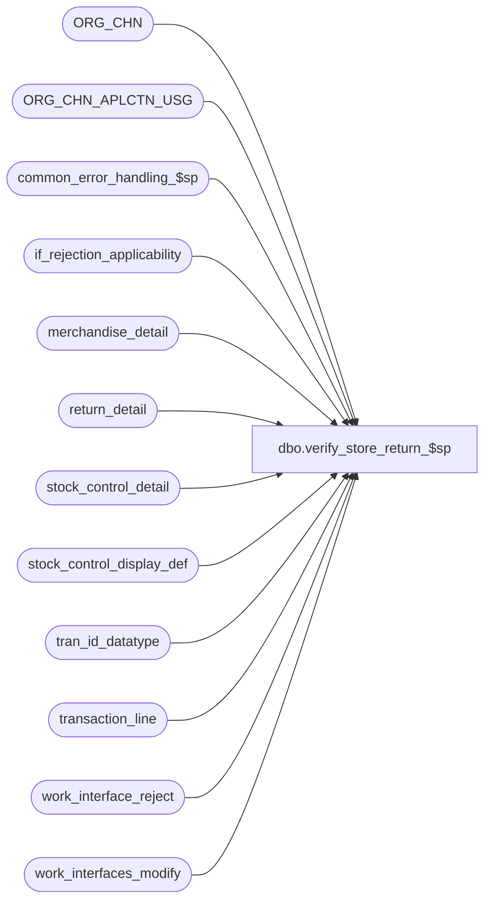

# dbo.verify_store_return_$sp

**Database:** auditworks  
**Server:** bedrockdb01  

## Architecture Diagram



## Table Dependencies

| Referenced Table |
|---|
| ORG_CHN |
| ORG_CHN_APLCTN_USG |
| common_error_handling_$sp |
| if_rejection_applicability |
| merchandise_detail |
| return_detail |
| stock_control_detail |
| stock_control_display_def |
| tran_id_datatype |
| transaction_line |
| work_interface_reject |
| work_interfaces_modify |

## Stored Procedure Code

```sql
create proc dbo.verify_store_return_$sp @process_id                     binary(16),
@user_id                        int, 
@transaction_id			tran_id_datatype,
@errmsg				nvarchar(255) OUTPUT,
@store_check			tinyint,
@stock_origin_store_check	tinyint,
@merch_origin_store_check	tinyint,
@merch_source_store_check	tinyint,
@merch_fulfillment_store_check	tinyint

AS

/*
PROC NAME: verify_store_return_$sp
     DESC: Verifies that store_no exists. If not then creates if rejection 
           Called from modify_interface_$sp, verify_transaction_$sp.  
           returns 0 = no rejects exist.
		   1 = some potential rejects exist (if_rejection_reason is inserted by calling proc).

HISTORY: 
Date     Name         Def Desc
Jan04,11 Paul      105313 Use unicode datatypes
Apr03,07 Paul     DV-1356 corrected alias
Dec19,05 Paul       64546 apply 61838/55034 to SA5
Sep08,05 Paul     DV-1312 apply 29369 to SA5, avoid joins to ORG_CHN_APLCTN_USG because warehouse stores may not exist there.
Jul05,05 Paul     DV-1239 Use tran_id_datatype
Jun03,05 Paul       55041 insert to work_interface_reject table to allow softcoding logic (also corrects DV-1202),
			  improve performance for the common cases (when a transaction has no return or stock control rows)
Mar30,05 David    DV-1202 Validate source and fulfillment store.
Oct28,04 David    DV-1159 Check for ORG_CHN active flag. 
Sep22,04 Paul     DV-1146 receive user_id
Aug23,04 Sab      DV-1120 hardcode aplctn_id to 300.
May19,04 David    DV-1071 Use ORG_CHN table as new the Store table.
Apr23,04 Maryam   DV-1071 Modified to receive @process_id as input parameters
			  and pass it to common_error_handling_$sp.
Nov30,05 Daphna     55034 allow softcoded logic to determine whether txn passes all store_no checks
Dec06,04 Daphna     29369 Check stores against store_sa (warehouse stores may not be
                          set up in store_salesaudit), allow store_no = 0
                          Validate for header_level attachments (line_id = 0)
                          Validate for store_no NOT NULL depending on mandatory check  
Aug16,02 HenryW	  1-AUHY5 Add validation of Merch and Stock Originating Store. I/F rejects = 110 and 111.
Aug06,02 HenryW	  1-EM0VU Properly set interface_rejection_flag in transaction_line for I/F rejects.
May10,02 Paul     1-CD0IX added R3 error handling
Mar14,01 Maryam      7437 insert into if_rejection_reason from #store_validation and #stock table.
Mar14,00 Daphna      5994 prevent voided lines from being marked IF rejects
Aug28,97 Paul S      ??   last modified
??       Seb V       n/a  author	     

*/

DECLARE
  @errno		int,
  @return_flag		tinyint,
  @return_count		int,
  @stock_exists		tinyint,
  @merch_rows		int,
  @rows			int,
  @rows_orig		int,
  @store_no	 	int,
  @line_id		numeric(5,0),
  @message_id		int,
  @object_name		nvarchar(255),
  @process_name		nvarchar(100),
  @operation_name	nvarchar(100)

SELECT  @return_flag = 0,
	@merch_rows = 0,
	@stock_exists = 0,
	@process_name = 'verify_store_return_$sp',
	@message_id = 201068

CREATE TABLE #store_validation (
line_id numeric(5,0) not null,
store_no int null,
originating_store_no int null,
valid_flag tinyint not null,
display_def_id smallint null)

SELECT @errno = @@error
IF @errno != 0
BEGIN
  SELECT @errmsg = 'Failed to create #store_validation',
          @object_name = '#store_validation',
          @operation_name = 'CREATE'
  GOTO error
END

CREATE TABLE #merch_origin
(line_id 	numeric(5,0)
,merch_store 	int
,valid_flag	tinyint
,if_reject_reason smallint)

SELECT @errno = @@error
IF @errno != 0
  BEGIN
    SELECT @errmsg = 'Failed to create temp table #merch_origin.',
           @object_name = '#merch_origin',
           @operation_name = 'CREATE'
    GOTO error
  END

INSERT #store_validation (line_id, store_no, originating_store_no, valid_flag)
SELECT line_id, return_from_store, 0, 0
  FROM return_detail
 WHERE return_from_store IS NOT NULL --
   AND transaction_id = @transaction_id

SELECT @errno = @@error, @return_count = @@rowcount
IF @errno != 0
BEGIN
  SELECT @errmsg = 'Failed to insert #store_validation',
          @object_name = '#store_validation',
          @operation_name = 'INSERT'
  GOTO error
END

IF @return_count > 0 AND @store_check > 0
  BEGIN
   UPDATE #store_validation
     SET valid_flag = 1
     FROM #store_validation r, ORG_CHN_APLCTN_USG u, ORG_CHN c 
    WHERE r.store_no = u.ORG_CHN_NUM
      AND u.APLCTN_ID = 300
      AND u.VLDTY = 1
      AND u.ORG_CHN_NUM = c.ORG_CHN_NUM
      AND c.ACTV = 1

   SELECT @errno = @@error
   IF @errno != 0
   BEGIN
     SELECT @errmsg = 'Failed to update #store_validation (1)',
          @object_name = '#store_validation',
          @operation_name = 'UPDATE'
     GOTO error
   END

  INSERT work_interface_reject (
	   process_id,
	   transaction_id,
	   line_id,
	   if_reject_reason,
	   memo1)
  SELECT   @process_id,
           @transaction_id,
           line_id,
           9,
           CONVERT(nvarchar,store_no)
    FROM #store_validation  
   WHERE valid_flag = 0    
   
   SELECT @errno = @@error, @rows = @@rowcount
   IF @errno != 0
   BEGIN
     SELECT @errmsg = 'Failed to insert work_interface_reject (9)',
           @object_name = 'work_interface_reject',
    @operation_name = 'INSERT'
     GOTO error
   END

   IF @rows > 0
     SELECT @return_flag = 1

   TRUNCATE TABLE #store_validation
  END  /* @return_count > 0 */

IF EXISTS(SELECT 1
          FROM stock_control_detail
          WHERE transaction_id = @transaction_id)
  SELECT @stock_exists = 1

IF @stock_exists = 1 AND (@store_check > 1 OR @stock_origin_store_check > 0)
BEGIN
  INSERT #store_validation (line_id, store_no, originating_store_no, valid_flag,display_def_id)
  SELECT line_id, other_store_no, originating_store_no, 0, display_def_id
    FROM stock_control_detail
   WHERE transaction_id = @transaction_id
     AND (other_store_no IS NOT NULL OR originating_store_no IS NOT NULL)

  SELECT @errno = @@error
  IF @errno != 0
  BEGIN
    SELECT @errmsg = 'Failed to insert #store_validation',
          @object_name = '#store_validation',
          @operation_name = 'INSERT'
    GOTO error
  END

  IF @store_check > 1
    BEGIN
     UPDATE #store_validation -- check other_store_no from stock_control_detail against ORG_CHN (allows for warehouse stores)
       SET valid_flag = 1
       FROM #store_validation r, ORG_CHN c 
      WHERE r.store_no = c.ORG_CHN_NUM
        AND c.ACTV = 1

     SELECT @errno = @@error
     IF @errno != 0
     BEGIN
       SELECT @errmsg = 'Failed to update #store_validation (2)',
          @object_name = '#store_validation',
          @operation_name = 'UPDATE'
       GOTO error
     END

     INSERT work_interface_reject (
	   process_id,
	   transaction_id,
	   line_id,
	   if_reject_reason,
	   memo1)
     SELECT @process_id,
            @transaction_id,
            line_id,
            10,
            CONVERT(nvarchar,store_no)
       FROM #store_validation
      WHERE valid_flag = 0
        AND store_no IS NOT NULL -- check for undefined store at line and header levels
        AND display_def_id IN (SELECT display_def_id
         		        FROM stock_control_display_def
         		       WHERE other_store_validation = 1
         		         AND other_store_no_fe_resource_id > 0)

     SELECT @errno = @@error, @rows = @@rowcount
     IF @errno != 0
       BEGIN
        SELECT @errmsg = 'IF reject reason = 10, other_store_validation',
           @object_name = 'work_interface_reject',
           @operation_name = 'INSERT'
        GOTO error
       END

     INSERT work_interface_reject (
	   process_id,
	   transaction_id,
	   line_id,
	   if_reject_reason,
	   memo1)
     SELECT @process_id,
            @transaction_id,
            line_id,
            10,
            NULL
       FROM stock_control_detail
      WHERE transaction_id = @transaction_id
        AND other_store_no IS NULL -- check for missing store number at line and header levels
        AND display_def_id IN (SELECT display_def_id
         		        FROM stock_control_display_def
         		       WHERE other_store_no_mandatory = 1
         		         AND other_store_no_fe_resource_id > 0)
     SELECT @errno = @@error, @rows = @rows + @@rowcount
     IF @errno != 0
       BEGIN
        SELECT @errmsg = 'IF reject reason = 10, other_store_no_mandatory',
           @object_name = 'work_interface_reject',
           @operation_name = 'INSERT'
        GOTO error
       END

     IF @rows > 0
       SELECT @return_flag = 1

    END -- If @store_check > 1


  IF @stock_origin_store_check > 0
  BEGIN
   UPDATE #store_validation
     SET valid_flag = 99 -- reset to not valid
    WHERE originating_store_no IS NOT NULL --
      AND display_def_id IN (SELECT display_def_id
         		        FROM stock_control_display_def
         		       WHERE original_store_validation = 1
         		         AND originating_str_fe_resource_id > 0)

   SELECT @errno = @@error, @rows_orig = @@rowcount
   IF @errno != 0
     BEGIN
      SELECT @errmsg = 'Failed to reset #store_validation',
        @object_name = '#store_validation',
        @operation_name = 'UPDATE'
      GOTO error
     END

   IF @rows_orig > 0
   BEGIN
     UPDATE #store_validation
       SET valid_flag = 2
       FROM #store_validation r, ORG_CHN c 
      WHERE valid_flag = 99
        AND r.originating_store_no = c.ORG_CHN_NUM
        AND c.ACTV = 1

      SELECT @errno = @@error
      IF @errno != 0
      BEGIN
        SELECT @errmsg = 'Failed to update #store_validation (3)',
          @object_name = '#store_validation',
          @operation_name = 'UPDATE'
        GOTO error
      END

     INSERT work_interface_reject (
	   process_id,
	   transaction_id,
	   line_id,
	   if_reject_reason,
	   memo1)
     SELECT @process_id,
           @transaction_id,
           line_id,
           111,
           CONVERT(nvarchar,originating_store_no)
       FROM #store_validation
      WHERE valid_flag = 99 -- check for undefined store at line and header levels

     SELECT @errno = @@error,
	    @rows = @@rowcount
     IF @errno != 0
     BEGIN
       SELECT @errmsg = 'IF reject reason 111, original_store_validation',
             @object_name = 'work_interface_reject',
             @operation_name = 'INSERT'                  
       GOTO error
     END

     INSERT work_interface_reject (
	   process_id,
	   transaction_id,
	   line_id,
	   if_reject_reason,
	   memo1)
     SELECT @process_id,
           @transaction_id,
           line_id,
           111,
           NULL
       FROM stock_control_detail
      WHERE transaction_id = @transaction_id
        AND originating_store_no IS NULL -- check for missing store number at line and header levels
        AND display_def_id IN (SELECT display_def_id
         		        FROM stock_control_display_def
         		       WHERE originating_str_mandatory = 1
         		         AND originating_str_fe_resource_id > 0)
     SELECT @errno = @@error,
	   @rows = @rows + @@rowcount
     IF @errno != 0
     BEGIN
       SELECT @errmsg = 'IF reject reason 111, originating_str_mandatory',
             @object_name = 'work_interface_reject',
             @operation_name = 'INSERT'                  
       GOTO error
     END

     IF @rows > 0
       SELECT @return_flag = 1

   END -- If @rows_orig > 0
  END  -- IF @stock_origin_store_check > 0

END-- If @stock_exists = 1

DROP TABLE #store_validation

IF @merch_origin_store_check > 0
BEGIN
  INSERT #merch_origin
  SELECT line_id, originating_store_no, 0, 110
    FROM merchandise_detail
   WHERE originating_store_no IS NOT NULL -- 
     AND transaction_id = @transaction_id

    SELECT @errno = @@error, @merch_rows = @@rowcount
    IF @errno != 0
    BEGIN
      SELECT @errmsg = 'Failed to determine merch originating store',
             @object_name = '#merch_origin',
 @operation_name = 'INSERT'
      GOTO error
    END
END -- @merch_origin_store_check

IF @merch_source_store_check > 0
BEGIN
  INSERT #merch_origin 
  SELECT line_id, source_store_no, 0, 114
    FROM merchandise_detail
   WHERE transaction_id = @transaction_id
     AND source_store_no IS NOT NULL --
     
    SELECT @errno = @@error, @merch_rows = @merch_rows + @@rowcount
    IF @errno != 0
    BEGIN
      SELECT @errmsg = 'Failed to determine merch source store',
             @object_name = '#merch_origin',
             @operation_name = 'INSERT'
      GOTO error
    END
END -- @merch_source_store_check

IF @merch_fulfillment_store_check > 0
BEGIN
  INSERT #merch_origin 
  SELECT line_id, fulfillment_store_no, 0, 115
    FROM merchandise_detail
   WHERE transaction_id = @transaction_id
     AND fulfillment_store_no IS NOT NULL -- 
     
    SELECT @errno = @@error, @merch_rows = @merch_rows + @@rowcount
    IF @errno != 0
    BEGIN
      SELECT @errmsg = 'Failed to determine merch fulfillment store',
             @object_name = '#merch_origin',
             @operation_name = 'INSERT'
      GOTO error
    END
END -- @merch_fulfillment_store_check


IF @merch_rows > 0 -- validate store against ORG_CHN to allow for warehouse stores
  BEGIN
   UPDATE #merch_origin
     SET valid_flag = 1
     FROM #merch_origin r, ORG_CHN c 
    WHERE r.merch_store = c.ORG_CHN_NUM
      AND c.ACTV = 1

   SELECT @errno = @@error
   IF @errno != 0
   BEGIN
     SELECT @errmsg = 'Failed to update #merch_origin',
             @object_name = '#merch_origin',
             @operation_name = 'UPDATE'
     GOTO error
   END

   INSERT work_interface_reject (
	   process_id,
	   transaction_id,
	   line_id,
	   if_reject_reason,
	   memo1)
   SELECT @process_id,
           @transaction_id,
           line_id,
           if_reject_reason,
           CONVERT(nvarchar,merch_store)
     FROM #merch_origin
    WHERE valid_flag = 0

   SELECT @errno = @@error,
	   @rows = @@rowcount
   IF @errno != 0
   BEGIN
     SELECT @errmsg = 'Failed to insert work_interface_reject (110)',
             @object_name = 'work_interface_reject',
             @operation_name = 'INSERT'                  
     GOTO error
   END

   IF @rows > 0
     SELECT @return_flag = 1

  END -- If @merch_rows > 0

DROP TABLE #merch_origin

IF @return_flag = 1
  BEGIN
    DELETE work_interface_reject -- don't create i/f rejects for void lines
      FROM work_interface_reject wi, transaction_line tl WITH (NOLOCK)
     WHERE wi.process_id = @process_id
       AND wi.line_id > 0
       AND wi.transaction_id = tl.transaction_id
       AND wi.line_id = tl.line_id
       AND tl.line_void_flag != 0

    SELECT @errno = @@error
    IF @errno != 0
    BEGIN
     SELECT @errmsg = 'Failed to delete voids.',
           @object_name = 'work_interface_reject',
           @operation_name = 'DELETE'
     GOTO error
    END

    UPDATE work_interface_reject
      SET interface_affected_flag = 1
      FROM work_interface_reject wr, work_interfaces_modify wm WITH (NOLOCK), if_rejection_applicability ir
     WHERE wr.process_id = @process_id
       AND wr.process_id = wm.process_id
       AND wr.transaction_id = @transaction_id
       AND wm.interface_id = ir.interface_id
       AND wr.if_reject_reason = ir.if_reject_reason

    SELECT @errno = @@error, @return_flag = SIGN(@@rowcount) -- @re-evaluate return_flag
    IF @errno != 0
    BEGIN
      SELECT @errmsg = 'Failed to set interface_affected_flag.',
            @object_name = 'work_interface_reject',
            @operation_name = 'UPDATE'                
      GOTO error
    END

  END -- If @return_flag = 1

RETURN @return_flag

error:   /* Common error handler. */
	EXEC common_error_handling_$sp 100, @errno, @errmsg, 0, @message_id, 
	  @process_name, @object_name, @operation_name, 0, 1, 0, null, 0,
	  null, null, null, null, null, null, 0, @process_id, @user_id
	RETURN
```

