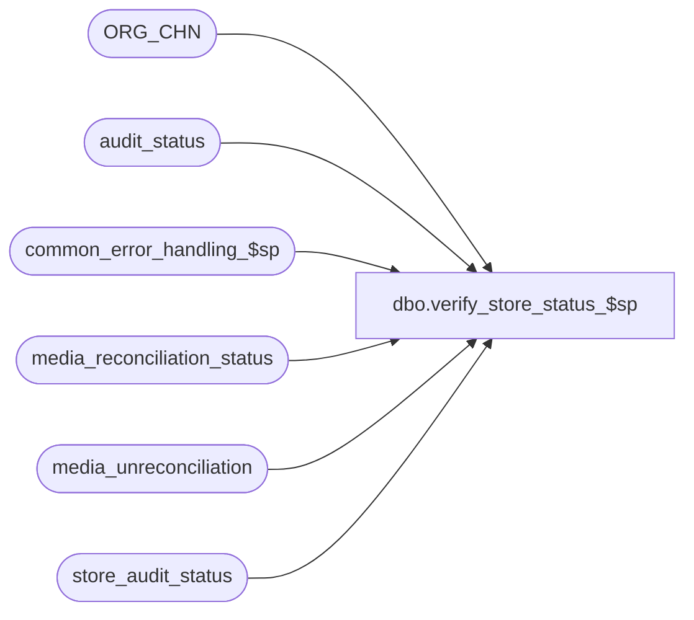

# dbo.verify_store_status_$sp

**Database:** auditworks  
**Server:** bedrockdb01  

## Architecture Diagram



## Table Dependencies

| Referenced Table |
|---|
| ORG_CHN |
| audit_status |
| common_error_handling_$sp |
| media_reconciliation_status |
| media_unreconciliation |
| store_audit_status |

## Stored Procedure Code

```sql
create proc dbo.verify_store_status_$sp (@process_id            binary(16),
 @user_id               int,
 @store_no		int,
 @transaction_date	smalldatetime,
 @date_reject_id	tinyint,
 @errmsg 		nvarchar(2000) OUTPUT,
 @verify_store_status	tinyint = 1,-- 3= unlock store-date since called by new media rec, 1 = default value
 @called_by_edit        tinyint = 0) -- 2= called by accept/force accept, 3 = called by unaccept, 5=called by edit_verifiy_registers_$sp

AS

/*
   Proc Name: verify_store_status_$sp.
   Desc: Recalculates store_audit_status and updates if necessary.
   Called by edit, delete, move, accept, unaccept, media_rec (add, modify) and frontend.
   
   Can use the same version of this proc for SA 5.0 and for SA 5.1 .
   Unicode version.
   
HISTORY:
Date     Name         Def# Desc
May20,16 Vicci    DAOM-730 Ensure that stuff trickling in is not auto-accepted just because a store closeout happens to exist.
                           Avoid overhead of re-looking up store closeout in transactions when this was already done by register verification.
May10,16 Vicci    DAOM-730 When try catch was introduced, it broke ISNULL(@errmsg,' ') != 'force accept' logic.  Restore the broken logic.
Apr26,16 Vicci    DAOM-667 When a user force-accepts a store by marking its missing register as unused, and the store audit status will not be going to accepted do not mark it as auto-accepted.
                           Note this also required a front-end fix to pass i_called_by_edit 2 since the UI updates to 900 directly instead of calling
                           the force_accept_$sp.
Dec12,14 Paul    TFS-94103 use try .. catch
Mar26,12 Paul     1-48LC97 update store_audit_status column only when needed in order to reduce deadlocking
Oct22,10 Vicci      121948 Since unreconciled FLOAT rec-type amounts are now considered activity too, ensure they
                           only prevent auto-accept if the drawer fund has changed
Jun28,10 Vicci      118310 Set the status_set_by_user_id to NULL if it is -1 (system/edit).
Oct06,09 Vicci      113373 For the purpose of the Auto-Accept, ignore closeouts which do not fall within the defined 
		 	   pre/post midnight times when logical trading date handling is in use.
Apr05,07 Daphna    DV-1360 uplift 84045 Depending on auto-accept method, unreconciled media and presence of store-level closeout txn
                           set verified reg to accepted before doing store status
Feb05,07 Paul      DV-1355 port 1-39RAI3 to SA5
Jul19,06 Phu         75036 port 75035 to SA5
Apr18,05 Paul      DV-1218 change default on @verify_store_status to 1
Feb08,04 Maryam    DV-1203 set auto_accepted to 1.
Nov30,04 Maryam    DV-1181 fix the comment.
Oct12,04 Maryam    DV-1146 Receive @called_by_edit flag and set the auto_accepted flag to 1, use user_id.
Apr19,04 Maryam    DV-1071 Modified to receive @process_id as input parameter
Jul19,06 Phu   75034/75035 Set auto_accepted = 1 when store-dates are auto-accepted by edit/manual functions.
Mar20,06 Daphna   1-39RAI3 Receive @called_by_edit flag, Set store_audit_status.auto_accepted = 1
                   / 69360 when status = 300 and  @called_by_edit = 1
Jul29,03 Paul        11627 add comment to indicate that proc is called by frontend
May27,03 Paul      1-KX549 Unlock store-date if @verify_store_status flag = 3 (new media rec)
May10,02 Paul      1-CD0IX added R3 error handling
Mar04,02 Paul      1-BE0YK Do not look at trickle flag. Trickle is already handled in verify_register_$sp.
				also retrofitted to 2.50
Nov28,01 Paul         8910 Set status_set_by in store_audit_status to 'system'
Apr04,01 Phu          7501 Use system function to retrieve user name
May31,00 Paul         6394 Avoid checking store level over/short when called from
				force_accept_$sp.
May08,00 Paul         6293 Standardized the store status calculation.   
Feb18,99 Paul              author
*/

DECLARE
	@auto_accepted			tinyint,
       @auto_accept_flag               tinyint,
	@errmsg2                        nvarchar(2000),
	@errline                        int,
	@errno                          int,
	@min_audit_status               smallint,
	@media_rec_verified             smallint,
	@opening_drawer_discrepancy     smallint,  
	@store_audit_status             smallint,
	@short_by_tender_over_limit     smallint,
	@message_id			int,
	@object_name			nvarchar(255),
	@process_name			nvarchar(100),
	@operation_name			nvarchar(100),
	@default_post_midnight_time	int,
	@default_pre_midnight_time	int,
	@completion_date_time		datetime,
	@store_closeout_exists		tinyint,
	@rows				int,
	@force_accept			tinyint;

IF @errmsg= 'force accept' 
  SELECT @force_accept = 1
ELSE 
  SELECT @force_accept = 0

SELECT @process_name = 'verify_store_status_$sp',
       @message_id = 201068,
       @auto_accept_flag = 0;

BEGIN TRY

IF @called_by_edit = 5 AND @date_reject_id = 0  --called by Edit Phase2
BEGIN
  --Handle case when current batch has store closeout provided by one register that others registers for the store that are not in the batch were waiting for to set their status from 200 to 300.
  SELECT @errmsg = 'Failed to select from audit_status',
         @object_name = 'audit_status',
         @operation_name = 'SELECT';
  SELECT @auto_accept_flag = AUTO_ACPT
    FROM ORG_CHN
   WHERE ORG_CHN_NUM = @store_no;        
 
  IF @auto_accept_flag IN (2, 4)  --if auto accept requires store level closeout
  BEGIN
    SELECT @errmsg = 'Failed to determine if store closeout exists',
           @object_name = 'audit_status',
           @operation_name = 'SELECT';
    IF EXISTS (SELECT 1
                 FROM audit_status
                WHERE sales_date = @transaction_date
                  AND store_no = @store_no
                  AND date_reject_id = 0
                  AND audit_status = 300)  --since registers are evaluated correctly, presence of at least one of them with status accepted means store closeout was received (assuming they weren't manually accepted or force-accepted)
      SELECT @store_closeout_exists = 1;
    ELSE
      SELECT @store_closeout_exists = 0;
    
    IF @store_closeout_exists = 1   
    BEGIN
      IF @auto_accept_flag = 4  --Media Reconciliation not required but store closeout required
      BEGIN
        SELECT @errmsg = 'Failed to auto-accept where store closeout txn found and media not required',
               @object_name = 'audit_status',
               @operation_name = 'UPDATE';
        UPDATE audit_status
           SET audit_status = 300
         WHERE store_no = @store_no
           AND sales_date = @transaction_date
           AND date_reject_id = 0
           AND audit_status = 200;
      END;
      ELSE --ELSE of @auto_accept_flag = 4
      BEGIN
        SELECT @errmsg = 'Failed to auto-accept where store closeout txn found',
               @object_name = 'audit_status',
               @operation_name = 'UPDATE';
        UPDATE audit_status
           SET audit_status = 300
         WHERE store_no = @store_no
           AND sales_date = @transaction_date
           AND date_reject_id = 0
           AND audit_status = 200
           AND (   ISNULL(unreconciled_media_present,0) =0
                OR EXISTS (SELECT 1 
                             FROM media_reconciliation_status m 
              		    WHERE m.store_no = @store_no 
              		      AND (m.register_no = audit_status.register_no OR m.register_no = 0) AND m.rec_type = 3)
		              AND NOT EXISTS(
		                  SELECT 1 
		                    FROM media_reconciliation_status m, media_unreconciliation u
                                   WHERE m.store_no = @store_no
     			             AND (m.register_no = audit_status.register_no OR m.register_no = 0)
     			             AND m.first_unreconciled_date_time < dateadd(hh, 6, dateadd(dd, 1, @transaction_date))  --include contribution to expected of counts entered between midnight and 6AM
     			             AND (m.rec_type <> 3 OR m.unreconciled_activity_amount <> 0)
     			             AND @store_no = u.store_no 
     			             AND audit_status.register_no = u.register_no 
     			             AND @transaction_date = u.transaction_date
     			             AND u.unrec_activity_flag > 0)
     			  );
      END; --ELSE of @auto_accept_flag = 4
    END; --  IF @store_closeout_exists = 1
  END; --IF @auto_accept_flag IN (2, 4)
END; --IF @called_by_edit = 5 AND @date_reject_id = 0, i.e. called by Edit Phase2


     SELECT @errmsg = 'Failed to select from audit_status',
           @object_name = 'audit_status',
           @operation_name = 'SELECT';
  SELECT @min_audit_status = ISNULL(MIN(audit_status),901) 
    FROM audit_status 
   WHERE store_no = @store_no
     AND sales_date = @transaction_date 
     AND date_reject_id = @date_reject_id
   AND audit_status != 900;

    SELECT @errmsg = 'Failed to select from store_audit_status',
           @object_name = 'store_audit_status',
           @operation_name = 'SELECT';
  SELECT @media_rec_verified = media_rec_verified,
         @opening_drawer_discrepancy = opening_drawer_discrepancy,  
         @store_audit_status = store_audit_status,
         @short_by_tender_over_limit = short_by_tender_over_limit,
         @auto_accepted = auto_accepted
   FROM store_audit_status
  WHERE store_no = @store_no
    AND sales_date = @transaction_date 
    AND date_reject_id = @date_reject_id;

  /* If an unverified store level over/short exists, then reset store_audit_status to 100 */

  IF (@min_audit_status >= 200 AND @min_audit_status <= 300)
      AND  (@short_by_tender_over_limit = 1 OR @opening_drawer_discrepancy = 1)      
      AND @media_rec_verified = 0
      AND @force_accept <> 1
   SELECT @min_audit_status = 100;

  IF @min_audit_status < 300 OR @min_audit_status >= 900 --auto-accepted shouldn't change for dayend statuses
    SELECT @auto_accepted = 0; -- reset if store_audit_status will not be 300
  ELSE
    IF @min_audit_status = 300 AND @min_audit_status != @store_audit_status -- changing store to accepted
      BEGIN
        IF @called_by_edit = 2 -- accept/force accept
          SELECT @auto_accepted = 0;
        ELSE
          SELECT @auto_accepted = 1;
      END;

  IF @verify_store_status = 3 -- unlock store-date at the same time
    BEGIN 
      SELECT @errmsg = 'Failed to update store_audit_status : ' + CONVERT(nvarchar,@min_audit_status),
	           @object_name = 'store_audit_status',
	           @operation_name = 'UPDATE';

      IF @min_audit_status != @store_audit_status
	BEGIN /* change status and unlock */

	     UPDATE store_audit_status
	       SET store_audit_status = @min_audit_status,
	           store_status_date = getdate(),
	           status_set_by_user_id = CASE WHEN @user_id = -1 THEN NULL ELSE @user_id END,
	           update_in_progress = 0,
	           process_id         = 0,
	           auto_accepted = @auto_accepted
	     WHERE store_no = @store_no
	       AND sales_date = @transaction_date
	       AND date_reject_id = @date_reject_id;
	END;
      ELSE       
	BEGIN /* unlock only */
	     UPDATE store_audit_status
	       SET store_status_date = getdate(),
	           update_in_progress = 0,
	           process_id         = 0,
	           auto_accepted = @auto_accepted
	     WHERE store_no = @store_no
	       AND sales_date = @transaction_date
	       AND date_reject_id = @date_reject_id;
	END; -- else of @min_audit_status != @store_audit_status

      END; -- If @verify_store_status = 3
  ELSE /* @verify_store_status != 3 */

    IF @min_audit_status != @store_audit_status
      BEGIN /* update status only when necessary */
          SELECT @errmsg = 'Failed to update store_audit_status (2)',
             @object_name = 'store_audit_status',
             @operation_name = 'UPDATE';
       UPDATE store_audit_status
         SET store_audit_status = @min_audit_status,
	     store_status_date = getdate(),
	     status_set_by_user_id = CASE WHEN @user_id = -1 THEN NULL ELSE @user_id END,
	     auto_accepted = @auto_accepted
        WHERE store_no = @store_no
          AND sales_date = @transaction_date
          AND date_reject_id = @date_reject_id;
      END;  

RETURN;


business_error:   /* Business Rule handler. */

	SELECT @errmsg2 = @errmsg;

	/* Could include similar cleanup code to system error trap when needed (example is from move_store_$sp).
	   However, could also exclude the cleanup code here since the outer system error catch should fire again after the exec below. */

	EXEC common_error_handling_$sp 36, @errno, @errmsg, 0, @message_id, 
	  @process_name, @object_name, @operation_name, 0, 1, 0, null, 0, null, null, null,
	  null, null, null, 0, @process_id, @user_id;
	  /* Note: when the exec above raises an error, that action also fires the system error trap (below) */
	RETURN;
END TRY

BEGIN CATCH; -- trap system errors
    /* common error handling. Appending proc name here because a rollback could occur if called within a transaction. */

        SELECT @errno = ERROR_NUMBER(),
		@errline = ERROR_LINE();

        SELECT @errmsg = CONVERT(nvarchar, @errno) + ':' + @process_name + ':' + CONVERT(nvarchar, @errline) + ':'
               + COALESCE(@errmsg, ' ') + ':' + ERROR_MESSAGE();

	 /* this condition will only be true when raise error in traps above fire this general catch */
	IF @errmsg2 IS NOT NULL
	  SELECT @errmsg = @errmsg2;

	EXEC common_error_handling_$sp 36, @errno, @errmsg, 0, @message_id, 
	  @process_name, @object_name, @operation_name, 0, 1, 0, null, 0, null, null, null,
	  null, null, null, 0, @process_id, @user_id;

	RETURN;
END CATCH;
```

