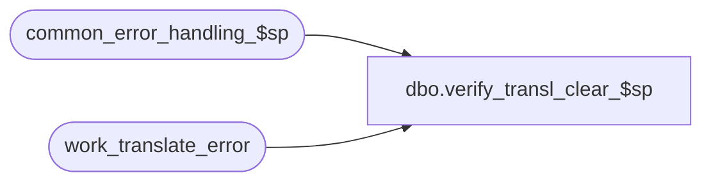

# dbo.verify_transl_clear_$sp

**Database:** auditworks  
**Server:** bedrockdb01  

## Architecture Diagram



## Table Dependencies

| Referenced Table |
|---|
| common_error_handling_$sp |
| work_translate_error |

## Stored Procedure Code

```sql
create proc dbo.verify_transl_clear_$sp 

@process_id binary(16),
@user_id    int

AS

/*  Proc Name: verify_transl_clear_$sp
    Description: Verification of translate errors. Clears work table.
    Called from F/E. 

HISTORY:
Date     Name        Def# Desc
Jan04,11 Paul      105313 Use unicode datatypes
Sep22,04 Paul     DV-1146 receive user_id
Apr19,04 Maryam   DV-1071 Modified to pass in @process_id which was an output parameter.
                          modified the call to common_error_handling to pass the variable.
May10,02 Paul     1-CD0IX added R3 error handling

*/

DECLARE @errmsg			nvarchar(255),
  @errno			int,
  @message_id			int,
  @object_name			nvarchar(255),
  @process_name			nvarchar(100),
  @operation_name		nvarchar(100)

SELECT @process_name = 'verify_transl_clear_$sp',
	@message_id = 201068

DELETE work_translate_error
  WHERE process_id = @process_id

SELECT @errno = @@error
IF @errno != 0
  BEGIN
   SELECT @errmsg = 'Failed to delete from work_translate_error',
          @object_name = 'work_translate_error',
          @operation_name = 'DELETE'
   GOTO error
  END

RETURN

error:
	EXEC common_error_handling_$sp 117, @errno, @errmsg, 0, @message_id, 
	  @process_name, @object_name, @operation_name, 0, 1, 0, null, 0, null, null, null,
	  null, null, null, 0, @process_id, @user_id
	RETURN
```

