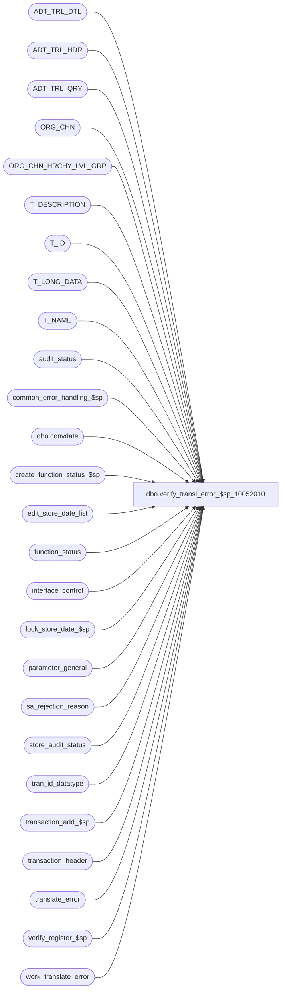

# dbo.verify_transl_error_$sp_10052010

**Database:** auditworks  
**Server:** bedrockdb01  

## Architecture Diagram



## Table Dependencies

| Referenced Table |
|---|
| ADT_TRL_DTL |
| ADT_TRL_HDR |
| ADT_TRL_QRY |
| ORG_CHN |
| ORG_CHN_HRCHY_LVL_GRP |
| T_DESCRIPTION |
| T_ID |
| T_LONG_DATA |
| T_NAME |
| audit_status |
| common_error_handling_$sp |
| dbo.convdate |
| create_function_status_$sp |
| edit_store_date_list |
| function_status |
| interface_control |
| lock_store_date_$sp |
| parameter_general |
| sa_rejection_reason |
| store_audit_status |
| tran_id_datatype |
| transaction_add_$sp |
| transaction_header |
| translate_error |
| verify_register_$sp |
| work_translate_error |

## Stored Procedure Code

```sql
CREATE proc [dbo].[verify_transl_error_$sp_10052010] (@process_id binary(16),
 @user_id    int,
 @action tinyint = 1 /* 1 = verify, 0 = unverify */
)
AS

/* Proc Name: verify_transl_error_$sp
   Description: To update translate_error_verified column in audit_status for translate_error rows 
		which are flagged as verified. Then verify the registers and stores. 
		Revalidates SA Reject Reason 8, and posts trxns when no more SA rejects for the trxn.
		Calls transaction_add_$sp proc with new function_no 112.
		Called from frontend. work_translate_error is populated by frontend.

HISTORY
Date	 Name      Def# Desc
Jun03,10  Paul   114682 handle invalid date with translate errors: added check on sa_reject_flag in transaction_header,
				 update audit group hierarchy at end of proc (performance)
May18,10  Vicci  117947 Don't upgrade audit status from Invalid Store/Reg to Edited.
Mar22,10  Vicci  115375 Update translate_error/sa-reject/audit-status in cursor even if only 1 transaction present for s/r/d;  
			log audit trail.  Use correct function# to allow cleanup to set audit_status.translate_error_verified.
			Don't skip unlocked store/dates when in trickle-audit.
Mar03,08 Phu   1-3W8CDJ translate_error.transaction_id NULL causing audit_status.translate_error_verified not evaluated.
Jul30,07 Phu      89875 Make sure that row in ORG_CHN_HRCHY_LVL_GRP is updated for front end screen refresh.
Oct25,06 Phu      77931 Fix outer join for SQL 2005 Mode 90.
Jan31,06 Paul   DV-1329 set verified_date, simplify cursor logic
Sep08,05 Paul   DV-1312 apply 46670 to SA5
Jul05,05 Paul   DV-1239 Use tran_id_datatype
Sep22,04 Paul   DV-1146 receive user_id
Aug23,04 Paul   DV-1120 change refresh logic, pass zero entry_id
Apr21,04 Maryam DV-1071 Pass in @process_id and @user_name and modify the call to the
                        sub procs to receive these two variables as their first 2 parameters.
                        modify the call to lock_store_date_$sp as it no longer outputs the user_name
Jan04,05 Daphna 1-JA116/46670  prevent verification of translate errors for SRD that 
                               have not yet completed edit phase 2
Jul08,03 Paul     10169 correctly set @locked if force accepting
Jun19,03 David  1-LZEID Initialize @force_accept_flag to be 0.
Dec16,02 Paul   1-HCTFY Corrected error logic for 201571 message. Avoid raising this warning
				if called by force_accept_$sp.
Nov18,02 David     5161 Set any entries left in work_translate error after store_date_crsr loop to @action_value.
Oct29,02 Winnie 1-G9TW5 Pass verify_store_status = 1 when calling verify_register_$sp
Sep20,02 Winnie 1-FHAT5 To correctly set the translate_error_verified in audit_status
May06,02 Henry	1-CMIL0 To handle exception translate errors (no associated SA rejects or NULL entries).
			Update feature table (for front-end auto-refresh), re-verify audit_status.
Mar14,02 Henry	1-A8XPT When verify translate rejects, also correct the associated SA reject.
			Added R3 common error handling.
Apr04,01 Phu       7501 Use sql function to retrieve user name
Mar30,00 Sab       6159 Prevent infinite loop
Mar01,00 Phu       5900 Change @@fetch_status > 0 to @@fetch_status <> 0 for MS SQL compatibility
Jan12,99 Sab       5791 Include register_no in CURSOR
Nov26,96 Paul           author
*/

DECLARE @action_value		tinyint,
	@current_date		smalldatetime,
	@cursor_open		tinyint,
	@date_reject_id		tinyint,
	@errmsg			varchar(255),
	@errno			int,
	@force_accept_flag	tinyint,
	@function_no		tinyint,
	@interfaces_updated	int,
	@locked			tinyint,
	@locked_count		int,
	@more_sa_rejects	tinyint,
	@no_more_rows		tinyint,
	@override_flag		tinyint,
	@previous_store_no	int,
	@previous_date_rej_id	tinyint,
	@previous_sales_date	smalldatetime,
	@previous_register_no	smallint,
	@register_no		smallint,
        @ret                    int,
	@rows			int,
	@store_no		int,
	@transaction_date	smalldatetime,
        @transaction_id         tran_id_datatype,
	@object_name		varchar(255),
	@process_name		varchar(100),
	@operation_name		varchar(100),
	@message_id		int,
	@sa_reject_qty		smallint,
	@verified_by_user_id	int,
	@verified_date		smalldatetime,
	@verified_flag		tinyint,
	@violated_sareject_rule	smallint,
	@unverified_date	smalldatetime,
	@entry_date_time	datetime, 
	@sep                    char(1),
	@TBL_KEY		T_DESCRIPTION,
  	@TBL_KEY_RSRC_NAME	T_LONG_DATA,
  	@TBL_KEY_RSRC_PRMS	T_DESCRIPTION,
  	@ENTRY_ID		T_ID,
	@ORG_CHN_NAME		T_NAME,
	@transaction_no		int,
	@transaction_series	char(1),
	@trickle_polling_flag	tinyint

SELECT @function_no = 140,
	@no_more_rows = 0,
	@previous_store_no = -1,
        @process_name = 'verify_transl_error_$sp',
        @message_id = 201068,
        @force_accept_flag = 0, -- 1-LZEID
        @action_value = 0,
        @current_date = getdate(),
        @override_flag = 1,
        @verified_date = NULL,
        @verified_by_user_id = NULL, -- default value for unaccept
        @sep = CHAR(12)

SELECT @trickle_polling_flag = ISNULL(trickle_polling_flag,0)
  FROM parameter_general
SELECT @errno = @@error
IF @errno != 0
BEGIN
  SELECT @errmsg = 'Failed to read table parameter_general.',
         @object_name = 'parameter_general',
         @operation_name = 'SELECT'
  GOTO error
END

--Required in case of recovery mode
DELETE function_status
 WHERE function_no = @function_no
   AND process_id = @process_id
SELECT @errno = @@error
IF @errno != 0
BEGIN
  SELECT @errmsg = 'Failed to cleanup status',
         @object_name = 'function_status',
         @operation_name = 'DELETE'
         GOTO error
END

IF @action >= 10  -- called by force_accept_$sp
 SELECT @action = @action - 10,
	@force_accept_flag = 1

IF @action = 1 -- verify
  SELECT @action_value = 1,
   	 @verified_date = @current_date,
   	 @verified_by_user_id = @user_id,
   	 @override_flag = NULL
ELSE
  SELECT @unverified_date = @current_date

IF @trickle_polling_flag = 0 
BEGIN
  /* prevent verification of translate errors for SRD that have not yet been processed by edit phase 2 */
  DELETE work_translate_error
    FROM work_translate_error w, 
         translate_error t, 
         edit_store_date_list e
   WHERE t.store_no = e.store_no
     AND t.register_no = e.register_no
     AND t.transaction_date = e.transaction_date
     AND t.translate_error_id = w.translate_error_id     
     AND process_id = @process_id
  SELECT @errno = @@error
  IF @errno != 0
  BEGIN
    SELECT @errmsg = ' for SRD found in edit_store_date_list and trickle-audit not active', 
           @object_name = 'work_translate_error',
           @operation_name = 'DELETE'
    GOTO error
  END
END
ELSE  --ELSE of IF i_trickle_polling_flag = 0 
BEGIN
  DELETE work_translate_error
    FROM work_translate_error w, 
         translate_error t, 
         transaction_header h
   WHERE t.transaction_id = h.transaction_id
     AND h.edit_progress_flag > 0
     AND t.translate_error_id = w.translate_error_id     
     AND process_id = @process_id
  SELECT @errno = @@error
  IF @errno != 0
  BEGIN
    SELECT @errmsg = 'Do not process translate errors for transactions which are in the midst of trickling in',
           @object_name = 'work_translate_error',
           @operation_name = 'DELETE'
    GOTO error
  END
END --ELSE of IF i_trickle_polling_flag = 0 
/* save snapshot of verified rows in order to allow concurrent verification by multiple users */

SELECT	wt.translate_error_id,
	store_no,
	register_no,
	te.entry_date_time,
	te.transaction_date, -- changed this. Was entry_date_time. Def 1-A8XPT.
	ISNULL(te.transaction_id, 0) AS transaction_id, -- added this. Def 1-A8XPT.
	te.transaction_no,
	te.transaction_series 
   INTO #reject_list
   FROM work_translate_error wt, translate_error te
 WHERE process_id = @process_id
    AND wt.translate_error_id = te.translate_error_id

SELECT @errno = @@error,
       @rows = @@rowcount
IF @errno != 0
  BEGIN
  SELECT @errmsg = 'Failed to build temp table #reject_list',
          @object_name = ' #reject_list',
          @operation_name = 'INSERT'
   GOTO error
  END

IF @rows <= 0
  BEGIN
   DROP TABLE #reject_list
   RETURN
  END

-- get a list of trxns for store-reg-dates that are not dayended yet
SELECT DISTINCT st.store_no,
	st.register_no,
	rl.transaction_date,
	st.date_reject_id,
	rl.transaction_id, -- added this. Def 1-A8XPT.
	rr.violated_sareject_rule,
	rl.entry_date_time,
	rl.transaction_no,
	rl.transaction_series
  INTO #work_transl_reject
  FROM #reject_list rl
       INNER JOIN audit_status st ON (rl.store_no = st.store_no
                                      AND rl.register_no = st.register_no
                                      AND rl.transaction_date = st.sales_date)
       LEFT JOIN sa_rejection_reason rr ON (rl.transaction_id = rr.transaction_id
                                            AND rr.violated_sareject_rule = 8)
 WHERE rl.transaction_id IS NOT NULL
   AND st.audit_status >= 6
   AND st.audit_status <= 300
SELECT @errno = @@error
IF @errno != 0
  BEGIN
   SELECT @errmsg = 'Failed to build temp table #work_transl_reject',
          @object_name = ' #work_transl_reject',
          @operation_name = 'INSERT'
   GOTO error
  END

  /* The cursor will return a row for each value of date_reject_id that exists in audit_status
     for any rows that match the cursor where clause, i.e. there is a one-to-many relationship between
     translate_error and audit_status when invalid dates (date_reject_id > 0) exist.
     For each affected store-reg-transaction_date, recalculate translate_error_verified in audit_status.
     When a sa_reject exists (@violated_sareject_rule is not null), then revalidate the transaction. */

DECLARE store_date_crsr CURSOR FAST_FORWARD
FOR
SELECT	store_no,
	transaction_date,
	register_no,
	date_reject_id,
	transaction_id,
	violated_sareject_rule,
	entry_date_time,
	transaction_no,
	transaction_series
FROM #work_transl_reject WITH (NOLOCK)
ORDER BY store_no, transaction_date, date_reject_id, register_no

OPEN store_date_crsr

SELECT @errno = @@error
IF @errno != 0
  BEGIN
   SELECT @errmsg = 'Failed to open cursor store_date_crsr',
          @object_name = 'store_date_crsr',
          @operation_name = 'OPEN'
   GOTO error
  END

SELECT  @cursor_open = 1,
	@locked_count = 0

WHILE 1=1
 BEGIN

  FETCH store_date_crsr INTO
	@store_no,
	@transaction_date,
	@register_no,
	@date_reject_id,
	@transaction_id,
	@violated_sareject_rule,
	@entry_date_time,
	@transaction_no,
	@transaction_series

  IF @@fetch_status <> 0
  BEGIN
   IF @previous_store_no = -1
     BREAK
   ELSE
     SELECT @no_more_rows = 1
  END

  -- check for change of store or date or register

  IF ( (@store_no <> @previous_store_no) OR (@transaction_date <> @previous_sales_date) OR
       (@date_reject_id <> @previous_date_rej_id) OR (@register_no <> @previous_register_no)
       OR (@no_more_rows = 1) )
   BEGIN

     IF @no_more_rows = 0 
     BEGIN
       SELECT @ORG_CHN_NAME = SUBSTRING(ORG_CHN_NAME,1,30)
  	 FROM ORG_CHN
   	WHERE ORG_CHN_NUM = @store_no
       SELECT @errno = @@error
       IF @errno != 0
       BEGIN
         SELECT @errmsg = 'Unable to get store name.',
                @object_name = 'ORG_CHN',
                @operation_name = 'SELECT'
         GOTO error
       END
       IF @ORG_CHN_NAME IS NULL
         SELECT @ORG_CHN_NAME = ' '
    END

    IF @previous_store_no <> -1
     BEGIN
       SELECT @verified_flag = 0

       SELECT @verified_flag = MIN(verified)
         FROM translate_error
        WHERE store_no = @previous_store_no
 	  AND register_no = @previous_register_no
          AND transaction_date = @previous_sales_date

       SELECT @sa_reject_qty = COUNT(1)
	  FROM transaction_header
	 WHERE store_no = @previous_store_no
	   AND register_no = @previous_register_no
	   AND transaction_date = @previous_sales_date
	   AND date_reject_id = @previous_date_rej_id
	   AND sa_rejection_flag = 1

       UPDATE audit_status
          SET translate_error_verified = ISNULL(@verified_flag,0),
              sa_reject_qty = @sa_reject_qty,
              audit_status = CASE WHEN audit_status IN (7, 8) THEN audit_status ELSE 100 END
        WHERE store_no = @previous_store_no
          AND register_no = @previous_register_no
          AND sales_date = @previous_sales_date
          AND date_reject_id = @previous_date_rej_id
          AND audit_status <= 300

       SELECT @errno = @@error
       IF @errno != 0
         BEGIN
           SELECT @errmsg = 'Failed to VERIFY translate_error - last pass',
      	          @object_name = 'audit_status',
		  @operation_name = 'UPDATE'
             GOTO error
	 END

       EXEC verify_register_$sp @process_id, @user_id, @previous_store_no, @previous_register_no, @previous_sales_date, @previous_date_rej_id, @errmsg OUTPUT, 1

       SELECT @errno = @@error
       IF @errno != 0
         BEGIN
	   IF @errmsg IS NULL /* then */
	   SELECT @errmsg = 'Failed to verify register (1)'
	   SELECT  @object_name = 'verify_register_$sp',
	 	   @operation_name = 'EXEC'
	   GOTO error
	  END

	/* unlock store/date */
	UPDATE store_audit_status
	   SET update_in_progress = 0
	 WHERE store_no = @previous_store_no
	   AND sales_date = @previous_sales_date
	   AND date_reject_id = @previous_date_rej_id

	SELECT @errno = @@error
	IF @errno != 0
	BEGIN
	  SELECT @errmsg = 'Failed to unlock store/date',
		 @object_name = 'store_audit_status',
		 @operation_name = 'UPDATE'
	  GOTO error
	END

	DELETE function_status
	 WHERE function_no = @function_no
	   AND process_id = @process_id

	SELECT @errno = @@error
	IF @errno != 0
	BEGIN
	  SELECT @errmsg = 'Failed to cleanup status',
		 @object_name = 'function_status',
		 @operation_name = 'DELETE'
	  GOTO error
	END

	IF @no_more_rows = 1
	  BREAK

     END /* @previous_store_no <> -1 */

     SELECT @previous_store_no = @store_no,
	    @previous_sales_date = @transaction_date,
	    @previous_date_rej_id = @date_reject_id,
	    @previous_register_no = @register_no,
	    @locked = 1

     IF @force_accept_flag = 0
       BEGIN
        EXEC lock_store_date_$sp @process_id, @user_id, @store_no, @transaction_date, @date_reject_id,
	  @function_no, @ret OUTPUT

        SELECT @errno = @@error
        IF @errno != 0
          BEGIN
	   SELECT @errmsg = 'Failed to lock the store/date',
		@object_name = 'lock_store_date_$sp',
		@operation_name = 'EXECUTE'
	   GOTO error
        END
       END
     ELSE  -- bypass locking if called from force accept
       SELECT @ret = 0

     IF @ret = 0 AND @force_accept_flag = 0
      BEGIN /* record for cleanup of locked store_audit_status and reassessment of audit_status.translate_reject_verified changed to @function_no instead of 182*/
	EXEC create_function_status_$sp @process_id, @user_id, @function_no, 0, @errmsg OUTPUT,
		@store_no, @transaction_date, @date_reject_id, @register_no, @action 

	SELECT @errno = @@error
	IF @errno != 0
	 BEGIN
	  IF @errmsg IS NULL /* then */
	    SELECT @errmsg = 'Failed to create function status entry'
	  SELECT   @object_name = 'create_function_status_$sp',
		   @operation_name = 'EXEC'
	  GOTO error
	 END
      END /* @ret = 0 */

     IF @ret != 0 /* unable to lock, skip store-date */
       BEGIN
	SELECT @locked = 0,
		@locked_count = @locked_count + 1

	DELETE work_translate_error
	  FROM #reject_list rl, work_translate_error wt
	 WHERE process_id = @process_id
	   AND rl.store_no = @store_no
	   AND rl.transaction_date = @transaction_date
	   AND rl.translate_error_id = wt.translate_error_id

	SELECT @errno = @@error
	IF @errno != 0
	 BEGIN
	   SELECT @errmsg = 'Failed to cleanup work table (1)',
		  @object_name = 'work_translate_error',
		  @operation_name = 'DELETE'
	   GOTO error
	 END
       END /* @ret != 0 */
     ELSE
       BEGIN -- update flags for locked store-register
        UPDATE translate_error
	  SET verified = @action_value,
	      verified_by_user_id = @verified_by_user_id,
	      verified_date = @verified_date,
	      override_flag = ISNULL(@override_flag,te.override_flag)
	  FROM work_translate_error wt, translate_error te
	 WHERE process_id = @process_id
	   AND wt.translate_error_id = te.translate_error_id
	   AND verified != @action_value
	   AND store_no = @store_no
	   AND register_no = @register_no
	   AND transaction_date = @transaction_date

        SELECT @errno = @@error
        IF @errno != 0
	BEGIN
	   SELECT @errmsg = 'Failed to SET verified flags',
		  @object_name = 'translate_error',
		  @operation_name = 'UPDATE'
	   GOTO error
	END
       END -- update flags

   END /* IF (((@store_no <> @previous_store_no) OR ... */


   IF @violated_sareject_rule IS NOT NULL AND @action_value = 1
     AND @locked = 1 AND @date_reject_id = 0 -- If verifying, then remove sa reject type 8
    BEGIN
	 SELECT @more_sa_rejects = 0

	 -- check if there are additional SA rejects for the trxn.

	 IF EXISTS (SELECT violated_sareject_rule
		      FROM sa_rejection_reason
		     WHERE transaction_id = @transaction_id
		       AND violated_sareject_rule != 8)
	   SELECT @more_sa_rejects = 1

	 IF @more_sa_rejects = 1
	   BEGIN
	    DELETE sa_rejection_reason
	     WHERE transaction_id = @transaction_id
	       AND violated_sareject_rule = 8

	    SELECT @errno = @@error
	    IF @errno != 0
	    BEGIN
	     SELECT @errmsg = 'Failed to delete sa_rejection_reason',
		    @object_name = 'sa_rejection_reason',
		    @operation_name = 'DELETE'
	     GOTO error
	    END
	   END -- If @more_sa_rejects = 1

	 -- if tran has no other SA rejects, then post valid transaction to interfaces and SA summary tables.
	 IF @more_sa_rejects = 0 AND @transaction_id > 0 
	 BEGIN

	  SELECT @interfaces_updated = COUNT(1)
	    FROM interface_control
	   WHERE transaction_id = @transaction_id

	   SELECT @errno = @@error
	   IF @errno != 0
	   BEGIN
	     SELECT @errmsg = 'Failed to set @interfaces_updated',
		    @object_name = 'interface_control',
		    @operation_name = 'SELECT'
	     GOTO error
	   END

	   -- detect change to non-reject

	   UPDATE transaction_header
	      SET sa_rejection_flag = 0
	    WHERE transaction_id = @transaction_id
	      AND sa_rejection_flag = 1 -- safety check

	   SELECT @errno = @@error, @rows = @@rowcount
	   IF @errno != 0
	   BEGIN
	     SELECT @errmsg = 'Failed to RESET sa_rejection_flag',
		    @object_name = 'transaction_header',
		    @operation_name = 'UPDATE'
	     GOTO error
	   END

	   IF @rows > 0 AND @interfaces_updated = 0
	     BEGIN
	      EXEC transaction_add_$sp @process_id, @user_id, @transaction_id, @errmsg OUTPUT, 0, 112 -- new function_no

	      SELECT @errno = @@error
	      IF @errno != 0
	        BEGIN
		     IF @errmsg IS NULL /* then */
		       SELECT @errmsg = 'Failed to ADD the trxn to interfaces'
		     SELECT @object_name = 'transaction_add_$sp',
			    @operation_name = 'EXECUTE'
		     GOTO error
	        END
	     END -- If @rows > 0
	 END -- If @more_sa_rejects = 0

    END -- If @violated_sareject_rule IS NOT NULL ...

    /* Handle possible combination of invalid date (date_reject_id > 0) and translate reject.
       The loop will process date_reject_id = 0 before processing date_reject_id > 0 
       since the same store-reg-date could also exist with date_reject_id = 0.
       Transactions on an invalid date will have other sa reject reasons. */

    IF @date_reject_id > 0 AND @action = 1 AND @transaction_id > 0 AND @locked = 1 -- THEN
	 BEGIN
		DELETE sa_rejection_reason
		WHERE transaction_id = @transaction_id
	     	  AND violated_sareject_rule = 8

		SELECT @errno = @@error
		IF @errno != 0
		   BEGIN
		     SELECT @errmsg = 'Failed to delete sa_rejection_reason (invalid date)',
			    @object_name = 'sa_rejection_reason',
			    @operation_name = 'DELETE'
		     GOTO error
		   END
	 END

    --Audit Trail logging
    IF @locked = 1 
    BEGIN
      SELECT @ENTRY_ID = NEWID()
      IF @transaction_id <> 0 OR @transaction_no <> 0 
      BEGIN
        SELECT @TBL_KEY = CASE WHEN @transaction_id > 0 
                               THEN convert(varchar, @transaction_id) 
                               ELSE convert(varchar, @store_no) + @sep + dbo.convdate(@transaction_date)  + @sep + 
                        	    convert(varchar, @register_no) + @sep + convert(varchar, @date_reject_id) + @sep + 
                        	    convert(varchar, @transaction_no) + @sep + @transaction_series + @sep +  
       	    dbo.convdate(@entry_date_time)
                          END,
               @TBL_KEY_RSRC_NAME = 'TK_STOR_TRAN_DATE_REGI_DATE_REJE_ID_TRAN_NO_TRAN_SERI_ENTR_DATE_TIME',
               @TBL_KEY_RSRC_PRMS = convert(varchar, @store_no)  + ' - ' + COALESCE(@ORG_CHN_NAME,convert(varchar, @store_no))+ @sep +
                             dbo.convdate(@transaction_date) + @sep + convert(varchar, @register_no) + @sep + 
                             convert(varchar, @date_reject_id) + @sep + convert(varchar, @transaction_no) + @sep + 
                             @transaction_series + @sep + dbo.convdate(@entry_date_time)
    END 
    ELSE
    BEGIN
      SELECT @TBL_KEY = convert(varchar, @store_no) + @sep + dbo.convdate(@transaction_date) + @sep + convert(varchar, @register_no) + @sep + convert(varchar, @date_reject_id),
      	     @TBL_KEY_RSRC_NAME = 'TK_STOR_TRAN_DATE_REGI_DATE_REJE_ID',
      	     @TBL_KEY_RSRC_PRMS = convert(varchar, @store_no) + ' - ' + @ORG_CHN_NAME + @sep + dbo.convdate(@transaction_date) + @sep + convert(varchar, @register_no) 
	                     	+ @sep + convert(varchar, @date_reject_id)
    END --IF @transaction_id <> 0 OR @transaction_no <> 0 

    INSERT INTO ADT_TRL_HDR (
           ENTRY_ID,
           ENTRY_DATE_TIME,
           USER_ID,
           APP_ID,
           ROOT_TBL_NAME,
           ROOT_TBL_KEY,
           ROOT_TBL_KEY_RSRC_NAME,
           ROOT_TBL_KEY_RSRC_PRMS,
           FNCTN_NUM)
    VALUES (@ENTRY_ID,
      	   COALESCE(@verified_date, @unverified_date),
      	   @user_id,
      	   300,
      	   'TRANSLATE_ERROR',
      	   @TBL_KEY,
      	   @TBL_KEY_RSRC_NAME,
      	   @TBL_KEY_RSRC_PRMS,
      	   @function_no)
    SELECT @errno = @@error
    IF @errno != 0
    BEGIN
      SELECT @errmsg = 'Cannot log verified/unverified translate error info to audit trail header', 
	     @object_name = 'ADT_TRL_HDR',
	     @operation_name = 'INSERT'
      GOTO error
    END

    INSERT INTO ADT_TRL_DTL (
	   ENTRY_ID,
           TBL_NAME,
           TBL_KEY,
           TBL_KEY_RSRC_NAME,
           TBL_KEY_RSRC_PRMS,
           ACTN_CODE,
           CLMN_NAME,
           OLD_VAL,
           NEW_VAL)
    VALUES (@ENTRY_ID,
	   'TRANSLATE_ERROR',
	   @TBL_KEY,
	   @TBL_KEY_RSRC_NAME,
	   @TBL_KEY_RSRC_PRMS,
	   'M',
	   'VERIFIED',
	   ABS(@action - 1),
	   @action)
    SELECT @errno = @@error
    IF @errno != 0
    BEGIN
      SELECT @errmsg = 'Cannot log verified/unverified translate error info to audit trail detail', 
	     @object_name = 'ADT_TRL_DTL',
	     @operation_name = 'INSERT'
      GOTO error
    END

    INSERT INTO ADT_TRL_QRY (
	   ENTRY_ID,
	   QRY_KEY_NUM,
	   KEY_PART_VAL_1,
	   KEY_PART_VAL_2,
	   KEY_PART_VAL_3,
	   KEY_PART_VAL_5,
	   KEY_PART_VAL_6,
	   KEY_PART_VAL_8)
    VALUES (@ENTRY_ID,
           301,
           convert(varchar, @store_no),
           convert(varchar, @register_no),
           dbo.convdate(@transaction_date),
	   CASE WHEN @transaction_id = 0 THEN NULL ELSE convert(varchar, @transaction_no) END,
	   CASE WHEN @transaction_id = 0 THEN NULL ELSE @transaction_series END,
	   CASE WHEN @transaction_id = 0 THEN NULL ELSE convert(varchar, @transaction_id) END)
    SELECT @errno = @@error
    IF @errno != 0
    BEGIN
      SELECT @errmsg = 'CUnable to insert audit trail query keys.', 
	     @object_name = 'ADT_TRL_QRY',
	     @operation_name = 'INSERT'
      GOTO error
    END

  END  --IF @locked = 1
 
END /* While 1=1 */

CLOSE store_date_crsr
DEALLOCATE store_date_crsr

SELECT @cursor_open = 0


/* Now verify/unverify all remaining entries in translate_error table
 (no store-reg-date-tran logged by translate or store-date is no longer open). */
DELETE work_translate_error
  FROM translate_error te
 WHERE work_translate_error.process_id = @process_id
   AND work_translate_error.translate_error_id = te.translate_error_id
AND te.verified = @action_value
SELECT @errno = @@error
IF @errno != 0
BEGIN
  SELECT @errmsg = 'Failed to remove previously processed work_translate_error table entries',
         @object_name = 'work_translate_error',
         @operation_name = 'DELETE'
  GOTO error
END

UPDATE translate_error
   SET verified = @action_value,
       verified_by_user_id = @verified_by_user_id,
       verified_date = @verified_date,
       override_flag = ISNULL(@override_flag,te.override_flag)
  FROM translate_error te, work_translate_error we
 WHERE te.verified != @action_value
   AND te.translate_error_id = we.translate_error_id
   AND we.process_id = @process_id
SELECT @errno = @@error, @rows = @@rowcount
IF @errno != 0
BEGIN
  SELECT @errmsg = 'Failed to SET verified flag',
         @object_name = 'translate_error',
         @operation_name = 'UPDATE'
  GOTO error
END

IF @rows > 0 
BEGIN
  SELECT @TBL_KEY_RSRC_NAME = 'TK_STOR_TRAN_DATE_REGI_DATE_REJE_ID_TRAN_ERRO_ID'
  
  UPDATE work_translate_error
     SET audit_trail_entry_id = newid()
   WHERE process_id = @process_id
  SELECT @errno = @@error 
  IF @errno != 0
  BEGIN
    SELECT @errmsg = 'Failed to set prepare work entries for audit-trail insertion',
           @object_name = 'work_translate_error',
           @operation_name = 'UPDATE'
    GOTO error
  END

  INSERT INTO ADT_TRL_HDR (
             ENTRY_ID,
             ENTRY_DATE_TIME,
             USER_ID,
             APP_ID,
             ROOT_TBL_NAME,
             ROOT_TBL_KEY,
             ROOT_TBL_KEY_RSRC_NAME,
             ROOT_TBL_KEY_RSRC_PRMS,
             FNCTN_NUM)
  SELECT wt.audit_trail_entry_id,
       	 COALESCE(@verified_date, @unverified_date),
      	 @user_id,
      	 300,
      	 'TRANSLATE_ERROR',
       	 COALESCE(convert(varchar, te.store_no), ' ') + @sep + COALESCE(dbo.convdate(te.transaction_date), ' ') + @sep + COALESCE(convert(varchar, te.register_no), ' ') + @sep + '0'+ @sep + convert(varchar, wt.translate_error_id),
      	 @TBL_KEY_RSRC_NAME,
      	 SUBSTRING(COALESCE(convert(varchar, te.store_no) + ' - ' + o.ORG_CHN_NAME, ' ') + @sep + COALESCE(dbo.convdate(te.transaction_date), ' ') + @sep + COALESCE(convert(varchar, te.register_no), ' ')+ @sep + '0'+ @sep + convert(varchar, wt.translate_error_id) + ' ' + COALESCE(transl_error_msg, ' ') , 1, 255), 
       	 @function_no
    FROM work_translate_error wt
         INNER JOIN  translate_error te ON (wt.translate_error_id = te.translate_error_id)
         LEFT OUTER JOIN ORG_CHN o
      	 ON o.ORG_CHN_NUM = te.store_no
   WHERE process_id = @process_id;
  SELECT @errno = @@error 
  IF @errno != 0
  BEGIN
    SELECT @errmsg = 'Cannot log verified/unverified translate error info to audit trail header (2)',
           @object_name = 'ADT_TRL_HDR',
           @operation_name = 'INSERT'
    GOTO error
  END

  INSERT INTO ADT_TRL_DTL (
         ENTRY_ID,
         TBL_NAME,
         TBL_KEY,
         TBL_KEY_RSRC_NAME,
         TBL_KEY_RSRC_PRMS,
         ACTN_CODE,
         CLMN_NAME,
         OLD_VAL,
         NEW_VAL)
  SELECT wt.audit_trail_entry_id,
	 'TRANSLATE_ERROR',
	 COALESCE(convert(varchar, te.store_no), ' ') + @sep + COALESCE(dbo.convdate(te.transaction_date), ' ') + @sep + COALESCE(convert(varchar, te.register_no), ' ') + @sep + '0'+ @sep + convert(varchar, wt.translate_error_id),
	 @TBL_KEY_RSRC_NAME, 
	 SUBSTRING(COALESCE(convert(varchar, te.store_no), ' ') + ' - ' + @ORG_CHN_NAME + @sep + COALESCE(dbo.convdate(te.transaction_date), ' ') + @sep + COALESCE(convert(varchar, te.register_no), ' ')+ @sep + '0'+ @sep + convert(varchar, wt.translate_error_id) + ' ' + COALESCE(transl_error_msg, ' ') , 1, 255), 
	 'M',
	 'VERIFIED',
	 ABS(@action_value - 1),
	 @action_value 
    FROM work_translate_error wt
         INNER JOIN  translate_error te ON (wt.translate_error_id = te.translate_error_id)
   WHERE process_id = @process_id;
  SELECT @errno = @@error 
  IF @errno != 0
  BEGIN
    SELECT @errmsg = 'Cannot log verified/unverified translate error info to audit trail detail (2)',
  @object_name = 'ADT_TRL_DTL',
           @operation_name = 'INSERT'
    GOTO error
  END

  INSERT INTO ADT_TRL_QRY (
	     ENTRY_ID,
	     QRY_KEY_NUM,
	     KEY_PART_VAL_1,
	     KEY_PART_VAL_2,
	     KEY_PART_VAL_3,
	     KEY_PART_VAL_5,
	     KEY_PART_VAL_6,
	     KEY_PART_VAL_8)
  SELECT wt.audit_trail_entry_id,
         301,
         convert(varchar, te.store_no),
         convert(varchar, te.register_no),
         dbo.convdate(te.transaction_date),
         convert(varchar, te.transaction_no),
         te.transaction_series,
         te.transaction_id
    FROM work_translate_error wt
         INNER JOIN  translate_error te 
            ON wt.translate_error_id = te.translate_error_id
   WHERE process_id = @process_id;
  SELECT @errno = @@error 
  IF @errno != 0
  BEGIN
     SELECT @errmsg  = 'Unable to insert audit trail query keys (2).', 
     	    @object_name = 'ADT_TRL_QRY', 
      	    @operation_name = 'INSERT'
     GOTO error;
  END;
END --IF @rows > 0, left over work table entries to be verified.


DELETE work_translate_error
 WHERE process_id = @process_id
SELECT @errno = @@error
IF @errno != 0
  BEGIN
   SELECT @errmsg = 'Failed to cleanup work table (2)',
	  @object_name = 'work_translate_error',
	  @operation_name = 'DELETE'
   GOTO error
  END

  /* Now refresh all audit groups (avoids refreshing each audit group multiple times inside the cursor) */

  UPDATE ORG_CHN_HRCHY_LVL_GRP
     SET GRP_MBR_CHNG = getdate()
   WHERE GRP_MBR_CHNG IS NOT NULL

  SELECT @errno = @@error
  IF @errno != 0
    BEGIN
	   SELECT @errmsg = 'Failed to update ORG_CHN_HRCHY_LVL_GRP',
		  @object_name = 'ORG_CHN_HRCHY_LVL_GRP',
		  @operation_name = 'UPDATE'
 	  GOTO error
    END

IF @locked_count > 0
BEGIN
  SELECT @errno = 201571,
	 @errmsg = 'Could not process all data. Some store-dates were in use.',
	 @message_id = 201571
  GOTO error
END

RETURN
 
error:

	IF @cursor_open = 1
	BEGIN
	  CLOSE store_date_crsr
	  DEALLOCATE store_date_crsr
	END

        EXEC common_error_handling_$sp @function_no, @errno, @errmsg, 0, @message_id, 
                                 @process_name, @object_name, @operation_name, 0, 1, 0, null, 0, null, null, null,
	                         null, null, null, 0, @process_id, @user_id

	RETURN
```

