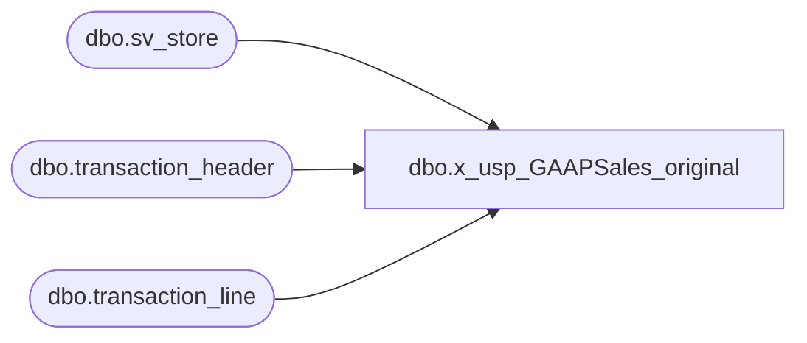

# dbo.x_usp_GAAPSales_original

**Database:** auditworks  
**Server:** bedrockdb01  

## Architecture Diagram



## Table Dependencies

| Referenced Table |
|---|
| dbo.sv_store |
| dbo.transaction_header |
| dbo.transaction_line |

## Stored Procedure Code

```sql
create proc usp_GAAPSales_original

as

SELECT a.store_no,
	c.store_name,
	SUM( ((b.gross_line_amount - b.pos_discount_amount) )* b.db_cr_none * b.voiding_reversal_flag)*-1 as total,
	left(max(a.entry_date_time),19) as [time of last transaction polled]
FROM auditworks.dbo.transaction_header a with (nolock), auditworks.dbo.transaction_line b with (nolock), auditworks.dbo.sv_store c with (nolock)
WHERE a.transaction_id=b.transaction_id  
    AND a.store_no=c.store_no  
    AND (a.transaction_date Between   CONVERT(char, GETDATE(), 101) and   CONVERT(char, GETDATE(), 101) 
    AND a.transaction_void_flag = 0 
    AND a.transaction_category IN (1,2) 
    AND b.line_void_flag=0 
    AND b.line_object IN (100,200,202,203,204,206,210,250,290,291,293,295,623,640,690,691)) 
GROUP BY a.store_no,c.store_name
```

