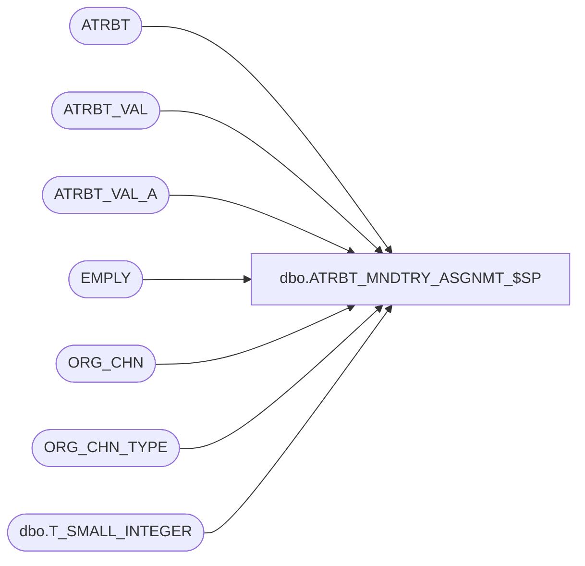

# dbo.ATRBT_MNDTRY_ASGNMT_$SP

**Database:** auditworks_external  
**Server:** bedrockdb01  

## Architecture Diagram



## Table Dependencies

| Referenced Table |
|---|
| ATRBT |
| ATRBT_VAL |
| ATRBT_VAL_A |
| EMPLY |
| ORG_CHN |
| ORG_CHN_TYPE |
| dbo.T_SMALL_INTEGER |

## Stored Procedure Code

```sql
CREATE PROC dbo.ATRBT_MNDTRY_ASGNMT_$SP
(
   @att_type dbo.T_SMALL_INTEGER
)
AS
    
  /*
    Procedure : ATRBT_MNDTRY_ASGNMT_$SP
    Purpose   : Assign mandatory attributes to all entities if not already assigned.

    HISTORY:
    Date         Name                Def# Desc
    Mar 12, 2015 Yan Ding            Initial Creation
    Mar 19, 2015 Yan Ding            Bug 111233, only assign active mandatory attributes to active entites
  */

DECLARE
   @att_code          nvarchar(8),
   @emp_cursor_open   int,
   @store_cursor_open int,
   @error_msg         nvarchar(1000)

BEGIN
   IF @att_type = 1
   BEGIN   
      /* 1. employee attributes*/
   
      DECLARE emp_mandatory_attribute_list CURSOR FOR
       SELECT a.ATRBT_CODE 
         FROM ATRBT a 
        WHERE a.ATRBT_TYPE = @att_type
          AND a.MNDTRY = 1
          AND a.IS_ACTV = 1

      BEGIN TRY
         OPEN emp_mandatory_attribute_list;
      END TRY
   
      BEGIN CATCH
         SELECT @error_msg = 'Failed to open employee mandatory attributes cursor - ' + ERROR_MESSAGE();
         GOTO error_handler;
      END CATCH
  
      SELECT @emp_cursor_open = 1;

      WHILE 1 = 1
      BEGIN
         BEGIN TRY
            FETCH emp_mandatory_attribute_list INTO @att_code;
         END TRY
         BEGIN CATCH
            SELECT @error_msg = 'Failed to fetch next employee mandatory attribute record - ' + ERROR_MESSAGE();
            GOTO error_handler;
         END CATCH
   
         IF @@fetch_status <> 0
            BREAK
      
         -- assign mandatory attributes to employees if not already assigned
         BEGIN TRY
            INSERT INTO ATRBT_VAL_A
                       (ASGND_OBJ_NUM, ATRBT_CODE, ATRBT_VAL_CODE, ATRBT_TYPE)
                 SELECT e.EMPLY_NUM, @att_code, av.ATRBT_VAL_CODE, av.ATRBT_TYPE
                   FROM EMPLY e WITH (NOLOCK)
             INNER JOIN ATRBT_VAL av WITH (NOLOCK)
                     ON av.ATRBT_CODE = @att_code
                    AND av.ATRBT_TYPE = @att_type
                    AND av.DFLT = 1
                    AND e.ACTV = 1
                  WHERE NOT EXISTS
                   (SELECT *
                      FROM ATRBT_VAL_A ava WITH (NOLOCK)
                     WHERE e.EMPLY_NUM = ava.ASGND_OBJ_NUM
                       AND ava.ATRBT_TYPE = @att_type
                       AND ava.ATRBT_CODE = @att_code);
         END TRY
         BEGIN CATCH
            SELECT @error_msg = 'Failed to assign mandatory attribute ''' + @att_code + ''' to employees  - ' + ERROR_MESSAGE();
            GOTO error_handler;
         END CATCH
      END

      CLOSE emp_mandatory_attribute_list;
      DEALLOCATE emp_mandatory_attribute_list;
      SET @emp_cursor_open = 0;
   END
   
   ELSE IF @att_type = 2
   
   BEGIN   
      /* 2. store attributes*/
   
      DECLARE store_mandatory_attribute_list CURSOR FOR
       SELECT a.ATRBT_CODE 
         FROM ATRBT a 
        WHERE a.ATRBT_TYPE = 2
          AND a.MNDTRY = 1
          AND a.IS_ACTV = 1

      BEGIN TRY
         OPEN store_mandatory_attribute_list
      END TRY
   
      BEGIN CATCH
         SELECT @error_msg = 'Failed to open store mandatory attributes cursor - ' + ERROR_MESSAGE();
         GOTO error_handler;
      END CATCH
  
      SELECT @store_cursor_open = 1;
   
      WHILE 1 = 1
      BEGIN
         BEGIN TRY
            FETCH store_mandatory_attribute_list INTO @att_code
         END TRY
         BEGIN CATCH
            SELECT @error_msg = 'Failed to fetch next store mandatory attribute record - ' + ERROR_MESSAGE();
            GOTO error_handler;
         END CATCH
      
         IF @@fetch_status <> 0
            BREAK
   
         -- assign mandatory attributes to stores if not already assigned
         BEGIN TRY
            INSERT INTO ATRBT_VAL_A
                       (ASGND_OBJ_NUM, ATRBT_CODE, ATRBT_VAL_CODE, ATRBT_TYPE)
                 SELECT s.ORG_CHN_NUM, @att_code, av.ATRBT_VAL_CODE, av.ATRBT_TYPE
                   FROM ORG_CHN s WITH (NOLOCK)
             INNER JOIN ATRBT_VAL av WITH (NOLOCK)
                     ON av.ATRBT_CODE = @att_code
                    AND av.ATRBT_TYPE = @att_type
                    AND av.DFLT = 1
                    AND s.ORG_CHN_TYPE_CODE IN
                      (SELECT t.ORG_CHN_TYPE_CODE FROM ORG_CHN_TYPE t WITH (NOLOCK) WHERE t.SYS_CODE IN ('CTLG', 'STR', 'WEB', 'WSTR'))
                    AND s.ACTV = 1
                  WHERE NOT EXISTS
                   (SELECT *
                      FROM ATRBT_VAL_A ava
                     WHERE s.ORG_CHN_NUM = ava.ASGND_OBJ_NUM
                       AND ava.ATRBT_TYPE = @att_type
                       AND ava.ATRBT_CODE = @att_code)
         END TRY
         BEGIN CATCH
            SELECT @error_msg = 'Failed to assign mandatory attribute ''' + @att_code + ''' to stores  - ' + ERROR_MESSAGE();
            GOTO error_handler;
         END CATCH
      END

      CLOSE store_mandatory_attribute_list
      DEALLOCATE store_mandatory_attribute_list
      SELECT @store_cursor_open = 0;
   END

   RETURN;
	
error_handler:

    IF @emp_cursor_open = 1
    BEGIN
      CLOSE emp_mandatory_attribute_list;
      DEALLOCATE emp_mandatory_attribute_list;    
    END

    IF @store_cursor_open = 1
    BEGIN
      CLOSE store_mandatory_attribute_list;
      DEALLOCATE store_mandatory_attribute_list;    
    END
    
    IF @@TRANCOUNT > 0 
       ROLLBACK;

    RAISERROR (@error_msg, 16, 1); /* System Errors will be reported with SQL error code = 50000 */


END
```

