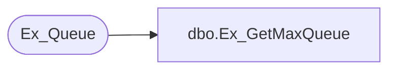

# dbo.Ex_GetMaxQueue

**Database:** auditworks_external  
**Server:** bedrockdb01  

## Architecture Diagram



## Table Dependencies

| Referenced Table |
|---|
| Ex_Queue |

## Stored Procedure Code

```sql
create proc dbo.Ex_GetMaxQueue @QueueID int, @MinSerialNo Numeric(14,0), @DesiredCount int, @MaxSerialNo Numeric(14,0) OUTPUT
/*********************************************************/
/*                                                       */
/*      Author: Chris Carveth                            */
/*      Creation Date: 13-April-1999                     */
/*      Comments:                                        */
/*                                                       */
/*                                                       */
/*********************************************************/
AS
DECLARE @Max Numeric(14,0)

    set rowcount @DesiredCount

    /* Init variables */
    SELECT @Max = serial_no
      FROM Ex_Queue
     WHERE queue_id = @QueueID
       AND serial_no >= @MinSerialNo

    set rowcount 0

    SELECT @MaxSerialNo = ISNULL(@Max,0)

RETURN 0
```

