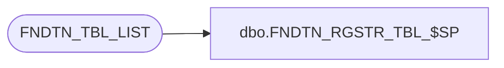

# dbo.FNDTN_RGSTR_TBL_$SP

**Database:** auditworks_external  
**Server:** bedrockdb01  

## Architecture Diagram



## Table Dependencies

| Referenced Table |
|---|
| FNDTN_TBL_LIST |

## Stored Procedure Code

```sql
create proc dbo.FNDTN_RGSTR_TBL_$SP
( @session_id   binary(16),
  @table_name   varchar(32)  
)

AS

/*
  Procedure : FNDTN_RGSTR_TBL_$SP
  Purpose   : Register a table created for a session with foundation.

HISTORY:
Date     Name         Def# Desc
Oct21,11 Phu        130594 Undo D#108321. Return fail status if the table has been previously registered, so that a different table name is allocated,
                             otherwise the same table is created again causing the error: There is already an object named 'SA_...' in the database.
                             For module CRDM only. Module FOUND does not need the fix because it did not have 108321.
Feb24,09 Phu        108321 Return successful status even if the table has been previously registered.
Feb25,05 Ian K             author

*/

DECLARE

  @success      int,
  @errno        int

BEGIN

  SELECT @success = 0
  
  IF EXISTS (SELECT 1 FROM FNDTN_TBL_LIST WHERE TBL_NAME = @table_name)
    BEGIN
        SELECT @success = -1
    END

  ELSE

    BEGIN
      BEGIN TRAN

        INSERT INTO FNDTN_TBL_LIST VALUES (@session_id, @table_name)
  
        SELECT @errno = @@error
        IF @errno <> 0
          SELECT @success = 1

      COMMIT

    END
     
  RETURN @success
  
END
```

