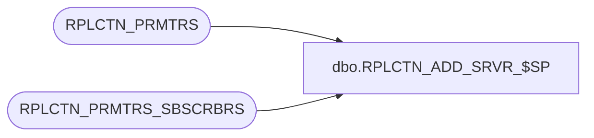

# dbo.RPLCTN_ADD_SRVR_$SP

**Database:** auditworks_external  
**Server:** bedrockdb01  

## Architecture Diagram



## Table Dependencies

| Referenced Table |
|---|
| RPLCTN_PRMTRS |
| RPLCTN_PRMTRS_SBSCRBRS |

## Stored Procedure Code

```sql
CREATE proc [dbo].[RPLCTN_ADD_SRVR_$SP]
(
  @application_name varchar(100),
  @security_mode    integer,
  @rpl_user_pwd     sysname
)
AS

DECLARE

  @server_name          varchar(100),
  @user_name            varchar(100),
  @error_msg            varchar(1000),
  @exists               int,
  @cursor_open          int  
  
BEGIN

  DECLARE create_servers CURSOR FAST_FORWARD FOR
   SELECT DISTINCT b.SBSCRBR_DB_SRVR_NAME, a.RPLCTN_USER 
     FROM RPLCTN_PRMTRS a, RPLCTN_PRMTRS_SBSCRBRS b
    WHERE a.APLCTN_NAME = @application_name
      AND a.APLCTN_NAME = b.APLCTN_NAME
    
  /*
    Procedure : RPLCTN_ADD_SRVR_$SP
    Purpose   : Create linked servers - this is done manualy as replication creates the old
                style links which do not allow remote store proc calls.

    HISTORY:
    Date     Name         Def# Desc
    Jul14,14 Ian k             Initial Creation

  */
  
  /* Get list of Subscribers */

  BEGIN TRY
       
    OPEN create_servers;
  
  END TRY
  BEGIN CATCH
    SELECT @error_msg = 'Failed to open servers cursor - ' + ERROR_MESSAGE();
    GOTO error_handler;
  END CATCH
  
  SELECT @cursor_open = 1;
  
  BEGIN TRY
        
    FETCH NEXT FROM create_servers
     INTO @server_name, @user_name;
    
  END TRY
  BEGIN CATCH
    SELECT @error_msg = 'Failed to fetch next article record - ' + ERROR_MESSAGE();
    GOTO error_handler;
  END CATCH
                            
  WHILE @@FETCH_STATUS = 0
  BEGIN  

    BEGIN TRY  
    
      /* Add each server */
      
      /* Check to see if the object actually exists */

      SELECT @exists = 0
      
      BEGIN TRY

        SELECT @exists = 1
          FROM sys.servers
         WHERE name = @server_name;
         
      END TRY
      BEGIN CATCH
        SELECT @error_msg = 'Failed to test for server existance - ' + ERROR_MESSAGE();
        GOTO error_handler;
      END CATCH      
      
      IF @exists = 0
       BEGIN

        PRINT '                                   Server Exists - Dropping ' + @server_name;
        --EXEC master.dbo.sp_dropserver @server = @server_name, @droplogins = 'droplogins'
        EXEC master.dbo.sp_addlinkedserver @server = @server_name, @srvproduct=N'SQL Server'        
       END 
      
       BEGIN
       
         EXEC master.dbo.sp_addlinkedsrvlogin @rmtsrvname=@server_name,@useself=N'True',@locallogin=NULL,@rmtuser=NULL,@rmtpassword=NULL;
         EXEC master.dbo.sp_addlinkedsrvlogin @rmtsrvname=@server_name,@useself=N'True',@locallogin=@user_name,@rmtuser=NULL,@rmtpassword=NULL;
         EXEC master.dbo.sp_serveroption @server=@server_name, @optname=N'data access', @optvalue=N'true';
         EXEC master.dbo.sp_serveroption @server=@server_name, @optname=N'dist', @optvalue=N'false';

         EXEC master.dbo.sp_serveroption @server=@server_name, @optname=N'pub', @optvalue=N'false';
         EXEC master.dbo.sp_serveroption @server=@server_name, @optname=N'rpc', @optvalue=N'true';
         EXEC master.dbo.sp_serveroption @server=@server_name, @optname=N'rpc out', @optvalue=N'true';
         EXEC master.dbo.sp_serveroption @server=@server_name, @optname=N'sub', @optvalue=N'true';
         EXEC master.dbo.sp_serveroption @server=@server_name, @optname=N'connect timeout', @optvalue=N'0';

       END      

    END TRY

    BEGIN CATCH
      SELECT @error_msg = 'Failed to add server ' + @server_name + ERROR_MESSAGE();
      GOTO error_handler;
    END CATCH
 
    BEGIN TRY
        
      FETCH NEXT FROM create_servers
       INTO @server_name, @user_name;
    
    END TRY
    BEGIN CATCH
      SELECT @error_msg = 'Failed to fetch server record - ' + ERROR_MESSAGE();
      GOTO error_handler;
    END CATCH
    
  END
  
  CLOSE create_servers;
  DEALLOCATE create_servers;

  SELECT @cursor_open = 0;
    
  RETURN;
	
error_handler:

    IF @cursor_open = 1
    BEGIN
      CLOSE create_servers;
      DEALLOCATE create_servers;    
    END
    
    IF @@TRANCOUNT > 0 
      ROLLBACK;

    RAISERROR (@error_msg, 16, 1); /* System Errors will be reported with SQL error code = 50000 */

END
```

