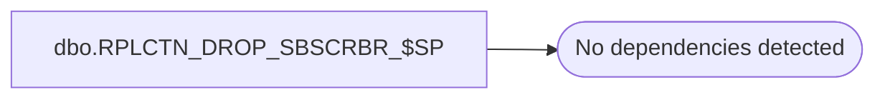

# dbo.RPLCTN_DROP_SBSCRBR_$SP

**Database:** auditworks_external  
**Server:** bedrockdb01  

## Architecture Diagram



## Table Dependencies

_No table dependencies detected._

## Stored Procedure Code

```sql
CREATE proc [dbo].[RPLCTN_DROP_SBSCRBR_$SP]
(
  @application_name varchar(100),
  @subscriber_name  varchar(100),
  @database_name    varchar(100)
)
AS

DECLARE

  @rpl_user_pwd         sysname,  
  @publication_name     varchar(100),
  @subscriber_db_name   varchar(100),
  @subscriber_srvr_name varchar(100),
  @replication_user     varchar(100),
  @error_msg            varchar(1000),
  @exists               int
  
BEGIN
   
  /*
    Procedure : RPLCTN_DROP_SBSCRBR_$SP
    Purpose   : Drops subscribers from the current publication
    

    HISTORY:
    Date     Name         Def# Desc
    Dec04,14 Ian K       95105 Add ability to remove only single application when multiple replication
                               exists on the same server.    
    Jul14,14 Ian k             Initial Creation

  */
  
  /* Set up variables */
  
  SELECT @publication_name = @application_name + '_Publication';
  
  /* Drop specified subscriber */

  BEGIN TRY
  
    EXEC sp_dropsubscription @subscriber = @subscriber_name,
                             @publication = @publication_name,
                             @article = 'all',
                             @destination_db = @database_name

  END TRY
  BEGIN CATCH
    SELECT @error_msg = 'Failed to drop subsriber  - ' + ERROR_MESSAGE();
    GOTO error_handler;
  END CATCH
  
  RETURN;
	
error_handler:

    IF @@TRANCOUNT > 0 
      ROLLBACK;
      
    RAISERROR (@error_msg, 16, 1); /* System Errors will be reported with SQL error code = 50000 */

END
```

