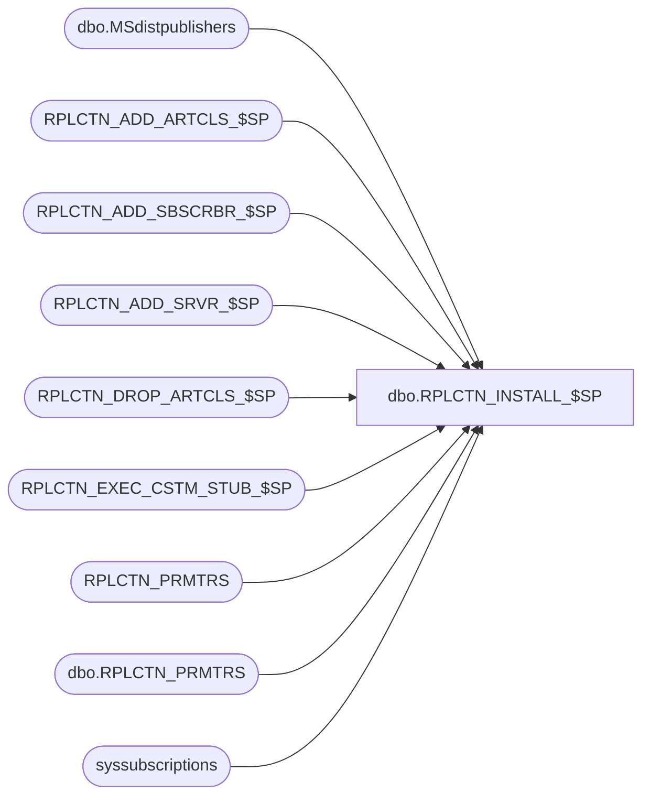

# dbo.RPLCTN_INSTALL_$SP

**Database:** auditworks_external  
**Server:** bedrockdb01  

## Architecture Diagram



## Table Dependencies

| Referenced Table |
|---|
| dbo.MSdistpublishers |
| RPLCTN_ADD_ARTCLS_$SP |
| RPLCTN_ADD_SBSCRBR_$SP |
| RPLCTN_ADD_SRVR_$SP |
| RPLCTN_DROP_ARTCLS_$SP |
| RPLCTN_EXEC_CSTM_STUB_$SP |
| RPLCTN_PRMTRS |
| dbo.RPLCTN_PRMTRS |
| syssubscriptions |

## Stored Procedure Code

```sql
CREATE proc [dbo].[RPLCTN_INSTALL_$SP]
(
  @application_name varchar(100),
  @security_mode    integer,
  @replication_user_pwd sysname
)
AS

/*
  Procedure : RPLCTN_INSTALL_$SP
  Purpose   : This is the main procedure for creating replication between applications.
              This is NOT a CRDM specfic stored procedure and can be used to configure
              mutliple applications replication to each other.

              The following tables are used to configure a replication setup.

              RPLCTN_PRMTRS : Defines which applications are installed. Installed applications
                              will have the ACTV flag set to 1.

                              Note that the application can be a pseudo application
                              i.e. a CRM Reporting server or SA scale out server.

                              Also Defines the server and database name of the application

              RPLCTN_PRMTRS_SBSCRBRS : Defines by application the other other application(s)
                                       that subscribe to it's data.

              RPLCTN_OBJCT_LIST : Defines the objects that are replicated to subscribers.


  HISTORY:

  Date        Name         Def#   Desc

  Jul14,14    Ian k               Initial Creation
  2014 1013   JHardin             repl config in oldest distr DB
  2014 1029   JHardin             Concurrency control

*/

DECLARE

  @lockResource       nvarchar(128),
  @result             integer,
  @database_Published int,
  @distributor_name   varchar(100),
  @publication_name   varchar(100),
  @database_name      varchar(100),
  @error_msg          varchar(1000),
  @active             int,
  @SQLString          nvarchar(500),
  @ParmDefinition     nvarchar(500),
  @Exists             int,
  @articles_published int,
  @articles_removed   int,
  @start_time         datetime

BEGIN

  SET @lockResource = NULL;

  /* Check to see if supplied application is configured */

  BEGIN TRY

    SELECT @active = ACTV, @database_name = APLCTN_DB_NAME
      FROM RPLCTN_PRMTRS
     WHERE APLCTN_NAME = @application_name
       AND ACTV = 1;

  END TRY
  BEGIN CATCH
    SET @error_msg = 'Failed to check for active applications - ' + ERROR_MESSAGE();
    GOTO error_handler;
  END CATCH

  IF @active = 0 OR @active IS NULL
   BEGIN
     PRINT '  This application is not configured for replication in RPLCTN_PRMTRS - Aborting setup';
     RETURN;
   END;

  /* Get current database name as we need to switch back and forth */

  --SET @database_name = db_name();

  PRINT 'Initializing replication ..... Checking Published State'
  SET @start_time = GETDATE();

  -- Concurrency control - only one replication management process for this application
  -- should be executing at a time! (Including UNINSTALL)
  SET @lockResource = 'Replication management - ' + @application_name;
  EXEC @result = sp_getapplock @Resource = @lockResource, @LockMode = 'Exclusive', @LockOwner = 'Session', @LockTimeout = 0;
  IF @result < 0
  BEGIN
    -- Somebody else is holding the lock
    PRINT '  Replication management for application "' + @application_name + '" is underway, try again later.';
    RETURN;
  END;

  -- DO NOT "RETURN" PAST THIS POINT WITHOUT RELEASING THE LOCK!!!

  BEGIN TRY

    SELECT @database_Published = is_published
      FROM sys.databases sd,
           dbo.RPLCTN_PRMTRS rp
     WHERE rp.APLCTN_NAME = @application_name
       AND sd.name        = @database_name;

  END TRY
  BEGIN CATCH
    SET @error_msg = 'Failed to test for existence of publication - ' + ERROR_MESSAGE();
    GOTO error_handler;
  END CATCH

  SET @publication_name = @application_name + '_Publication';

  IF @database_Published = 1
    PRINT '                               Already Published - Skipping Publisher'
  ELSE

   BEGIN

     PRINT '                               Not Published - Running Setup'

     /* Set current server as a distributor if it does not exist */

     /* Create server links */

     BEGIN TRY

       EXEC RPLCTN_ADD_SRVR_$SP @application_name, @security_mode, @replication_user_pwd;

     END TRY
     BEGIN CATCH
       SET @error_msg = 'Failed to add servers - ' + ERROR_MESSAGE();
       GOTO error_handler;
     END CATCH

     IF NOT EXISTS (SELECT 1
                      FROM sys.servers
                     WHERE name='repl_distributor'
                       AND data_source=@@servername)
      BEGIN

         PRINT '                               Creating Distributor'

         BEGIN TRY

            EXEC master.sys.sp_adddistributor @@servername;

         END TRY
         BEGIN CATCH
           SET @error_msg = 'Failed to add distributor - ' + ERROR_MESSAGE();
           GOTO error_handler;
         END CATCH

      END

     ELSE
      BEGIN
        PRINT '                               Distributor Exists - Skipping step'
      END

     /* Create Distribution Database if it does not exist */

     SET @distributor_name = @application_name + '_Distributor';

     IF EXISTS ( SELECT 1
                   FROM sys.databases sd,
                        dbo.RPLCTN_PRMTRS rp
                  WHERE rp.APLCTN_NAME = @application_name
                    AND sd.name = @distributor_name
                    AND is_distributor = 1 )
       BEGIN
         PRINT '                               Distribution DB ' + @distributor_name + ' Exists - Skipping step'
       END

     ELSE
       BEGIN

         PRINT '                               Creating Distribution Database ' + @distributor_name
         PRINT ''

         BEGIN TRY

           EXEC master.sys.sp_adddistributiondb @database = @distributor_name;

         END TRY
         BEGIN CATCH
           SET @error_msg = 'Failed to create distribution database - ' + ERROR_MESSAGE();
           GOTO error_handler;
         END CATCH

      END

     /* Create Publisher */

     IF NOT EXISTS (SELECT 1
                      FROM msdb.dbo.MSdistpublishers
                     WHERE name = @@servername)
      BEGIN

        PRINT '                               Creating Publisher ' + @@servername

        BEGIN TRY

          EXEC master.sys.sp_adddistpublisher @publisher = @@servername,
                                               @distribution_db = @distributor_name;

        END TRY
        BEGIN CATCH
          SET @error_msg = 'Failed to create publisher - ' + ERROR_MESSAGE();
          GOTO error_handler;
        END CATCH

     END
     ELSE
        PRINT '                               Publisher ' + @@servername + ' already exists - Skipping';

     /* Enable Database for replication */

     PRINT '                               Enabling Replication for ' + @database_name


     BEGIN TRY

        EXEC sp_replicationdboption @dbname  = @database_name,
                                    @optname = N'publish',
                                    @value   = N'true';

     END TRY
     BEGIN CATCH
       SET @error_msg = 'Failed to enable replication - ' + ERROR_MESSAGE();
       GOTO error_handler;
     END CATCH

     /* Create publication */

     PRINT '                               Creating Publication ' + @publication_name

     BEGIN TRY

       EXEC sp_addpublication @publication = @publication_name,
                              @replicate_ddl = 1,
                              @allow_push = N'true';

       EXEC sp_changepublication @publication = @publication_name,
                                 @property = N'allow_anonymous',
                                 @value = 'false';

       EXEC sp_changepublication @publication = @publication_name,
                                 @property = N'immediate_sync',
                                 @value = 'false';

     END TRY
     BEGIN CATCH
       SET @error_msg = 'Failed to create publication - ' + ERROR_MESSAGE();
       GOTO error_handler;
     END CATCH

     /* Enable the publication */

     PRINT '                               Enabling Publication ' + @publication_name

     BEGIN TRY

       EXEC sp_changepublication @publication_name, 'status','active'

     END TRY
     BEGIN CATCH
       SET @error_msg = 'Failed to enable publication - ' + ERROR_MESSAGE();
       GOTO error_handler;
     END CATCH

  END

  /* Add the articles to the publication */

  PRINT '                               Adding Articles for application ' + @application_name;

  BEGIN TRY

    EXEC @articles_published = RPLCTN_ADD_ARTCLS_$SP @application_name, @database_name;

  END TRY
  BEGIN CATCH
    SET @error_msg = 'Failed to add articles to publication ' + ERROR_MESSAGE();
    GOTO error_handler;
  END CATCH

  /* Removing articles from the publication */

  PRINT '                               Removing Articles for application ' + @application_name;

  BEGIN TRY

    EXEC @articles_removed = RPLCTN_DROP_ARTCLS_$SP @application_name, @database_name;

  END TRY
  BEGIN CATCH
    SET @error_msg = 'Failed to remove articles from publication ' + ERROR_MESSAGE();
    GOTO error_handler;
  END CATCH

  /* Add configured subscribers */

  PRINT '                               Configuring Subscribers to ' + @application_name;

  IF @articles_published = 1
  BEGIN

    BEGIN TRY

       EXEC RPLCTN_ADD_SBSCRBR_$SP @application_name, @security_mode, @replication_user_pwd, @database_name

    END TRY
    BEGIN CATCH
      SET @error_msg = 'Failed to add subscribers ' + ERROR_MESSAGE();
      GOTO error_handler;
    END CATCH

  END
  ELSE

    PRINT '                                     Nothing new to subscribe to ... Skipping';


  /* If there is nothing to syncronize then don't restart the agents */

  IF EXISTS (SELECT 1
               FROM syssubscriptions WITH (NOLOCK)
              WHERE status = 1)
  BEGIN

    /* Create the publication snapshot */

    BEGIN TRY

      -- Replication configs are apparently stored in the oldest distribution database
      -- regardless of which distributor the publication uses...
      SELECT TOP 1 @SQLString = name
      FROM sys.databases
      WHERE is_distributor <> 0
      ORDER BY create_date
      ;

      SET @Exists = 0;
      SET @SQLString = N'SELECT @Exists = 1 FROM [' + @SQLString + '].dbo.MSsnapshot_agents
                          WHERE publication = ' + '''' + @publication_name + '''' + '
                            AND job_step_uid IS NOT NULL';

      SET @ParmDefinition = N'@Exists int OUTPUT';

      EXECUTE sp_executesql @SQLString, @ParmDefinition, @Exists OUTPUT;

    END TRY
    BEGIN CATCH
      SET @error_msg = 'Failed to execute dynamic sql ' + ERROR_MESSAGE();
      GOTO error_handler;
    END CATCH

    BEGIN TRY

      IF @Exists = 0 OR @Exists IS NULL
      BEGIN
        EXEC sp_addpublication_snapshot @publication = @publication_name;
      END

      EXEC sp_startpublication_snapshot @publication = @publication_name;

    END TRY
    BEGIN CATCH
      SET @error_msg = 'Failed to generate snapshot - ' + ERROR_MESSAGE();
      GOTO error_handler;
    END CATCH

    /* Remotely run the custom stub proc to do any subscriber custom code */

    PRINT '      Executing custom procedures for subscribers to ' + @application_name

    BEGIN TRY

      EXEC RPLCTN_EXEC_CSTM_STUB_$SP @application_name, @start_time
      PRINT '      Executed custom procedures for subscribers to ' + @application_name

    END TRY
    BEGIN CATCH
      SET @error_msg = 'Failed to execute custom procedures at subscriber(s) ' + ERROR_MESSAGE();
      GOTO error_handler;
    END CATCH

  END

  EXEC sp_releaseapplock @lockResource, @LockOwner = 'Session';

  PRINT 'Completed replication setup for application ' + @application_name + ' at ' +  CAST(GETDATE() AS varchar(32));
  RETURN;

error_handler:

    IF @@TRANCOUNT > 0
    BEGIN
      ROLLBACK;
    END;

    IF @lockResource IS NOT NULL
    BEGIN
      EXEC sp_releaseapplock @lockResource, @LockOwner = 'Session';
    END;

    RAISERROR (@error_msg, 16, 1); /* System Errors will be reported with SQL error code = 50000 */

END
```

