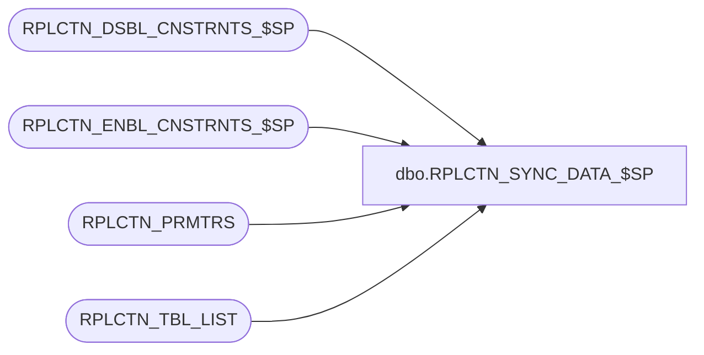

# dbo.RPLCTN_SYNC_DATA_$SP

**Database:** auditworks_external  
**Server:** bedrockdb01  

## Architecture Diagram



## Table Dependencies

| Referenced Table |
|---|
| RPLCTN_DSBL_CNSTRNTS_$SP |
| RPLCTN_ENBL_CNSTRNTS_$SP |
| RPLCTN_PRMTRS |
| RPLCTN_TBL_LIST |

## Stored Procedure Code

```sql
CREATE proc [dbo].[RPLCTN_SYNC_DATA_$SP]
(
  @application_name varchar(100)
)
AS

/*
  Procedure : RPLCTN_SYNC_DATA_$SP
  Purpose   : Syncs the CRDM data prior to switching on replication
  
            **** NOTE **** This should only be run in the subscriber databases

HISTORY:
Date     Name         Def# Desc
Jul14,14 Ian k             Initial Creation

*/

BEGIN

    DECLARE @table_name  varchar(100);
    DECLARE @table_id    numeric;
    DECLARE @column_name varchar(2000);
    DECLARE @sql         nvarchar(2000);
    DECLARE @ident_on    nvarchar(1000);
    DECLARE @ident_off   nvarchar(1000);
    DECLARE @sql2        nvarchar(2000);      
    DECLARE @server      varchar(100);
    DECLARE @database    varchar(100);
    DECLARE @is_ident    numeric;
    DECLARE @ident_flag  numeric;
    DECLARE @error_msg   varchar(1000);
        
    /* Read RPLCTN parameters */
    
    SELECT @server = APLCTN_SRVR_NAME,
           @database = APLCTN_DB_NAME  
      FROM RPLCTN_PRMTRS
     WHERE APLCTN_NAME = @application_name;

  	DECLARE copy_data CURSOR FAST_FORWARD FOR
      SELECT a.TBL_NAME
        FROM RPLCTN_TBL_LIST a
       WHERE APLCTN_NAME = @application_name;
       
    /* First disable the constraints on the subscriber */
    
    BEGIN TRY
    
       EXEC RPLCTN_DSBL_CNSTRNTS_$SP;
   
    END TRY
    BEGIN CATCH   
      SELECT @error_msg = 'Unable to disable constraints - ' + ERROR_MESSAGE();
      GOTO error_handler;      
    END CATCH
    
    BEGIN TRY
     
      CREATE TABLE #column_list (
                                  column_name varchar(100)
                                );
    END TRY
    BEGIN CATCH    
      SELECT @error_msg = 'Failed to create temp table #column_list - ' + ERROR_MESSAGE();        
      GOTO error_handler;            
    END CATCH
    
    /* Next copy data from each table in the replication list */
    BEGIN TRY
    
      OPEN copy_data;
      
    END TRY
    BEGIN CATCH
      SELECT @error_msg = 'Failed to open replication table list cursor - ' + ERROR_MESSAGE();
      GOTO error_handler;
    END CATCH

    BEGIN TRY
        
	  FETCH NEXT FROM copy_data
	   INTO @table_name;
    
    END TRY
    BEGIN CATCH
      SELECT @error_msg = 'Failed to fetch table name from table list cursor - ' + ERROR_MESSAGE();
      GOTO error_handler;
    END CATCH
                            
	WHILE @@FETCH_STATUS = 0
	BEGIN

        /* 
           Go to the master and get a list of columns in the current table. This needs to be done to
           ensure that only columns that exist in the master have their data copied. This prevents
           errors in case the subscriber has a newer version of CRDM.
           
        */
         
        BEGIN TRY
        
          TRUNCATE TABLE #column_list;

        END TRY
        BEGIN CATCH
          SELECT @error_msg = 'Failed to truncate temporary table #column_list - ' + ERROR_MESSAGE();
          GOTO error_handler;
        END CATCH    
        
	    SELECT @sql = 'INSERT INTO #column_list 
	                   SELECT b.name
                         FROM ' + @server + '.' + @database + '.sys.columns b, ' +
                                  @server + '.' + @database + '.sys.tables c
                        WHERE b.object_id = c.object_id 
                          AND c.name      = ' + '''' + @table_name + '''' + ' 
                        ORDER BY column_id';

        BEGIN TRY            
        
          EXEC sp_executesql @sql;
        
        END TRY
        BEGIN CATCH
          SELECT @error_msg = 'Failed to execute dynamic SQL to populate #column_list - ' + ERROR_MESSAGE();
          GOTO error_handler;
        END CATCH
    	
    	/* If the table has identity columns then allow insert for identity before copying */
    	
        SELECT @ident_flag = 0;
        
        SELECT @sql = N'SELECT @ident_flagOUT = 1 FROM ' + @server + '.' + @database + '.sys.columns a, ' +
                                                                    @server + '.' + @database + '.sys.tables  b  ' +
                                                         ' WHERE a.object_id = b.object_id ' +
                                                         '   AND b.name = ' + '''' + @table_name + '''' +
                                                         '   AND is_identity = 1';

        EXEC sp_executesql @sql,N'@ident_flagOUT numeric(10) OUTPUT', @ident_flagOUT=@ident_flag OUTPUT;
        	 
	    SELECT @sql = 'DELETE FROM ' + @table_name;
	    
	    EXEC sp_executesql @sql;
    
	    /* Build INSERT statement for table */
	    
	    SELECT @sql = 'INSERT INTO ' + @table_name;

  	    DECLARE c_column_list CURSOR FAST_FORWARD FOR
         SELECT column_name
           FROM #column_list;  

        /* Add columns - Needs to be done so INSERT_IDENTITY can be switched on */
                	    
        SELECT @sql2 = '';
                        	    
	    OPEN c_column_list;

        FETCH NEXT FROM c_column_list
         INTO @column_name

        WHILE @@FETCH_STATUS = 0
        BEGIN
            
          SELECT @sql2 = @sql2 + @column_name;

          FETCH NEXT FROM c_column_list
           INTO @column_name;

          IF @@FETCH_STATUS = 0
          BEGIN
            SELECT @sql2 = @sql2 + ', ';         
          END;            

	    END; 

        SELECT @sql = @sql + '(' + @sql2 + ')';	    

        CLOSE c_column_list;
        DEALLOCATE c_column_list;
	    SELECT @sql = @sql +  ' SELECT '
	    
	    IF @ident_flag = 1
	      SELECT @sql = @sql + @sql2; 
	    ELSE
	      SELECT @sql = @sql +  '*';
	      
	    SELECT @sql = @sql +  ' FROM ' + @server + '.' +
	                                     @database + '.' +
	                                     'dbo' + '.' +
	                                     @table_name + ';';

        SELECT @ident_off = '', @ident_on = '';
        
        /* Set Identity Insert to on so identity columns can be synced if needed*/
        
        IF @ident_flag = 1
        BEGIN
        
          SELECT @ident_on = 'SET IDENTITY_INSERT ' + @table_name + ' ON;';
	      
	    END;
        	    	    	   
	    /* Set Identity Insert back to off */
        
        IF @ident_flag = 1
        BEGIN
                  
          SELECT @ident_off = 'SET IDENTITY_INSERT ' + @table_name + ' OFF;';
	      
	    END;
	    
	    SELECT @sql = @ident_on + @sql + @ident_off;
	    
	    EXEC sp_executesql @sql;
	    
	    BEGIN TRY
	    
	      FETCH NEXT FROM copy_data
	       INTO @table_name;
	       
        END TRY
        BEGIN CATCH
          SELECT @error_msg = 'Failed to fetch table name from table list cursor - ' + ERROR_MESSAGE();
          GOTO error_handler;
        END CATCH
    	     
	END;
	
	CLOSE copy_data;
	DEALLOCATE copy_data;

    /* Finally re-enable the constraints on the subscriber */
    
    EXEC RPLCTN_ENBL_CNSTRNTS_$SP;
    	
	RETURN 1;
	
error_handler:

    RAISERROR (@error_msg, 16, 1); /* System Errors will be reported with SQL error code = 50000 */

END
```

