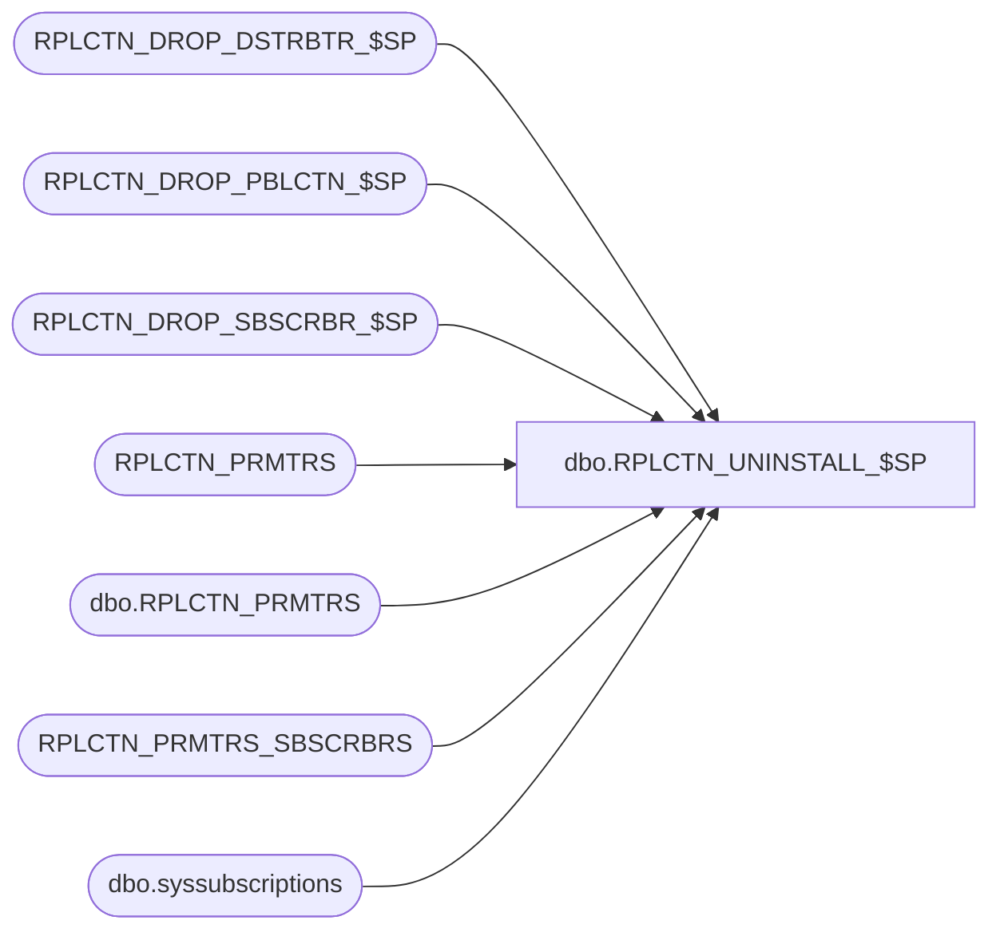

# dbo.RPLCTN_UNINSTALL_$SP

**Database:** auditworks_external  
**Server:** bedrockdb01  

## Architecture Diagram



## Table Dependencies

| Referenced Table |
|---|
| RPLCTN_DROP_DSTRBTR_$SP |
| RPLCTN_DROP_PBLCTN_$SP |
| RPLCTN_DROP_SBSCRBR_$SP |
| RPLCTN_PRMTRS |
| dbo.RPLCTN_PRMTRS |
| RPLCTN_PRMTRS_SBSCRBRS |
| dbo.syssubscriptions |

## Stored Procedure Code

```sql
CREATE proc [dbo].[RPLCTN_UNINSTALL_$SP]
(
  @application_name varchar(100)
)
AS

/*
  Procedure : RPLCTN_UNINSTALL_$SP
  Purpose   : This procedure will remove replication from the current server
              
  

  HISTORY:
  
  Date     Name         Def# Desc

  Jan05,15 Ian K       98263 Remove need for collation on joins for CRM databases.
  Dec04,14 Ian K       95105 Add ability to remove only single application when multiple replication
                             exists on the same server. 
  Jul14,14 Ian k             Initial Creation

*/

DECLARE

  @subscriber_srvr_name varchar(100),
  @subscriber_db_name   varchar(100),
  @error_msg            varchar(1000),
  @exists               int,
  @cursor_open          int,
  @database_name        varchar(100),
  @database_published   int,
  @application_db_name  varchar(100)
  
BEGIN

  /* Check to see if application is published before attempting to remove */
  
  PRINT '';
  PRINT 'Initializing replication removal for application ' + @application_name
  PRINT '';
  PRINT 'Checking Published State .........';
  PRINT '';

  SELECT @application_db_name = APLCTN_DB_NAME
    FROM RPLCTN_PRMTRS
   WHERE APLCTN_NAME = @application_name;
   
  SELECT @database_published = is_published
    FROM sys.databases sd,
         dbo.RPLCTN_PRMTRS rp
   WHERE rp.APLCTN_NAME = @application_name
     AND sd.name        = @application_db_name;
   
  IF @database_published <> 1
  BEGIN
  
    PRINT 'This application is not currently replicated .... Exiting.';
    
    RETURN;
    
  END

  DECLARE drop_subscribers CURSOR FAST_FORWARD FOR
   SELECT SBSCRBR_DB_SRVR_NAME, SBSCRBR_DB_NAME
     FROM RPLCTN_PRMTRS_SBSCRBRS
    WHERE APLCTN_NAME = @application_name;
    
  SELECT @database_name = db_name();    

  /* Get list of Subscribers */

  BEGIN TRY
       
    OPEN drop_subscribers;
  
  END TRY
  BEGIN CATCH
    SELECT @error_msg = 'Failed to open subscriber cursor - ' + ERROR_MESSAGE();
    GOTO error_handler;
  END CATCH

  SELECT @cursor_open = 1;
 
  BEGIN TRY
        
    FETCH NEXT FROM drop_subscribers
     INTO @subscriber_srvr_name,
          @subscriber_db_name;
    
  END TRY
  BEGIN CATCH
    SELECT @error_msg = 'Failed to fetch next subscriber record - ' + ERROR_MESSAGE();
    GOTO error_handler;
  END CATCH

  PRINT 'Removing all subscribers to application ' + @application_name + ' ......... ';
  PRINT '';
            
  WHILE @@FETCH_STATUS = 0
  BEGIN
  
     IF EXISTS (SELECT 1 from INFORMATION_SCHEMA.TABLES
                 WHERE table_name = 'syssubscriptions')
     BEGIN
                 
                    
       SELECT TOP 1 @exists = 1 
         FROM dbo.syssubscriptions
        WHERE srvname = @subscriber_srvr_name;
      
       IF  @exists = 1  
       BEGIN
      
         PRINT '   Dropping Subscriber ' + @subscriber_srvr_name;          

         BEGIN TRY  
     
           /* Drop each subscription */
      
           EXEC RPLCTN_DROP_SBSCRBR_$SP   @application_name,
                                          @subscriber_srvr_name,
                                          @subscriber_db_name;
 
         END TRY
         BEGIN CATCH
           SELECT @error_msg = 'Failed to drop subscriber from publication - ' + ERROR_MESSAGE();
           GOTO error_handler;
         END CATCH
    
       END
    END   
    BEGIN TRY
        
       FETCH NEXT FROM drop_subscribers
        INTO @subscriber_srvr_name,
             @subscriber_db_name;
    
    END TRY
    BEGIN CATCH
       SELECT @error_msg = 'Failed to fetch next subscriber record - ' + ERROR_MESSAGE();
       GOTO error_handler;
    END CATCH
   
  END
 
  CLOSE drop_subscribers;
  DEALLOCATE drop_subscribers;

  SELECT @cursor_open = 0;
  
  PRINT '';
   
  /* Drop Publication */

  BEGIN TRY  
  
    EXEC RPLCTN_DROP_PBLCTN_$SP @application_name;

  END TRY
  BEGIN CATCH
    SELECT @error_msg = 'Failed to call drop publication proc - ' + ERROR_MESSAGE();
    GOTO error_handler;
  END CATCH

  /* Drop Distribution */

  BEGIN TRY  
  
    EXEC RPLCTN_DROP_DSTRBTR_$SP @application_name;

  END TRY
  BEGIN CATCH
    SELECT @error_msg = 'Failed to call drop publication proc - ' + ERROR_MESSAGE();
    GOTO error_handler;
  END CATCH
  
  PRINT 'Successfully removed application ' + @application_name + ' from replication !! ';
  PRINT '' 
       
  RETURN;
   	
error_handler:

     IF @@TRANCOUNT > 0 
      ROLLBACK;
      
    IF @cursor_open = 1
    BEGIN
      CLOSE drop_subscribers;
      DEALLOCATE drop_subscribers;    
    END

    RAISERROR (@error_msg, 16, 1); /* System Errors will be reported with SQL error code = 50000 */

END
```

