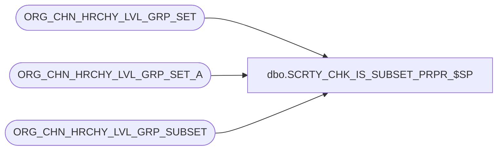

# dbo.SCRTY_CHK_IS_SUBSET_PRPR_$SP

**Database:** auditworks_external  
**Server:** bedrockdb01  

## Architecture Diagram



## Table Dependencies

| Referenced Table |
|---|
| ORG_CHN_HRCHY_LVL_GRP_SET |
| ORG_CHN_HRCHY_LVL_GRP_SET_A |
| ORG_CHN_HRCHY_LVL_GRP_SUBSET |

## Stored Procedure Code

```sql
CREATE PROC dbo.SCRTY_CHK_IS_SUBSET_PRPR_$SP
/**********************************************************************************************
				Is set 2 a proper subset (partial ONLY) of set 1?

Return Value:	1 (True) -	if 2nd parameter represents a subset (but NOT equal set)
							of set passed in 1st parameter;
				0 (False) -	otherwise.

Created By:		ABida
Create Date:	2010 1018

Remarks:		Result would be not necessarily 'True' for 1st parameter = -1 (Global set).
				Result will be always 'False' for 2nd parameter = -1.

***********************************************************************************************
UPDATES:
2011 0110 JHardin	RETURN the result as well as SELECTing it
2012 0613 JHardin	CRDM merge final renaming, cleanup
***********************************************************************************************/
	@OCG_SET_ID		int,
	@OCG_SUBSET_ID	int
AS
BEGIN
	DECLARE
		@countDivAll	int,
		@countDivSet	int
	;

	SET NOCOUNT ON;

	-- Sanity check and trivial cases first
	IF @OCG_SET_ID IS NULL
		OR @OCG_SUBSET_ID IS NULL
		OR @OCG_SUBSET_ID = -1
		OR @OCG_SUBSET_ID = @OCG_SET_ID		-- Trivial, don't hit database for this one
		OR NOT EXISTS(SELECT 1 FROM ORG_CHN_HRCHY_LVL_GRP_SET WHERE HRCHY_LVL_GRP_SET_ID = @OCG_SET_ID)
		OR NOT EXISTS(SELECT 1 FROM ORG_CHN_HRCHY_LVL_GRP_SET WHERE HRCHY_LVL_GRP_SET_ID = @OCG_SUBSET_ID)
	BEGIN
		SELECT 0;
		RETURN 0;
	END;

	IF @OCG_SET_ID = -1
	BEGIN
		-- 1st set is Global -
		-- 2nd set is not same as first set -
		-- are there any not in 2nd set?
		-- (i.e. is the second set any set other than the "real" all-groups set?)
		SELECT @countDivAll = COUNT(*) FROM ORG_CHN_HRCHY_LVL_GRP_SET_A
		WHERE HRCHY_LVL_GRP_SET_ID = -1;

		SELECT @countDivSet = COUNT(*) FROM ORG_CHN_HRCHY_LVL_GRP_SET_A
		WHERE HRCHY_LVL_GRP_SET_ID = @OCG_SUBSET_ID;

		IF @countDivSet < @countDivAll
		BEGIN
			SELECT 1;
			RETURN 1;
		END;
	END
	ELSE
	BEGIN
		-- 1st set is not Global -
		-- 2nd set is not same as first set -
		-- is 2nd set a subset of 1st set?
		IF EXISTS(
			SELECT 1
			FROM ORG_CHN_HRCHY_LVL_GRP_SUBSET
			WHERE HRCHY_LVL_GRP_SET_ID = @OCG_SET_ID
			AND HRCHY_LVL_GRP_SUBSET_ID = @OCG_SUBSET_ID
		)
		BEGIN
			SELECT 1;
			RETURN 1;
		END;
	END;

	SELECT 0;
	RETURN 0;

END;
```

