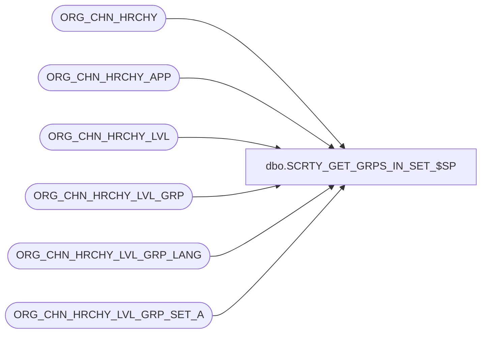

# dbo.SCRTY_GET_GRPS_IN_SET_$SP

**Database:** auditworks_external  
**Server:** bedrockdb01  

## Architecture Diagram



## Table Dependencies

| Referenced Table |
|---|
| ORG_CHN_HRCHY |
| ORG_CHN_HRCHY_APP |
| ORG_CHN_HRCHY_LVL |
| ORG_CHN_HRCHY_LVL_GRP |
| ORG_CHN_HRCHY_LVL_GRP_LANG |
| ORG_CHN_HRCHY_LVL_GRP_SET_A |

## Stored Procedure Code

```sql
CREATE PROC dbo.SCRTY_GET_GRPS_IN_SET_$SP
/**********************************************************************
	Procedure		: SCRTY_GET_GRPS_IN_SET_$SP
	CRM Version		: 7.0
	Date			: 2009-04-27
	Author			: ABida
	Called from		:
	Calls			:
	Description		: Returns the list of divisions (ORG_CHN groups) in the division set (ORG_CHN Group set).
					: as a result set
					: Returns -1 and no result set on any error
***********************************************************************
UPDATES:
2010-02-08 JHardin	CRDM Merge query changes - code is NOT specific to CRM app!
2012-05-07 WWilkie	Updated to use config from ORG_CHN_HRCHY_APP table.
2012 0613 JHardin	CRDM merge final renaming, cosmetic cleanup

************************************************************************/
	@OCG_SET_ID 	int,
	@appID			smallint,
	@languageId 	smallint = -1
AS

BEGIN
	SET NOCOUNT ON;

	-- Confirm divisional security has been configured properly for
	-- this APP ID and that at least one Division has been defined.
	IF NOT EXISTS(
		SELECT 1
		FROM
			ORG_CHN_HRCHY_APP a
			INNER JOIN ORG_CHN_HRCHY_LVL l ON
				l.HRCHY_LVL_ID = a.DVSN_HRCHY_LVL_ID
			INNER JOIN ORG_CHN_HRCHY_LVL_GRP g ON
				g.HRCHY_LVL_ID = l.HRCHY_LVL_ID
			INNER JOIN ORG_CHN_HRCHY h ON
				h.HRCHY_ID = l.HRCHY_ID
		WHERE
			a.APP_ID = @appID
		AND
			a.DVSN_HRCHY_LVL_ID IS NOT NULL
		AND
			h.MTLY_EXCLSV <> 0
		AND
			h.MNDTRY_ASGNMNT <> 0
	)
	BEGIN
		RETURN -1;
	END;

	-- Return Divisions associated with the Division Set
	SELECT
		d.HRCHY_LVL_GRP_IDNTY,
		d.HRCHY_LVL_GRP_CODE,
		COALESCE(t.HRCHY_LVL_GRP_DESC, d.HRCHY_LVL_GRP_DESC) AS HRCHY_LVL_GRP_DESC,
		d.HRCHY_LVL_GRP_ID
	FROM
		ORG_CHN_HRCHY_LVL_GRP_SET_A ds
		INNER JOIN ORG_CHN_HRCHY_LVL_GRP d ON
			d.HRCHY_LVL_GRP_IDNTY = ds.HRCHY_LVL_GRP_IDNTY
		INNER JOIN ORG_CHN_HRCHY_APP a ON
			a.DVSN_HRCHY_LVL_ID = d.HRCHY_LVL_ID
		LEFT OUTER JOIN ORG_CHN_HRCHY_LVL_GRP_LANG t ON
			t.HRCHY_LVL_GRP_ID = d.HRCHY_LVL_GRP_ID
			AND
			t.LANG_ID = @languageId
	WHERE
		ds.HRCHY_LVL_GRP_SET_ID = @OCG_SET_ID
	AND
		a.APP_ID = @appID
	;

	IF (@@ROWCOUNT = 0)
	BEGIN
		RETURN -1;
	END;

	RETURN 0;

END;
```

