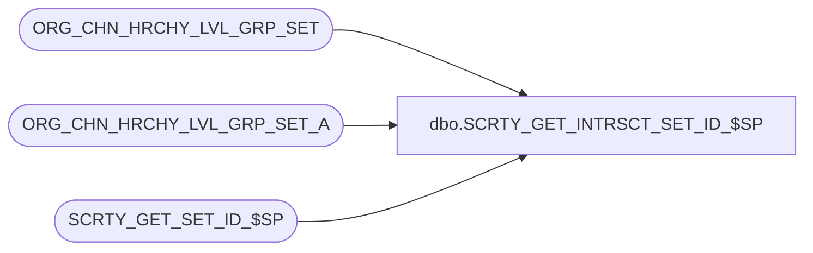

# dbo.SCRTY_GET_INTRSCT_SET_ID_$SP

**Database:** auditworks_external  
**Server:** bedrockdb01  

## Architecture Diagram



## Table Dependencies

| Referenced Table |
|---|
| ORG_CHN_HRCHY_LVL_GRP_SET |
| ORG_CHN_HRCHY_LVL_GRP_SET_A |
| SCRTY_GET_SET_ID_$SP |

## Stored Procedure Code

```sql
CREATE PROC dbo.SCRTY_GET_INTRSCT_SET_ID_$SP
/**********************************************************************************************
				Returns a intersection of two sets
Return Value:	set_id of intersection
				Returns 0 if none found

Created By:		ABida

Returned value represents an exact and unique intersection of two given sets

***********************************************************************************************
UPDATES:
2012 0613 JHardin	CRDM merge final renaming, cleanup

***********************************************************************************************/
(
	@OCG_SET_ID_1	int,
	@OCG_SET_ID_2 	int,
	@appID			smallint
)
AS
BEGIN

DECLARE
	@intersectId		int,
	@tempComma			varchar(1),
	@tempDivision		varchar(10),
	@tempDivisionId		smallint,
	@tempDivisionList	varchar(max)
;

SET NOCOUNT ON;

-- sanity check the values
IF @OCG_SET_ID_1 IS NULL
	OR
	@OCG_SET_ID_2 IS NULL
	OR
	NOT EXISTS (
		SELECT 1 FROM ORG_CHN_HRCHY_LVL_GRP_SET WHERE HRCHY_LVL_GRP_SET_ID = @OCG_SET_ID_1
	)
	OR
	NOT EXISTS (
		SELECT 1 FROM ORG_CHN_HRCHY_LVL_GRP_SET WHERE HRCHY_LVL_GRP_SET_ID = @OCG_SET_ID_2
	)
BEGIN
	RETURN 0;
END
-- global division set always contains another one
ELSE IF @OCG_SET_ID_1 = -1
BEGIN
	RETURN @OCG_SET_ID_2;
END
ELSE IF @OCG_SET_ID_2 = -1
BEGIN
	RETURN @OCG_SET_ID_1;
END;

SET @tempDivisionList = '';
SET @tempComma = '';

DECLARE ds_cur CURSOR FAST_FORWARD FOR
	SELECT DISTINCT
		HRCHY_LVL_GRP_IDNTY
	FROM
		ORG_CHN_HRCHY_LVL_GRP_SET_A
	WHERE
		HRCHY_LVL_GRP_SET_ID = @OCG_SET_ID_1
	ORDER BY
		HRCHY_LVL_GRP_IDNTY
	;

OPEN ds_cur;

FETCH NEXT FROM ds_cur
INTO @tempDivisionId;

WHILE @@FETCH_STATUS = 0
BEGIN

	IF EXISTS(
		SELECT 1
		FROM ORG_CHN_HRCHY_LVL_GRP_SET_A
		WHERE
			HRCHY_LVL_GRP_SET_ID = @OCG_SET_ID_2
		AND
			HRCHY_LVL_GRP_IDNTY = @tempDivisionId
	)
	BEGIN
		SET @tempDivisionList = LTRIM(@tempDivisionList + @tempComma) + CAST(@tempDivisionId AS varchar(10));
		SET @tempComma = ',';
	END;

	FETCH NEXT FROM ds_cur
	INTO @tempDivisionId;

END;

CLOSE ds_cur;
DEALLOCATE ds_cur;

-- empty intersection
IF LTRIM(@tempDivisionList) = ''
BEGIN
	RETURN 0;
END;

EXEC @intersectId = SCRTY_GET_SET_ID_$SP @tempDivisionList, NULL, -1, @appID;

RETURN @intersectId;

END;
```

