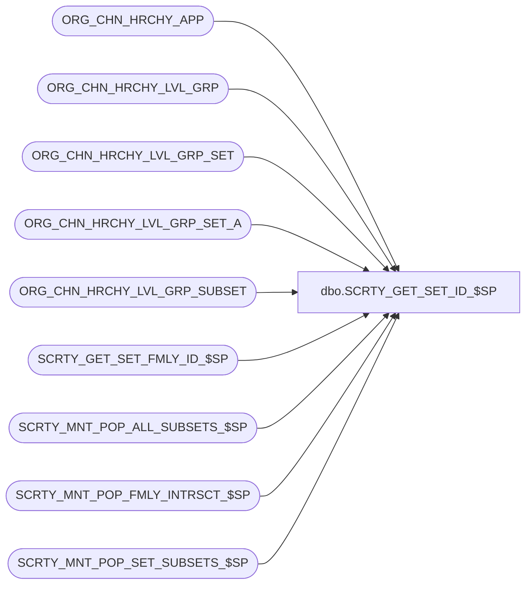

# dbo.SCRTY_GET_SET_ID_$SP

**Database:** auditworks_external  
**Server:** bedrockdb01  

## Architecture Diagram



## Table Dependencies

| Referenced Table |
|---|
| ORG_CHN_HRCHY_APP |
| ORG_CHN_HRCHY_LVL_GRP |
| ORG_CHN_HRCHY_LVL_GRP_SET |
| ORG_CHN_HRCHY_LVL_GRP_SET_A |
| ORG_CHN_HRCHY_LVL_GRP_SUBSET |
| SCRTY_GET_SET_FMLY_ID_$SP |
| SCRTY_MNT_POP_ALL_SUBSETS_$SP |
| SCRTY_MNT_POP_FMLY_INTRSCT_$SP |
| SCRTY_MNT_POP_SET_SUBSETS_$SP |

## Stored Procedure Code

```sql
CREATE PROC dbo.SCRTY_GET_SET_ID_$SP
/**********************************************************************************************
				Gets the set ID for the given list of ORG_CHN group IDNTYs
Return Value:	HRCHY_LVL_GRP_SET_ID (a.k.a. division set ID)

Created By:		MSharma

Parameters:		@OCG_IDNTY_List: Comma-delimited list of HRCHY_LVL_GRP_IDNTY values
				If provided in non-duplicated, ascending order with no spaces, performance on lookup
				of existing sets is better.
				@user_OCG_SET_ID: User's security set ID, to control user access

UPDATES:
2009-03-30 WWilkie	Misc cleanup.
2009-11-18 JHardin	Misc cleanup, add population and maintenance of division_subset
2010-02-08 JHardin	CRDM Merge query changes and major restructuring - code is NOT specific to CRM app!
2010-11-17 JHardin	Performance improvements
2011-03-10 JHardin	Performance improvements
2011-07-29 JHardin	Maintain membership of division_set_id = -1 (self-healing)
2011-09-01 WWilkie	Added correct validation against ORG_CHN_HRCHY_APP table for division
					configuration.  Left APP_ID = 200 (CRM) hard-coded at this time.
2012 0320 JHardin	Maintain division_set_id = 0 (self-healing)
2012 0424 JHardin	Restore user divsec restriction to optimized query path
2012 0613 JHardin	CRDM merge final renaming, cleanup
					Expose @appID parameter
2014 1022 JHardin	89236: Don't exclude inactive divisions
***********************************************************************************************/
(
	@OCG_IDNTY_List		varchar(max),
	@is_new_set			bit OUTPUT,			-- indicates whether set is newly created or not.
	@user_OCG_SET_ID	integer = -1,		-- security restriction on viewing and creating sets
	@appID				smallint
)
AS
BEGIN
	DECLARE @erc					integer;
	DECLARE @division_set_id		integer;
	DECLARE @tempdivisionid			smallint;
	DECLARE @divisionCount			smallint;
	DECLARE @max_div_set_id			integer;
	DECLARE @is_complete			bit;
	DECLARE @prefix_size			smallint;
	DECLARE @TempDivision			TABLE (temp_division_id smallint PRIMARY KEY);
	DECLARE @division				smallint;
	DECLARE @offset					smallint;
	DECLARE @scratchDivisionSet		integer;
	DECLARE @scratchDivision		varchar(10);
	DECLARE @scratchDivisionList	varchar(max);
	DECLARE @scratchChar			char(1);
	DECLARE @comma					char(1);
	DECLARE @DVSN_HRCHY_LVL_ID		uniqueidentifier;

	SET NOCOUNT ON;
	SET CONCAT_NULL_YIELDS_NULL ON;

	SET @division_set_id = NULL;
	SET @is_new_set = 0;

	IF @OCG_IDNTY_List IS NULL
	BEGIN
		-- GIGO
		RETURN 0;
	END;

	SELECT @DVSN_HRCHY_LVL_ID = DVSN_HRCHY_LVL_ID
	FROM ORG_CHN_HRCHY_APP
	WHERE APP_ID = @appID
	;

	IF @@ROWCOUNT < 1 OR @DVSN_HRCHY_LVL_ID IS NULL
	BEGIN
		-- Configuration incomplete, or parameter error
		RETURN 0;
	END;

	-- Cache this for subset maintenance
	SELECT
		@max_div_set_id = MAX(HRCHY_LVL_GRP_SET_ID)
	FROM
		ORG_CHN_HRCHY_LVL_GRP_SET
	;

	-- Look up HRCHY_LVL_GRP_SET_ID (division set ID) by list of divisions string
	-- Optimization: assume the caller isn't giving us garbage parameters
	SELECT
		@division_set_id = HRCHY_LVL_GRP_SET_ID,
		@divisionCount = MBR_COUNT
	FROM
		ORG_CHN_HRCHY_LVL_GRP_SET
	WHERE
		GRP_LIST_PREFIX = @OCG_IDNTY_List
	AND
		IS_GRP_LIST_PREFIX_CMPLT <> 0	-- Complete prefixes only!!
	;

	IF @division_set_id IS NOT NULL
	BEGIN
		-- Found it, return it.
		-- If the matching set's subsets are out-of-date, update them.
		IF EXISTS(SELECT 1 FROM ORG_CHN_HRCHY_LVL_GRP_SET WHERE HRCHY_LVL_GRP_SET_ID = @division_set_id AND LARGEST_GRP_SET_ID < @max_div_set_id)
		BEGIN
			EXEC SCRTY_MNT_POP_SET_SUBSETS_$SP @division_set_id;
		END;

		-- Maintain the -1 set (all divisions) if needed (paranoia)
		IF @divisionCount = 1		-- single-division set requested
		BEGIN
			-- Does it contain the division asked for?
			IF NOT EXISTS(
				SELECT 1
				FROM ORG_CHN_HRCHY_LVL_GRP_SET_A
				WHERE HRCHY_LVL_GRP_SET_ID = -1
				AND HRCHY_LVL_GRP_IDNTY = CAST(@OCG_IDNTY_List AS integer) -- known to be safe if we got here
			)
			BEGIN
				-- -1 division set is stale, fix
				INSERT INTO
					ORG_CHN_HRCHY_LVL_GRP_SET_A(
						HRCHY_LVL_GRP_SET_ID,
						HRCHY_LVL_GRP_IDNTY
					)
				SELECT
					-1,
					HRCHY_LVL_GRP_IDNTY
				FROM
					ORG_CHN_HRCHY_LVL_GRP ochlg
				WHERE
					HRCHY_LVL_ID = @DVSN_HRCHY_LVL_ID
				AND
					NOT EXISTS(
						SELECT 1
						FROM ORG_CHN_HRCHY_LVL_GRP_SET_A ochlgsa
						WHERE HRCHY_LVL_GRP_SET_ID = -1
						AND ochlgsa.HRCHY_LVL_GRP_IDNTY = ochlg.HRCHY_LVL_GRP_IDNTY
					)
				;
			END;
		END
		ELSE
		BEGIN
			-- Does it exist at all?
			IF NOT EXISTS(
				SELECT 1
				FROM ORG_CHN_HRCHY_LVL_GRP_SET_A
				WHERE HRCHY_LVL_GRP_SET_ID = -1
			)
			BEGIN
				-- -1 division set is missing, fix
				INSERT INTO
					ORG_CHN_HRCHY_LVL_GRP_SET_A(
						HRCHY_LVL_GRP_SET_ID,
						HRCHY_LVL_GRP_IDNTY
					)
				SELECT
					-1,
					HRCHY_LVL_GRP_IDNTY
				FROM
					ORG_CHN_HRCHY_LVL_GRP ochlg
				WHERE
					HRCHY_LVL_ID = @DVSN_HRCHY_LVL_ID
				AND
					NOT EXISTS(
						SELECT 1
						FROM ORG_CHN_HRCHY_LVL_GRP_SET_A ochlgsa
						WHERE HRCHY_LVL_GRP_SET_ID = -1
						AND ochlgsa.HRCHY_LVL_GRP_IDNTY = ochlg.HRCHY_LVL_GRP_IDNTY
					)
				;
			END;
		END;

		-- Maintain the 0 set (no divisions) if needed (paranoia)
		IF NOT EXISTS(
			SELECT 1
			FROM ORG_CHN_HRCHY_LVL_GRP_SET
			WHERE HRCHY_LVL_GRP_SET_ID = 0
		)
		BEGIN
			-- 0 division set is missing, fix
			SET IDENTITY_INSERT ORG_CHN_HRCHY_LVL_GRP_SET ON;

			INSERT INTO
				ORG_CHN_HRCHY_LVL_GRP_SET(
					HRCHY_LVL_GRP_SET_ID,
					GRP_LIST_PREFIX,
					IS_GRP_LIST_PREFIX_CMPLT,
					MBR_COUNT,
					LARGEST_GRP_SET_ID
				)
			VALUES (
				0,
				'*NONE*',
				-1,
				0,
				999999999
			);

			SET IDENTITY_INSERT ORG_CHN_HRCHY_LVL_GRP_SET OFF;
		END;
		-- ensure 0 set has no members or subsets, and is not a subset
		DELETE FROM
			ORG_CHN_HRCHY_LVL_GRP_SET_A
		WHERE
			HRCHY_LVL_GRP_SET_ID = 0
		;
		DELETE FROM
			ORG_CHN_HRCHY_LVL_GRP_SUBSET
		WHERE
			HRCHY_LVL_GRP_SET_ID = 0
		;
		DELETE FROM
			ORG_CHN_HRCHY_LVL_GRP_SUBSET
		WHERE
			HRCHY_LVL_GRP_SUBSET_ID = 0
		;

		-- Enforce security
		-- If user cannot see any division in the set, they cannot retrieve or create it
		IF @user_OCG_SET_ID > 0
		BEGIN
			IF NOT EXISTS(
				SELECT 1
				FROM ORG_CHN_HRCHY_LVL_GRP_SET_A dsd
				INNER JOIN ORG_CHN_HRCHY_LVL_GRP_SET_A dsd2 ON
					dsd2.HRCHY_LVL_GRP_SET_ID = @user_OCG_SET_ID
					AND
					dsd2.HRCHY_LVL_GRP_IDNTY = dsd.HRCHY_LVL_GRP_IDNTY
				WHERE dsd.HRCHY_LVL_GRP_SET_ID = @division_set_id
			)
			BEGIN
				-- User cannot see any member division, cannot manipulate the set
				RETURN 0;
			END;
		END;

		RETURN @division_set_id;
	END;

	-- Nope, this is a new set, or the caller gave us dirty parameters
	-- Clean up the parameters, try again
	SET @division_set_id = NULL;

	IF @OCG_IDNTY_List LIKE '%-%'
	BEGIN
		-- No negative OCG IDs (we devoutly hope)
		RETURN 0;
	END;

	-- Don't hardcode the prefix string column size
	-- (The size of dbo.ORG_CHN_HRCHY_LVL_GRP_SET.GRP_LIST_PREFIX can
	--  be changed at implementation, but DON'T change it afterwards
	--  if any rows have IS_GRP_LIST_PREFIX_CMPLT = 0 or if changing
	--  it would truncate any GRP_LIST_PREFIX value!)
	SET @prefix_size = COL_LENGTH('dbo.ORG_CHN_HRCHY_LVL_GRP_SET','GRP_LIST_PREFIX');

	-- Make sure the input is clean - only digits and commas
	SET @scratchDivisionList = '';
	SET @offset = 1;
	WHILE @offset <= LEN(@OCG_IDNTY_List)
	BEGIN
		SET @scratchChar = SUBSTRING(@OCG_IDNTY_List, @offset, 1);
		IF @scratchChar BETWEEN '0' AND '9' OR @scratchChar = ','
		BEGIN
			SET @scratchDivisionList = @scratchDivisionList + @scratchChar;
		END;
		SET @offset = @offset + 1;
	END;
	SET @OCG_IDNTY_List = @scratchDivisionList;

	IF LEN(@OCG_IDNTY_List) < 1
	BEGIN
		-- GIGO
		RETURN 0;
	END;

	-- Parse the comma-delimited list and clean it up
	-- Division IDs don't have leading zeros,
	-- list is sorted in ascending order,
	-- no duplicates,
	-- division_id must exist
	-- Side effect: This table will be used to
	-- choose from multiple IS_GRP_LIST_PREFIX_CMPLT = 0 candidate sets
	-- and to build the new set if needed
	SET @divisionCount = 0;
	WHILE (CHARINDEX(',', @OCG_IDNTY_List, 1) > 0)
	BEGIN
		SET @division = CAST(SUBSTRING(@OCG_IDNTY_List, 1 , CHARINDEX(',', @OCG_IDNTY_List, 1) - 1) AS smallint);
		SET @OCG_IDNTY_List = SUBSTRING(@OCG_IDNTY_List, CHARINDEX(',', @OCG_IDNTY_List, 1) + 1, LEN(@OCG_IDNTY_List));
		IF @division > 0	-- ignore blanks
		BEGIN
			IF NOT EXISTS(
				SELECT 1
				FROM ORG_CHN_HRCHY_LVL_GRP
				WHERE HRCHY_LVL_GRP_IDNTY = @division
				AND HRCHY_LVL_ID = @DVSN_HRCHY_LVL_ID
			)
			BEGIN
				-- GIGO
				RETURN 0;
			END;
			IF NOT EXISTS(SELECT 1 FROM @TempDivision WHERE temp_division_id = @division)
			BEGIN
				INSERT INTO @TempDivision VALUES(@division);
			END;
			SET @divisionCount = @divisionCount + 1;
		END;
	END;
	-- Insert the last/only division
	SET @division = CAST(@OCG_IDNTY_List AS smallint);
	IF @division > 0	-- ignore blanks
	BEGIN
		IF NOT EXISTS(
			SELECT 1
			FROM ORG_CHN_HRCHY_LVL_GRP
			WHERE HRCHY_LVL_GRP_IDNTY = @division
			AND HRCHY_LVL_ID = @DVSN_HRCHY_LVL_ID
		)
		BEGIN
			-- GIGO
			RETURN 0;
		END;
		IF NOT EXISTS(SELECT 1 FROM @TempDivision WHERE temp_division_id = @division)
		BEGIN
			INSERT INTO @TempDivision VALUES(@division);
		END;
		SET @divisionCount = @divisionCount + 1;
	END;

	IF @divisionCount < 1
	BEGIN
		-- GIGO
		RETURN 0;
	END;

	-- Enforce security
	-- If user cannot see any division in the set, they cannot retrieve or create it
	IF @user_OCG_SET_ID > 0
	BEGIN
		IF EXISTS(
			SELECT 1
			FROM @TempDivision td
			WHERE NOT EXISTS(
					SELECT 1
					FROM ORG_CHN_HRCHY_LVL_GRP_SET_A dsd
					WHERE dsd.HRCHY_LVL_GRP_SET_ID = @user_OCG_SET_ID
					AND dsd.HRCHY_LVL_GRP_IDNTY = td.temp_division_id
				)
		)
		BEGIN
			-- User cannot see a member division, cannot manipulate the set
			RETURN 0;
		END;
	END;

	-- Rebuild division_list, containing only complete division IDs (no truncation) in sorted order
	SET @is_complete = 1;	-- @OCG_IDNTY_List is small enough to fit until determined otherwise
	SET @OCG_IDNTY_List = NULL;

	SELECT @OCG_IDNTY_List = COALESCE(@OCG_IDNTY_List + ',', '') + CAST(temp_division_id AS varchar(10))
	FROM @TempDivision
	ORDER BY temp_division_id
	;

	IF LEN(@OCG_IDNTY_List) > @prefix_size
	BEGIN
		-- Too long, do it the slow way.
		-- This should be _rare_.
		SET @OCG_IDNTY_List = '';
		SET @comma = '';

		DECLARE division_id_cursor CURSOR FAST_FORWARD
		FOR
			SELECT temp_division_id
			FROM @TempDivision
			ORDER BY temp_division_id
		;

		OPEN division_id_cursor;
		FETCH NEXT FROM division_id_cursor INTO @tempdivisionid;

		WHILE @@FETCH_STATUS = 0
		BEGIN
			SET @scratchDivision = CAST(@tempdivisionid AS varchar(10));
			-- Do we have space left for the division ID and a comma?
			IF LEN(@OCG_IDNTY_List) <= (@prefix_size - (LEN(@scratchDivision) + 1))
			BEGIN
				-- Yes, add it
				SET @OCG_IDNTY_List = LTRIM(@OCG_IDNTY_List + @comma) + @scratchDivision;
				SET @comma = ',';
			END;
			ELSE
			BEGIN
				-- can't fit any more in the prefix string, stop trying
				SET @is_complete = 0;	-- @OCG_IDNTY_List is too big to fit
				BREAK;
			END;

			FETCH NEXT FROM division_id_cursor INTO @tempdivisionid;
		END;
		CLOSE division_id_cursor;
		DEALLOCATE division_id_cursor;
	END;

	IF @is_complete <> 0
	BEGIN
		-- Look up HRCHY_LVL_GRP_SET_ID (division set ID) by list of divisions string
		SELECT
			@division_set_id = HRCHY_LVL_GRP_SET_ID
		FROM
			ORG_CHN_HRCHY_LVL_GRP_SET
		WHERE
			GRP_LIST_PREFIX = @OCG_IDNTY_List
		AND
			IS_GRP_LIST_PREFIX_CMPLT <> 0
		;

		IF @division_set_id IS NOT NULL
		BEGIN
			-- Found it, return it.
			-- If the matching set's subsets are out-of-date, update them.
			IF EXISTS (SELECT 1 FROM ORG_CHN_HRCHY_LVL_GRP_SET WHERE HRCHY_LVL_GRP_SET_ID = @division_set_id AND LARGEST_GRP_SET_ID < @max_div_set_id)
			BEGIN
				EXEC SCRTY_MNT_POP_SET_SUBSETS_$SP @division_set_id;
			END;
			RETURN @division_set_id;
		END;

		-- Nope, this is a new set.
	END
	ELSE
	BEGIN
		-- The division list is larger than the GRP_LIST_PREFIX column,
		-- look up via prefix string to narrow, then compare ORG_CHN_HRCHY_LVL_GRP_SET_A members.
		SELECT
			@division_set_id = HRCHY_LVL_GRP_SET_ID
		FROM
			ORG_CHN_HRCHY_LVL_GRP_SET ds
		WHERE
			GRP_LIST_PREFIX = @OCG_IDNTY_List
		AND
			MBR_COUNT = @divisionCount
		AND
			IS_GRP_LIST_PREFIX_CMPLT = 0
		AND
			-- Candidate set does not have any members not in specified list
			NOT EXISTS(
				SELECT 1
				FROM ORG_CHN_HRCHY_LVL_GRP_SET_A dsd
				WHERE dsd.HRCHY_LVL_GRP_SET_ID = ds.HRCHY_LVL_GRP_SET_ID
				AND dsd.HRCHY_LVL_GRP_IDNTY NOT IN (
					SELECT temp_division_id FROM @TempDivision
				)
			)
		;

		IF @division_set_id IS NOT NULL
		BEGIN
			-- Found it, return it.
			-- If the matching division_set's subsets are out-of-date, update them.
			IF EXISTS (SELECT 1 FROM ORG_CHN_HRCHY_LVL_GRP_SET WHERE HRCHY_LVL_GRP_SET_ID = @division_set_id AND LARGEST_GRP_SET_ID < @max_div_set_id)
			BEGIN
				EXEC SCRTY_MNT_POP_SET_SUBSETS_$SP @division_set_id;
			END;
			RETURN @division_set_id;
		END;

		-- Nope, this is a new set.
	END;

	-- No matching division set was found,
	-- insert new records into ORG_CHN_HRCHY_LVL_GRP_SET
	-- and ORG_CHN_HRCHY_LVL_GRP_SET_A
	BEGIN TRANSACTION create_division_set;		-- keep it small

		SET @is_new_set = 1;

		-- Create the set header
		INSERT INTO
			ORG_CHN_HRCHY_LVL_GRP_SET(
				GRP_LIST_PREFIX,
				IS_GRP_LIST_PREFIX_CMPLT,
				MBR_COUNT,
				LARGEST_GRP_SET_ID
			)
		VALUES (
			@OCG_IDNTY_List,
			@is_complete,
			@divisionCount,
			0
		);

		SET @erc = @@error;
		IF @erc <> 0
		BEGIN
			GOTO error;
		END;

		SET @division_set_id = SCOPE_IDENTITY();

		-- Create the set members
		INSERT INTO
			ORG_CHN_HRCHY_LVL_GRP_SET_A(
				HRCHY_LVL_GRP_SET_ID,
				HRCHY_LVL_GRP_IDNTY
			)
		SELECT
			@division_set_id,
			temp_division_id
		FROM
			@TempDivision
		;

		SET @erc = @@error;
		IF @erc <> 0
		BEGIN
			GOTO error
		END

		-- Calculate intersections for the new set
		EXEC @erc = SCRTY_MNT_POP_FMLY_INTRSCT_$SP NULL, @division_set_id;

		IF @erc <> 0
		BEGIN
			GOTO error
		END;

		-- Add a single-set family for the new set
		-- This makes querying set-set intersections a little easier
		EXEC @erc = SCRTY_GET_SET_FMLY_ID_$SP @division_set_id;

		IF @erc <= 0
		BEGIN
			GOTO error
		END;

commit_tran:
	COMMIT TRANSACTION create_division_set;

	-- Make sure all subsets are correct (self-healing)
	EXEC SCRTY_MNT_POP_ALL_SUBSETS_$SP;

	-- Make sure the -1 division set is complete (self-healing)
	INSERT INTO
		ORG_CHN_HRCHY_LVL_GRP_SET_A(
			HRCHY_LVL_GRP_SET_ID,
			HRCHY_LVL_GRP_IDNTY
		)
	SELECT
		-1,
		HRCHY_LVL_GRP_IDNTY
	FROM
		ORG_CHN_HRCHY_LVL_GRP ochlg
	WHERE
		HRCHY_LVL_ID = @DVSN_HRCHY_LVL_ID
	AND
		NOT EXISTS(
			SELECT 1
			FROM ORG_CHN_HRCHY_LVL_GRP_SET_A ochlgsa
			WHERE HRCHY_LVL_GRP_SET_ID = -1
			AND ochlgsa.HRCHY_LVL_GRP_IDNTY = ochlg.HRCHY_LVL_GRP_IDNTY
		)
	;

	-- Maintain the subsets for set -1 (all divisions)
	INSERT INTO
		ORG_CHN_HRCHY_LVL_GRP_SUBSET (
			HRCHY_LVL_GRP_SET_ID,
			HRCHY_LVL_GRP_SUBSET_ID
		)
	SELECT DISTINCT
		-1,
		HRCHY_LVL_GRP_SET_ID
	FROM
		ORG_CHN_HRCHY_LVL_GRP_SET
	WHERE
		-- Is not already a subset of target division set
		HRCHY_LVL_GRP_SET_ID NOT IN (
			SELECT HRCHY_LVL_GRP_SUBSET_ID
			FROM ORG_CHN_HRCHY_LVL_GRP_SUBSET
			WHERE HRCHY_LVL_GRP_SET_ID = -1
		)
	;

	RETURN @division_set_id;

error:
	ROLLBACK TRANSACTION create_division_set;
	-- Should we be doing something with @erc here? Can't return it...
	RETURN 0;
END;
```

