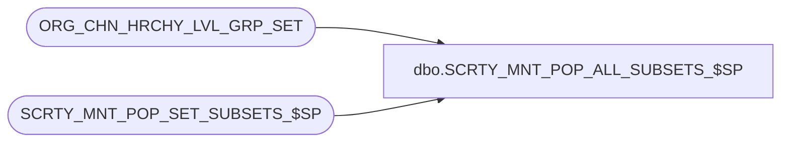

# dbo.SCRTY_MNT_POP_ALL_SUBSETS_$SP

**Database:** auditworks_external  
**Server:** bedrockdb01  

## Architecture Diagram



## Table Dependencies

| Referenced Table |
|---|
| ORG_CHN_HRCHY_LVL_GRP_SET |
| SCRTY_MNT_POP_SET_SUBSETS_$SP |

## Stored Procedure Code

```sql
CREATE PROC dbo.SCRTY_MNT_POP_ALL_SUBSETS_$SP
/**********************************************************************************************
					Loop through all defined division set ID values
					and call SCRTY_MNT_POP_SET_SUBSETS_$SP to bring everything up-to-date.
Return Value:		none

Created By:			JHardin

UPDATES:
2012 0613 JHardin	CRDM merge final renaming, cleanup

***********************************************************************************************/
AS
BEGIN
	DECLARE @max_div_set_id		integer;
	DECLARE @division_set_id	integer;

	SELECT
		@max_div_set_id = MAX(HRCHY_LVL_GRP_SET_ID)
	FROM
		ORG_CHN_HRCHY_LVL_GRP_SET
	;

	DECLARE ds_cur CURSOR FAST_FORWARD FOR
	SELECT DISTINCT
		HRCHY_LVL_GRP_SET_ID
	FROM
		ORG_CHN_HRCHY_LVL_GRP_SET
	;

	OPEN ds_cur

	FETCH NEXT FROM ds_cur
	INTO @division_set_id

	WHILE @@FETCH_STATUS = 0
	BEGIN

		EXEC SCRTY_MNT_POP_SET_SUBSETS_$SP @division_set_id;

		FETCH NEXT FROM ds_cur
		INTO @division_set_id

	END;

	CLOSE ds_cur;
	DEALLOCATE ds_cur;

END;
```

