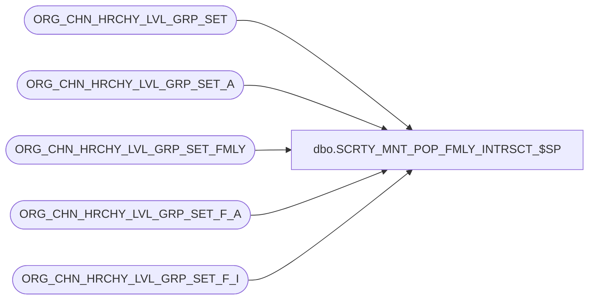

# dbo.SCRTY_MNT_POP_FMLY_INTRSCT_$SP

**Database:** auditworks_external  
**Server:** bedrockdb01  

## Architecture Diagram



## Table Dependencies

| Referenced Table |
|---|
| ORG_CHN_HRCHY_LVL_GRP_SET |
| ORG_CHN_HRCHY_LVL_GRP_SET_A |
| ORG_CHN_HRCHY_LVL_GRP_SET_FMLY |
| ORG_CHN_HRCHY_LVL_GRP_SET_F_A |
| ORG_CHN_HRCHY_LVL_GRP_SET_F_I |

## Stored Procedure Code

```sql
CREATE PROC dbo.SCRTY_MNT_POP_FMLY_INTRSCT_$SP
/**********************************************************************************************
				Populate the division set/family intersection table
Return Value:	nonzero on error

Created By:		JHardin 20110802

Notes:			Specify only one parameter.
				If both are specified, division_set_id is ignored.
				Can be called at any time to "heal" the intersection table and restore
				missing intersection data.
UPDATES:
***********************************************************************************************/
(
	@division_set_fmly_id	integer,
	@division_set_id		integer
)
AS
BEGIN
	DECLARE
		@member_set_count	smallint
	;
	
	IF @division_set_fmly_id IS NULL AND @division_set_id IS NULL
	BEGIN
		-- Need at least one parameter
		RETURN -1;
	END;

	IF @division_set_fmly_id IS NOT NULL
	BEGIN
		-- Calculate intersections for specified family ID against all division sets

		IF @division_set_fmly_id <> -1
		BEGIN
			SELECT
				@member_set_count = MBR_COUNT
			FROM
				ORG_CHN_HRCHY_LVL_GRP_SET_FMLY
			WHERE
				HRCHY_LVL_GRP_SET_FMLY_ID = @division_set_fmly_id
			;

			IF @@ROWCOUNT < 1
			BEGIN
				-- Bogus family ID
				RETURN -2;
			END;

			WITH
			t_id AS (
				-- All sets that intersect any family member set
				SELECT DISTINCT
					fa.HRCHY_LVL_GRP_SET_ID AS family_division_set_id,
					sa2.HRCHY_LVL_GRP_SET_ID AS division_set_id
				FROM
					ORG_CHN_HRCHY_LVL_GRP_SET_F_A fa
					INNER JOIN ORG_CHN_HRCHY_LVL_GRP_SET_A sa ON
						sa.HRCHY_LVL_GRP_SET_ID = fa.HRCHY_LVL_GRP_SET_ID
					INNER JOIN ORG_CHN_HRCHY_LVL_GRP_SET_A sa2 ON
						sa2.HRCHY_LVL_GRP_IDNTY = sa.HRCHY_LVL_GRP_IDNTY
				WHERE
					fa.HRCHY_LVL_GRP_SET_FMLY_ID = @division_set_fmly_id
			),
			t_idc AS (
				-- Count intersections by non-member division set
				-- Keep only sets that intersect ALL the family member sets
				SELECT
					division_set_id
				FROM
					t_id
				GROUP BY
					division_set_id
				HAVING
					COUNT(*) = @member_set_count 
			)
			INSERT INTO
				ORG_CHN_HRCHY_LVL_GRP_SET_F_I(
					HRCHY_LVL_GRP_SET_FMLY_ID,
					HRCHY_LVL_GRP_SET_ID
				)
			SELECT
				@division_set_fmly_id,
				division_set_id
			FROM
				t_idc
			WHERE
				NOT EXISTS(
					SELECT 1
					FROM ORG_CHN_HRCHY_LVL_GRP_SET_F_I fi
					WHERE fi.HRCHY_LVL_GRP_SET_FMLY_ID = @division_set_fmly_id
					AND fi.HRCHY_LVL_GRP_SET_ID = t_idc.division_set_id
				)
			;
		END;
	END
	ELSE
	BEGIN
		-- Calculate intersections for specified division set ID against all families

		IF @division_set_id <> -1
		BEGIN
			IF NOT EXISTS(SELECT 1 FROM ORG_CHN_HRCHY_LVL_GRP_SET WHERE HRCHY_LVL_GRP_SET_ID = @division_set_id)
			BEGIN
				-- Bogus division set ID
				RETURN -3;
			END;

			WITH
			t_id AS (
				-- All family member sets that intersect the division set
				SELECT DISTINCT
					fa.HRCHY_LVL_GRP_SET_FMLY_ID AS family_id,
					fa.HRCHY_LVL_GRP_SET_ID AS family_division_set_id
				FROM
					ORG_CHN_HRCHY_LVL_GRP_SET_A sa
					INNER JOIN ORG_CHN_HRCHY_LVL_GRP_SET_A sa2 ON
						sa2.HRCHY_LVL_GRP_IDNTY = sa.HRCHY_LVL_GRP_IDNTY
						AND
						sa2.HRCHY_LVL_GRP_SET_ID <> -1
					INNER JOIN ORG_CHN_HRCHY_LVL_GRP_SET_F_A fa ON
						fa.HRCHY_LVL_GRP_SET_ID = sa2.HRCHY_LVL_GRP_SET_ID
				WHERE
					sa.HRCHY_LVL_GRP_SET_ID = @division_set_id
			),
			t_idc AS (
				-- Count intersections by family
				SELECT
					family_id,
					COUNT(*) AS MBR_COUNT
				FROM
					t_id
				GROUP BY
					family_id
			)
			INSERT INTO
				ORG_CHN_HRCHY_LVL_GRP_SET_F_I(
					HRCHY_LVL_GRP_SET_FMLY_ID,
					HRCHY_LVL_GRP_SET_ID
				)
			SELECT
				f.HRCHY_LVL_GRP_SET_FMLY_ID,
				@division_set_id
			FROM
				t_idc
				INNER JOIN ORG_CHN_HRCHY_LVL_GRP_SET_FMLY f ON
					f.HRCHY_LVL_GRP_SET_FMLY_ID = t_idc.family_id
					AND
					f.MBR_COUNT = t_idc.MBR_COUNT	-- All family member sets intersected the target set
			WHERE
				NOT EXISTS(
					SELECT 1
					FROM ORG_CHN_HRCHY_LVL_GRP_SET_F_I fi
					WHERE fi.HRCHY_LVL_GRP_SET_FMLY_ID = f.HRCHY_LVL_GRP_SET_FMLY_ID
					AND fi.HRCHY_LVL_GRP_SET_ID = @division_set_id
				)
			;
		END;
	END;

	-- Maintain the -1 family visibility
	IF NOT EXISTS(SELECT 1 FROM ORG_CHN_HRCHY_LVL_GRP_SET_FMLY WHERE HRCHY_LVL_GRP_SET_FMLY_ID = -1)
	BEGIN
		-- This WILL BLOW UP if called in a context where IDENTITY_INSERT is already on!
		-- The -1 family SHOULD have been inserted as base data!
		SET IDENTITY_INSERT ORG_CHN_HRCHY_LVL_GRP_SET_FMLY ON;

		INSERT INTO
			ORG_CHN_HRCHY_LVL_GRP_SET_FMLY(
			HRCHY_LVL_GRP_SET_FMLY_ID,
			SET_LIST_PREFIX,
			IS_SET_LIST_PREFIX_CMPLT,
			MBR_COUNT
		)
		VALUES (
			-1,
			'*ALL*',
			-1,
			32767
		)
		;

		SET IDENTITY_INSERT ORG_CHN_HRCHY_LVL_GRP_SET_FMLY OFF;
	END;

	-- Family -1 intersects ALL division sets.
	INSERT INTO
		ORG_CHN_HRCHY_LVL_GRP_SET_F_I(
			HRCHY_LVL_GRP_SET_FMLY_ID,
			HRCHY_LVL_GRP_SET_ID
		)
	SELECT
		-1,
		HRCHY_LVL_GRP_SET_ID
	FROM
		ORG_CHN_HRCHY_LVL_GRP_SET ds
	WHERE
		NOT EXISTS(
			SELECT 1
			FROM ORG_CHN_HRCHY_LVL_GRP_SET_F_I fi
			WHERE fi.HRCHY_LVL_GRP_SET_FMLY_ID = -1
			AND fi.HRCHY_LVL_GRP_SET_ID = ds.HRCHY_LVL_GRP_SET_ID
		)
	;

	-- Division set -1 intersects ALL families.
	INSERT INTO
		ORG_CHN_HRCHY_LVL_GRP_SET_F_I(
			HRCHY_LVL_GRP_SET_FMLY_ID,
			HRCHY_LVL_GRP_SET_ID
		)
	SELECT
		HRCHY_LVL_GRP_SET_FMLY_ID,
		-1
	FROM
		ORG_CHN_HRCHY_LVL_GRP_SET_FMLY dsf
	WHERE
		NOT EXISTS(
			SELECT 1
			FROM ORG_CHN_HRCHY_LVL_GRP_SET_F_I fi
			WHERE fi.HRCHY_LVL_GRP_SET_FMLY_ID = dsf.HRCHY_LVL_GRP_SET_FMLY_ID
			AND fi.HRCHY_LVL_GRP_SET_ID = -1
		)
	;


	RETURN 0;
END;
```

