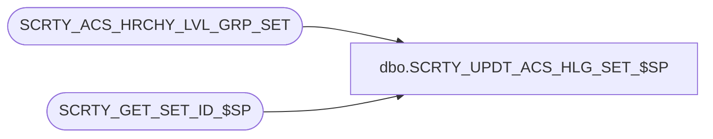

# dbo.SCRTY_UPDT_ACS_HLG_SET_$SP

**Database:** auditworks_external  
**Server:** bedrockdb01  

## Architecture Diagram



## Table Dependencies

| Referenced Table |
|---|
| SCRTY_ACS_HRCHY_LVL_GRP_SET |
| SCRTY_GET_SET_ID_$SP |

## Stored Procedure Code

```sql
CREATE PROC dbo.SCRTY_UPDT_ACS_HLG_SET_$SP
/**********************************************************************************************
				Updates the user's permissions.
Return Value:	0 if successful, otherwise an error code.

Created By:		WWilkie

UPDATES:

***********************************************************************************************/
(
	@ACS_ID				numeric(10,0),	-- User or group ID
	@ACS_ID_TYPE		tinyint,		-- User, or group?
	@IS_GBL_DFND		bit,
	@IS_GBL_ACTV		bit,
	@ACTV_GRP_LIST		varchar(max),	-- comma-delimited list of foundation group IDs
	@INACTV_GRP_LIST	varchar(max)	-- comma-delimited list of foundation group IDs
	-- Need @APP_ID parameter to make this usable by apps other than CRM (APP_ID = 200, see below).
	-- Matching managed code changes would be required in 
	-- NsbSystem.ServicesAdmin.SecurityManager.SecurityManagerCud.SaveSecurityHierarchies(...)
)
AS
BEGIN
	DECLARE @set_id 		integer;
	DECLARE @set_id_actv	integer;
	DECLARE @scratchBool	bit;

	SET NOCOUNT ON;

	-- Validate Input Parameters
	IF @ACS_ID IS NULL OR @ACS_ID_TYPE IS NULL
	BEGIN
		-- GIGO
		RETURN -1;
	END;

	-- Update record for Global access
	IF EXISTS(
		SELECT 1
		FROM SCRTY_ACS_HRCHY_LVL_GRP_SET
		WHERE ACS_ID = @ACS_ID
		AND ACS_ID_TYPE = @ACS_ID_TYPE
		AND HRCHY_LVL_GRP_SET_ID = -1
	)
	BEGIN
		IF 0 = @IS_GBL_DFND -- is no longer defined
		BEGIN
			DELETE FROM
				SCRTY_ACS_HRCHY_LVL_GRP_SET
			WHERE
				ACS_ID = @ACS_ID
			AND
				ACS_ID_TYPE = @ACS_ID_TYPE
			AND
				HRCHY_LVL_GRP_SET_ID = -1
			;
		END
		ELSE
		BEGIN
			UPDATE
				SCRTY_ACS_HRCHY_LVL_GRP_SET
			SET
				ACTV = @IS_GBL_ACTV
			WHERE
				ACS_ID = @ACS_ID
			AND
				ACS_ID_TYPE = @ACS_ID_TYPE
			AND
				HRCHY_LVL_GRP_SET_ID = -1
			AND
				ACTV <> @IS_GBL_ACTV
			;
		END;
	END
	ELSE
	BEGIN
		IF 0 <> @IS_GBL_DFND -- needs to be set
		BEGIN
			INSERT INTO
				SCRTY_ACS_HRCHY_LVL_GRP_SET(
					ACS_ID,
					ACS_ID_TYPE,
					ACTV,
					HRCHY_LVL_GRP_SET_ID
				)
			VALUES (
				@ACS_ID,
				@ACS_ID_TYPE,
				@IS_GBL_ACTV,
				-1
			);
		END;
	END;


	-- Remove existing HRCHY LVL GRP SET assignments
	DELETE FROM
		SCRTY_ACS_HRCHY_LVL_GRP_SET
	WHERE
		ACS_ID = @ACS_ID
	AND
		ACS_ID_TYPE = @ACS_ID_TYPE
	AND
		HRCHY_LVL_GRP_SET_ID <> -1
	;

	-- Process Active assignment
	EXEC @set_id = SCRTY_GET_SET_ID_$SP @ACTV_GRP_LIST, @scratchBool OUT, -1, 200;	-- 200 SHOULD BE @APP_ID !!!
	IF @set_id > 0
	BEGIN
		INSERT INTO
			SCRTY_ACS_HRCHY_LVL_GRP_SET(
				ACS_ID,
				ACS_ID_TYPE,
				ACTV,
				HRCHY_LVL_GRP_SET_ID
			)
		VALUES (
			@ACS_ID,
			@ACS_ID_TYPE,
			1,
			@set_id
		);
	END;
	SET @set_id_actv = @set_id;

	-- Process InActive assignment
	EXEC @set_id = SCRTY_GET_SET_ID_$SP @INACTV_GRP_LIST, @scratchBool OUT, -1, 200;	-- 200 SHOULD BE @APP_ID !!!
	IF @set_id > 0 AND @set_id <> @set_id_actv
	BEGIN
		INSERT INTO
			SCRTY_ACS_HRCHY_LVL_GRP_SET(
				ACS_ID,
				ACS_ID_TYPE,
				ACTV,
				HRCHY_LVL_GRP_SET_ID
			)
		VALUES (
			@ACS_ID,
			@ACS_ID_TYPE,
			0,
			@set_id
		);
	END;

	RETURN 0;

END;
```

