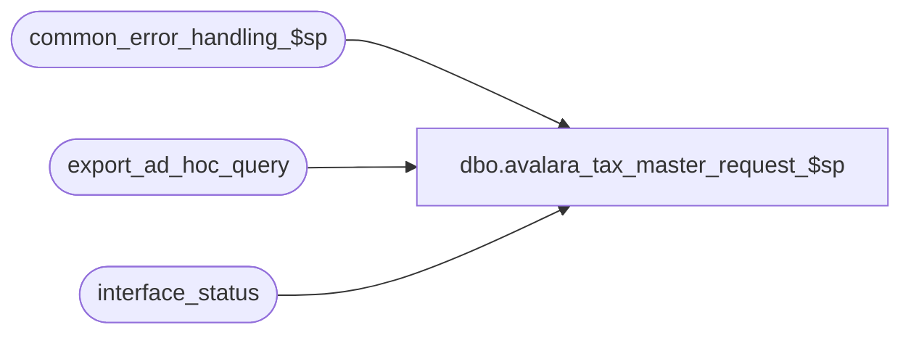

# dbo.avalara_tax_master_request_$sp

**Database:** auditworks_external  
**Server:** bedrockdb01  

## Architecture Diagram



## Table Dependencies

| Referenced Table |
|---|
| common_error_handling_$sp |
| export_ad_hoc_query |
| interface_status |

## Stored Procedure Code

```sql
create proc dbo.avalara_tax_master_request_$sp 
(@interface_id	tinyint
)
AS

DECLARE
@errmsg 			nvarchar(255),
@errno				int,
@process_log_entry 		tinyint,
@process_no 			smallint,
@process_timestamp 		float,
@process_start_time		datetime, 
@rows				int,
@message_id		        int,	
@object_name			nvarchar(255),
@operation_name			nvarchar(100),
@process_name		        nvarchar(100),
@immediate_posting_requested	tinyint,
@stream_no                      tinyint,
@last_transfer_datetime		datetime

/* Proc Name: avalara_tax_master_request_$sp
   Desc: Export tax master import request to Avalara.
         Called by ICT_EXPORTXX.
         Dayend Post Audit sets Immediate_posting_requested assuming export-format "auto-set-posting request" is left active (value 2=Upon dayend post-audit interface posting)
         but skips the posting of transactions to the I/F tables when this proc-name is in export-format.
         This triggers ICT_EXPORT01 to:
		a)  call the tax export import request proc specified in export format (e.g. avalara_tax_master_request_$sp).
		b)  transfer it to Avalara via a call to their web-service (if export format configured with FTP flag = 2 
		    and export destination set to web-service-caller exe (AvalaraInterface.exe -I -D? -S? -U? -P? -F? -C?
		    where -I indicates a master table Import request, -S the avalara web service URL without the https:// prefix, -U and -P are either the user-name/password
		    or the account/key depending on the avalara version used, -F is the name of the dummy file (usually avalara_taxYYYYMMDDHHMMSS) not actually transmitted,
		    and -C is the avalara company code.  
		    The ? specifies that smartload will swap in the FTP Host, HostId, HostPassword, OutputFilePrefixAndTimestamp, and Smartload Var
		    012_company_code settings for -S, -U, -P, -F, -C respectively.
                or
		    copy it to OUTPUT directory (if export format configured with FTP flag = 0 and destination set to ../OUTPUT)
		c)  Note that if -I and -D? switches indicate a request for Tax Import files generated since the last successful web-service call will be made.
		    The ? specifies that the interface_status.last_transfer_datetime will be swapped into the -D switch.

   Pre-requisites:  Interface 12 (Tax Tracking) must have an ascii export selected.
		    Avalara Company Code must have been set in Smartload Var table-maintenance under the variable named 012_company_code.
		    Avalara WebServiceURL(without the https:// prefix), Account and Key configured in export-format table-maintenance (under FTP Host, FTP Host Id and FTP Host Password) if web-service transfer is being used.

Unicode compliant version.

HISTORY:
Date     Name           Def# Desc
Apr04,12 Vicci        134246 Since this proc can be called from any user-defined interface, do not validate interface_id.
May31,11 Vicci        127475 Support -I (import) with no -E (export)
*/

SET CONCAT_NULL_YIELDS_NULL OFF

SELECT @process_no = 39,  --tax transaction export
       @process_name = 'avalara_tax_master_request_$sp',
       @message_id = 201068,
       @process_start_time = getdate()
       
/* immediate_posting_requested:  0=abort, 
				 1=populate work & copy to interface (ict will bcp and set to 0)
				 2=copy work to interface only (ict will bcp but not reset)
				 3=populate work & copy to interface (ict will bcp but not reset)
*/

IF @interface_id IS NULL
BEGIN
  SELECT @message_id = 201684,
         @errno = 201684,
         @object_name = @process_name,
         @errmsg = 'Invalid Argument(s) passed to the stored procedure ' + @process_name + '. Unable to proceed.'
  GOTO error
END

SELECT @immediate_posting_requested = ISNULL(immediate_posting_requested,0),
       @last_transfer_datetime = last_transfer_datetime
  FROM interface_status WITH (NOLOCK)
 WHERE interface_id = @interface_id
SELECT @errno = @@error
IF @errno <> 0
BEGIN
  SELECT @errmsg = 'Unable to select immediate_posting_request from interface status',
         @object_name = 'interface_status',
         @operation_name = 'SELECT'      
  GOTO error
END

IF @immediate_posting_requested = 0  --abort requested
  RETURN

INSERT into export_ad_hoc_query(delimited_field_col1)
VALUES ('Request for Tax Import files generated since the last successful web-service call of ' + convert(varchar, COALESCE(@last_transfer_datetime, '01/01/1970')))

-- Mark the interface as complete
UPDATE interface_status
   SET last_retrieval_datetime = getdate(),
       retrieval_in_progress = 0,
       immediate_posting_requested = 1  --in case some prior run had bumped it to 2
 WHERE interface_id = @interface_id
SELECT @errno = @@error
IF @errno <> 0
BEGIN
  SELECT @errmsg = 'Unable to set retrieval_in_progress in interface_status for interface_id ' + CONVERT(NVARCHAR, @interface_id),
         @object_name = 'interface_status',
         @operation_name = 'UPDATE'
  GOTO error
END

RETURN 

error:   /* Common error handler */
         IF @@trancount > 0
           ROLLBACK -- need in order to update interface_status

         UPDATE interface_status
            SET last_retrieval_datetime = getdate(),
                retrieval_in_progress = 0
          WHERE interface_id = @interface_id

         EXEC common_error_handling_$sp @process_no, @errno, @errmsg, 0, @message_id, 
  	    @process_name, @object_name, @operation_name, 1, @stream_no, 
  	    @process_log_entry, @process_timestamp, 0	  
	  
	RETURN
```

