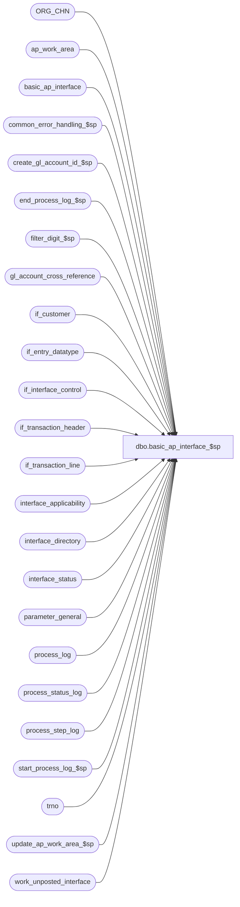

# dbo.basic_ap_interface_$sp

**Database:** auditworks_external  
**Server:** bedrockdb01  

## Architecture Diagram



## Table Dependencies

| Referenced Table |
|---|
| ORG_CHN |
| ap_work_area |
| basic_ap_interface |
| common_error_handling_$sp |
| create_gl_account_id_$sp |
| end_process_log_$sp |
| filter_digit_$sp |
| gl_account_cross_reference |
| if_customer |
| if_entry_datatype |
| if_interface_control |
| if_transaction_header |
| if_transaction_line |
| interface_applicability |
| interface_directory |
| interface_status |
| parameter_general |
| process_log |
| process_status_log |
| process_step_log |
| start_process_log_$sp |
| trno |
| update_ap_work_area_$sp |
| work_unposted_interface |

## Stored Procedure Code

```sql
create proc [dbo].[basic_ap_interface_$sp] 
AS

/* 
 Proc name:   basic_ap_interface_$sp
 Description: Build A/P interface table named basic_ap_interface 
 		to be used by smartload script bscintface.ict to generate an
 		ASCII file which will then be used by BASIX program to create
 		invoices. Also used as a mail check export to Great Plains (SA4+).  
		Called from smartload script bscintface1.ict
History:
Date	 Name		Def# Action
Sep06,06 Tim           76719 Null Concatenation Fix.
Sep07,05 Paul        DV-1312 58339 is not applicable to SA5 since old media rec is no longer supported
Jul14,05 Paul        DV-1295 apply 40830 to SA5
Apr28,05 Paul        DV-1234 expand if_entry_no to use if_entry_datatype
Aug09,04 Sab	     DV-1071 Changes required for bank tables.
Jun03,04 David       DV-1071 Use ORG_CHN table as the new Store table.
May10,04 Maryam      DV-1071 Set @process_id = @@spid 
Apr14,04 Sab	     DV-1068 Remove join to media_parameter
Aug26,05 Daphna        58339 use if_export_code to populate store_deposit_destination (for gl_acct_id)
Sep03,04 Daphna  39407/40830 Remove logic to set the completed_flag in process_status_log, 
                             it is done in reset_ap_interface_$sp
Dec09,02 Winnie      1-H56TW avoid raise error on business rule warning message
Oct11,02 Daphna      1-F8GOD Allow any customer role to post, giving preference to role 3
                             Set unpostable entries = 50 (posted) to prevent backlog 
                             of nonpurged IF entries, issue error message to alert user 
Oct11,02 Phu         1-DQIV7 Don't create mail check for voided line
Dec19,01 Phu         1-9TNY1 Create mail check entries based on vendor name/address
Dec18,01 Winnie      1-9Q1RX Change process_step_log update statement for MSSQL compatibility.
Nov13,01 Winnie		8846 R3 Error handling, add logic to log process_log.	
Jun22,01 Winnie		8100 Format the phone number to contain digits only.
               		     Remove uneccessary cursor.
May04,01 Phu		7808 Expand telephone # from 10 to 16 chars.
Apr11,01 Henry		7564 Only allow customer_role = 3 (Mail to check customer)
Mar12,01 Phu		7386 Build GL account no for store deposit destination setup
Feb26,01 Phu		7371 Change double quotes to single quotes for MS SQL compatibility
Jan04,01 Paul		7158 Remove exists clause, improve performance
Dec04,00 Henry		7017 Add a comma after last name, when building vendor_name.
May25,00 John G		5864 Change '= NULL' to 'IS NULL' where applicable to mirror Oracle.
May12,00 Henry		6303 To handle duplicates better, and role = 1 on unique customer
Feb28,00 Paul S		5733 Only look for customer rows with role = 3
Oct22,97 Paul S		??   ??
Sep25,97 Phu		n/a  Creation
*/

DECLARE
	@ap_bank_code			smallint,
	@ap_company_no			tinyint,
	@ascii_export			tinyint,
	@c_store_no			int, 
	@c_register_no			smallint, 
	@c_transaction_no               trno, 
	@c_transaction_date		smalldatetime,
	@c_if_entry_no			if_entry_datatype,
	@c_interface_control_flag       numeric(14,0),
	@completed_workload		int,
	@errmsg 			nvarchar(255),
	@errno 				int,
	@first_batch			int,
	@if_entry			if_entry_datatype,
	@loop_flag			smallint,
	@last_retrieval_datetime 	datetime,
	@last_posting_datetime 		datetime,
	@memo1				nvarchar(100), 
	@memo2				nvarchar(100), 
	@memo3				nvarchar(100),
	@new_telephone_no		nchar(16),
	@open_cursor			smallint,
	@posting_in_progress 		tinyint,
	@process_log_entry 		tinyint,
	@process_no 			smallint,
	@process_timestamp 		float,
	@process_id			binary(16), 
	@rows 				int,
	@row_count			int,
	@row_inserted 			int,
	@row_updated 			int,
	@space_filler			nchar(30),
	@telephone_no			nchar(16),
	@terminate_interface		tinyint,
	@transaction_count 		int,
	@unposted_count			int,
	@zero_filler			nchar(14),
	@operation_name			nvarchar(100),
	@message_id			int,
	@log_flag			smallint,
	@object_name			nvarchar(255),
	@process_name			nvarchar(100)

SET CONCAT_NULL_YIELDS_NULL OFF

SELECT @process_id = @@spid

SELECT @ascii_export = ascii_export
 FROM interface_directory
 WHERE interface_id = 21
   AND update_timing >= 1

IF ISNULL(@ascii_export,0) = 0
  RETURN

IF EXISTS( SELECT if_entry_no
	     FROM if_interface_control
	    WHERE interface_id = 21
	      AND interface_control_flag < 50 )
  SELECT @rows = 1
ELSE
  RETURN

SELECT  @errmsg = NULL,
	@process_log_entry = 0,
	@process_no = 206,
	@transaction_count = 0,
	@process_timestamp = 0,
	@terminate_interface = 0,
	@zero_filler = REPLICATE ('0', 14),
	@space_filler = SPACE(30),
	@process_name = 'basic_ap_interface_$sp',
	@message_id = 201068,
	@loop_flag = 0,
	@log_flag = 1,  -- called by smartload
	@unposted_count = 0

SELECT @ap_bank_code = ap_bank_code,
       @ap_company_no = ap_company_no
  FROM parameter_general

SELECT @errno = @@error
IF @errno <> 0
  BEGIN
    SELECT @errmsg = 'Unable to select ap_bank_code, ap_company_no from parameter_general',
           @object_name = 'parameter_general',
           @operation_name = 'SELECT'
    GOTO error
  END

DELETE work_unposted_interface
WHERE process_id = @process_id
AND interface_id = 21

CREATE TABLE #ap_interface (
	if_entry_no 			numeric(14,0) 	not null, -- if_entry_datatype
	min_line_id 			numeric(5,0) 	null,
	line_id 			numeric(5,0) 	not null,
	to_line_id 			numeric(5,0) 	not null,
	customer_role			smallint	not null,
	store_no 			int 		not null,
	transaction_date 		nchar(6) 	not null,
	transaction_no 			int 		not null,
	register_no 			smallint 	not null,
	gl_account_id 			int 		not null,
	first_expense_account 		nchar(14) 	not null,
	gl_expense_account1		nchar(14) 	not null,
	gl_expense_account2 		nchar(14) 	not null,
	gl_expense_account3		nchar(14) 	not null,
	gl_expense_account4		nchar(14) 	not null,
	gl_expense_account5		nchar(14) 	not null,
	gl_expense_account6		nchar(14) 	not null,
	gl_expense_account7		nchar(14) 	not null,
	gl_expense_account8		nchar(14) 	not null,
	gl_expense_account9		nchar(14) 	not null,
	first_distribution_amount 	int 	 	not null,
	gl_distribution_amount1 	int 	 	not null,
	gl_distribution_amount2 	int 	 	not null,
	gl_distribution_amount3 	int 	 	not null,
	gl_distribution_amount4 	int 	 	not null,
	gl_distribution_amount5		int 	 	not null,
	gl_distribution_amount6 	int 	 	not null,
	gl_distribution_amount7 	int 	 	not null,
	gl_distribution_amount8 	int 	 	not null,
	gl_distribution_amount9 	int 	 	not null,
	vendor_name			nchar(30)	not null,
	address_1			nchar(30)	not null )

SELECT @errno = @@error
IF @errno <> 0
  BEGIN
	SELECT @errmsg = 'Unable to create temp table #ap_interface',
	       @object_name = '#ap_interface',
               @operation_name = 'CREATE'
	GOTO error
  END

CREATE TABLE #count_date (
        transaction_date smalldatetime,
        transaction_count int)

SELECT @errno = @@error
IF @errno != 0
  BEGIN
   SELECT @errmsg = 'Unable to create temp table #count_date',
          @object_name = '#count_date',
          @operation_name = 'CREATE'
   GOTO error
  END

WHILE @terminate_interface = 0
  BEGIN
	SELECT @last_retrieval_datetime = last_retrieval_datetime,
		@last_posting_datetime = last_posting_datetime,
		@posting_in_progress = posting_in_progress
	FROM interface_status
	WHERE interface_id = 21

	SELECT @errno = @@error
	IF @errno <> 0
	  BEGIN
		SELECT @errmsg = 'Unable to select last_retrieval_datetime from interface_status',
		       @object_name = 'interface_status',
		       @operation_name = 'SELECT'
		GOTO error
	  END

	IF @last_retrieval_datetime >= @last_posting_datetime
	  OR @posting_in_progress <> 1
		SELECT @terminate_interface = 1

	TRUNCATE TABLE ap_work_area

	SELECT @errno = @@error
	IF @errno <> 0
	  BEGIN
		SELECT @errmsg = 'Unable to truncate table ap_work_area',
		       @object_name = 'ap_work_area',
		       @operation_name = 'TRUNCATE'
		GOTO error
	  END

	TRUNCATE TABLE #ap_interface

	SELECT @errno = @@error
	IF @errno <> 0
	  BEGIN
		SELECT @errmsg = 'Unable to truncate #ap_interface',
		       @object_name = '#ap_interface',
		       @operation_name = 'TRUNCATE'
		GOTO error
	  END

/* amount = (l.gross_line_amount - l.pos_discount_amount) * l.db_cr_none  * -100 */

	INSERT ap_work_area (
		if_entry_no,
 		line_id,
		store_no,
		transaction_category,
		line_object,
		line_action,
		class_code,
		tax_jurisdiction,
		store_deposit_destination,
		discounted_line_object,
		return_from_store,
		card_type,
		transaction_date,
		gl_account_id,
		transaction_no,
		register_no,
		amount,
		interface_control_flag)
	SELECT
	 	l.if_entry_no,
	 	l.line_id,
		h.store_no,
		h.transaction_category,
		l.line_object,
		l.line_action,
		0,
		'     ',
		s.PRMRY_BANK_ACNT_ID,
		0,
		0,
		' ',
		SUBSTRING (CONVERT (nchar(6), h.transaction_date, 12), 3, 4)
		+ SUBSTRING (CONVERT (nchar(6), h.transaction_date, 12), 1, 2),
		-1,                                                            
		h.transaction_no,
		h.register_no,
		(l.gross_line_amount - l.pos_discount_amount) * l.db_cr_none  * -100
		  * voiding_reversal_flag,
		ic.interface_control_flag  
	FROM
		if_interface_control ic,
		if_transaction_header h,
		if_transaction_line l,
		interface_applicability ia,
		ORG_CHN s
	WHERE	ic.interface_id = 21
	    AND ic.interface_control_flag < 50
	    AND ic.if_entry_no = h.if_entry_no
	    AND h.if_entry_no = l.if_entry_no
	    AND transaction_void_flag * (transaction_void_flag - 8) = 0
	    AND line_void_flag = 0
	    AND date_reject_id = 0
	    AND db_cr_none != 0
	    AND ia.interface_id = ic.interface_id
	    AND ia.transaction_category = h.transaction_category
	    AND ia.line_object = l.line_object
	    AND ia.line_action = l.line_action
	    AND h.store_no = s.ORG_CHN_NUM

	SELECT @row_inserted = @@rowcount,
    	       @rows = @@rowcount,
    	       @transaction_count = @transaction_count + @@rowcount,
	       @errno = @@error

	IF @errno <> 0
	  BEGIN
		SELECT @errmsg = 'Unable to insert ap_work_area',
		       @object_name = 'ap_work_area',
                       @operation_name = 'INSERT'
		GOTO error
	  END

	IF @rows <= 0
		BREAK

        IF @loop_flag = 0 
	BEGIN
	  SELECT @first_batch = completed_flag,
	         @completed_workload = completed_workload
	    FROM process_status_log
	   WHERE process_no = @process_no

	  SELECT @errno = @@error
	  IF @errno <> 0
	    BEGIN
	      SELECT @errmsg = 'Unable to select completed_flag from process_status_log ',
		     @object_name = 'process_status_log',
		     @operation_name = 'SELECT'
		GOTO error
	    END

          IF @first_batch IS NULL 
	    BEGIN
              INSERT process_status_log
 	             (process_no,
                      process_start_time,
                      expected_workload,
                      completed_workload,
                      completed_flag,
                      abort_requested,
                      transaction_qty)
	      VALUES (@process_no,
                      getdate(),
                      1,
                      0,
                      0,
                      0,
                      0)   
    
              SELECT @errno = @@error
	      IF @errno <> 0
	        BEGIN
	          SELECT @errmsg = 'Unable to insert process_status_log (initial)',
	                 @object_name = 'process_status_log',
		         @operation_name = 'INSERT'
		  GOTO error
		END 

      	      INSERT process_step_log
	            (process_no,
		     stream_no,
		     process_step_no,
		     process_step_start_time,
		     expected_workload,
		     completed_workload)
             VALUES (@process_no,
	             1,
		     0,
		     getdate(),
		     1,
		     0)	    	

              SELECT @errno = @@error
	      IF @errno <> 0
	        BEGIN
	     SELECT @errmsg = 'Unable to insert process_step_log (initial)',
                         @object_name = 'process_step_log',
		         @operation_name = 'INSERT'
		  GOTO error
		END          
            END -- IF @first_batch IS NULL 

          ELSE IF @first_batch = 1
            BEGIN 
	      UPDATE process_status_log
		 SET completed_flag = 0,
		     expected_workload = 1,
		     completed_workload = 0,
		     transaction_qty = 0,
		     process_start_time = getdate()
	       WHERE process_no = @process_no
		 AND completed_flag = 1

	      SELECT @errno = @@error
	  IF @errno <> 0
		BEGIN
		  SELECT @errmsg = 'Unable to update process_status_log (initial)',
			 @object_name = 'process_status_log',
			 @operation_name = 'UPDATE'
		  GOTO error
		END

		UPDATE process_step_log
	           SET process_step_start_time = getdate(),
		       expected_workload = 1,
		       completed_workload = 0,
		       process_step_no = 0
		 WHERE process_no = @process_no
	           AND stream_no = 1
           
		SELECT @errno = @@error
		IF @errno <> 0
		BEGIN
		  SELECT @errmsg = 'Unable to update process_step_log (initial)',
			 @object_name = 'process_step_log',
			 @operation_name = 'UPDATE'
		  GOTO error
		END          
            END -- ELSE IF @first_batch = 1

          IF @first_batch = 1 OR @first_batch IS NULL 
	    BEGIN
              SELECT @completed_workload = 0
   	      INSERT INTO #count_date
	      SELECT CONVERT(SMALLDATETIME, convert(nchar,process_start_time,112)),
	             SUM(transaction_count)
	        FROM process_log
	       WHERE DATEDIFF(dd,process_start_time, getdate()) <= 7
	         AND DATEDIFF(dd,process_start_time, getdate()) >= 1
	         AND process_no = @process_no
	         AND transaction_count > 0
	      GROUP BY CONVERT(SMALLDATETIME, convert(nchar,process_start_time,112))

              SELECT @errno = @@error,
	             @row_count = @@rowcount
	      IF @errno <> 0
	        BEGIN
	          SELECT @errmsg = 'Unable to insert #count_date ',
	                 @object_name = '#count_date',
		         @operation_name = 'INSERT'
		  GOTO error
                END          

		IF @row_count > 0
		BEGIN
		  UPDATE process_status_log
		     SET expected_workload = (SELECT CEILING(CONVERT(FLOAT,(SUM(transaction_count))) / CONVERT(FLOAT,(@row_count)))
                                	        FROM #count_date)
		   WHERE process_no = @process_no

		  SELECT @errno = @@error
		  IF @errno <> 0
		  BEGIN
		    SELECT @errmsg = 'Unable to update process_status_log for expected_workload',
		           @object_name = 'process_status_log',
 		           @operation_name = 'UPDATE'
		    GOTO error
		  END          

		  UPDATE process_status_log
		     SET expected_workload = 1
		   WHERE process_no = @process_no
		     AND expected_workload = 0

		  SELECT @errno = @@error
		  IF @errno <> 0
		  BEGIN
		    SELECT @errmsg = 'Unable to update process_status_log for expected_workload to 1',
		           @object_name = 'process_status_log',
 		           @operation_name = 'UPDATE'
		    GOTO error
		  END          
                END -- IF @row_count > 0 

                UPDATE process_step_log 
	           SET expected_workload = s.expected_workload,
	               process_step_no = 64,
	               process_step_start_time = getdate()
	          FROM process_status_log s, process_step_log p
	         WHERE p.process_no = @process_no
	           AND p.process_no = s.process_no
	           AND stream_no = 1

                SELECT @errno = @@error
	        IF @errno <> 0
		  BEGIN
		    SELECT @errmsg = 'Unable to update process_step_log for expected_workload',
		           @object_name = 'process_step_log',
 		           @operation_name = 'UPDATE'
		    GOTO error
		  END          
          END -- IF @first_batch = 1 OR @first_batch IS NULL 
	END  -- IF @loop_flag = 0 
    
       SELECT @loop_flag = 1

	IF @process_log_entry = 0
	  BEGIN
		EXEC start_process_log_$sp @process_no,
					   @process_timestamp OUTPUT,
					   @errmsg OUTPUT

		SELECT @errno = @@error
		IF @errno <> 0
		  BEGIN
		    IF @errmsg IS NULL 
		 SELECT @errmsg = 'Unable to execute start_process_log_$sp'
		    SELECT @object_name = 'start_process_log_$sp',
                           @operation_name = 'EXECUTE'
		    GOTO error
		  END

		SELECT @process_log_entry = 1
	  END

/* Retrieves gl_account_id */

	EXEC update_ap_work_area_$sp @row_updated OUTPUT, @errmsg OUTPUT

	SELECT @errno = @@error
	IF @errno <> 0
	  BEGIN
		IF @errmsg IS NULL 
		  SELECT @errmsg = 'Unable to execute update_ap_work_area_$sp'
		SELECT @object_name = 'update_ap_work_area_$sp',
		       @operation_name = 'EXECUTE'
		GOTO error
	  END

	BEGIN TRAN

	IF @row_updated <> @row_inserted
	  BEGIN
		EXEC create_gl_account_id_$sp @process_no, @errmsg OUTPUT

		SELECT @errno = @@error
		IF @errno <> 0
		  BEGIN
			IF @errmsg IS NULL 
			  SELECT @errmsg = 'Unable to execute create_gl_account_id_$sp'
			SELECT @object_name = 'create_gl_account_id_$sp',
			       @operation_name = 'EXECUTE'
			GOTO error
		  END

		EXEC update_ap_work_area_$sp @row_updated OUTPUT, @errmsg OUTPUT

		SELECT @errno = @@error
		IF @errno <> 0
		  BEGIN
			IF @errmsg IS NULL 
			  SELECT @errmsg = 'Unable to execute update_ap_work_area_$sp'
			SELECT @object_name = 'update_ap_work_area_$sp',
			       @operation_name = 'EXECUTE'
			GOTO error
		  END

	  END /* if @row_updated <> @row_inserted */
	COMMIT TRAN

        SELECT ic.if_entry_no, a.line_id, line_id = MAX(ic.line_id), 
               ic.customer_role
        INTO #customer_role3
        FROM ap_work_area a, if_customer ic
        WHERE a.if_entry_no = ic.if_entry_no
        AND ic.customer_role = 3
        AND a.line_id >= ic.line_id
        GROUP BY ic.if_entry_no, a.line_id, ic.customer_role
        
        SELECT @errno = @@error
        IF @errno <> 0
        BEGIN
	  SELECT @errmsg = 'where customer_role = 3',
	         @object_name = '#customer_role3',
  	         @operation_name = 'CREATE'
  	  GOTO error        
        END

        SELECT ic.if_entry_no, a.line_id, line_id = MAX(ic.line_id), 
               customer_role = MIN(ic.customer_role)
        INTO #customer_not_role3
        FROM ap_work_area a, if_customer ic
        WHERE a.if_entry_no = ic.if_entry_no
        AND ic.customer_role <> 3
        AND a.line_id >= ic.line_id
        GROUP BY ic.if_entry_no, a.line_id

        SELECT @errno = @@error
        IF @errno <> 0
        BEGIN
	  SELECT @errmsg = 'where customer_role <> 3',
	         @object_name = '#customer_not_role3',
  	         @operation_name = 'CREATE'
  	  GOTO error        
        END

        DELETE #customer_not_role3
        FROM #customer_not_role3 nr3, #customer_role3 r3
        WHERE nr3.if_entry_no = r3.if_entry_no
        AND nr3.line_id = r3.line_id

        SELECT @errno = @@error
        IF @errno <> 0
        BEGIN
	  SELECT @errmsg = 'where if_entry_no and line_id match',
	         @object_name = '#customer_not_role3',
  	         @operation_name = 'DELETE'
  	  GOTO error        
        END

	INSERT #ap_interface (
		if_entry_no,
		min_line_id,
		line_id,
		to_line_id,
		customer_role,
		store_no,
		transaction_date,
		transaction_no,
		register_no,
		gl_account_id,
		first_expense_account,
		gl_expense_account1,
		gl_expense_account2,
		gl_expense_account3,
		gl_expense_account4,
		gl_expense_account5,
		gl_expense_account6,
		gl_expense_account7,
		gl_expense_account8,
		gl_expense_account9,
		first_distribution_amount,
		gl_distribution_amount1,
		gl_distribution_amount2,
		gl_distribution_amount3,
		gl_distribution_amount4,
		gl_distribution_amount5,
		gl_distribution_amount6,
		gl_distribution_amount7,
		gl_distribution_amount8,
		gl_distribution_amount9,
		vendor_name,
		address_1 )
	SELECT  ic.if_entry_no,
		ic.line_id,  -- min_line_id
		ic.line_id,  -- line_id
		a.line_id,        -- to_line_id
		r3.customer_role,
		0,
		'      ',
		0,
		0,
		-1,
		'              ',
		'              ',
		'              ',
		'              ',
		'              ',
		'      ',
		'              ',
		'              ',
		'              ',
		'              ',
		0,
		0,
		0,
		0,
		0,
		0,
		0,
		0,
		0,
		0,
		SUBSTRING (ic.last_name + ',' + ' ' + ic.title + ' ' + ic.first_name + @space_filler, 1, 30),
		SUBSTRING (ic.address_1 + ' ' + ic.address_2 + @space_filler, 1, 30)
	FROM #customer_role3 r3, ap_work_area a, if_customer ic
	WHERE r3.if_entry_no = a.if_entry_no
	AND r3.if_entry_no = ic.if_entry_no
	AND r3.line_id = ic.line_id
	AND r3.customer_role = ic.customer_role
	AND r3.line_id = a.line_id

	SELECT @errno = @@error
	IF @errno <> 0
	BEGIN
	  SELECT @errmsg = 'from #customer_role3',
	         @object_name = '#ap_interface',
	         @operation_name = 'INSERT'
	  GOTO error
	END

	INSERT #ap_interface (
		if_entry_no,
		min_line_id,
		line_id,
		to_line_id,
		customer_role,
		store_no,
		transaction_date,
		transaction_no,
		register_no,
		gl_account_id,
		first_expense_account,
		gl_expense_account1,
		gl_expense_account2,
		gl_expense_account3,
		gl_expense_account4,
		gl_expense_account5,
		gl_expense_account6,
		gl_expense_account7,
		gl_expense_account8,
		gl_expense_account9,
		first_distribution_amount,
		gl_distribution_amount1,
		gl_distribution_amount2,
		gl_distribution_amount3,
		gl_distribution_amount4,
		gl_distribution_amount5,
		gl_distribution_amount6,
		gl_distribution_amount7,
		gl_distribution_amount8,
		gl_distribution_amount9,
		vendor_name,
		address_1 )
	SELECT  ic.if_entry_no,
		ic.line_id,  -- min_line_id
		ic.line_id,  -- line_id
		a.line_id,        -- to_line_id
		nr3.customer_role,
		0,
		'      ',
		0,
		0,
		-1,
		'              ',
		'              ',
		'              ',
		'              ',
		'              ',
		'              ',
		'              ',
		'              ',
		'              ',
		'              ',
		0,
		0,
		0,
		0,
		0,
		0,
		0,
		0,
		0,
		0,
		SUBSTRING (ic.last_name + ',' + ' ' + ic.title + ' ' + ic.first_name + @space_filler, 1, 30),
		SUBSTRING (ic.address_1 + ' ' + ic.address_2 + @space_filler, 1, 30)
	FROM #customer_not_role3 nr3, ap_work_area a, if_customer ic
	WHERE nr3.if_entry_no = a.if_entry_no
	AND nr3.if_entry_no = ic.if_entry_no
	AND nr3.line_id = ic.line_id
	AND nr3.customer_role = ic.customer_role
	AND nr3.line_id = a.line_id

	SELECT @errno = @@error
	IF @errno <> 0
        BEGIN
 	  SELECT @errmsg = 'from #customer_not_role3',
	         @object_name = '#ap_interface',
	         @operation_name = 'INSERT'
 	  GOTO error
	END

        DROP TABLE #customer_role3
	SELECT @errno = @@error
	IF @errno <> 0
        BEGIN
 	  SELECT @errmsg = 'Unable to drop table #customer_role3',
	         @object_name = '#customer_role3',
	         @operation_name = 'DROP'
 	  GOTO error
	END

        DROP TABLE #customer_not_role3
	SELECT @errno = @@error
	IF @errno <> 0
        BEGIN
 	  SELECT @errmsg = 'Unable to drop table #customer_not_role3',
	         @object_name = '#customer_not_role3',
	         @operation_name = 'DROP'
 	  GOTO error
	END

	UPDATE #ap_interface
	SET min_line_id = (SELECT MIN (line_id)
			   FROM ap_work_area
			   WHERE if_entry_no = ai.if_entry_no
			   AND line_id >= ai.min_line_id
			   AND line_id <= ai.to_line_id)
	FROM #ap_interface ai, ap_work_area aw
	WHERE ai.if_entry_no = aw.if_entry_no
	AND ai.min_line_id <= aw.line_id
	AND ai.to_line_id >= aw.line_id

	SELECT @errno = @@error
	IF @errno <> 0
	  BEGIN
		SELECT @errmsg = 'Unable to set min_line_id in #ap_interface',
		       @object_name = '#ap_interface',
		       @operation_name = 'UPDATE'
		GOTO error
	  END

	UPDATE #ap_interface
	SET first_distribution_amount = aw.amount,
	    store_no = aw.store_no,
	    transaction_date = aw.transaction_date,
	    transaction_no = aw.transaction_no,
	    register_no = aw.register_no,
	    first_expense_account = RIGHT (@zero_filler
					   + (SELECT gl_account_no
					      FROM gl_account_cross_reference
					      WHERE gl_account_id = aw.gl_account_id
					     ), 14
					  ),
	    min_line_id = (SELECT MIN (line_id)
			   FROM ap_work_area
			   WHERE if_entry_no = ai.if_entry_no
			   AND line_id > ai.min_line_id
			   AND line_id <= ai.to_line_id)
	FROM #ap_interface ai, ap_work_area aw
	WHERE ai.if_entry_no = aw.if_entry_no
	AND ai.min_line_id = aw.line_id

	SELECT @errno = @@error
	IF @errno <> 0
	  BEGIN
		SELECT @errmsg = 'Unable to update #ap_interface (1)',
		       @object_name = '#ap_interface',
		       @operation_name = 'UPDATE'
		GOTO error
	  END

	UPDATE #ap_interface
	SET gl_distribution_amount1 = aw.amount,
	    gl_expense_account1 = RIGHT (@zero_filler
					 + (SELECT gl_account_no
					    FROM gl_account_cross_reference
					    WHERE gl_account_id = aw.gl_account_id
					   ), 14
					),
	    min_line_id = (SELECT MIN (line_id)
			   FROM ap_work_area
			   WHERE if_entry_no = ai.if_entry_no
			   AND line_id > ai.min_line_id
			   AND line_id <= ai.to_line_id)
	FROM #ap_interface ai, ap_work_area aw
	WHERE ai.if_entry_no = aw.if_entry_no
	AND ai.min_line_id = aw.line_id

	SELECT @errno = @@error, @row_updated = @@rowcount
	IF @errno <> 0
	  BEGIN
		SELECT @errmsg = 'Unable to update #ap_interface(2)',
		       @object_name = '#ap_interface',
		       @operation_name = 'UPDATE'
		GOTO error
	  END

	IF @row_updated > 0
	BEGIN
	  UPDATE #ap_interface
	  SET gl_distribution_amount2 = aw.amount,
	      gl_expense_account2 = RIGHT (@zero_filler
					   + (SELECT gl_account_no
					      FROM gl_account_cross_reference
					      WHERE gl_account_id = aw.gl_account_id
					     ), 14),
	      min_line_id = (SELECT MIN (line_id)
			     FROM ap_work_area
			     WHERE if_entry_no = ai.if_entry_no
			     AND line_id > ai.min_line_id
			     AND line_id <= ai.to_line_id)
	  FROM #ap_interface ai, ap_work_area aw
	  WHERE ai.if_entry_no = aw.if_entry_no
	  AND ai.min_line_id = aw.line_id

	  SELECT @errno = @@error, @row_updated = @@rowcount
	  IF @errno <> 0
	  BEGIN
	    SELECT @errmsg = 'Unable to update #ap_interface (3)',
	           @object_name = '#ap_interface',
	           @operation_name = 'UPDATE'
	    GOTO error
	  END
	END -- if @row_updated > 0

	IF @row_updated > 0
	BEGIN
	  UPDATE #ap_interface
	  SET gl_distribution_amount3 = aw.amount,
	      gl_expense_account3 = RIGHT (@zero_filler
					   + (SELECT gl_account_no
					      FROM gl_account_cross_reference
					      WHERE gl_account_id = aw.gl_account_id
					     ), 14),
	      min_line_id = (SELECT MIN (line_id)
			     FROM ap_work_area
			     WHERE if_entry_no = ai.if_entry_no
			     AND line_id > ai.min_line_id
			     AND line_id <= ai.to_line_id)
	  FROM #ap_interface ai, ap_work_area aw
	  WHERE ai.if_entry_no = aw.if_entry_no
	  AND ai.min_line_id = aw.line_id

	  SELECT @errno = @@error, @row_updated = @@rowcount
	  IF @errno <> 0
	  BEGIN
	    SELECT @errmsg = 'Unable to update #ap_interface (4)',
	           @object_name = '#ap_interface',
	           @operation_name = 'UPDATE'
	    GOTO error
	  END
	END -- if @row_updated > 0

	IF @row_updated > 0
	BEGIN
	  UPDATE #ap_interface
	  SET gl_distribution_amount4 = aw.amount,
	      gl_expense_account4 = RIGHT (@zero_filler
					   + (SELECT gl_account_no
					      FROM gl_account_cross_reference
					      WHERE gl_account_id = aw.gl_account_id
					     ), 14),
	      min_line_id = (SELECT MIN (line_id)
			     FROM ap_work_area
			     WHERE if_entry_no = ai.if_entry_no
			     AND line_id > ai.min_line_id
			     AND line_id <= ai.to_line_id)
	  FROM #ap_interface ai, ap_work_area aw
	  WHERE ai.if_entry_no = aw.if_entry_no
	  AND ai.min_line_id = aw.line_id

	  SELECT @errno = @@error, @row_updated = @@rowcount
	  IF @errno <> 0
	  BEGIN
	    SELECT @errmsg = 'Unable to update #ap_interface (5)',
	   @object_name = '#ap_interface',
	           @operation_name = 'UPDATE'
	    GOTO error
	  END
	END -- if @row_updated > 0

	IF @row_updated > 0
	BEGIN
	  UPDATE #ap_interface
	  SET gl_distribution_amount5 = aw.amount,
	      gl_expense_account5 = RIGHT (@zero_filler
					   + (SELECT gl_account_no
					      FROM gl_account_cross_reference
					      WHERE gl_account_id = aw.gl_account_id
					     ), 14),
	      min_line_id = (SELECT MIN (line_id)
			     FROM ap_work_area
			     WHERE if_entry_no = ai.if_entry_no
			     AND line_id > ai.min_line_id
			     AND line_id <= ai.to_line_id)
	  FROM #ap_interface ai, ap_work_area aw
	  WHERE ai.if_entry_no = aw.if_entry_no
	  AND ai.min_line_id = aw.line_id

	  SELECT @errno = @@error, @row_updated = @@rowcount
	  IF @errno <> 0
	  BEGIN
	    SELECT @errmsg = 'Unable to update #ap_interface (6)',
	           @object_name = '#ap_interface',
	           @operation_name = 'UPDATE'
	    GOTO error
	  END
	END -- if @row_updated > 0

	IF @row_updated > 0
	BEGIN
	  UPDATE #ap_interface
	  SET gl_distribution_amount6 = aw.amount,
	      gl_expense_account6 = RIGHT (@zero_filler
					   + (SELECT gl_account_no
					      FROM gl_account_cross_reference
					      WHERE gl_account_id = aw.gl_account_id
					     ), 14),
	      min_line_id = (SELECT MIN (line_id)
			     FROM ap_work_area
			     WHERE if_entry_no = ai.if_entry_no
			     AND line_id > ai.min_line_id
			     AND line_id <= ai.to_line_id)
	  FROM #ap_interface ai, ap_work_area aw
	  WHERE ai.if_entry_no = aw.if_entry_no
	  AND ai.min_line_id = aw.line_id

	  SELECT @errno = @@error, @row_updated = @@rowcount
	  IF @errno <> 0
	  BEGIN
	    SELECT @errmsg = 'Unable to update #ap_interface (7)',
	           @object_name = '#ap_interface',
	           @operation_name = 'UPDATE'
	    GOTO error
	  END
	END -- if @row_updated > 0

	IF @row_updated > 0
	BEGIN
	  UPDATE #ap_interface
	  SET gl_distribution_amount7 = aw.amount,
	      gl_expense_account7 = RIGHT (@zero_filler
					   + (SELECT gl_account_no
					      FROM gl_account_cross_reference
					      WHERE gl_account_id = aw.gl_account_id
					     ), 14),
	      min_line_id = (SELECT MIN (line_id)
			     FROM ap_work_area
			     WHERE if_entry_no = ai.if_entry_no
			     AND line_id > ai.min_line_id
			     AND line_id <= ai.to_line_id)
	  FROM #ap_interface ai, ap_work_area aw
	  WHERE ai.if_entry_no = aw.if_entry_no
	  AND ai.min_line_id = aw.line_id

	  SELECT @errno = @@error, @row_updated = @@rowcount
	  IF @errno <> 0
	  BEGIN
	    SELECT @errmsg = 'Unable to update #ap_interface (8)',
	           @object_name = '#ap_interface',
	           @operation_name = 'UPDATE'
	    GOTO error
	  END
	END -- if @row_updated > 0

	IF @row_updated > 0
	BEGIN
	  UPDATE #ap_interface
	  SET gl_distribution_amount8 = aw.amount,
	      gl_expense_account8 = RIGHT (@zero_filler
					   + (SELECT gl_account_no
					      FROM gl_account_cross_reference
					      WHERE gl_account_id = aw.gl_account_id
					     ), 14),
	      min_line_id = (SELECT MIN (line_id)
			     FROM ap_work_area
			     WHERE if_entry_no = ai.if_entry_no
			     AND line_id > ai.min_line_id
			     AND line_id <= ai.to_line_id)
	  FROM #ap_interface ai, ap_work_area aw
	  WHERE ai.if_entry_no = aw.if_entry_no
	  AND ai.min_line_id = aw.line_id

	  SELECT @errno = @@error, @row_updated = @@rowcount
	  IF @errno <> 0
	  BEGIN
	    SELECT @errmsg = 'Unable to update #ap_interface (9)',
	           @object_name = '#ap_interface',
	           @operation_name = 'UPDATE'
	    GOTO error
	  END
	END -- if @row_updated > 0

	IF @row_updated > 0
	BEGIN
	  UPDATE #ap_interface
	  SET gl_distribution_amount9 = aw.amount,
	      gl_expense_account9 = RIGHT (@zero_filler
					   + (SELECT gl_account_no
					      FROM gl_account_cross_reference
					      WHERE gl_account_id = aw.gl_account_id
					     ), 14),
	      min_line_id = (SELECT MIN (line_id)
			     FROM ap_work_area
			     WHERE if_entry_no = ai.if_entry_no
			     AND line_id > ai.min_line_id
			     AND line_id <= ai.to_line_id)
	  FROM #ap_interface ai, ap_work_area aw
	  WHERE ai.if_entry_no = aw.if_entry_no
	  AND ai.min_line_id = aw.line_id

	  SELECT @errno = @@error
	  IF @errno <> 0
	  BEGIN
	    SELECT @errmsg = 'Unable to update #ap_interface (10)',
	           @object_name = '#ap_interface',
	           @operation_name = 'UPDATE'
	    GOTO error
	  END
	END -- if @row_updated > 0

    BEGIN TRAN
    INSERT basic_ap_interface (
	company_no,
	bank_code,
	filler_1,
	invoice_no,
	invoice_type,
	hold_flag,
	invoice_remark,
	gross_invoice_amount,
	discount_amount,
	entered_date,
	invoice_date,
	due_date,
	discount_date,
	first_expense_account,
	gl_expense_accounts,
	first_distribution_amount,
	gl_distribution_amount1,
	gl_distribution_amount2,
	gl_distribution_amount3,
	gl_distribution_amount4,
	gl_distribution_amount5,
	gl_distribution_amount6,
	gl_distribution_amount7,
	gl_distribution_amount8,
	gl_distribution_amount9,
	vendor_name,
	address_1,
	address_2,
	telephone_no,
	filler_2 )
    SELECT
	@ap_company_no,
	@ap_bank_code,
	'  ',
	ai.if_entry_no,
	CONVERT (nchar(1), 1 + SIGN (1 - SIGN (	first_distribution_amount + gl_distribution_amount1 + gl_distribution_amount2
						+ gl_distribution_amount3 + gl_distribution_amount4
						+ gl_distribution_amount5 + gl_distribution_amount6
						+ gl_distribution_amount7 + gl_distribution_amount8
						+ gl_distribution_amount9
					      )
				    )),
	' ',
	SUBSTRING ( ''''
		    + SUBSTRING (LTRIM (STR (ai.store_no, 10))
				 + '-'
				 + ss.ORG_CHN_SHRT_NAME + @space_filler, 1, 14)
		    + ' '
		    + LTRIM (STR (ai.register_no, 5))
		    + ' '
		    + LTRIM (STR (ai.transaction_no, 10))
		    + @space_filler, 1, 32),
	first_distribution_amount + gl_distribution_amount1 + gl_distribution_amount2
			     + gl_distribution_amount3 + gl_distribution_amount4
			     + gl_distribution_amount5 + gl_distribution_amount6
			     + gl_distribution_amount7 + gl_distribution_amount8
			     + gl_distribution_amount9,
	0,
	ai.transaction_date,
	ai.transaction_date,
	ai.transaction_date,
	ai.transaction_date,
	ai.first_expense_account,
	ai.gl_expense_account1 + ai.gl_expense_account2 + ai.gl_expense_account3
	 + ai.gl_expense_account4 + ai.gl_expense_account5 + ai.gl_expense_account6
	 + ai.gl_expense_account7 + ai.gl_expense_account8 + ai.gl_expense_account9,
	ai.first_distribution_amount,
	ai.gl_distribution_amount1,
	ai.gl_distribution_amount2,
	ai.gl_distribution_amount3,
	ai.gl_distribution_amount4,
	ai.gl_distribution_amount5,
	ai.gl_distribution_amount6,
	ai.gl_distribution_amount7,
	ai.gl_distribution_amount8,
	ai.gl_distribution_amount9,
	ai.vendor_name,
	ai.address_1,
	SUBSTRING (ic.city + ',' + ic.state + ' ' + ic.post_code + @space_filler, 1, 30),
	SUBSTRING(ISNULL(ic.telephone_no1, SUBSTRING(@zero_filler, 1, 10)) + @space_filler, 1, 16),
	SUBSTRING (@space_filler, 1, 10)
    FROM
	#ap_interface ai,
	if_customer ic,
	ORG_CHN ss
    WHERE ai.if_entry_no = ic.if_entry_no
      AND ai.store_no = ss.ORG_CHN_NUM
      AND ai.line_id = ic.line_id
      AND ai.customer_role = ic.customer_role
    GROUP BY
	ai.if_entry_no,
	CONVERT (nchar(1), 1 + SIGN (1 - SIGN (	first_distribution_amount + gl_distribution_amount1 + gl_distribution_amount2
						+ gl_distribution_amount3 + gl_distribution_amount4
						+ gl_distribution_amount5 + gl_distribution_amount6
						+ gl_distribution_amount7 + gl_distribution_amount8
						+ gl_distribution_amount9
					      )
				    )),
	SUBSTRING ( ''''
		    + SUBSTRING (LTRIM (STR (ai.store_no, 10))
				 + '-'
				 + ss.ORG_CHN_SHRT_NAME + @space_filler, 1, 14)
		    + ' '
		    + LTRIM (STR (ai.register_no, 5))
		    + ' '
		    + LTRIM (STR (ai.transaction_no, 10))
		    + @space_filler, 1, 32),
	first_distribution_amount + gl_distribution_amount1 + gl_distribution_amount2
			     + gl_distribution_amount3 + gl_distribution_amount4
			     + gl_distribution_amount5 + gl_distribution_amount6
			     + gl_distribution_amount7 + gl_distribution_amount8
			     + gl_distribution_amount9,
	ai.transaction_date,
	ai.first_expense_account,
	ai.gl_expense_account1 + ai.gl_expense_account2 + ai.gl_expense_account3
	 + ai.gl_expense_account4 + ai.gl_expense_account5 + ai.gl_expense_account6
	 + ai.gl_expense_account7 + ai.gl_expense_account8 + ai.gl_expense_account9,
	ai.first_distribution_amount,
	ai.gl_distribution_amount1,
	ai.gl_distribution_amount2,
	ai.gl_distribution_amount3,
	ai.gl_distribution_amount4,
	ai.gl_distribution_amount5,
	ai.gl_distribution_amount6,
	ai.gl_distribution_amount7,
	ai.gl_distribution_amount8,
	ai.gl_distribution_amount9,
	ai.vendor_name,
	ai.address_1,
	SUBSTRING (ic.city + ',' + ic.state + ' ' + ic.post_code + @space_filler, 1, 30),
	SUBSTRING(ISNULL(ic.telephone_no1, SUBSTRING(@zero_filler, 1, 10)) + @space_filler, 1, 16)

    SELECT @errno = @@error
    IF @errno <> 0
      BEGIN
	SELECT @errmsg = 'Unable to INSERT into basic_ap_interface',
	       @object_name = 'basic_ap_interface',
	       @operation_name = 'INSERT'
	GOTO error
      END

    SELECT @open_cursor = 0

    DECLARE filter_telephone_crsr CURSOR
    FOR
     SELECT telephone_no  
       FROM basic_ap_interface

    SELECT @errno = @@error
    IF @errno <> 0
     BEGIN
       SELECT @errmsg = 'Unable to declare cursor filter_telephone_crsr',
              @object_name = 'filter_telephone_crsr',
              @operation_name = 'DECLARE'
       GOTO error
     END

-- To strip out the character from the telephone number
    OPEN filter_telephone_crsr
    SELECT  @open_cursor = 1

    WHILE 3 = 3
    BEGIN

      FETCH filter_telephone_crsr
       INTO @telephone_no

      IF @@fetch_status <> 0
        BREAK

      SELECT @new_telephone_no = null        

      EXEC filter_digit_$sp @telephone_no, @new_telephone_no OUTPUT

      SELECT @errno = @@error
      IF @errno != 0
        BEGIN
	  SELECT @errmsg = 'Unable to execute stored procedure filter_digit_$sp',
                 @object_name = 'filter_digit_$sp',
   	         @operation_name = 'EXECUTE'
            GOTO error
        END

      UPDATE basic_ap_interface
         SET telephone_no = SUBSTRING (convert(nvarchar, @new_telephone_no) + @space_filler, 1, 16)
      WHERE CURRENT OF filter_telephone_crsr

      SELECT @errno = @@error
	IF @errno != 0
	  BEGIN
	      SELECT @errmsg = 'Unable to update telephone_no',
		     @object_name = 'basic_ap_interface',
		     @operation_name = 'UPDATE'
	      GOTO error
	  END 

    END -- WHILE 3 = 3

    CLOSE filter_telephone_crsr
    DEALLOCATE filter_telephone_crsr

    SELECT @open_cursor = 0

    UPDATE if_interface_control
       SET interface_control_flag = 50
      FROM if_interface_control ic, #ap_interface ai
     WHERE ic.if_entry_no = ai.if_entry_no
       AND interface_id = 21
       AND interface_control_flag < 50

    SELECT @errno = @@error,
           @row_count = @@rowcount
    IF @errno <> 0
    BEGIN
      SELECT @errmsg = 'Unable to set interface_control_flag to 50 in if_interface_control',
	       @object_name = 'if_interface_control',
	       @operation_name = 'UPDATE'
      GOTO error
    END   
        
    UPDATE process_status_log
       SET completed_workload =  @completed_workload + @transaction_count,
          transaction_qty = transaction_qty + @row_count
     WHERE process_no = @process_no
   
    SELECT @errno = @@error 
    IF @errno <> 0
    BEGIN
      SELECT @errmsg = 'Unable to update process_status_log for completed_workload',
             @object_name = 'process_status_log',
             @operation_name = 'UPDATE'
GOTO error
    END          

      UPDATE process_step_log
         SET completed_workload =  @completed_workload + @transaction_count,
             process_step_start_time = getdate()
WHERE process_no = @process_no
  AND stream_no = 1
   
      SELECT @errno = @@error
      IF @errno <> 0
	BEGIN
    SELECT @errmsg = 'Unable to update process_step_log for completed_workload',
   	         @object_name = 'process_step_log',
	         @operation_name = 'UPDATE'
  	  GOTO error
        END          

    COMMIT TRAN

    UPDATE interface_status
       SET last_retrieval_datetime = getdate()
     WHERE interface_id = 21

    SELECT @errno = @@error
    IF @errno <> 0
    BEGIN
	SELECT @errmsg = 'Unable to set last_retrieval_datetime in interface_status',
	       @object_name = 'interface_status',
	       @operation_name = 'UPDATE'
	GOTO error
    END
    
    DELETE ap_work_area
    FROM ap_work_area a, #ap_interface ai
    WHERE a.if_entry_no = ai.if_entry_no
    AND a.line_id = ai.line_id 

    SELECT @errno = @@error
    IF @errno <> 0
    BEGIN
      SELECT @errmsg = 'where if_entry_no in #ap_interface',
             @object_name = 'ap_work_area',
             @operation_name = 'DELETE'
      GOTO error
    END

    INSERT work_unposted_interface
         (process_id, interface_id, if_entry_no, interface_control_flag,
          store_no, register_no, transaction_no, transaction_date)
    SELECT DISTINCT @process_id, 21, if_entry_no, interface_control_flag,
          store_no, register_no, transaction_no, 
          convert(smalldatetime, convert(nvarchar, (SUBSTRING(transaction_date,1,2) + '/' 
          + SUBSTRING(transaction_date,3,2)+ '/' + SUBSTRING (transaction_date,5,2)))) 
      FROM ap_work_area 
   
    SELECT @errno= @@error, @unposted_count = @unposted_count + @@rowcount
    IF @errno <> 0
    BEGIN
      SELECT @errmsg = 'from ap_work_area',
             @object_name = 'work_unposted_interface',
             @operation_name = 'INSERT'
      GOTO error
    END    
    
  END /* while @terminate_interface = 0 */


-- DEF 1-F8GOD: post warning message re unpostable if entry, set it = 50 to prevent backlog    
IF @unposted_count > 0
BEGIN
    
  DECLARE unposted_crsr CURSOR
  FOR  SELECT DISTINCT if_entry_no, interface_control_flag, store_no, register_no, 
        transaction_no, transaction_date
  FROM  work_unposted_interface w
  WHERE process_id = @process_id
      
  OPEN unposted_crsr
  SELECT @open_cursor = 2
      
  WHILE 2=2
  BEGIN
        
    FETCH unposted_crsr
    INTO @c_if_entry_no, @c_interface_control_flag, @c_store_no, @c_register_no, 
         @c_transaction_no, @c_transaction_date
      
    IF @@fetch_status <> 0
      BREAK
  
    IF @c_interface_control_flag IN (10,30)
    BEGIN
      SELECT @message_id =202014,
             @errno =  202014,
             @errmsg = 'AP Mail Check Interface missing entries',
             @memo1= convert(nvarchar, @c_store_no), 
             @memo2=convert(nvarchar, @c_register_no),
             @memo3=convert(nvarchar, @c_transaction_no),
             @object_name ='basic_ap_interface',
             @operation_name='INSERT'           
           
      EXEC common_error_handling_$sp @process_no, @errno, @errmsg, 3, @message_id, 
  	    @process_name, @object_name, @operation_name, @log_flag, 1, 
  	    NULL, NULL, NULL, @memo1, @memo2, @memo3, @c_transaction_date

      SELECT @message_id = 201068
    END  -- IN (10,30)
    
    UPDATE if_interface_control
       SET interface_control_flag = 50
     WHERE if_entry_no = @c_if_entry_no
       AND interface_id = 21
       AND interface_control_flag < 50

    SELECT @errno = @@error
 IF @errno <> 0
    BEGIN
      SELECT @errmsg = ' for unposted interface entries',
	       @object_name = 'if_interface_control',
	       @operation_name = 'UPDATE'
      GOTO error
    END               
  END -- 2=2
            
  CLOSE unposted_crsr
  DEALLOCATE unposted_crsr
  SELECT @open_cursor = 0 
END  -- @unposted > 0

DELETE work_unposted_interface
WHERE process_id = @process_id
AND interface_id = 21

SELECT @errno = @@error
IF @errno <> 0
BEGIN
  SELECT @errmsg = ' cleanup',
         @object_name = 'work_unposted_interface',
         @operation_name = 'DELETE'
  GOTO error
END               

UPDATE process_step_log
  SET process_step_no = -1,
      process_step_start_time = getdate()
 WHERE process_no = @process_no
   AND stream_no = 1

SELECT @errno = @@error    
IF @errno <> 0
  BEGIN
   SELECT @errmsg = 'Unable to update process_step_log to step_no -1',
                 @object_name = 'process_step_log',
                 @operation_name = 'UPDATE'
   GOTO error
  END          

DROP TABLE #count_date
SELECT @errno = @@error
IF @errno <> 0
  BEGIN
    SELECT @errmsg = 'Unable to drop table #count_date',
           @object_name = '#count_date',
           @operation_name = 'DROP'		  
    GOTO error
  END

IF @process_log_entry = 1
	EXEC end_process_log_$sp @process_no, @process_timestamp, @transaction_count

SELECT @errno = @@error
IF @errno <> 0
  BEGIN
	SELECT @errmsg = 'Unable to exec end_process_log_$sp',
	       @object_name = 'end_process_log_$sp',
	       @operation_name = 'EXECUTE'
	GOTO error
  END

TRUNCATE TABLE ap_work_area

SELECT @errno = @@error
IF @errno <> 0
  BEGIN
	SELECT @errmsg = 'Unable to truncate table ap_work_area',
	       @object_name = 'ap_work_area',
	       @operation_name = 'TRUNCATE'
	GOTO error
  END

RETURN


error:   /* Common error handler */


        IF @open_cursor =1
        BEGIN
	  CLOSE filter_telephone_crsr
	  DEALLOCATE filter_telephone_crsr
        END 
        IF @open_cursor = 2
        BEGIN
	  CLOSE unposted_crsr
	  DEALLOCATE unposted_crsr        
        END

	EXEC common_error_handling_$sp @process_no, @errno, @errmsg, 0, @message_id, 
  	    @process_name, @object_name, @operation_name, @log_flag, 1, 
  	    @process_log_entry, @process_timestamp, @transaction_count

	RETURN
```

