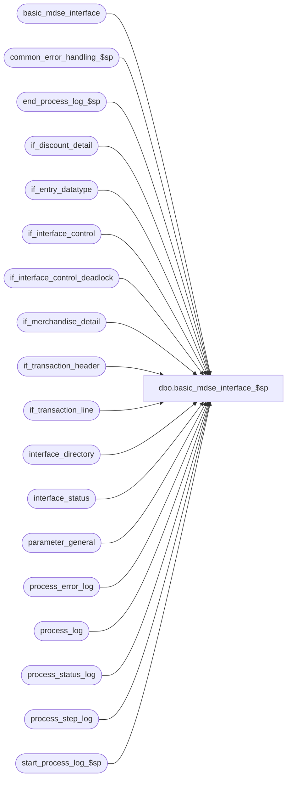

# dbo.basic_mdse_interface_$sp

**Database:** auditworks_external  
**Server:** bedrockdb01  

## Architecture Diagram



## Table Dependencies

| Referenced Table |
|---|
| basic_mdse_interface |
| common_error_handling_$sp |
| end_process_log_$sp |
| if_discount_detail |
| if_entry_datatype |
| if_interface_control |
| if_interface_control_deadlock |
| if_merchandise_detail |
| if_transaction_header |
| if_transaction_line |
| interface_directory |
| interface_status |
| parameter_general |
| process_error_log |
| process_log |
| process_status_log |
| process_step_log |
| start_process_log_$sp |

## Stored Procedure Code

```sql
create proc [dbo].[basic_mdse_interface_$sp] 
 AS

/*
** Proc name:   basic_mdse_interface_$sp
** Description: Build Merchandise Interface table named basic_mdse_interface 
** 		to be used by smartload script bscintface.ict to generate an
** 		ASCII file which will then be used by BASIX program to create:
** 		1) stock ledger interfaces *IFSLR & *IFSLX
** 		2) flash sales interface *IFFSS
** 		3) store interface *IFSTS
**		Table is built from if_transaction_header, if_transaction_line,
**		if_merchandise_detail, if_discount_detail
** HISTORY:
** Date     Name       Def# Desc
   Aug14,07 Paul    DV-1363 Apply 81895 to SA5
   Oct25,06 Phu       77931 Fix outer join for SQL 2005 Mode 90.
   Sep06,06 Tim       76719 apply 75320 to SA5
   May27,05 Paul    DV-1254 apply 40830 to SA5
   Apr28,05 Paul    DV-1234 expand transaction_id to use if_entry_datatype
   Sep30,04 David   DV-1146 Use column verified_by_user_id.
   Jan12,07 Vicci     81895 Support sale following loan, sale following rental, repair pickup, alteration pickup
   Sep06,06 Tim       75320  Null Concatenation Fix.
   Jan19,05 Vicci     47390  Add support for order delivery, pickup, and sale for pickup
   Sep03,04 Daphna  39407/40830  Remove logic to set the completed_flag in process_status_log, 
                                 it is done in reset_mdse_interface_$sp
   Aug21,02 Paul    1-EWHCR listed column names in select into to avoid MSSQL problem
** Nov13,01 Winnie     8846 R3 Error handling, add logic to log process_log.
** Aug08,01 Vicci      8472 Exit the proc when there is no data after waiting for 4 minutes
** Mar23,01 Bayani D.  7428 Reduce sleep time from 30 to 4 minutes before exiting if no data to process
** Mar09,01 Phu        7176 Split into several rows where units > 32767
** Jan23,01 Winnie     7220 check if merchandise interface flag is set to active, if not return
** Oct01,98 Paul
**          Phu        author
*/

DECLARE
	@split_counter			smallint,
	@cursor_open			smallint,
	@completed_workload		int,
	@current_date			smalldatetime,
	@employee_discount_amount	int,
	@empl_disc_per_unit		float,
	@errmsg 			nvarchar(255),
	@errno 				int,
	@first_batch			int,
	@from_date			datetime,
	@gross_sales_amount		int,
	@if_entry_no			if_entry_datatype,
	@line_id			numeric(5,0),
	@loop_flag			int,
	@last_posting_datetime		datetime,
	@max_if_entry 			if_entry_datatype,
	@message_id			int,
	@min_if_entry 			if_entry_datatype,
	@max_line_id			numeric(5,0),
	@object_name			nvarchar(255),
	@operation_name			nvarchar(100),
	@pos_discount_amount		int,
	@pos_disc_per_unit		float,
	@posting_in_progress 		tinyint,
	@prev_if_entry_no 		if_entry_datatype,
	@process_log_entry 		tinyint,
	@process_no 			smallint,
	@process_name			nvarchar(100),
	@process_start_time		datetime,
	@process_timestamp 		float,
	@register_no			nchar(5),
	@rows 				int,
	@row_count			int,
	@salesperson			nchar(9),
	@store_no			nchar(3),
	@terminate_interface		tinyint,
	@to_date			datetime,
	@transaction_count 		int,
	@transaction_date		nchar(8),
	@transaction_no			nchar(4),
	@units				int,
	@unit_price			float,
	@unit_remainded			int,
	@upc_lookup_division		nchar(2),
	@upc_no				nchar(14),
	@wait_for_edit_phase2		tinyint,
	@zero_filler			nchar(14)

SET CONCAT_NULL_YIELDS_NULL OFF

IF EXISTS( SELECT ascii_export
	FROM interface_directory
	WHERE interface_id = 1
	AND ascii_export = 1
	AND update_timing > 0 )
  SELECT @rows = 1
ELSE
  RETURN

IF EXISTS( SELECT if_entry_no
	FROM
	if_interface_control
	WHERE
	interface_id = 1
	AND interface_control_flag < 50 )
  SELECT @rows = 1
ELSE
  RETURN

SELECT  @cursor_open = 0,
	@max_if_entry = 0,
	@process_log_entry = 0,
	@process_no = 201,
	@transaction_count = 0,
	@process_timestamp = 0,
	@terminate_interface = 0,
	@wait_for_edit_phase2 = 2, -- wait edit phase2 for 4 minutes (2 minutes * 2)
	@zero_filler = '00000000000000',
	@process_name = 'basic_mdse_interface_$sp',
	@message_id = 201068,
	@loop_flag = 0

SELECT upc_lookup_division, store_no, register_no, transaction_date, transaction_no,
   upc_no, units, gross_sales_amount, pos_discount_amount, employee_discount_amount,
   salesperson, if_entry_no, line_id
  INTO #mdse_base
  FROM basic_mdse_interface
 WHERE upc_lookup_division IS NULL  
 SELECT @errno = @@error
IF @errno <> 0
  BEGIN
	SELECT @errmsg = 'Unable to select into #mdse_base from basic_mdse_interface',
	       @object_name = '#mdse_base',
	       @operation_name = 'SELECT'
	GOTO error
  END

SELECT upc_lookup_division, store_no, register_no, transaction_date, transaction_no,
   upc_no, units, gross_sales_amount, pos_discount_amount, employee_discount_amount,
   salesperson, if_entry_no, line_id
 INTO #mdse_split
  FROM #mdse_base

SELECT @errno = @@error
IF @errno <> 0
  BEGIN
	SELECT @errmsg = 'Unable to select into #mdse_split from #mdse_base',
	       @object_name = '#mdse_split',
	       @operation_name = 'SELECT'
	GOTO error
  END

CREATE TABLE #count_date (
        transaction_date smalldatetime,
        transaction_count int)

SELECT @errno = @@error
IF @errno != 0
  BEGIN
   SELECT @errmsg = 'Unable to create temp table #count_date',
          @object_name = '#count_date',
          @operation_name = 'CREATE'
   GOTO error
  END

WHILE @terminate_interface = 0
  BEGIN
    SELECT @min_if_entry = MIN(if_entry_no)
      FROM if_interface_control
     WHERE interface_id = 1
       AND interface_control_flag < 50

    SELECT @errno = @@error
    IF @errno <> 0
      BEGIN
	SELECT @errmsg = 'Unable to select min(if_entry_no) from if_interface_control',
	       @object_name = 'if_interface_control',
	       @operation_name = 'SELECT'
	GOTO error
      END

    IF @min_if_entry IS NULL /* then */
     BEGIN
       SELECT @posting_in_progress = posting_in_progress,
              @last_posting_datetime = last_posting_datetime
        FROM interface_status
        WHERE interface_id = 1

	SELECT @errno = @@error
	IF @errno <> 0
	  BEGIN
	    SELECT @errmsg = 'Unable to select posting_in_progress from interface_status (start)',
		   @object_name = 'interface_status',
		   @operation_name = 'SELECT'
	    GOTO error
	  END

       IF @posting_in_progress = 1
         BEGIN
          IF @wait_for_edit_phase2 = 0 BREAK
          SELECT @wait_for_edit_phase2 = @wait_for_edit_phase2 - 1
          WAITFOR DELAY '0:02:00'  /* wait for 2 minutes if edit is in progress before searching again */
          CONTINUE
         END

       BREAK
      END

      IF @loop_flag = 0 
	BEGIN
	  SELECT @first_batch = completed_flag,
	         @completed_workload = completed_workload
	    FROM process_status_log
	   WHERE process_no = @process_no

	  SELECT @errno = @@error
	  IF @errno <> 0
	    BEGIN
	      SELECT @errmsg = 'Unable to select completed_flag from process_status_log ',
		     @object_name = 'process_status_log',
		     @operation_name = 'SELECT'
		GOTO error
	    END

	  IF @first_batch IS NULL /* then */
           BEGIN
              INSERT process_status_log
 	             (process_no,
                      process_start_time,
                      expected_workload,
                      completed_workload,
                      completed_flag,
                      abort_requested,
                      transaction_qty)
	       VALUES (@process_no,
                      getdate(),
                      1,
                      0,
                      0,
                      0,
                      0)   
    
              SELECT @errno = @@error
	      IF @errno <> 0
	        BEGIN
	          SELECT @errmsg = 'Unable to insert process_status_log (initial)',
	                 @object_name = 'process_status_log',
		         @operation_name = 'INSERT'
		  GOTO error
		END

              INSERT process_step_log
	       	     (process_no,
		   stream_no,
		      process_step_no,
		      process_step_start_time,
		      expected_workload,
		      completed_workload)
	       VALUES (@process_no,
	               1,
		       64,
		       getdate(),
		       1,
		       0)	    	

        SELECT @errno = @@error
	      IF @errno <> 0
	 BEGIN
	          SELECT @errmsg = 'Unable to insert process_step_log (initial)',
	                @object_name = 'process_step_log',      
		         @operation_name = 'INSERT'
		   GOTO error
		END          
          END /* IF @first_batch IS NULL */

	  ELSE IF @first_batch = 1
	    BEGIN 
	      UPDATE process_status_log
		 SET completed_flag = 0,
		     expected_workload = 1,
		     completed_workload = 0,
		     transaction_qty = 0,
		     process_start_time = getdate()
	       WHERE process_no = @process_no
		 AND completed_flag = 1

	      SELECT @errno = @@error
	      IF @errno <> 0
		BEGIN
		  SELECT @errmsg = 'Unable to update process_status_log (initial)',
			 @object_name = 'process_status_log',
			 @operation_name = 'UPDATE'
		  GOTO error
		END

		UPDATE process_step_log
	           SET process_step_start_time = getdate(),
		       expected_workload = 1,
		       completed_workload = 0,
		       process_step_no = 64
		 WHERE process_no = @process_no
	           AND stream_no = 1
           
		SELECT @errno = @@error
		IF @errno <> 0
		BEGIN
		  SELECT @errmsg = 'Unable to update process_step_log (initial)',
			 @object_name = 'process_step_log',
			 @operation_name = 'UPDATE'
		  GOTO error
		END          
          END -- ELSE IF @first_batch = 1

          IF @first_batch IS NULL OR @first_batch = 1
           BEGIN
              SELECT @completed_workload = 0

              SELECT @current_date = CONVERT(smalldatetime, convert(nchar,getdate(),112)) 
              IF (SELECT trickle_polling_flag FROM parameter_general) = 0
                BEGIN
                  IF (SELECT datepart(hh,getdate())) > = 12
                    SELECT @from_date = dateadd(hh,12,dateadd(dd, -7, @current_date)),             
                               @to_date = dateadd(hh,12,dateadd(dd, -6, @current_date))
                  ELSE 
	            SELECT @from_date = dateadd(hh,12,dateadd(dd, -8, @current_date)),             
                             @to_date = dateadd(hh,12,dateadd(dd, -7, @current_date))
                END                                             
              ELSE
                SELECT @from_date = dateadd(dd,-7, @current_date),
                         @to_date = dateadd(dd,-6, @current_date) 

              SELECT @row_count = SUM(transaction_count)
                FROM process_log
               WHERE process_start_time >= @from_date
                 AND process_start_time < @to_date
                 AND process_no = @process_no

	      SELECT @errno = @@error
	      IF @errno <> 0
	        BEGIN
	          SELECT @errmsg = 'Unable to select from process_log ',
	                 @object_name = 'process_log',
		         @operation_name = 'SELECT'
		  GOTO error
		END          

              IF @row_count IS NULL OR @row_count = 0
                SELECT @row_count = 1

              UPDATE process_status_log
	         SET expected_workload = @row_count
   	       WHERE process_no = @process_no

	      SELECT @errno = @@error
	      IF @errno <> 0
	        BEGIN
	          SELECT @errmsg = 'Unable to update process_status_log for expected_workload',
	                 @object_name = 'process_status_log',
 	                 @operation_name = 'UPDATE'
	           GOTO error
	        END          

              UPDATE process_step_log
	         SET expected_workload = @row_count
	       WHERE process_no = @process_no
	         AND stream_no = 1

	      SELECT @errno = @@error
	      IF @errno <> 0
	        BEGIN
	          SELECT @errmsg = 'Unable to update process_step_log for expected_workload',
	               @object_name = 'process_step_log',
 	                 @operation_name = 'UPDATE'
	          GOTO error
	        END          
	  END -- IF @first_batch IS NULL OR @first_batch = 1
	END  -- IF @loop_flag = 0 

    SELECT @loop_flag = 1

    IF @process_log_entry = 0
      BEGIN
	EXEC start_process_log_$sp @process_no, @process_timestamp OUTPUT, @errmsg OUTPUT

	SELECT @errno = @@error
	IF @errno <> 0
	  BEGIN
	    IF @errmsg IS NULL /* then */
	      SELECT @errmsg = 'Unable to execute start_process_log_$sp'
	    SELECT @object_name = 'start_process_log_$sp',
		   @operation_name = 'EXECUTE'
	    GOTO error
	  END

	SELECT @process_log_entry = 1
      END

  SELECT @max_if_entry = @min_if_entry + 3000,
	   @wait_for_edit_phase2 = 2

    SELECT if_entry_no, interface_id
     INTO #if_int_control
     FROM if_interface_control
    WHERE interface_id = 1
      AND if_entry_no >= @min_if_entry
      AND if_entry_no <= @max_if_entry
      AND interface_control_flag < 50

    SELECT @errno = @@error,
	   @rows = @@rowcount
    IF @errno <> 0
      BEGIN
	SELECT @errmsg = 'Unable to insert into #if_int_control',
	       @object_name = '#if_int_control',
	       @operation_name = 'INSERT'
	GOTO error
      END

    IF @rows <= 0
      BEGIN
	DROP TABLE #if_int_control

	SELECT @errno = @@error
	IF @errno <> 0
	  BEGIN
		SELECT @errmsg = 'Unable to drop table #if_int_control',
		       @object_name = '#if_int_control',
		       @operation_name = 'DROP'
		GOTO error
	  END

	CONTINUE
      END

    TRUNCATE TABLE #mdse_base
    SELECT @errno = @@error
    IF @errno <> 0
      BEGIN
	SELECT @errmsg = 'Unable to truncate table #mdse_base',
	       @object_name = '#mdse_base',
	       @operation_name = 'TRUNCATE'
	GOTO error
      END

    TRUNCATE TABLE #mdse_split
    SELECT @errno = @@error
    IF @errno <> 0
      BEGIN
	SELECT @errmsg = 'Unable to truncate table #mdse_split',
	       @object_name = '#mdse_split',
	       @operation_name = 'TRUNCATE'
	GOTO error
      END

/* gross_sales_amount = gross_line_amount * db_cr_none
** pos_discount_amount = pos_discount_amount * db_cr_none
** employee_discount_amount = pos_discount_amount * db_cr_none * applied_flag
*/

    INSERT #mdse_base (
	upc_lookup_division,
	store_no,
	register_no,
	transaction_date,
	transaction_no,
	line_id,
	upc_no,
	units,
	gross_sales_amount,
	pos_discount_amount,
	employee_discount_amount,
	salesperson,
	if_entry_no )
    SELECT
	RIGHT (@zero_filler + LTRIM (STR (upc_lookup_division, 2)), 2),
	RIGHT (@zero_filler + LTRIM (STR (store_no, 3)), 3),
	RIGHT (@zero_filler + LTRIM (STR (register_no, 5)), 5),
	CONVERT (nchar(8), transaction_date, 1),
	RIGHT (@zero_filler + LTRIM (STR (transaction_no, 8)), 4),
	l.line_id,
	RIGHT (@zero_filler + LTRIM (STR (upc_no, 14)), 14),
	CONVERT (INT, units * voiding_reversal_flag),
	CONVERT (INT, l.gross_line_amount * l.db_cr_none * 100 * voiding_reversal_flag),
	ISNULL (CONVERT (INT, l.pos_discount_amount * l.db_cr_none * -100 * voiding_reversal_flag), 0),
	ISNULL (CONVERT (INT, SUM (d.pos_discount_amount * l.db_cr_none
							 * CONVERT (SMALLINT, d.applied_flag)
							 * -100 * voiding_reversal_flag
							 * (  (1 - SIGN (ABS (d.pos_discount_level - 17)))
							    + (1 - SIGN (ABS (d.pos_discount_level - 19)))
							   )
				  )
			), 0
		),
	RIGHT (@zero_filler + LTRIM (STR (salesperson, 9)), 9),
	h.if_entry_no
    FROM
	#if_int_control c
	INNER JOIN if_transaction_header h ON (c.if_entry_no = h.if_entry_no)
	INNER JOIN if_transaction_line l ON (h.if_entry_no = l.if_entry_no)
	INNER JOIN if_merchandise_detail m ON (l.if_entry_no = m.if_entry_no AND l.line_id = m.line_id AND m.upc_lookup_division <> 0)
	LEFT JOIN if_discount_detail d ON (l.if_entry_no = d.if_entry_no AND l.line_id = d.line_id)
    WHERE transaction_void_flag * (transaction_void_flag - 8) = 0
    AND line_void_flag = 0
    AND date_reject_id = 0
    AND db_cr_none != 0
    AND line_action IN ( 1, 2, 101, 102, 201, 90, 137, 142, 6, 222, 229, 197 )
    AND upc_lookup_division <> 0
    GROUP BY
	RIGHT (@zero_filler + LTRIM (STR (upc_lookup_division, 2)), 2),
	RIGHT (@zero_filler + LTRIM (STR (store_no, 3)), 3),
	RIGHT (@zero_filler + LTRIM (STR (register_no, 5)), 5),
	CONVERT (nchar(8), transaction_date, 1),
	RIGHT (@zero_filler + LTRIM (STR (transaction_no, 8)), 4),
	l.line_id,
	RIGHT (@zero_filler + LTRIM (STR (upc_no, 14)), 14),
	CONVERT (INT, units * voiding_reversal_flag),
	CONVERT (INT, l.gross_line_amount * l.db_cr_none * 100 * voiding_reversal_flag),
	ISNULL (CONVERT (INT, l.pos_discount_amount * l.db_cr_none * -100 * voiding_reversal_flag), 0),
	RIGHT (@zero_filler + LTRIM (STR (salesperson, 9)), 9),
	h.if_entry_no

    SELECT @errno = @@error
    IF @errno <> 0
      BEGIN
	SELECT @errmsg = 'Unable to insert into #mdse_base (1)',
	       @object_name = '#mdse_base',
	       @operation_name = 'INSERT'
	GOTO error
      END

    INSERT #mdse_split (
	upc_lookup_division,
	store_no,
	register_no,
	transaction_date,
	transaction_no,
	line_id,
	upc_no,
	units,
	gross_sales_amount,
	pos_discount_amount,
	employee_discount_amount,
	salesperson,
	if_entry_no )
    SELECT
	upc_lookup_division,
	store_no,
	register_no,
	transaction_date,
	transaction_no,
	line_id,
	upc_no,
	units,
	gross_sales_amount,
	pos_discount_amount,
	employee_discount_amount,
	salesperson,
	if_entry_no
    FROM #mdse_base
    WHERE units > 32767

    SELECT @errno = @@error, @rows = @@rowcount

    IF @errno <> 0
      BEGIN
	SELECT @errmsg = 'Unable to insert into #mdse_split from #mdse_base',
	       @object_name = '#mdse_split',
	       @operation_name = 'INSERT'
	GOTO error
      END

    IF @rows > 0
      BEGIN
	SELECT @cursor_open = 0

	DECLARE mdse_crsr CURSOR FOR
	SELECT
		upc_lookup_division,
		store_no,
		register_no,
		transaction_date,
		transaction_no,
		line_id,
		upc_no,
		units,
		gross_sales_amount,
		pos_discount_amount,
		employee_discount_amount,
		salesperson,
		if_entry_no
	FROM #mdse_split

	SELECT @errno = @@error
	IF @errno <> 0
	  BEGIN
		SELECT @errmsg = 'Unable to declare cursor mdse_crsr',
		       @object_name = 'mdse_crsr',
		       @operation_name = 'DECLARE'
		GOTO error
	  END

	OPEN mdse_crsr
	SELECT @cursor_open = 1, @prev_if_entry_no = -1

	WHILE 1 = 1
	  BEGIN
	    FETCH mdse_crsr INTO
		@upc_lookup_division,
		@store_no,
		@register_no,
		@transaction_date,
		@transaction_no,
		@line_id,
		@upc_no,
		@units,
		@gross_sales_amount,
		@pos_discount_amount,
		@employee_discount_amount,
		@salesperson,
		@if_entry_no

	    IF @@fetch_status <> 0
		BREAK

	    IF @prev_if_entry_no <> @if_entry_no
	      BEGIN
		SELECT @prev_if_entry_no = @if_entry_no

		SELECT @max_line_id = MAX(line_id)
 		  FROM if_transaction_line
		 WHERE if_entry_no = @if_entry_no

		SELECT @errno = @@error
		IF @errno <> 0
		  BEGIN
		    SELECT @errmsg = 'Unable to select max_line_id from if_transaction_line',
		           @object_name = 'if_transaction_line',
		           @operation_name = 'SELECT'
		    GOTO error
		  END

	      END  -- if @prev_if_entry_no <> @if_entry_no

	    SELECT @split_counter = CONVERT(smallint, CEILING(CONVERT(float, ABS(@units)) / 32000)),
		   @unit_price = ABS(CONVERT(float, @gross_sales_amount) / @units),
		   @pos_disc_per_unit = ABS(CONVERT(float, @pos_discount_amount) / @units),
		   @empl_disc_per_unit = ABS(CONVERT(float, @employee_discount_amount) / @units),
		   @unit_remainded = ABS(@units)

	    WHILE @split_counter > 0
	      BEGIN
		SELECT @split_counter = @split_counter - 1, @max_line_id = @max_line_id + 1
		IF @unit_remainded >= ABS(@units)
		  SELECT @unit_remainded = @unit_remainded - 32000,
			 @units = SIGN(@units) * 32000
		ELSE
		  SELECT @units = SIGN(@units) * @unit_remainded

		INSERT #mdse_base (
		  upc_lookup_division,
		  store_no,
		  register_no,
		  transaction_date,
		  transaction_no,
		  line_id,
		  upc_no,
		  units,
		  gross_sales_amount,
		  pos_discount_amount,
		  employee_discount_amount,
		  salesperson,
		  if_entry_no )
		VALUES (
		  @upc_lookup_division,
		  @store_no,
		 @register_no,
		  @transaction_date,
		  @transaction_no,
		  @max_line_id,
		  @upc_no,
		  @units,
		  CONVERT(int, SIGN(@gross_sales_amount) * (@unit_price * ABS(@units))),
		  CONVERT(int, SIGN(@pos_discount_amount) * (@pos_disc_per_unit * ABS(@units))),
		  CONVERT(int, SIGN(@employee_discount_amount) * (@empl_disc_per_unit * ABS(@units))),
		  @salesperson,
		  @if_entry_no )

		SELECT @errno = @@error
		IF @errno <> 0
		  BEGIN
		    SELECT @errmsg = 'Unable to insert #mdse_base (2)',
		           @object_name = '#mdse_base',
	   	           @operation_name = 'INSERT'
		    GOTO error
		  END
	      END  -- while @split_counter > 0
	  END  -- while 1 = 1

	CLOSE mdse_crsr
	DEALLOCATE mdse_crsr
	SELECT @cursor_open = 0

      END  -- if @rows > 0

    BEGIN TRAN

    INSERT basic_mdse_interface (
	upc_lookup_division,
	store_no,
	register_no,
	transaction_date,
	transaction_no,
	line_id,
	upc_no,
	units,
	gross_sales_amount,
	pos_discount_amount,
	employee_discount_amount,
	salesperson,
	if_entry_no )
    SELECT
	upc_lookup_division,
	store_no,
	register_no,
	transaction_date,
	transaction_no,
	line_id,
	upc_no,
	units,
	gross_sales_amount,
	pos_discount_amount,
	employee_discount_amount,
	salesperson,
	if_entry_no
    FROM #mdse_base
    WHERE units <= 32767

    SELECT @errno = @@error,
	   @transaction_count = @transaction_count + @@rowcount

    IF @errno <> 0
      BEGIN
	SELECT @errmsg = 'Unable to insert basic_mdse_interface',
               @object_name = 'basic_mdse_interface',
               @operation_name = 'INSERT'
	GOTO error
      END

/* simulate table lock on if_interface_control */

    UPDATE if_interface_control_deadlock
     SET function_no = 201,
         status_date = getdate()

    SELECT @errno = @@error
    IF @errno <> 0
      BEGIN
	SELECT @errmsg = 'Unable to set function_no in if_interface_control_deadlock',
               @object_name = 'if_interface_control_deadlock',
               @operation_name = 'UPDATE'
	GOTO error
      END

    UPDATE if_interface_control
    SET interface_control_flag = 50
    FROM if_interface_control i, #if_int_control c
    WHERE i.if_entry_no = c.if_entry_no
    AND i.interface_id = c.interface_id
    AND i.interface_control_flag < 50

    SELECT @errno = @@error,
           @row_count = @@rowcount
    IF @errno <> 0
      BEGIN
	SELECT @errmsg = 'Unable to set interface_control_flag to 50 in if_interface_control',
               @object_name = 'if_interface_control',
               @operation_name = 'UPDATE'
	GOTO error
      END

    UPDATE process_status_log
       SET completed_workload = @completed_workload + @transaction_count,
           transaction_qty = transaction_qty + @row_count
     WHERE process_no = @process_no
    
    SELECT @errno = @@error
    IF @errno <> 0
      BEGIN
        SELECT @errmsg = 'Unable to update process_status_log for completed_workload',
               @object_name = 'process_status_log',
               @operation_name = 'UPDATE'
        GOTO error
      END          

    UPDATE process_step_log
       SET completed_workload = @completed_workload + @transaction_count,
           process_step_start_time = getdate()
     WHERE process_no = @process_no
       AND stream_no = 1
   
    SELECT @errno = @@error
    IF @errno <> 0
      BEGIN
        SELECT @errmsg = 'Unable to update process_step_log for completed_workload',
               @object_name = 'process_step_log',
               @operation_name = 'UPDATE'
        GOTO error
      END          

    COMMIT TRAN

    DROP TABLE #if_int_control

    SELECT @errno = @@error
    IF @errno <> 0
      BEGIN
	SELECT @errmsg = 'Unable to drop table #if_int_control',
               @object_name = '#if_int_control',
               @operation_name = 'DROP'
	GOTO error
      END

  END /* while @terminate_interface = 0 */

UPDATE process_step_log
   SET process_step_no = -1,
       process_step_start_time = getdate()
 WHERE process_no = @process_no
   AND stream_no = 1

SELECT @errno = @@error    
IF @errno <> 0
  BEGIN
   SELECT @errmsg = 'Unable to update process_step_log to step_no -1',
          @object_name = 'process_step_log',
          @operation_name = 'UPDATE'
   GOTO error
  END          

DROP TABLE #count_date
SELECT @errno = @@error
IF @errno <> 0
  BEGIN
    SELECT @errmsg = 'Unable to drop table #count_date',
           @object_name = '#count_date',
           @operation_name = 'DROP'		  
    GOTO error
  END

IF @process_log_entry = 1
  BEGIN
   EXEC end_process_log_$sp @process_no, @process_timestamp, @transaction_count

   SELECT @errno = @@error
   IF @errno <> 0
     BEGIN
	SELECT @errmsg = 'Unable to exec end_process_log_$sp',
               @object_name = 'end_process_log_$sp',
               @operation_name = 'EXECUTE'
	GOTO error
      END

   UPDATE process_error_log
      SET verified = 1,
          verified_by_user_id = NULL -- system
    WHERE process_no = @process_no
      AND verified = 0

   SELECT @errno = @@error
   IF @errno <> 0
     BEGIN
	SELECT @errmsg = 'Unable to update process_error_log',
	       @object_name = 'process_error_log',
   	       @operation_name = 'UPDATE'
	GOTO error
     END

   UPDATE process_log
      SET process_status_flag = 3
    WHERE process_start_time = process_end_time
      AND process_no = @process_no
      AND process_status_flag = 1

   SELECT @errno = @@error
   IF @errno <> 0
     BEGIN
	SELECT @errmsg = 'Unable to update process_log',
               @object_name = 'process_log',
               @operation_name = 'UPDATE'
	GOTO error
     END

   UPDATE interface_status
      SET last_retrieval_datetime = getdate()
    WHERE interface_id = 1

   SELECT @errno = @@error
   IF @errno <> 0
     BEGIN
	SELECT @errmsg = 'Unable to set last_retrieval_datetime in interface_status',
               @object_name = 'interface_status',
               @operation_name = 'UPDATE'
	GOTO error
     END
  END /* If @process_log_entry = 1 */

RETURN

error:   /* Common error handler */
	IF @cursor_open <> 0
	  BEGIN
		CLOSE mdse_crsr
		DEALLOCATE mdse_crsr
	  END

	  EXEC common_error_handling_$sp @process_no, @errno, @errmsg, 0, @message_id, 
  	    @process_name, @object_name, @operation_name, 1, 1, 
  	    @process_log_entry, @process_timestamp, @transaction_count

	RETURN
```

