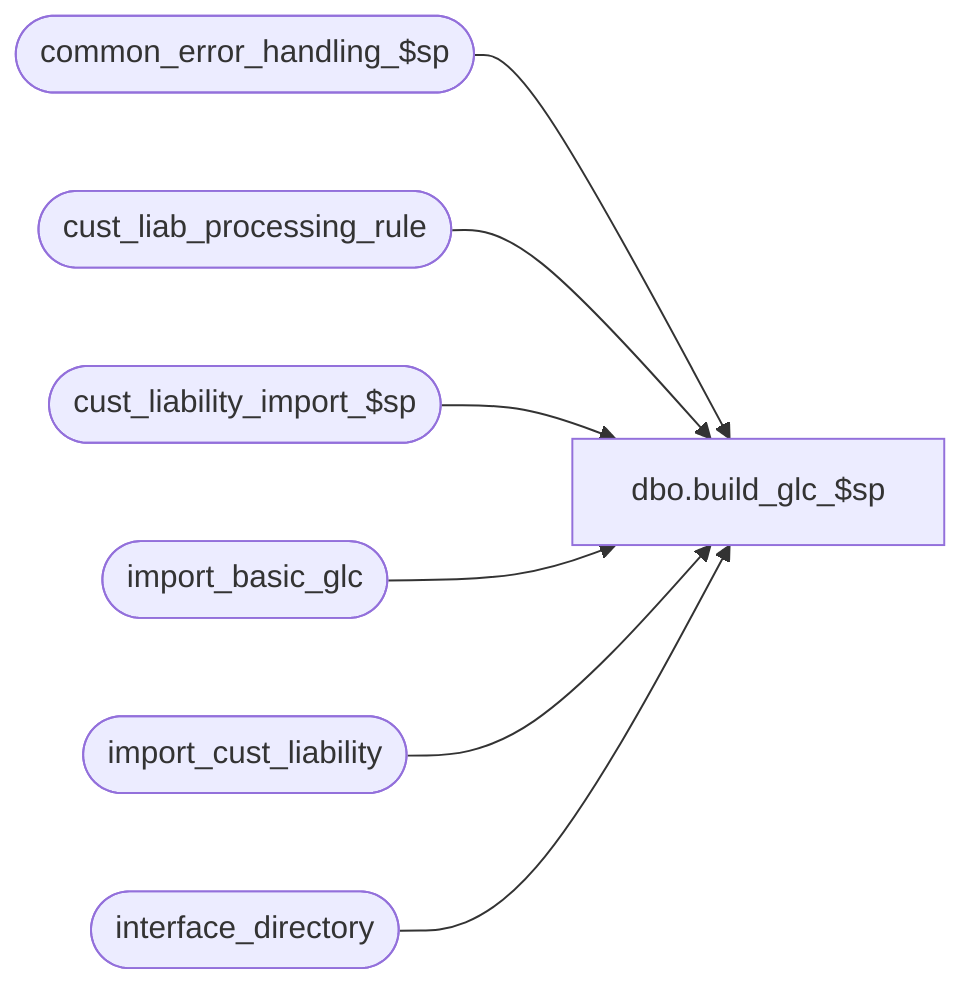

# dbo.build_glc_$sp

**Database:** auditworks_external  
**Server:** bedrockdb01  

## Architecture Diagram



## Table Dependencies

| Referenced Table |
|---|
| common_error_handling_$sp |
| cust_liab_processing_rule |
| cust_liability_import_$sp |
| import_basic_glc |
| import_cust_liability |
| interface_directory |

## Stored Procedure Code

```sql
create proc [dbo].[build_glc_$sp] 
AS

/*	
PROC NAME: build_glc_$sp		
     DESC: Basically takes the entry from import_basic_glc and builds two tables with it:
 	   customer_liability and customer_liability_action.
 	   For R3 customer liability, load data in import_cust_liability and call cust_liability_import_$sp

HISTORY: 
Date     Name         Defect# Desc
Oct25,06 Phu            77931 Fix outer join for SQL 2005 Mode 90.
Apr07,04 Sab	    DV-1068 Removed variable @old_glc and block of code "IF @old_glc = 1"
Feb18,02 David C      AW-8415 R3 customer liability
Aug09,01 Henry           8475 Optimize code, add index hints.
Nov08,99 Daphna F        5540 Ensure reference_no is padded with '0'  	   
*/

DECLARE
	@errno			int,
	@errmsg			nvarchar(255),
	@message_id		int,
	@new_glc		bit,
	@object_name		nvarchar(255),
	@operation_name		nvarchar(100),
	@posting_date_time	smalldatetime,
	@process_name		nvarchar(100),
	@process_no 		smallint,
	@reference_no		nvarchar(20),
	@reference_no_length	tinyint,
	@str1			nvarchar(20)

SELECT  @new_glc = 0,
	@process_no = 242,
	@process_name = 'build_glc_$sp',
	@message_id = 201068

IF EXISTS ( SELECT interface_id 
              FROM interface_directory
             WHERE interface_id = 28 
               AND update_timing > 0 )
SELECT @new_glc = 1

IF @new_glc = 0 RETURN

SELECT i.object, i.action, MIN(p.rule_id) AS rule_id
  INTO #process_rule
  FROM import_basic_glc i
       LEFT JOIN cust_liab_processing_rule p ON (i.object = p.line_object AND i.action = p.line_action AND p.transaction_category = 242)
 GROUP BY i.object, i.action
   
SELECT @errno = @@error
IF @errno <> 0
BEGIN
  SELECT @errmsg = 'Unable to select into #process_rule',
	 @object_name = '#process_rule',
	 @operation_name = 'CREATE'
  GOTO error
END 

IF EXISTS (SELECT rule_id FROM #process_rule 
	    WHERE rule_id IS NULL )
  BEGIN
    SELECT @errmsg = 'cust_liab_processing rule for the object/action being imported has not been defined',
           @errno = 201649, 
           @message_id = 201649
    GOTO error
  END
  
INSERT import_cust_liability (
  	rule_id, 
  	reference_no, 
  	date_issued, 
  	issuing_store_no, 
  	action_amount  )
SELECT	r.rule_id, 
	i.reference_no, 
	i.transaction_date, 
	i.store_no, 
	i.amount
   FROM import_basic_glc i, #process_rule r
  WHERE i.object = r.object 
    AND i.action = r.action

SELECT @errno = @@error
IF @errno <> 0
BEGIN
  SELECT @errmsg = 'Unable to insert into import_cust_liability',
	 @object_name = 'import_cust_liability',
	 @operation_name = 'INSERT'
  GOTO error
END 

EXEC cust_liability_import_$sp

SELECT @errno = @@error
IF @errno !=0
BEGIN
  IF @errmsg IS NULL 
    SELECT @errmsg='Failed to execute cust_liability_import_$sp'

  SELECT @object_name = 'cust_liability_import_$sp',
	 @operation_name = 'EXECUTE'
  GOTO error
END

RETURN

/* error handling routine */
error:
	EXEC common_error_handling_$sp @process_no, @errno, @errmsg, 0, @message_id, 
	@process_name, @object_name, @operation_name, 1

	RETURN
```

