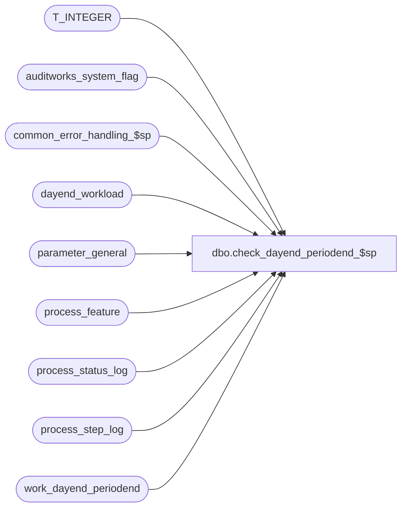

# dbo.check_dayend_periodend_$sp

**Database:** auditworks_external  
**Server:** bedrockdb01  

## Architecture Diagram



## Table Dependencies

| Referenced Table |
|---|
| T_INTEGER |
| auditworks_system_flag |
| common_error_handling_$sp |
| dayend_workload |
| parameter_general |
| process_feature |
| process_status_log |
| process_step_log |
| work_dayend_periodend |

## Stored Procedure Code

```sql
create proc dbo.check_dayend_periodend_$sp ( @process_id             binary(16),
  @source_request         tinyint = 1, -- 1:day-end (the UI DayEnd screen doesn't call this proc anymore), 2: UI period-end screen
  @status                 int OUTPUT
)

AS

/* 
Name: check_dayend_periodend_$sp
Description: This procedure is used to check whether the dayend and optional period end are currently running,
             and populate the work_dayend_periodend table if dayend is running.
             Called from n-tier Period End batch process screen ONLY, and only on consolidated.

Notes:  dayend_in_progress turned on by dayend_populate_$sp and off by dayend_housekeeping_$sp.
        immediate_dayend_requested turned off or to 9 by dayend_populate_$sp
        day_end_started_date is set by dayend_populate_$sp (if it is not just doing the next batch or not period end only).
        day_end_completed_date is set by both dayend_posting_$sp (unlesss period_end_only = 1) 
        	and further bumped by dayend_housekeeping_$sp (if posting had already set it).
        function status 18 is inserted by dayend_end_populate_$sp, has its process_id bumped by dayend_posting_$sp,
        	has its process_id bumped and is function changed to 16 the deleted by dayend_housekeeping.
        period_end_only is turned on by UI if selected, and is turned off by period_end_$sp.
        context info is set to auditworks_dayendX (where X is strem) by D/E pop, post, period end and housekeeping.
        period_end_status: period_end_status set to 0 and process_start_time set when starts;
                           remains 0 and process_end_time set when completes normally;
                           set to 1 if period end aborts/errors out.
	period_end_in_progress:  set to 1 by period end, set to 0 by reset_period_end_$sp or by error encountered in period end.
	period_end_locked_by:  set to user_id of user requesting period end by UI, copied to period_end_completed_by via reset_period_end_$sp
	Smartload dayend/dayend1 flow:
		day_end_populate_$sp
		day_end_posting_$sp 1
		period_end_$sp
		check_period_end_dates_$sp
		reset_period_end_$sp
		dayend_housekeeping_$sp 1
	Period End cancellation: turns off period end date, prelim period end date, period end only;  sets cancelled date.

returned @status:
   0       Ready (runnable)
   1       Pending (already requested and waiting to be run)
   2       Running
   3       No store-date to day-end
   4       Cancelled by user
   5       Aborted
   > 100   Aborted with Business rule number

HISTORY
Date     Name            Defect# Description
May21,14 Vicci         TFS-69544 Set status to 1=Pending, not 5=Aborted when request to run period end upon next dayend (as opposed to immediately) has been issued.
Apr15,13 Vicci            143314 Remove @source_request = 1 handling to avoid confusion, since the UI does not call this proc from DayEnd.
				 Handle dayend_in_progress = 1 / period_end_only = 1 combination.
				 Remove call to day_end_cleanup_$sp since it can't be called from UI due to timing
				 issues: it is normal for dayend_in_progress to be on but the spid in function status not
				 actually running in between ICT switches from populate to posting to housekeeping (the
				 proc was only intended for use by dayend itself).  Likewise do not change status flags in this proc:  this
				 is already done correctly by DayEnd and PeriodEnd procs and ICT, and can be done from
				 function cleanup if necessary.  Also, don't bother returning error code as
				 status for aborted since UI doesn't use it anyhow (and since it isn't looking on peripherals) and since UI 
				 doesn't handle a negative status (and error numbers can be negative).
Oct01,07 Phu               91846 Return correct status to caller.
Feb06,07 Phu               81714 Return status of dayend to the caller.
Oct25,06 Phu               77931 Fix outer join for SQL 2005 Mode 90.
Feb24,06 Phu        DV-1328 Don't populate work table if day-end is not running.
Jan19,06 Phu             DV-1329 author

*/

DECLARE
  @current_datetime               datetime,
  @day_end_cancelled_date         datetime,
  @day_end_completed_date  datetime,
  @day_end_request_date           datetime,
  @day_end_started_date           datetime,
  @day_end_start_from_date        datetime,
  @dayend_in_progress             tinyint,
  @error_code                     int,
  @errmsg                         nvarchar(255),
  @errno                          int,
  @front_end_refresh_interval     int, -- in seconds
  @immediate_dayend_requested     tinyint,              
  @instance_id                    T_INTEGER,
  @last_date_closed               smalldatetime,
  @log_flag                       tinyint,
  @message_id                     int,
  @object_name                    nvarchar(255),
  @operation_name                 nvarchar(100),
  @outstanding_store_date         int,
  @period_end_cancelled_date      datetime,
  @period_end_completed_date      datetime,
  @period_end_date                smalldatetime,
  @period_end_in_progress         tinyint,
  @period_end_only                tinyint,
  @period_end_request_date        datetime,
  @period_end_started_date        datetime,
  @period_end_start_from_date     datetime,
  @preliminary_period_end_date    smalldatetime,
  @process_name                   nvarchar(100),
  @process_no                     smallint,
  @process_start_time             datetime,
  @process_timestamp              float,
  @status2                        int,
  @transaction_count              int


SELECT @process_name = 'check_dayend_periodend_$sp',
       @message_id = 201068,
       @log_flag = 0,
       @process_no = 18,
       @immediate_dayend_requested = 0,
       @instance_id = 0,
       @current_datetime = getdate(),
       @status = 0,
       @front_end_refresh_interval = 35 -- 30 seconds for actual intervals + 5 seconds for buffer

SELECT @instance_id = CONVERT(smallint, flag_numeric_value)
  FROM auditworks_system_flag
 WHERE flag_name = 'instance_id'
SELECT @errno = @@error
IF @errno != 0
BEGIN
  SELECT @errmsg = 'Failed to select from auditworks_system_flag',
         @object_name = 'auditworks_system_flag',
         @operation_name = 'SELECT'
  GOTO error
END

SELECT @immediate_dayend_requested = immediate_dayend_requested,
       @dayend_in_progress = dayend_in_progress,
       @period_end_in_progress = period_end_in_progress,
       @preliminary_period_end_date = preliminary_period_end_date,
       @period_end_date = period_end_date,
       @last_date_closed = last_date_closed
  FROM parameter_general
SELECT @errno = @@error
IF @errno != 0
BEGIN
  SELECT @errmsg = 'Failed to select immediate_dayend_requested from parameter_general',
         @object_name = 'parameter_general',
         @operation_name = 'SELECT'
  GOTO error
END

SELECT @day_end_cancelled_date = flag_datetime_value
  FROM auditworks_system_flag
 WHERE flag_name = 'day_end_cancelled_date'
SELECT @errno = @@error
IF @errno != 0
BEGIN
  SELECT @errmsg = 'Failed to select day_end_cancelled_date',
         @object_name = 'auditworks_system_flag',
         @operation_name = 'SELECT'
  GOTO error
END

SELECT @day_end_completed_date = flag_datetime_value
  FROM auditworks_system_flag
 WHERE flag_name = 'day_end_completed_date'
SELECT @errno = @@error
IF @errno != 0
BEGIN
  SELECT @errmsg = 'Failed to select day_end_completed_date',
         @object_name = 'auditworks_system_flag',
         @operation_name = 'SELECT'
  GOTO error
END

SELECT @day_end_request_date = flag_datetime_value
  FROM auditworks_system_flag
 WHERE flag_name = 'day_end_request_date'
SELECT @errno = @@error
IF @errno != 0
BEGIN
  SELECT @errmsg = 'Failed to select day_end_request_date',
         @object_name = 'auditworks_system_flag',
         @operation_name = 'SELECT'
  GOTO error
END

SELECT @day_end_started_date = flag_datetime_value
  FROM auditworks_system_flag
 WHERE flag_name = 'day_end_started_date'
SELECT @errno = @@error
IF @errno != 0
BEGIN
  SELECT @errmsg = 'Failed to select day_end_started_date',
         @object_name = 'auditworks_system_flag',
         @operation_name = 'SELECT'
  GOTO error
END

-- values of period_end_only:
-- 1: run period end only
-- 2: run period end upon the next day-end
-- 3: run day-end and period end immediately 
SELECT @period_end_only = flag_numeric_value -- front end sets this value
  FROM auditworks_system_flag
 WHERE flag_name = 'period_end_only'
SELECT @errno = @@error
IF @errno != 0
BEGIN
  SELECT @errmsg = 'Failed to select period_end_only',
         @object_name = 'auditworks_system_flag',
         @operation_name = 'SELECT'
  GOTO error
END

SELECT @period_end_cancelled_date = flag_datetime_value
  FROM auditworks_system_flag
 WHERE flag_name = 'period_end_cancelled_date'
SELECT @errno = @@error
IF @errno != 0
BEGIN
  SELECT @errmsg = 'Failed to select period_end_cancelled_date',
         @object_name = 'auditworks_system_flag',
         @operation_name = 'SELECT'
  GOTO error
END

SELECT @period_end_completed_date = flag_datetime_value
  FROM auditworks_system_flag
 WHERE flag_name = 'period_end_completed_date'
SELECT @errno = @@error
IF @errno != 0
BEGIN
  SELECT @errmsg = 'Failed to select period_end_completed_date',
         @object_name = 'auditworks_system_flag',
         @operation_name = 'SELECT'
  GOTO error
END

SELECT @period_end_request_date = flag_datetime_value
  FROM auditworks_system_flag
 WHERE flag_name = 'period_end_request_date'
SELECT @errno = @@error
IF @errno != 0
BEGIN
  SELECT @errmsg = 'Failed to select period_end_request_date',
         @object_name = 'auditworks_system_flag',
         @operation_name = 'SELECT'
  GOTO error
END

SELECT @period_end_started_date = flag_datetime_value
  FROM auditworks_system_flag
 WHERE flag_name = 'period_end_started_date'
SELECT @errno = @@error
IF @errno != 0
BEGIN
  SELECT @errmsg = 'Failed to select period_end_started_date',
         @object_name = 'auditworks_system_flag',
         @operation_name = 'SELECT'
  GOTO error
END

SELECT @period_end_request_date = ISNULL(@period_end_request_date, @current_datetime)

IF ISNULL(@period_end_started_date, @current_datetime) > @period_end_request_date
  SELECT @period_end_start_from_date = ISNULL(@period_end_started_date, @current_datetime)
ELSE
  SELECT @period_end_start_from_date = @period_end_request_date

SELECT @outstanding_store_date = COUNT(store_no)
  FROM dayend_workload
SELECT @errno = @@error
IF @errno != 0
BEGIN
  SELECT @errmsg = 'Failed to select count(store_no)',
         @object_name = 'dayend_workload',
    @operation_name = 'SELECT'
  GOTO error
END

-- Cleanup table first.
-- Will populate the status to be displayed by front end if dayend is running.
DELETE work_dayend_periodend
 WHERE process_id = @process_id
SELECT @errno = @@error
IF @errno != 0
BEGIN
  SELECT @errmsg = 'Failed to delete rows in table work_dayend_periodend',
         @object_name = 'work_dayend_periodend',
         @operation_name = 'DELETE'
  GOTO error
END

IF @source_request = 2 -- period-end screen is requesting the status
BEGIN
  IF (@preliminary_period_end_date IS NULL AND @period_end_date = @last_date_closed)  --i.e. no period end is outstanding
  BEGIN
    IF (@period_end_cancelled_date > @period_end_completed_date OR @period_end_completed_date IS NULL) AND (@period_end_cancelled_date > @period_end_request_date OR @period_end_request_date IS NULL)
    BEGIN
      SELECT @status = 4 -- cancelled
      RETURN      
    END
    ELSE
    BEGIN
      SELECT @status = 0 -- ready
      RETURN
    END
  END
  ELSE  --a period end is outstanding
  BEGIN
    IF (@period_end_only = 2 OR @immediate_dayend_requested > 0) AND @dayend_in_progress = 0 --immediate run request is outstanding but hasn't reached dayend populate yet
    BEGIN
      SELECT @status = 1 -- pending
      RETURN
    END
    ELSE
    BEGIN
      IF @dayend_in_progress = 0   --i.e. a period end is outstanding but there is no longer any outstanding request nor is dayend/period-end currently running 
      BEGIN
        SELECT @status = 5 --aborted
        RETURN
      END
      ELSE
      BEGIN
        SELECT @status = 2 -- running
        
        INSERT INTO work_dayend_periodend (
               process_id,
               instance_id,
               process_no,
               process_start_time,
               process_step_no,
               process_step_start_time,
               transaction_qty,
               process_completed_workload,
               process_expected_workload,
               step_completed_workload,
               step_expected_workload,
               stream_no,
               abortable_process,
               aborted_requested,
               immediate_dayend_requested,
               completed_flag,
               dayend_status )
        SELECT @process_id,
               @instance_id,
               sta.process_no,
               sta.process_start_time,
               ste.process_step_no,
               ste.process_step_start_time,
               COALESCE(sta.transaction_qty, 0),
               sta.completed_workload,
               sta.expected_workload,
               ste.completed_workload,
               ste.expected_workload,
               ste.stream_no,
               COALESCE(f.abortable, 0),
               SIGN(sta.abort_requested),
               @immediate_dayend_requested,
               sta.completed_flag,
               CONVERT(smallint, CASE WHEN @status > 32767 or @status < 0 THEN 5 ELSE @status END)
          FROM process_status_log sta
         INNER JOIN process_step_log ste ON (sta.process_no = ste.process_no)
          LEFT JOIN process_feature f ON (sta.process_no = f.process_no)
         WHERE sta.completed_flag = 0
           AND sta.process_no = 18 -- dayend;  note that period end is just step 45 in the dayend process
        SELECT @errno = @@error
        IF @errno != 0
        BEGIN
          SELECT @errmsg = 'Failed to insert work_dayend_periodend.',
                 @object_name = 'work_dayend_periodend',
                 @operation_name = 'INSERT'
          GOTO error
        END
      END
    END
  END
END  --IF @source_request = 2


RETURN

error:

  EXEC common_error_handling_$sp @process_no, @errno, @errmsg, 0, @message_id,
       @process_name, @object_name, @operation_name, @log_flag, 1, 0, null, 0,
       null, null, null, null, null, null, 0, @process_id, null --
	     
  RETURN
```

