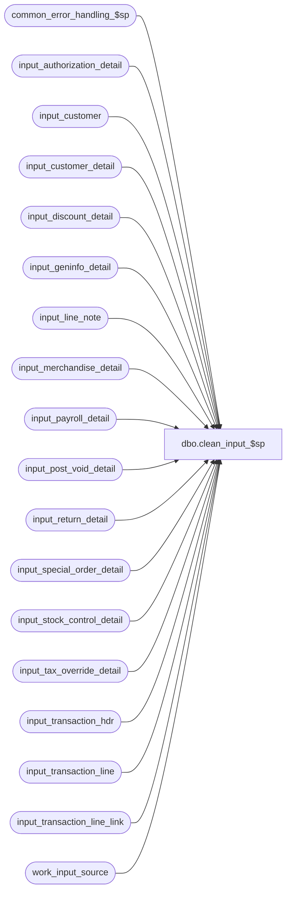

# dbo.clean_input_$sp

**Database:** auditworks_external  
**Server:** bedrockdb01  

## Architecture Diagram



## Table Dependencies

| Referenced Table |
|---|
| common_error_handling_$sp |
| input_authorization_detail |
| input_customer |
| input_customer_detail |
| input_discount_detail |
| input_geninfo_detail |
| input_line_note |
| input_merchandise_detail |
| input_payroll_detail |
| input_post_void_detail |
| input_return_detail |
| input_special_order_detail |
| input_stock_control_detail |
| input_tax_override_detail |
| input_transaction_hdr |
| input_transaction_line |
| input_transaction_line_link |
| work_input_source |

## Stored Procedure Code

```sql
create proc dbo.clean_input_$sp 
@process_id	binary(16),
@user_id	int,
@input_id	int,
@errmsg		nvarchar(255) OUTPUT

AS

/* 
PROC NAME: clean_input_$sp
     DESC: Cleanup input tables. Called by cust_liability_processing_$sp,user_home_delivery_$sp
           Based on clean_input_from_transl_$sp.
           
HISTORY:
Date     Name       Def# Description
Apr16,12 Vicci    133164 Delete input_geninfo_detail too.
Mar15,05 Maryam  DV-1202 Delete the new table input_transaction_line_link.
Sep23,04 David   DV-1146 Use user_id instead of user_name.
Jul09,04 ShuZ    DV-1071 Expand user_name to nvarchar(50)
Apr23,04 Maryam  DV-1071 Modified to receive @user_name and @process_id as input parameters
			 and pass it to the common_error_handling_$sp
May03,02 Ian     1-CD0IX Add R3 Error Handling
Aug24,01 ShuZ       8274 Cleanup input tables
*/


DECLARE	@errno		int,
        -- error handling
        @process_name		nvarchar(100),
	@process_no		smallint,
	@operation_name		nvarchar(100),
	@object_name		nvarchar(255),
	@message_id		int,
	@log_flag		tinyint

SELECT	@process_name = 'clean_input_$sp',
	@message_id = 201068,
	@log_flag = 0,
	@process_no = 36

DELETE FROM input_transaction_hdr 
 WHERE input_id = @input_id

SELECT @errno = @@error
IF @errno !=0
BEGIN
  SELECT @errmsg         = 'Failed to delete from input_transaction_hdr.',
         @object_name    = 'input_transaction_hdr',
         @operation_name = 'DELETE'
  GOTO error
END

DELETE FROM input_geninfo_detail
 WHERE input_id = @input_id

SELECT @errno = @@error
IF @errno !=0
BEGIN
  SELECT @errmsg         = 'Failed to delete from input_geninfo_detail.',
         @object_name    = 'input_geninfo_detail',
         @operation_name = 'DELETE'
  GOTO error
END

DELETE FROM input_transaction_line 
 WHERE input_id = @input_id

SELECT @errno = @@error
IF @errno !=0
BEGIN
  SELECT @errmsg         = 'Failed to delete from input_transaction_line.',
         @object_name    = 'input_transaction_line',
         @operation_name = 'DELETE'
  GOTO error
END

DELETE FROM input_merchandise_detail 
 WHERE input_id = @input_id

SELECT @errno = @@error
IF @errno !=0
BEGIN
  SELECT @errmsg         = 'Failed to delete from input_merchandise_detail.',
         @object_name    = 'input_merchandise_detail',
         @operation_name = 'DELETE'
  GOTO error
END

DELETE FROM input_tax_override_detail 
 WHERE input_id = @input_id

SELECT @errno = @@error
IF @errno !=0
BEGIN
  SELECT @errmsg         = 'Failed to delete from input_tax_override_detail.',
         @object_name    = 'input_tax_override_detail',
         @operation_name = 'DELETE'
  GOTO error
END

DELETE FROM input_discount_detail 
 WHERE input_id = @input_id

SELECT @errno = @@error
IF @errno !=0
BEGIN
  SELECT @errmsg         = 'Failed to delete from input_discount_detail.',
         @object_name    = 'input_discount_detail',
         @operation_name = 'DELETE'
  GOTO error
END

DELETE FROM input_post_void_detail 
 WHERE input_id = @input_id

SELECT @errno = @@error
IF @errno !=0
BEGIN
  SELECT @errmsg         = 'Failed to delete from input_post_void_detail .',
         @object_name    = 'input_post_void_detail',
         @operation_name = 'DELETE'
  GOTO error
END

DELETE FROM input_return_detail 
 WHERE input_id = @input_id

SELECT @errno = @@error
IF @errno !=0
BEGIN
  SELECT @errmsg         = 'Failed to delete from input_return_detail.',
         @object_name    = 'input_return_detail',
         @operation_name = 'DELETE'
  GOTO error
END

DELETE FROM input_authorization_detail 
 WHERE input_id = @input_id

SELECT @errno = @@error
IF @errno !=0
BEGIN
  SELECT @errmsg         = 'Failed to delete from input_authorization_detail.',
         @object_name    = 'input_authorization_detail',
         @operation_name = 'DELETE'
  GOTO error
END

DELETE FROM input_customer 
 WHERE input_id = @input_id

SELECT @errno = @@error
IF @errno !=0
BEGIN
  SELECT @errmsg         = 'Failed to delete from input_customer.',
         @object_name    = 'input_customer',
         @operation_name = 'DELETE'
  GOTO error
END

DELETE FROM input_customer_detail 
 WHERE input_id = @input_id

SELECT @errno = @@error
IF @errno !=0
BEGIN
  SELECT @errmsg         = 'Failed to delete from input_customer_detail.',
         @object_name    = 'input_customer_detail',
 @operation_name = 'DELETE'
  GOTO error
END

DELETE FROM input_payroll_detail 
 WHERE input_id = @input_id

SELECT @errno = @@error
IF @errno !=0
BEGIN
  SELECT @errmsg         = 'Failed to delete from input_payroll_detail.',
         @object_name    = 'input_payroll_detail',
         @operation_name = 'DELETE'
  GOTO error
END

DELETE FROM input_special_order_detail 
 WHERE input_id = @input_id

SELECT @errno = @@error
IF @errno !=0
BEGIN
  SELECT @errmsg         = 'Failed to delete from input_special_order_detail.',
         @object_name    = 'input_special_order_detail',
         @operation_name = 'DELETE'
  GOTO error
END

DELETE FROM input_stock_control_detail 
 WHERE input_id = @input_id

SELECT @errno = @@error
IF @errno !=0
BEGIN
  SELECT @errmsg         = 'Failed to delete from input_stock_control_detail.',
         @object_name    = 'input_stock_control_detail',
         @operation_name = 'DELETE'
  GOTO error
END

DELETE FROM input_line_note 
 WHERE input_id = @input_id

SELECT @errno = @@error
IF @errno !=0
BEGIN
  SELECT @errmsg         = 'Failed to delete from input_line_note.',
         @object_name    = 'input_line_note',
         @operation_name = 'DELETE'
  GOTO error
END

DELETE FROM input_transaction_line_link 
 WHERE input_id = @input_id

SELECT @errno = @@error
IF @errno !=0
BEGIN
  SELECT @errmsg         = 'Failed to delete from input_transaction_line_link.',
         @object_name    = 'input_transaction_line_link',
         @operation_name = 'DELETE'
  GOTO error
END

DELETE FROM work_input_source 
 WHERE input_id = @input_id

SELECT @errno = @@error
IF @errno !=0
BEGIN
  SELECT @errmsg         = 'Failed to delete from work_input_source.',
         @object_name    = 'work_input_source',
         @operation_name = 'DELETE'
  GOTO error
END

RETURN

error:
        
	EXEC common_error_handling_$sp @process_no, @errno, @errmsg, 0, @message_id,
		@process_name, @object_name, @operation_name, @log_flag, 1, 0, 
	null, 0, null, null, null, null, null, null, 0, @process_id, @user_id
	
	RETURN
```

