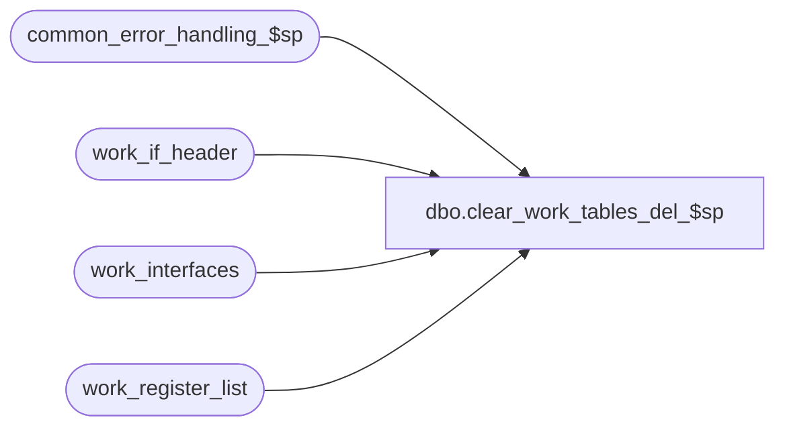

# dbo.clear_work_tables_del_$sp

**Database:** auditworks_external  
**Server:** bedrockdb01  

## Architecture Diagram



## Table Dependencies

| Referenced Table |
|---|
| common_error_handling_$sp |
| work_if_header |
| work_interfaces |
| work_register_list |

## Stored Procedure Code

```sql
create proc [dbo].[clear_work_tables_del_$sp] 
 @process_id     binary(16),
 @user_id	int,
 @process_no     smallint

AS

/* Proc Name: clear_work_tables_del_$sp
   Desc: To clear work tables used by delete transaction function.
    Called from delete_transaction_$sp. 

HISTORY
Date     Name         Defect Desc
Sep24,04 David       DV-1146 Use user_id instead of user_name.
Jul09,04 ShuZ        DV-1071 Expand user_name to nvarchar(50)
Apr27,04 Maryam      DV-1071 Receive @process_id and @user_name and pass it to the 
                             common_error_handling_$sp.
Jul22,03 Paul          11627 pass in process_no
May03,02 Ian         1-CD0IX Add R3 Error Handling
Mar29,01 Bayani D       7376 Remove lines that process 'HO' table

*/

DECLARE	-- error handling
	@process_name		nvarchar(100),
	@operation_name		nvarchar(100),
	@object_name		nvarchar(255),
	@message_id		int,
	@log_flag		tinyint,
	@errno                  int,
	@errmsg                 nvarchar(255)

SELECT	@process_name = 'clear_work_tables_del_$sp',
	@message_id = 201068,
	@log_flag = 0


IF @process_no != 35
BEGIN
  DELETE work_register_list
   WHERE process_id = @process_id

  SELECT @errno = @@error
  IF @errno !=0
  BEGIN
    SELECT @errmsg         = 'Failed to delete from table work_register_list',
           @object_name    = 'work_register_list',
           @operation_name = 'DELETE'
    GOTO error
  END
END

DELETE work_interfaces
 WHERE process_id = @process_id

SELECT @errno = @@error
IF @errno !=0
  BEGIN
    SELECT @errmsg         = 'Failed to delete from table work_interfaces',
           @object_name    = 'work_interfaces',
           @operation_name = 'DELETE'
    GOTO error
  END

DELETE work_if_header
 WHERE process_id = @process_id

SELECT @errno = @@error
IF @errno !=0
  BEGIN
    SELECT @errmsg         = 'Failed to delete from table work_if_header',
           @object_name    = 'work_if_header',
           @operation_name = 'DELETE'
    GOTO error
  END
  
RETURN

error:

	EXEC common_error_handling_$sp @process_no, @errno, @errmsg, 0, @message_id,
	    @process_name, @object_name, @operation_name, @log_flag, 1, 0, null, 0,
	    null, null, null, null, null, null, 0, @process_id, @user_id
	    
	RETURN
```

