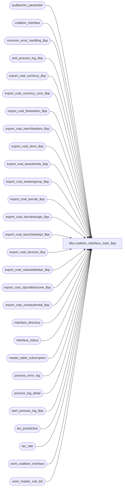

# dbo.coalition_interface_main_$sp

**Database:** auditworks_external  
**Server:** bedrockdb01  

## Architecture Diagram



## Table Dependencies

| Referenced Table |
|---|
| auditworks_parameter |
| coalition_interface |
| common_error_handling_$sp |
| end_process_log_$sp |
| export_coal_currency_$sp |
| export_coal_currency_conv_$sp |
| export_coal_feetaxitem_$sp |
| export_coal_merchtaxitem_$sp |
| export_coal_store_$sp |
| export_coal_taxauthority_$sp |
| export_coal_taxitemgroup_$sp |
| export_coal_taxrule_$sp |
| export_coal_taxruleassign_$sp |
| export_coal_taxschedulept_$sp |
| export_coal_taxzone_$sp |
| export_coal_valueaddedtax_$sp |
| export_coal_zipcodetaxzone_$sp |
| export_coal_zoneauthrelat_$sp |
| interface_directory |
| interface_status |
| master_table_subscription |
| process_error_log |
| process_log_detail |
| start_process_log_$sp |
| tax_jurisdiction |
| tax_rate |
| work_coalition_interface |
| work_master_sub_list |

## Stored Procedure Code

```sql
create proc dbo.coalition_interface_main_$sp 
(@interface_id	tinyint
)
AS
DECLARE
@block_type			smallint,
@data_header			nvarchar(255),
@errmsg 			nvarchar(255),
@errno				int,
@max_runtime_datetime		datetime,
@cursor_open			tinyint,
@process_log_entry 		tinyint,
@process_no 			smallint,
@process_timestamp 		float,
@record_sequence		int,
@rows				int,
@runtime_allow_errors           nvarchar(30), 
@runtime_datetime		datetime,
@runtime_date			nvarchar(30),
@runtime_header			nvarchar(50),
@runtime_time			nvarchar(30),
@subscription_method		tinyint,
@task_module			nvarchar(255),
@task_server			nvarchar(255),
@transaction_count 		numeric(12,0),
@immediate_posting_requested	tinyint,
@sequence_no			smallint,
@task_no			int,
@task_header			nvarchar(255),
@task_operation 		nvarchar(255),
@export_module_name		nvarchar(255),
@export_status			tinyint,
@message_id		        int,	
@object_name			nvarchar(255),
@operation_name			nvarchar(100),
@process_name		        nvarchar(100),
@datetime			datetime,
@new_release			tinyint, -- 0 = Not new release
@more_data			int,
@tax_dcn_exp_hist	 	int,
@today 				datetime,
@trace_msg			nvarchar(500),
@clear_and_full_export_request  tinyint,
@restart			tinyint

/* Proc Name: coalition_interface_main_$sp
   Desc: Coalition Tax Exports.
     Called by ICT_EXPORT.
     
HISTORY:
Date     Name           Def# Desc
Oct02,14 Vicci     TFS-86958 If there are entries in work_master_sub_list for a table_name that does not exist in master_table_subscription
                             then report the integrity instead of looping infinitely.  Also, set export_status to 0 for master_table_subscription
                             entries for tables that were marked as requiring a full export but for which no data was found to be exported rather than
                             leaving their status at 2 forever.
Feb10,14 Vicci        149810 Exclude inactive jurisdictions.
Mar08,13 Vicci        142400 If immediate posting requested = 4 then a full export was requested so clean up, set to 1, run full export;
                             check for abort after each module.
Jan04,13 Vicci        140866 Add tracing (process_log_detail)
Dec18,12 Vicci        140634 Relocate END of IF @runtime_datetime is not null to match 5.1, 
                             don't delete work_coalition_interface before have used it in master_table_subscription update.
Jul16,12 Vicci        136951 Relocate BEGIN TRAN/COMMIT to avoid deadlocking with tax imports, 
                             add missing @interface_id to where clause, update master table subscription and interface status in consistent order.         
Apr07,11 Vicci        126078 Take master_table_subscription active flag into account.
Feb20,09 Vicci         86072 Take into account parameter for whether or not to export expired information.
Sep06,06 Daphna        75320 MSSQL2005 prevent null string 
Mar14,06 Vicci	       68918 Remove truncation and insertion of obsolete work tables;  avoid
			     repeating the calls to the export_coal... procedures as many
			     times as there are tables that they subscribed to;  add
			     call to export_coal_merchtaxitem_$sp
Jan12,06 Vicci	       65834 Do not loop infinitely when immediate_posting_requested = 3
Aug03,05 Daphna        58339 Add export_coal_feetaxitem_$sp
Jul04,05 Daphna        56814 Add export_coal_currency_conv_$sp, export_coal_currency_$sp
Jul09,03 Vicci	 11567/11569 .dcn file with invalid runtime date and no task/data sections
			     produced when there is nothing to export.
Dec04,02 Winnie		5241 Check work_master_sub_list to see if more data needs to be exported
Nov19,02 Winnie      1-G2KUX Support Tax coalition for ZipCodeTaxZone module
Oct21,02 Winnie	     1-G3UJD Only check integrity when export_format = 1
Aug06,02 Winnie      1-DZ2SY To support export_status = 1 (for coalition update/delete)
May02,02 Winnie	     1-CFFPT To standardize the coalition for Tax export.

*/

SET CONCAT_NULL_YIELDS_NULL OFF

SELECT @process_name = 'coalition_interface_main_$sp',
       @process_no = 209,
       @message_id = 201068,
       @datetime = getdate(),
       @today = convert(datetime, convert(nvarchar, getdate(), 101))
       

IF EXISTS( SELECT record_content
             FROM coalition_interface)
BEGIN
  INSERT into process_log_detail(         
         process_no, 
         process_name, 
         process_info_type, 
         process_info_string) 
  VALUES(@process_no, 
         @process_name, 
         'verification of prior run', 
         'Content of coalition_interface from prior run has not yet been dumped out by ICT_EXPORT01.  Aborting.')
  SELECT @errno = @@error
  IF @errno <> 0
  BEGIN
    SELECT @errmsg = 'Unable to log verification of prior run trace',
           @object_name = 'process_log_detail',
           @operation_name = 'INSERT'      
    GOTO error
  END
  
  SELECT @trace_msg = NCHAR(13) + NCHAR(10) + ':LOG && Content of coalition_interface from prior run has not yet been dumped out by ICT_EXPORT01.  Aborting.: ' + CONVERT(nchar, getdate(), 8)
  PRINT @trace_msg

  RETURN  -- To avoid mixing data for different runtimes in the same batch
END

IF EXISTS (SELECT interface_id
             FROM interface_directory
            WHERE interface_id = 16
              AND ascii_export >= 2)
  SELECT @new_release = 1
ELSE
  SELECT @new_release = 0

restart:
SELECT @restart = 0

SELECT @immediate_posting_requested = ISNULL(immediate_posting_requested,0)
  FROM interface_status 
 WHERE interface_id = @interface_id
/* immediate_posting_requested:  0=abort, 
				 1=populate work_coalition_interface & copy to coalition_interface (ict will bcp and set to 0)
				 2=copy work_coalition_interface to coalition_interface only (ict will bcp but not reset)
				 3=populate work_coalition_interface & copy to coalition_interface (ict will bcp but not reset)
				 4=full export requested so reset to 1 and behave as per 1 but ignoring TM changes outstanding.
*/
SELECT @errno = @@error
IF @errno <> 0
BEGIN
  SELECT @errmsg = 'Unable to select immediate_posting_request from interface status',
         @object_name = 'interface_status',
         @operation_name = 'SELECT'      
  GOTO error
END
  
INSERT into process_log_detail(         
       process_no, 
       process_name, 
       process_info_type, 
       process_info_number,
       process_info_string) 
VALUES(@process_no, 
       @process_name, 
       '@immediate_posting_requested', 
       @immediate_posting_requested,
       CASE @immediate_posting_requested WHEN 0 THEN 'ABORT!' WHEN 4 THEN 'CLEAR TM CHANGES AND RUN FULL EXPORT' ELSE NULL END) 
SELECT @errno = @@error
IF @errno <> 0
BEGIN
  SELECT @errmsg = 'Unable to log @immediate_posting_requested trace',
         @object_name = 'process_log_detail',
         @operation_name = 'INSERT'      
  GOTO error
END

IF @immediate_posting_requested = 4
  SELECT @clear_and_full_export_request = 1, @immediate_posting_requested = 1
ELSE
  SELECT @clear_and_full_export_request = 0

IF @immediate_posting_requested = 0  --abort requested
  BEGIN
    TRUNCATE TABLE work_coalition_interface
    SELECT @errno = @@error
    IF @errno <> 0
      BEGIN
        SELECT @errmsg = 'Unable to truncate work_coalition_interface when @immediate_posting_requested = 0',
               @object_name = 'work_coalition_interface',
               @operation_name = 'TRUNCATE'      
        GOTO error
      END
  
    SELECT @trace_msg = NCHAR(13) + NCHAR(10) + ':LOG && Coalition export abort requested.  Aborting.: ' + CONVERT(nchar, getdate(), 8)
    PRINT @trace_msg

    RETURN
  END
  
UPDATE interface_status
   SET retrieval_in_progress  = 1
 WHERE interface_id = @interface_id
SELECT @errno = @@error
IF @errno <> 0
  BEGIN
    SELECT @errmsg = 'Unable to set last_retrieval_datetime in interface_status',
           @object_name = 'interface_status',
      @operation_name = 'UPDATE'
    GOTO error
  END

SELECT @tax_dcn_exp_hist = convert(int, par_value)
  FROM auditworks_parameter
 WHERE par_name = 'tax_dcn_exp_hist'
   AND IsNumeric(par_value) = 1
SELECT @errno = @@error
IF @errno <> 0
BEGIN
  SELECT @errmsg = 'Unable to determine whether or not to export expire tax master information to coalition',
         @object_name = 'auditworks_parameter',
         @operation_name = 'SELECT'
  GOTO error
END
IF @tax_dcn_exp_hist IS NULL
SELECT @tax_dcn_exp_hist = -1
  
/*
export_status:
0=	Complete
1=	Table maintenance export outstanding
2=	Full export requested
3=	In-progress
*/
IF @immediate_posting_requested IN (1,3) --build work table with all data to be exported
BEGIN
  IF @clear_and_full_export_request = 1
     OR NOT EXISTS (SELECT export_status
                     FROM master_table_subscription
                    WHERE export_status = 1
                      AND interface_id = @interface_id
                      AND active_flag > 0)  
  BEGIN
    INSERT into process_log_detail(         
           process_no, 
           process_name, 
           process_info_type, 
           process_info_string) 
    VALUES(@process_no, 
           @process_name, 
           'export type', 
           'full download') 
    SELECT @errno = @@error
    IF @errno <> 0
    BEGIN
      SELECT @errmsg = 'Unable to log full download request trace',
             @object_name = 'process_log_detail',
             @operation_name = 'INSERT'      
      GOTO error
    END

    UPDATE master_table_subscription
       SET export_status = 2
     WHERE interface_id = @interface_id
       AND active_flag > 0
    SELECT @errno = @@error
    IF @errno <> 0
    BEGIN
      SELECT @errmsg = 'Unable to update master_table_subscription export_status to 2',
             @object_name = 'master_table_subscription',
             @operation_name = 'UPDATE'      
      GOTO error
    END   
    
    IF @clear_and_full_export_request = 1
    BEGIN
      UPDATE interface_status
         SET immediate_posting_requested = 1
       WHERE interface_id = @interface_id
         AND immediate_posting_requested = 4
      SELECT @errno = @@error
      IF @errno <> 0
      BEGIN
        SELECT @errmsg = 'Unable to reset immediate_posting_requested',
               @object_name = 'interface_status',
               @operation_name = 'UPDATE'      
        GOTO error
      END
    END

  END -- if not exists       

  EXEC start_process_log_$sp @process_no, @process_timestamp OUTPUT, @errmsg OUTPUT
  SELECT @errno = @@error
  IF @errno <> 0
  BEGIN
    IF @errmsg IS NULL  
      SELECT @errmsg = 'Unable to execute start_process_log_$sp'
    SELECT @object_name = 'start_process_log_$sp',
           @operation_name = 'EXECUTE'      
    GOTO error
  END

  TRUNCATE TABLE work_coalition_interface
  SELECT @errno = @@error
  IF @errno <> 0
  BEGIN
    SELECT @errmsg = 'Unable to truncate work_coalition_interface when @immediate_posting_requested = 1',
           @object_name = 'work_coalition_interface',
           @operation_name = 'TRUNCATE'      
    GOTO error
  END

  SELECT @process_log_entry = 1,
         @task_server = 'Server=TAX',
         @task_no = 0,
         @cursor_open = 0

  SELECT @runtime_datetime = MIN(CASE WHEN @tax_dcn_exp_hist = 0 AND t.effective_from_date <= @today THEN '01/01/1970' ELSE t.effective_from_date END)
   FROM tax_rate t
        INNER JOIN tax_jurisdiction j
           ON t.tax_jurisdiction = j.tax_jurisdiction
          AND j.active_flag = 1
  SELECT @errno = @@error
  IF @errno <> 0
  BEGIN
    SELECT @errmsg = 'Unable to select @runtime_datetime from tax_rate',
           @object_name = 'tax_rate',
           @operation_name = 'SELECT'      
    GOTO error
  END     
  IF @runtime_datetime IS NULL
    SELECT @runtime_datetime = '01/01/1970'

  DECLARE master_table_subscription_crsr CURSOR FAST_FORWARD 
      FOR
   SELECT export_module_name,
          CASE WHEN @clear_and_full_export_request = 1 THEN 2 ELSE MAX(export_status) END,
          MIN(ISNULL(sequence_no,1)) --was selected inorder to support order by. @sequence_no is not used.
     FROM master_table_subscription WITH (NOLOCK)
    WHERE interface_id = @interface_id
     AND export_status IN (1,2)
     AND active_flag > 0
   GROUP BY export_module_name
   ORDER BY MIN(ISNULL(sequence_no,1))
  SELECT @errno = @@error
  IF @errno <> 0
  BEGIN
    SELECT @errmsg = 'Unable to declare cursor master_table_subscription_crsr',
           @object_name = 'master_table_subscription_crsr',
           @operation_name = 'DECLARE'      
    GOTO error
  END

  OPEN master_table_subscription_crsr
  SELECT @errno = @@error
  IF @errno <> 0
  BEGIN
    SELECT @errmsg = 'Unable to open cursor master_table_subscription_crsr',
           @object_name = 'master_table_subscription_crsr',
           @operation_name = 'OPEN'      
    GOTO error
  END

  SELECT  @cursor_open = 1

  WHILE 1 = 1
  BEGIN
    FETCH master_table_subscription_crsr
     INTO @export_module_name,
          @export_status,
          @sequence_no
          
    IF @@fetch_status <> 0
      BREAK
    
    --Check if Abort or clear-and-Full-Export have been requested since the export started
    IF EXISTS (SELECT 1
                 FROM interface_status 
	        WHERE interface_id = @interface_id
	          AND (immediate_posting_requested = 0
	               OR (immediate_posting_requested = 4 AND @clear_and_full_export_request = 0)))
    BEGIN
      SELECT @restart = 1
      BREAK
    END
      
    IF @export_status IN (1,2)
    BEGIN
      INSERT into process_log_detail(         
             process_no, 
             process_name, 
             process_info_type, 
             process_info_string,
             process_info_number,
             process_info_date) 
      VALUES(@process_no, 
             @process_name, 
             'master_table_subscription_crsr:  @export_module_name, @export_status, @datetime or @runtime_datetime', 
             @export_module_name,
             @export_status,
             CASE WHEN @export_module_name IN ('TaxRule', 'TaxSchedulePt', 'TaxRuleAssign', 'ValueAddedTax') THEN @datetime ELSE @runtime_datetime END) 
      SELECT @errno = @@error
      IF @errno <> 0
      BEGIN
        SELECT @errmsg = 'Unable to log master_table_subscription_crsr trace',
               @object_name = 'process_log_detail',
               @operation_name = 'INSERT'      
        GOTO error
      END
      
      IF @export_module_name = 'TaxZone'
      BEGIN
            EXEC export_coal_taxzone_$sp @interface_id, @process_no, @task_server, @runtime_datetime, @export_status,
                                              @task_no	OUTPUT, @errmsg OUTPUT
            SELECT @errno = @@error
            IF @errno != 0
              BEGIN
                IF @errmsg IS NULL  
                  SELECT @errmsg = 'Failed to execute stored procedure export_coal_taxzone_$sp'
 	        SELECT @object_name = 'export_coal_taxzone_$sp',
                       @operation_name = 'EXECUTE'
                GOTO error
             END
      END -- IF @export_module_name = 'TaxZone'

      IF @export_module_name = 'ZipCodeTaxZone'
      BEGIN
            EXEC export_coal_zipcodetaxzone_$sp @interface_id, @process_no, @task_server, @runtime_datetime, @export_status,
                                               @task_no	OUTPUT, @errmsg OUTPUT
            SELECT @errno = @@error
            IF @errno != 0
              BEGIN
                IF @errmsg IS NULL  
                  SELECT @errmsg = 'Failed to execute stored procedure export_coal_zipcodetaxzone_$sp'
 	        SELECT @object_name = 'export_coal_zipcodetaxzone_$sp',
                  @operation_name = 'EXECUTE'
                GOTO error
             END
      END -- IF @export_module_name = 'ZipCodeTaxZone'

      IF @export_module_name = 'ValueAddedTax'
      BEGIN
            EXEC export_coal_valueaddedtax_$sp @interface_id, @process_no, @task_server, @datetime, @export_status,
                                               @task_no	OUTPUT, @errmsg OUTPUT, @tax_dcn_exp_hist 
            SELECT @errno = @@error
            IF @errno != 0
              BEGIN
                IF @errmsg IS NULL  
                  SELECT @errmsg = 'Failed to execute stored procedure export_coal_valueaddedtax_$sp'
 	        SELECT @object_name = 'export_coal_valueaddedtax_$sp',
                       @operation_name = 'EXECUTE'
                GOTO error
             END
      END -- IF @export_module_name = 'ValueAddedTax'

      IF @export_module_name = 'TaxAuthority'
      BEGIN
            EXEC export_coal_taxauthority_$sp @interface_id, @process_no, @task_server, @runtime_datetime, @export_status,
                                               @task_no	OUTPUT, @errmsg OUTPUT
            SELECT @errno = @@error
            IF @errno != 0
            BEGIN
                IF @errmsg IS NULL  
                  SELECT @errmsg = 'Failed to execute stored procedure export_coal_taxauthority_$sp'
 	        SELECT @object_name = 'export_coal_taxauthority_$sp',
                       @operation_name = 'EXECUTE'
          GOTO error
        END
      END -- IF @export_module_name = 'TaxAuthority'

      IF @export_module_name = 'ZoneAuthRelation'
      BEGIN
            EXEC export_coal_zoneauthrelat_$sp @interface_id, @process_no, @task_server, @runtime_datetime, @export_status,
                                               @task_no	OUTPUT, @errmsg OUTPUT
            SELECT @errno = @@error
            IF @errno != 0
        BEGIN
                IF @errmsg IS NULL  
                  SELECT @errmsg = 'Failed to execute stored procedure export_coal_zoneauthrelat_$sp'
 	        SELECT @object_name = 'export_coal_zoneauthrelat_$sp',
                       @operation_name = 'EXECUTE'
                GOTO error
        END          
      END -- IF @export_module_name = 'ZoneAuthRelation'

      IF @export_module_name = 'TaxItemGroup'
      BEGIN
            EXEC export_coal_taxitemgroup_$sp @interface_id, @process_no, @task_server, @runtime_datetime, @export_status,
                                              @new_release, @task_no	OUTPUT, @errmsg OUTPUT
            SELECT @errno = @@error
            IF @errno != 0
              BEGIN
                IF @errmsg IS NULL  
                  SELECT @errmsg = 'Failed to execute stored procedure export_coal_taxitemgroup_$sp'
 	        SELECT @object_name = 'export_coal_taxitemgroup_$sp',
                      @operation_name = 'EXECUTE'
                GOTO error
             END          
      END -- IF @export_module_name = 'TaxItemGroup'

      IF @export_module_name = 'TaxRule'
      BEGIN
            EXEC export_coal_taxrule_$sp @interface_id, @process_no, @task_server, @datetime, @export_status,
                                         @new_release, @task_no	OUTPUT, @errmsg OUTPUT, @tax_dcn_exp_hist 
            SELECT @errno = @@error
            IF @errno != 0
              BEGIN
                IF @errmsg IS NULL  
                  SELECT @errmsg = 'Failed to execute stored procedure export_coal_taxrule_$sp'
 	        SELECT @object_name = 'export_coal_taxrule_$sp',
                       @operation_name = 'EXECUTE'
                GOTO error
             END          
      END -- IF @export_module_name = 'TaxRule'
  
      IF @export_module_name = 'TaxSchedulePt'
      BEGIN
            EXEC export_coal_taxschedulept_$sp @interface_id, @process_no, @task_server, @datetime, @export_status,
                                               @task_no	OUTPUT, @errmsg OUTPUT, @tax_dcn_exp_hist
            SELECT @errno = @@error
            IF @errno != 0
              BEGIN
                IF @errmsg IS NULL  
                  SELECT @errmsg = 'Failed to execute stored procedure export_coal_taxschedulept_$sp'
 	        SELECT @object_name = 'export_coal_taxschedulept_$sp',
                       @operation_name = 'EXECUTE'
                GOTO error
             END          
      END -- IF @export_module_name = 'TaxSchedulePt'

      IF @export_module_name = 'TaxRuleAssign'
      BEGIN

            EXEC export_coal_taxruleassign_$sp @interface_id, @process_no, @task_server, @datetime, @export_status,
                                               @new_release, @task_no OUTPUT, @errmsg OUTPUT 
            SELECT @errno = @@error
            IF @errno != 0
              BEGIN
                IF @errmsg IS NULL  
                  SELECT @errmsg = 'Failed to execute stored procedure export_coal_taxruleassign_$sp'
 	        SELECT @object_name = 'export_coal_taxruleassign_$sp',
                       @operation_name = 'EXECUTE'
                GOTO error
             END          
      END -- IF @export_module_name = 'TaxRuleAssign' 
   
      IF @export_module_name = 'Store'
      BEGIN
            EXEC export_coal_store_$sp @interface_id, @process_no, @task_server, @runtime_datetime, @export_status,
                @task_no	OUTPUT, @errmsg OUTPUT
            SELECT @errno = @@error
            IF @errno != 0
              BEGIN
                IF @errmsg IS NULL  
                  SELECT @errmsg = 'Failed to execute stored procedure export_coal_store_$sp'
 	        SELECT @object_name = 'export_coal_store_$sp',
                       @operation_name = 'EXECUTE'
                GOTO error
             END        

      END -- IF @export_module_name = 'Store'

      IF @export_module_name = 'CurrencyType'
      BEGIN
            EXEC export_coal_currency_$sp @interface_id, @process_no, @task_server, @runtime_datetime, @export_status,
                                          @task_no	OUTPUT, @errmsg OUTPUT
            SELECT @errno = @@error
            IF @errno != 0
              BEGIN
                IF @errmsg IS NULL  
                  SELECT @errmsg = 'Failed to execute stored procedure export_coal_currency_$sp'
 	      SELECT @object_name = 'export_coal_currency_$sp',
                       @operation_name = 'EXECUTE'
                GOTO error
             END          

      END -- IF @export_module_name = 'StoreCurrency'
          
      IF @export_module_name = 'StoreCurrency'
      BEGIN
            EXEC export_coal_currency_conv_$sp @interface_id, @process_no, @task_server, @runtime_datetime, @export_status,
         @task_no	OUTPUT, @errmsg OUTPUT
            SELECT @errno = @@error
            IF @errno != 0
              BEGIN
                IF @errmsg IS NULL  
                  SELECT @errmsg = 'Failed to execute stored procedure export_coal_currency_conv_$sp'
 	        SELECT @object_name = 'export_coal_currency_conv_$sp',
                       @operation_name = 'EXECUTE'
                GOTO error
             END          

      END -- IF @export_module_name = 'StoreCurrency'

      IF @export_module_name = 'Item'
      BEGIN
            EXEC export_coal_feetaxitem_$sp @interface_id, @process_no, @task_server, @runtime_datetime, @export_status,
                                          @task_no	OUTPUT, @errmsg OUTPUT
            SELECT @errno = @@error
            IF @errno != 0
              BEGIN
                IF @errmsg IS NULL  
                  SELECT @errmsg = 'Failed to execute stored procedure export_coal_feetaxitem_$sp'
 	        SELECT @object_name = 'export_coal_feetaxitem_$sp',
                       @operation_name = 'EXECUTE'
                GOTO error
             END
             
            EXEC export_coal_merchtaxitem_$sp @interface_id, @process_no, @datetime, @export_status,
                                          @task_no	OUTPUT, @errmsg OUTPUT
            SELECT @errno = @@error
            IF @errno != 0
              BEGIN
                IF @errmsg IS NULL  
                  SELECT @errmsg = 'Failed to execute stored procedure export_coal_merchtaxitem_$sp'
 	        SELECT @object_name = 'export_coal_merchtaxitem_$sp',
                       @operation_name = 'EXECUTE'
                GOTO error
             END          
          END -- IF @export_module_name = 'Item'
          
        
      END -- IF @export_status IN (1,2)
        
    END -- While 1 = 1

    CLOSE master_table_subscription_crsr
    SELECT @errno = @@error
      IF @errno <> 0
        BEGIN
          SELECT @errmsg = 'Unable to close cursor master_table_subscription_crsr',
                 @object_name = 'master_table_subscription_crsr',
                 @operation_name = 'close'      
          GOTO error
        END

    DEALLOCATE master_table_subscription_crsr

    SELECT @cursor_open = 0
    
    IF @restart = 1
      GOTO restart

END -- IF @immediate_posting_requested IN (1,3)

-- Build coalition_interface_table

IF @immediate_posting_requested IN (1,2,3) 
BEGIN

  SELECT @runtime_datetime = MIN(runtime_datetime),
         @max_runtime_datetime = MAX(runtime_datetime)
    FROM work_coalition_interface
  SELECT @errno = @@error
  IF @errno <> 0
  BEGIN
    SELECT @errmsg = 'Unable to select from work_coalition_interface',
           @object_name = 'work_coalition_interface',
           @operation_name = 'SELECT'                        
    GOTO error
  END

  IF @runtime_datetime IS NOT NULL
  BEGIN
    SELECT @runtime_time = 'Time=' + CONVERT(nvarchar, @runtime_datetime,8),
           @runtime_date = 'Date=' + CONVERT(nvarchar,datepart(yy,@runtime_datetime)) + '-' + 
           RIGHT('00' + CONVERT(nvarchar,datepart(mm, @runtime_datetime)), 2) + '-'  + 
           RIGHT('00' + CONVERT(nvarchar,datepart(dd, @runtime_datetime)), 2), 
           @runtime_allow_errors = 'AllowErrors=FALSE', 
           @runtime_header='[Runtime]'

    BEGIN TRAN
    
     -- Insert the Runtime block into the Coalition interface table

    INSERT coalition_interface
           (record_content, block_type, task_no, record_sequence_no)
    VALUES (@runtime_header, 0, 0, 0)
    SELECT @errno = @@error
    IF @errno <> 0
    BEGIN
      SELECT @errmsg = 'Unable to insert coalition_interface (runtime_header)',
             @object_name = 'coalition_interface',
             @operation_name = 'INSERT'                        
      GOTO error
    END

    INSERT coalition_interface
           (record_content, block_type, task_no, record_sequence_no)
    VALUES (@runtime_date, 0, 0, 1)
    SELECT @errno = @@error
    IF @errno <> 0
    BEGIN
      SELECT @errmsg = 'Unable to insert coalition_interface (runtime_date)',
             @object_name = 'coalition_interface',
             @operation_name = 'INSERT'           
      GOTO error
    END

    INSERT coalition_interface
           (record_content, block_type, task_no, record_sequence_no)
    VALUES (@runtime_time, 0, 0, 2)
    SELECT @errno = @@error
    IF @errno <> 0
    BEGIN
      SELECT @errmsg = 'Unable to insert coalition_interface (runtime_time)',
             @object_name = 'coalition_interface',
             @operation_name = 'INSERT'                   
      GOTO error
    END

    INSERT coalition_interface
           (record_content, block_type, task_no, record_sequence_no)
    VALUES (@runtime_allow_errors, 0, 0, 3)
    SELECT @errno = @@error
    IF @errno <> 0
    BEGIN
      SELECT @errmsg = 'Unable to insert coalition_interface (runtime_allow_errors)',
             @object_name = 'coalition_interface',
             @operation_name = 'INSERT'                   
      GOTO error
    END

    -- Insert the task and data blocks into the Coalition interface table
    INSERT coalition_interface
           (record_content, block_type, task_no, record_sequence_no)
    SELECT record_content, block_type, task_no, record_sequence_no
      FROM work_coalition_interface 
     WHERE runtime_datetime = @runtime_datetime
     ORDER BY block_type, task_no, record_sequence_no, record_content
    SELECT @errno = @@error,
           @transaction_count = @@rowcount
    IF @errno <> 0
    BEGIN
      SELECT @errmsg = 'Unable to insert coalition_interface',
             @object_name = 'coalition_interface',
             @operation_name = 'INSERT'                   
      GOTO error
    END

    INSERT into process_log_detail(         
      process_no, 
           process_name, 
           process_info_type, 
           process_info_number,
           process_info_date,
           process_info_string) 
    VALUES(@process_no, 
           @process_name, 
           'copy from work_coalition_interface to coalition_interface @transaction_count for @runtime_datetime', 
           @transaction_count,
           @runtime_datetime,
           CASE WHEN @runtime_datetime <> @max_runtime_datetime THEN 'Other loop(s) will be required to reach: ' + convert(nvarchar, @max_runtime_datetime) ELSE NULL END ) 
    SELECT @errno = @@error
    IF @errno <> 0
    BEGIN
      SELECT @errmsg = 'Unable to log loop completion trace',
             @object_name = 'process_log_detail',
             @operation_name = 'INSERT'      
      GOTO error
    END


    -- Record when the export was last run for each master table affected
    UPDATE master_table_subscription
       SET last_export_datetime = getdate(), 
           export_status = 3
      FROM work_coalition_interface w
     WHERE runtime_datetime = @runtime_datetime 
       AND w.export_module_name = master_table_subscription.export_module_name 
       AND interface_id = @interface_id
       AND export_status <> 0
       AND active_flag > 0
    SELECT @errno = @@error
    IF @errno <> 0
      BEGIN
        SELECT @errmsg = 'Unable to update master_table_subscription',
               @object_name = 'master_table_subscription',
               @operation_name = 'UPDATE'                   
        GOTO error
      END

    DELETE work_coalition_interface
     WHERE runtime_datetime = @runtime_datetime
    SELECT @errno = @@error
    IF @errno <> 0
      BEGIN
        SELECT @errmsg = 'Unable to delete work_coalition_interface',
               @object_name = 'work_coalition_interface',
               @operation_name = 'DELETE'                           
        GOTO error
      END

    COMMIT
    
  END -- if @runtime_datetime is not null

    -- Delete the batch in question from the work table
    
    -- If there are remaining batches, set the immediate_processing_requested to 2

    IF @runtime_datetime IS NOT NULL AND @runtime_datetime <> @max_runtime_datetime 
      BEGIN
        UPDATE interface_status
           SET immediate_posting_requested = 2   
         WHERE interface_id = @interface_id
           AND immediate_posting_requested <> 4 
        SELECT @errno = @@error
        IF @errno <> 0 
          BEGIN
            SELECT @errmsg = 'Unable to update interface status to 2',
                   @object_name = 'interface_status',
                   @operation_name = 'UPDATE'                
             GOTO error
          END
      END -- @runtime_datetime not null and <> @max_runtime_datetime 
    ELSE
      BEGIN 
        UPDATE master_table_subscription
           SET export_status = 0
         WHERE interface_id = @interface_id
           AND (export_status IN (2, 3) OR @runtime_datetime IS NULL)  --set for status 2 as well since if this is the last batch then even if nothing was found to be exported the export is done.
           AND active_flag > 0
        SELECT @errno = @@error
        IF @errno <> 0 
          BEGIN
            SELECT @errmsg = 'Unable to update master_table_subscription',
                   @object_name = 'master_table_subscription',
                   @operation_name = 'UPDATE'                            
            GOTO error
          END 

        UPDATE interface_status
           SET immediate_posting_requested = 1   
         WHERE interface_id = @interface_id
           AND immediate_posting_requested in (2, 3)
        SELECT @errno = @@error
        IF @errno <> 0 
          BEGIN
            SELECT @errmsg = 'Unable to update interface status to 1',
                   @object_name = 'interface_status',
                   @operation_name = 'UPDATE'                            
            GOTO error
          END

        IF EXISTS (SELECT interface_id
                     FROM work_master_sub_list
             WHERE interface_id = @interface_id)
        
          SELECT @more_data = 1
        
        IF @more_data = 1
          BEGIN

            UPDATE master_table_subscription
               SET export_status = 1
              FROM work_master_sub_list w, master_table_subscription m
             WHERE w.interface_id = m.interface_id
               AND w.table_name = m.table_name
               AND m.active_flag > 0
               AND w.interface_id = @interface_id
            SELECT @errno = @@error, @more_data = SIGN(@@rowcount) 
            IF @errno <> 0 
              BEGIN
                SELECT @errmsg = 'Unable to update master_table_subscription',
                       @object_name = 'master_table_subscription',
                       @operation_name = 'UPDATE'                            
                GOTO error
              END

            IF @more_data = 1   --i.e. something actuall subscribes to whatever remains to be exported.
            BEGIN
              UPDATE interface_status
                 SET immediate_posting_requested = 3
               WHERE interface_id = @interface_id
                 AND immediate_posting_requested <> 4
              SELECT @errno = @@error
              IF @errno <> 0 
              BEGIN
                SELECT @errmsg = 'Unable to update interface status to 3',
                       @object_name = 'interface_status',
                       @operation_name = 'UPDATE'                
                 GOTO error
              END
           END
           ELSE
           BEGIN
             INSERT INTO process_error_log (
                    process_no,
                    error_code,
                    error_timestamp,
                    process_id,
                    verified,
                    error_msg,
                    process_name,
                    object_name,
                    operation_name,
                    message_id)
            VALUES(@process_no, 
                   0,--error_code
                   getdate(),--error_timestamp
                   @@spid,
                   0,--verified
                   'WARNING!! Entries exist in the list of changes to be exported (work_master_sub_list) for which there is no active interface subscription (master_table_subscription).',
                   'coalition_interface_main_$sp',
                   'master_table_subscription',
                   'UPDATE',
                   201068)
           END --ELSE of IF @more_data still 1
        END -- IF @more_data = 1  

      END -- @runtime_datetime is null or @runtime_datetime = @max_runtime_datetime 
      
END -- @immediate_posting_requested IN (1,2,3) 
   
UPDATE interface_status
   SET last_retrieval_datetime = getdate(),
       retrieval_in_progress = 0
 WHERE interface_id = @interface_id
SELECT @errno = @@error
IF @errno <> 0
  BEGIN
    SELECT @errmsg = 'Unable to set last_retrieval_datetime in interface_status',
           @object_name = 'interface_status',
           @operation_name = 'UPDATE'
    GOTO error
  END

IF @process_log_entry = 1
  BEGIN
    EXEC end_process_log_$sp @process_no, @process_timestamp, @transaction_count
    SELECT @errno = @@error
    IF @errno <> 0 
        BEGIN
          SELECT @errmsg = 'Unable to execute end_process_log_$sp',
                 @object_name = 'end_process_log_$sp',
                 @operation_name = 'EXECUTE'                            
          GOTO error
        END
  END

RETURN 

error:   /* Common error handler */
        IF @@trancount > 0
           ROLLBACK -- need in order to update interface_status
        
	IF @cursor_open = 1
	  BEGIN
	   CLOSE master_table_subscription_crsr
	   DEALLOCATE master_table_subscription_crsr
	  END

         UPDATE interface_status
            SET last_retrieval_datetime = getdate(),
                retrieval_in_progress = 0
          WHERE interface_id = @interface_id

 
         EXEC common_error_handling_$sp @process_no, @errno, @errmsg, 0, @message_id, 
  	    @process_name, @object_name, @operation_name, 1, 1, 
  	    @process_log_entry, @process_timestamp, @transaction_count	  

	RETURN
```

