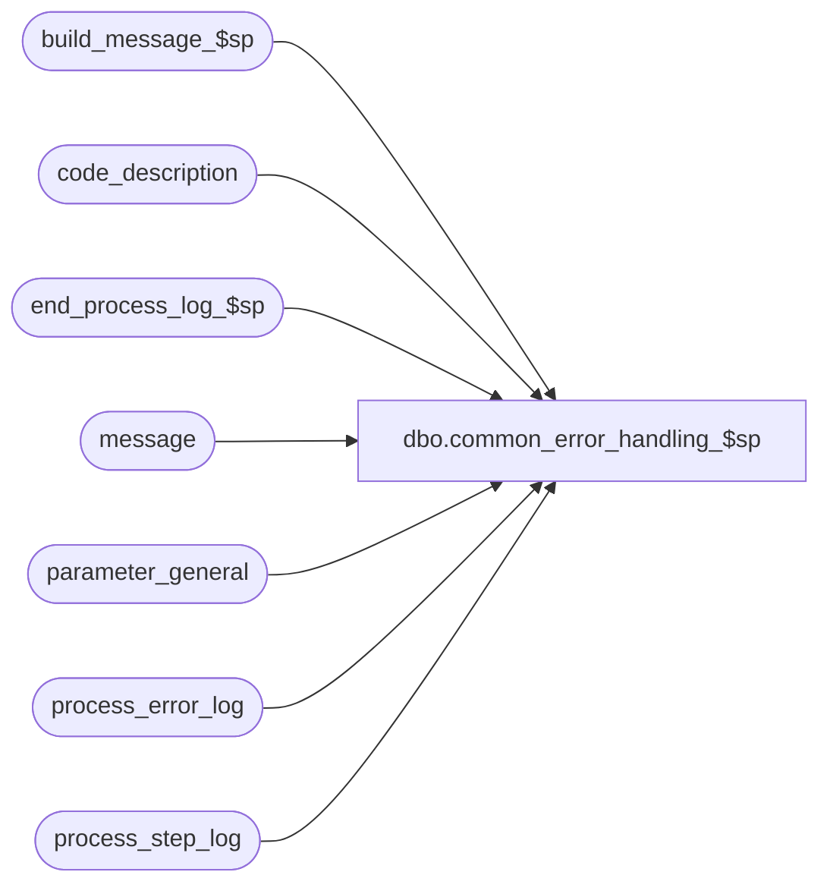

# dbo.common_error_handling_$sp

**Database:** auditworks_external  
**Server:** bedrockdb01  

## Architecture Diagram



## Table Dependencies

| Referenced Table |
|---|
| build_message_$sp |
| code_description |
| end_process_log_$sp |
| message |
| parameter_general |
| process_error_log |
| process_step_log |

## Stored Procedure Code

```sql
create proc dbo.common_error_handling_$sp @process_no		smallint,
@error_code		int,
@error_msg		nvarchar(2000) = ' ',
@abort_flag		tinyint = 0, -- 1 = abort smartload, 2 = bypass rollback (**see note re. triggers below), 3 = bypass raise error, 4 = bypass process_error_log (to avoid business rule errors being logged twice in try/catch environment)
@message_id		int,
@process_name	   	nvarchar(100),
@object_name		nvarchar(255),
@operation_name		nvarchar(100),
@log_flag		tinyint = 0, -- = 1: log xml_message to smartload.
@stream_no		int = 1, -- multi stream no used by edit phrase 1 and dayend.
@process_log_entry 	tinyint = 0, -- set to 1 if we need to execute end_process_log, used by dayend and some interfaces.
@process_timestamp 	float = null,
@transaction_count 	numeric(12,0) = 0,
@memo1			nvarchar(50) = null,
@memo2			nvarchar(50) = null,
@memo3			nvarchar(50) = null,
@memo_date		smalldatetime = null,
@memo_date2		smalldatetime = null,
@memo_date3		smalldatetime = null,
@commit_flag		int = 0, -- set to 1 if we need to bypass the rollback.
@process_id	         binary(16) = null,
@user_id			int = null

AS

/* Proc Name: common_error_handling_$sp - 5.1 (SQL 2012 compatible) version
   Desc: To log errors to the process_error_log table
   NOTE: ONLY message_id's between 201500 and 202499 can be used for SA backend raiserror (Oracle limitation).
     This proc updates SA table process_error_log and then attempts to log the same error message 
     to the Foundation event db that is used by SA by inserting to view SA_EVENT1.
     The Foundation event db could be on the same local rdbms server as SA or on a remote server
      (using a db link in SA view SA_EVENT1).
     If remote, then a shared login is used by the db link and that login needs permission to insert
     to the sa event table EVNT_300001 in the event db.
     If local, then each SA login that could execute this proc needs insert permission including
     any common Foundation logins that are used by CRDM or by the SA5 gui. 
     In Foundation event db, create a user or group and then grant insert and select permissions to those users/groups.
     e.g. grant insert on EVNT_300001 to aw_users, grant select on EVNT_300001 to aw_users. 
          grant insert on EVNT_300001 to auditworks_edit, grant select on EVNT_300001 to auditworks_edit.
          
   ** Note re. triggers: Rolling back within a trigger causes the batch to abort (loss of program control, and therefore @@error can't be tested) 
			 so the following code syntax (MSSQL 2005+) is required:
				DECLARE @errno int, @transcount int
				BEGIN TRANSACTION  -- this and commit/rollback are optional (only needed if multiple steps not in simple example below)
				BEGIN TRY
					delete
					from if_rejection_applicability
					where if_reject_reason = 1
					and interface_id = 51
				END TRY
				BEGIN CATCH
				  SELECT @errno = ERROR_NUMBER(), @transcount = @@trancount, @errmsg = ERROR_MESSAGE()
				END CATCH
				IF @transcount > 0
				BEGIN
				  IF @errno > 0
  				    ROLLBACK TRANSACTION
  				  ELSE
  				    COMMIT
  				END				

  NOTE: this proc is not identical between SA5.0 and SA5.1 . Search for 2012 comments.

HISTORY
Date     Name           Def# Desc
May04,15 Vicci    TFS-119660 When "front-end warning" messages are raised by Edit, don't log them as verified.
Apr30,15 Vicci    TFS-118970 Add override of message categorization for 201550 when @process_no = 140 (which although UI is not being reported
                             in UI) so that details of 201571 (categorized as 10) display too.
                             Add abort flag option 4 = bypass process_error_log (to avoid business rule errors being logged twice in try/catch environment)
Nov13,14 Vicci     TFS-92326 Remove override of true 201571 and 201527 message categorization.  Add override of message categorization 
                             for 201550 when @process_no = 82 (which is mass correct, not UI).
Apr02,14 Vicci        151097 Fix error event handling to log to FLD_421 (Exception full inner error message) not FLD_419 (context dtl).
Oct23,13 Paul         147019 Use newer raiserror to support SQL 2012, handle business rule messages in sys.messages that contain token %s.
Oct16,13 Vicci        145958 Handle fact that triggers may have passed back memo fields via appending them to error message.
Sep23,13 Paul         145958 Use try catch to trap errors inside this proc
Feb17,12 Paul       1-48FEQB improved trapping of errors within this proc and print them to screen or smartload log
Aug31,11 Vicci        129476 Expanded error message from 255 to 2000 to match Oracle.
Jul05,11 Vicci        128115 Added comment above re. rolling back with a trigger.
May10,11 Paul         120764 Use @quote variable to avoid dependency on quoted_identifier setting
Apr20,11 Paul         126025 avoid xact_abort error in distributed environments by turning xact_abort on, added try .. catch    
Jan04,11 Paul         105313 Use unicode datatypes
Oct27,10 Vicci        121781 Set @error_code to 0 if it is null to ensure that at least the error message is returned.
Oct09,10 Vicci        121621 If called by DayEnd turn off dayend_in_progress.  Done here to catch ICT errors too.
Jun02,10 Vicci        118310 Remove quotes from error message content to avoid failure of dynamic SQL insert into Event log;  
                             Log all categories of errors to the process error log to allow for troubleshooting, marking as verified those that
			       we did not previously log (i.e. front-end errors).
Apr05,10 Vicci        116601 Give message_id a default value (some calling procs like scaleout int weren't passing it in).
Feb12,09 Vicci        115913 Reverse 94350.  Message_category 10 must continue to log since warnings such as
                             interface tables not having been cleaned up, dayend failures resulting from missing associations,
                             locked entities being skipped, etc are important.  If certain errors reported to the UI are 
                             dealt with via function cleanup, then that function should be modified to mark the errors
                             as verified.  If other errors are really UI only (not back end) then they should be categorized as -1.
Oct21,08 Paul       1-3XVF0J convert string to nvarchar to avoid truncation of errmsg in evnt table
Jan24,08 Paul          94350 Avoid inserting messages with category 10 to process error log
Oct12,07 Paul          91395 insert to Foundation event db using dynamic sql, log warning if unable.
Sep01,06 Phu           76719 Want a non-null string when it's concatenated with null string.
Sep16,04 David       DV-1146 Use user_id.
Jul09,04 Maryam      DV-1071 Modified to pass in @process_id.
Mar03,04 Winnie	       24758 Do not update process_step_log if abort by user request 	
Nov22,02 Paul           5183 avoid rollback if abort_flag = 3 (used for warnings), repo fixed for 2.5/3
Jul11,02 Winnie	     1-E4VIT Log the correct message_id to process_error_log
May08,02 Winnie	     1-C2Q5L Add abort logic to dayend. 
Mar15,02 Paul        1-BO7JP Allow @abort_flag = 2 to act @like commit_flag = 1 to avoid 
				having to pass in the intervening variables
Jan16,02 Winnie      1-A7TTN Set raise no = error code if the error code between -20000 and - 20999
Dec20,01 Winnie	     1-9SCN9 To add commit_flag as an input parameter to bypass rollback 
Nov23,01 Winnie		8846 To log stream_no to process_error_log table
Nov22,01 Winnie		8932 To log the actual error no to process_error_log
Oct26,01 Winnie		8748 Author
*/

DECLARE
  @business_rule		tinyint,
  @count			int,
  @count_row		int,
  @db_name		nvarchar(50),
  @error_code1		int,
  @errmsg2		nvarchar(2000),
  @errmsg3		nvarchar(2000), -- used to capture errors within this proc
  @errno			int, -- used to capture errors within this proc
  @errno2		int,
  @entry_id		numeric(18,0),
  @lang_id		smallint,
  @length		int,
  @log_prefix		nchar(10),
  @message_category	smallint,
  @message_description	nvarchar(255),
  @message_text		nvarchar(255),
  @raise_error		int,
  @message		nvarchar(255),
  @print_message	nvarchar(255),
  @proc_name		nvarchar(30),
  @quote		nvarchar(1),
  @message_id1		int,
  @SQL_QRY		nvarchar(2048),
  @start_pos_memo		int,
  @start_pos_memo1	int,
  @end_pos_memo1		int,
  @start_pos_memo2	int,
  @end_pos_memo2		int,
  @start_pos_memo3	int,
  @end_pos_memo3		int;

/* As of SQL2014, concat_null_yields_null is always on. Therefore, that setting can no longer be modified in procs. */
-- SET CONCAT_NULL_YIELDS_NULL OFF

IF @commit_flag = 0 AND @@trancount > 0 AND @abort_flag NOT IN (2,3)
  ROLLBACK TRANSACTION;

/* used to log a message in the unlikely scenario of errors occurring within this proc */
SELECT @proc_name = 'common_error_handling_$sp:',
       @business_rule = 0,
       @errno = 0,
       @errno2 = 0;

IF @error_code IS NULL
 SELECT @error_code = 0;

BEGIN TRY
  SELECT @errmsg3 = 'Failed to update parameter_general';

IF @error_code <> 201539 AND @process_no IN (16, 17, 18)  --Dayend Populate, Posting, Housekeeping and not an 'already in progress' error
BEGIN
  UPDATE parameter_general
     SET dayend_in_progress = 0;
END;

IF @process_log_entry = 1
  BEGIN
    SELECT @errmsg3 = 'Failed to exec end_process_log_$sp';
    EXEC end_process_log_$sp @process_no, @process_timestamp, @transaction_count;
  END

  SELECT @errmsg3 = 'Failed to update process_step_log';

IF @error_code = 201635
  SELECT @abort_flag = 1

IF @abort_flag != 1
BEGIN
  UPDATE process_step_log
     SET process_step_no = -1,
         process_step_start_time = getdate()
   WHERE process_no = @process_no
     AND stream_no = @stream_no;
END;

END TRY
BEGIN CATCH; -- trap error and continue
	SELECT @errno = ERROR_NUMBER();
	SELECT @errmsg3 = ':LOG EXECWARN:' + @proc_name + @errmsg3 + '. error_code = ' + CONVERT(nvarchar,@errno);
	PRINT @errmsg3;
END CATCH;

IF @process_id IS NULL
  SELECT @process_id =  @@spid;
SELECT @raise_error = @error_code,
       @error_code1 = @error_code,
       @message = ' ',
       @count_row = 0,
       @count = 0,
       @message_id1 = COALESCE(@message_id,201068),
       @db_name = db_name(),
       @quote = NCHAR(39), -- single quote
       @errno = 0;

IF (@raise_error >= 201500 AND @raise_error < 203000) AND @raise_error <> 201068
BEGIN
  SELECT @business_rule = 1,
         @start_pos_memo = CHARINDEX('<memo', @error_msg),
         @start_pos_memo1 = CHARINDEX('<memo1>', @error_msg) + 7,
         @end_pos_memo1 = CHARINDEX('</memo1>', @error_msg),
  	 @start_pos_memo2 = CHARINDEX('<memo2>', @error_msg) + 7,
         @end_pos_memo2 = CHARINDEX('</memo2>', @error_msg),
  	 @start_pos_memo3 = CHARINDEX('<memo3>', @error_msg) + 7,
         @end_pos_memo3 = CHARINDEX('</memo3>', @error_msg);         
  IF @memo1 IS NULL AND @start_pos_memo1 > 0 AND @end_pos_memo1 > @start_pos_memo1
    SELECT @memo1 = SUBSTRING(@error_msg, @start_pos_memo1, @end_pos_memo1 - @start_pos_memo1);
  IF @memo2 IS NULL AND @start_pos_memo2 > 0 AND @end_pos_memo2 > @start_pos_memo2
    SELECT @memo2 = SUBSTRING(@error_msg, @start_pos_memo2, @end_pos_memo2 - @start_pos_memo2);
  IF @memo3 IS NULL AND @start_pos_memo3 > 0 AND @end_pos_memo3 > @start_pos_memo3
    SELECT @memo3 = SUBSTRING(@error_msg, @start_pos_memo3, @end_pos_memo3 - @start_pos_memo3);
  IF @start_pos_memo > 0 
    SELECT @error_msg = SUBSTRING(@error_msg, 1, @start_pos_memo - 1);
END;


IF @error_code >= 201500 AND @error_code <= 202499 AND @message_id IN (201068,201069,201070,201079)
  SELECT @message_id1 = @error_code;

/* As of SQL2012, it is no longer useful to add 100000 to the system error number in order to raiserror */

BEGIN TRY
  SELECT @message_category = message_category,
       @message_text = text
    FROM message
   WHERE id = @message_id1;
END TRY
BEGIN CATCH;
	SELECT @errno = ERROR_NUMBER();
END CATCH;
IF @errno != 0
    BEGIN
	SELECT @errmsg3 = ':LOG EXECWARN:' + @proc_name + 'Failed to select message_category. error_code = ' + CONVERT(nvarchar,@errno);
	PRINT @errmsg3;
	-- trap error and continue
    END;

SELECT @message_category = COALESCE(@message_category,80), -- default to 80
	 @error_msg = COALESCE(@error_msg, 'error');

IF @message_id1 = 201550 AND @process_no IN (82, 140) AND @message_category = -1
  SELECT @message_category = 10

--To avoid errors encountered by background process being hidden
IF @message_category = -1 AND @process_no IN (1, 4, 5)
BEGIN
  SELECT @message_category = 10;
  
  BEGIN TRY
    UPDATE process_error_log
       SET verified = 0
     WHERE verified = 1
       AND process_id = @process_id
       AND error_timestamp >= dateadd(hh, -3, getdate());
  END TRY
  BEGIN CATCH
        SELECT @errno = ERROR_NUMBER();
	SELECT @errmsg3 = ':LOG EXECWARN:' + @proc_name + 'Failed to unverify front-end message IDs raised by Edit. error_code = ' + CONVERT(nvarchar,@errno);
	PRINT @errmsg3;
	-- trap error and continue
  END CATCH
END;

IF @abort_flag != 4
BEGIN
  -- log to process_error_log first
  BEGIN TRY
	INSERT process_error_log (
  	  process_no,
  	  error_code,
  	  error_timestamp,
	  process_id,
	  verified,
	  error_msg,
	  user_id,
	  message_id,
	  process_name,
	  object_name,
	  operation_name,
	  memo1,
	  memo2,
	  memo3,
	  memo_date,
	  memo_date2,
	  memo_date3,
	  stream_no)
	VALUES (
  	  @process_no,
	  @error_code1,
	  getdate(),
	  @process_id,
	  CASE WHEN @message_category = -1 THEN 1 ELSE 0 END,  /* frontend raiserrors logged as verified just to support trouble shooting */
	  @error_msg,
	  @user_id,
	  @message_id1,
	  @process_name,
	  @object_name,
	  @operation_name,
	  @memo1,
	  @memo2,
	  @memo3,
	  @memo_date,
	  @memo_date2,
	  @memo_date3,
	  @stream_no);
	SELECT @entry_id = @@identity;
  END TRY
  BEGIN CATCH;
	SELECT @errno = ERROR_NUMBER();
  END CATCH;
END;

  -- Now log to view SA_EVENT1 (points to Foundation event db) using dynamic sql in case the dblink is down
  -- or the Foundation server is down
IF @message_category NOT IN (-1) -- not frontend raiserror
  BEGIN
  BEGIN TRY
   /* ensure that these ansi settings are on in order to allow a possible cross-server insert to the event db */
  SET ANSI_WARNINGS ON;
  SET ANSI_NULLS ON;

  -- remove any double quotes or single quotes inside message
  SELECT @errmsg2 = CONVERT(nvarchar(2000), REPLACE(REPLACE(@error_msg, nchar(34), ''), @quote, ''));
  
  SELECT @SQL_QRY
   = N'INSERT INTO SA_EVENT1(EVNT_TYPE_ID,SRVR_NAME,APP_ID,PRDCT_ID,INSTNC_NUM,USER_ID,EVNT_POST_DTM,STRG_MCHNSM,FLD_715,'
   + N'FLD_418,FLD_421,FLD_716,FLD_419,FLD_717) VALUES (300001,'
   + @quote + @db_name + @quote + ',300,' + @quote + 'SA' + @quote +',0,'
   + CONVERT(nvarchar,COALESCE(@user_id,0))
   + N',getdate(),' + @quote + 'unused' + @quote + ',' + CONVERT(nvarchar,@error_code1) + ',' + @quote
    + CONVERT(nvarchar,@object_name) + @quote + ',' + @quote + @errmsg2 + @quote
   + N',null,null,null)';

   /* set xact_abort on to handle environments where distributed tran server option is active and event db is on a linked server */
    SET XACT_ABORT ON;

    EXEC sp_executesql @SQL_QRY;
  END TRY
  BEGIN CATCH;
	SELECT @errno2 = ERROR_NUMBER();
  END CATCH;
  SET XACT_ABORT OFF;

  IF @errno2 <> 0 AND @errno = 0 /* could not update event db but process_log was updated so log a warning and then continue */
	BEGIN
	 SELECT @errmsg3 = ':LOG EXECWARN:' + @proc_name
	   + 'Unable to insert SA error message to event view SA_EVENT1. error_code='
	   + CONVERT(nvarchar,@errno2);
	 PRINT @errmsg3;
	 PRINT ':LOG EXECWARN: Verify insert permissions (in event db) on the table in view SA_EVENT1';
	END;

  IF @errno != 0 /* could not log the original error to process_error_log table, so need to display this error and then the original error */
    BEGIN
	SELECT @errmsg3 = ':LOG EXECWARN:' + @proc_name + 'Failed to insert process_error_log. error_code = ' + CONVERT(nvarchar,@errno);
	PRINT @errmsg3;
  	GOTO error;
    END;
  
  IF @log_flag = 1 
    BEGIN
      SELECT @errmsg3 = 'Failed to select from code_description';
     BEGIN TRY
      SELECT @message_description = code_display_descr
        FROM code_description 
       WHERE code = @message_category
         AND code_type = 215;
  
      IF @message_text IS NULL /* then */
        SELECT @message_text = CONVERT(nvarchar, @message_id1); 
      ELSE
        BEGIN
          SELECT @errmsg3 = 'Failed to exec build_message_$sp';
          EXEC build_message_$sp  @entry_id, @message_text OUTPUT;
        END; -- else of @message_text IS NULL
     
      SELECT @length = LEN(@message_text),
             @errmsg3 = 'Failed to build print_message(s)';
      SELECT @count = ROUND((@length / 70) + 0.5, 0);

      SELECT @message = COALESCE(@message_description,' ') + ' ' + CONVERT(nvarchar,@error_code) + ' ' + @process_name, 
             @log_prefix = ':LOG && ';
      
      SELECT @print_message = @log_prefix + @message;
      PRINT @print_message;

      WHILE @count_row < @count
        BEGIN
          SELECT @print_message = @log_prefix + SUBSTRING(@message_text, 1 + @count_row * 70 , 70);
           PRINT @print_message;
 
          SELECT @count_row = @count_row + 1;
        END;  

    END TRY
    BEGIN CATCH;
	 SELECT @errno2 = ERROR_NUMBER();
	 SELECT @errmsg3 = ':LOG EXECWARN:' + @proc_name + @errmsg3 + '. error_code = ' + CONVERT(nvarchar,@errno2);
	 PRINT @errmsg3;
    END CATCH;
   END; -- If @log_flag = 1
  END; -- IF @message_category <> -1 not raise message from front end 

  IF @abort_flag = 1 /* supports smartload abort logic */
    BEGIN
      SELECT @message = ':ABORT requested by application.';
      PRINT @message;
    END;

  IF @abort_flag = 3
    RETURN;

-- Now display the error code and/or the error message

error:   /* Common error display.
	   As of SQL2012, only the raiserror syntax with brackets can be used.
	   If the message to be displayed is a business rule, then raise error with the business rule number
	   in order to allow calling objects to see the business rule number;
	   otherwise raise error as a string using the passed in error message. */

	SELECT @error_msg = CONVERT(nvarchar, @raise_error) + ':' + @error_msg;

         /* Verify that the business rule message_id exists in sys.messages, and add if it does not.
            The sp_addmessage could fail because it requires the SQL user to have permission to exec that proc or to have admin permissions. */

	IF @business_rule = 1
	 BEGIN;
	  IF NOT EXISTS (SELECT 1 FROM sys.messages
	             WHERE message_id = @raise_error
	             AND language_id = 1033)
	    BEGIN TRY
	      EXEC sp_addmessage @msgnum = @raise_error, 
                       @severity = 16, 
                       @msgtext = '%s', 
                       @lang = 'us_english';
	    END TRY
	    BEGIN CATCH;
	      SELECT @business_rule = 0;
	    END CATCH;

	   /* If the system or session language is not US English, then also add the message using the session language */
	  IF @@langid <> 0 -- not 'us_english'
	  BEGIN
	    SELECT @lang_id = msglangid
	      FROM sys.syslanguages
	     WHERE name = @@language;

	    IF NOT EXISTS (SELECT 1 FROM sys.messages
	                  WHERE message_id = @raise_error
	                    AND language_id = @lang_id)
	    BEGIN
	     BEGIN TRY
	      EXEC sp_addmessage @msgnum = @raise_error, 
	                       @severity = 16, 
	                       @msgtext = '%s',
	                       @replace = 'replace';
	       /* when adding messages for other languages, could use %1! which refers to the first token in the US English message */
	     END TRY
	     BEGIN CATCH;
	      SELECT @business_rule = 0;
	     END CATCH;
	    END; -- If not exists
	  END; -- If @@langid <> 0

	 END; -- If @business_rule = 1

	IF @business_rule = 1
	 BEGIN;  /* Note, argument @error_msg when not expected by token inside message in sys.messages is simply ignored (does no harm).*/
	  RAISERROR (@raise_error, 16, 1, @error_msg);
	 END;
	ELSE
	  RAISERROR (@error_msg, 16, 1); /* System Errors will be reported with SQL error code = 50000 */

	RETURN;
```

