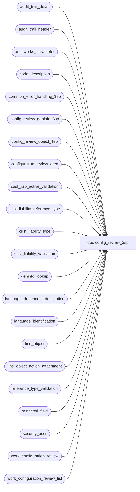

# dbo.config_review_$sp

**Database:** auditworks_external  
**Server:** bedrockdb01  

## Architecture Diagram



## Table Dependencies

| Referenced Table |
|---|
| audit_trail_detail |
| audit_trail_header |
| auditworks_parameter |
| code_description |
| common_error_handling_$sp |
| config_review_geninfo_$sp |
| config_review_object_$sp |
| configuration_review_area |
| cust_liab_active_validation |
| cust_liability_reference_type |
| cust_liability_type |
| cust_liability_validation |
| geninfo_lookup |
| language_dependent_description |
| language_identification |
| line_object |
| line_object_action_attachment |
| reference_type_validation |
| restricted_field |
| security_user |
| work_configuration_review |
| work_configuration_review_list |

## Stored Procedure Code

```sql
create proc dbo.config_review_$sp ( @detail_summary_both_flag tinyint = 2,  /* 	0=build detail from existing summary's selections
						1=build summary only, without selection
						2=build summary pre-selected then detail */						
  @line_object smallint = null,	/* may be optionally be set if @detail_summary_both_flag = 2, 
				   to limit review to the line-object specified regardless of status */
  @approval_status_date smalldatetime = null,
  @language_id smallint = null, 
  @session_id binary(16) = @@spid)

AS  

/* 
PROC NAME: config_review_$sp
     DESC: Called by PowerBuild Table Maintenance's Review Configurations pending approval.
     	   When called in summary-only mode only populates work_configuration_review_list with
     	   list of entities whose configuration has not yet been approved.  This list is
     	   presented to the user who may update the selected-flag of rows he wishes to review
     	   in greater detail.
     	   When called in detail-mode without line-object, presents the review detail for 
     	   all selected work-list rows or, if none are selected, for all entities pending approval.
     	   Called in detail-mode passing in a line-object from PB's Line Object TM to allow
     	   a line-object's configuration to be reviewed even if the line-object had already
     	   been approved, to present the review detail for that line-object alone.
     	   
     	   Note list of transactions at source of auto-config is available from auto_config_source table.
     	   
HISTORY:
Date     Name         Defect#  Description
Mar11,14 Vicci         150527  Add support for Chinese -People's Republic of China (2052).
Feb27,13 Vicci         142092  Add support for Mexican Spanish (2058).
Dec12,11 Vicci         131175  Use w.entry_id not @entry_id for work_configuration_review direct inserts
Sep29,1  Vicci         130127  Since configuration_review_area is hard-coded with only 3 languages, handle work around being passed a different one.
Sep29,11 Vicci         130118  Handle nulls when concatenating strings.
Sep16,11 Vicci         129791  Add before-values for code description desc changes
Jul13,11 Vicci         128421  Add handling for null field_code to header retrieval
Jun23,08 Vicci         102409  Close cursor upon error.
Oct25,06 Phu          77931    Fix outer join for SQL 2005 Mode 90.
Feb20,06 David        DV-1328  Make sure only approved configs are retrieved when user asks for approved configs as of a given date.
Mar08,05 David        DV-1202  Allow user to view previously approved configs as of a given date.
Feb24,05 Vicci        DV-1202  Author

*/

DECLARE @item_code		smallint, --line_object or form_code
	@detail_flag		tinyint, --0=header, 1=data
	@delim			nvarchar(3), 
	@delim2			nvarchar(3),
	@config_type		tinyint, --1=line_object, 2=code_description, 3=geninfo_lookup, 4=line_object_action_attachment
	@selected_flag		tinyint,
	@entry_id		numeric(12,0),
	@errmsg			nvarchar(255),
	@errno			int,
	@process_no		smallint,
	@object_name		nvarchar(255),	
	@operation_name		nvarchar(100),
	@cursor_open		tinyint,
	@config_review_area_lang smallint
 

IF @line_object <= 0 
  SELECT @line_object = null --

IF @detail_summary_both_flag = null --
  SELECT @detail_summary_both_flag = 2

SELECT @detail_flag = 1, 
       @delim = ' (', 
       @delim2 = ')', 
       @selected_flag = 1,
       @process_no = 292 

IF @detail_summary_both_flag <> 0
BEGIN
  DELETE work_configuration_review_list
   WHERE session_id = @session_id

  SELECT @errno = @@error
  IF @errno != 0
  BEGIN
    SELECT @errmsg = 'Failed to initialize work_configuration_review_list.',
           @object_name = 'work_configuration_review_list',
           @operation_name = 'DELETE'     
    GOTO error
  END
END  -- IF

IF @detail_summary_both_flag = 1
  SELECT @selected_flag = 0

IF @session_id = null --
  SELECT @session_id = @@spid 

/* Remove left-behind summary review list rows that are more than 1 day old */
DELETE work_configuration_review_list
 WHERE review_start_time < dateadd(dd, -1, getdate())

  SELECT @errno = @@error
  IF @errno != 0
  BEGIN
    SELECT @errmsg = 'Failed to clean up work_configuration_review_list.',
           @object_name = 'work_configuration_review_list',
           @operation_name = 'DELETE'     
    GOTO error
  END

/* Remove review detail rows for the current session or left-behind rows that are more than 1 day old */
DELETE work_configuration_review
 WHERE session_id = @session_id
    OR review_start_time < dateadd(dd, -1, getdate())

 SELECT @errno = @@error
  IF @errno != 0
  BEGIN
    SELECT @errmsg = 'Failed to clean up work_configuration_review.',
           @object_name = 'work_configuration_review',
           @operation_name = 'DELETE'     
    GOTO error
  END

/* Determine in which language to present the review */
IF @language_id IS NULL --
BEGIN
  SELECT @language_id = u.language_id
    FROM security_user u
   WHERE u.user_id = suser_sname()

  SELECT @errno = @@error
  IF @errno != 0
  BEGIN
    SELECT @errmsg = 'Failed to get language_id from security_user.',
           @object_name = 'security_user',
           @operation_name = 'SELECT'     
    GOTO error
  END
END -- IF   

IF @language_id IS NULL --
BEGIN
  SELECT @language_id = i.language_id
    FROM auditworks_parameter p, language_identification i
   WHERE par_name = 'base_language_id'
     AND convert(smallint, par_value) = i.language_id
     AND i.active_flag > 0

  SELECT @errno = @@error
  IF @errno != 0
  BEGIN
    SELECT @errmsg = 'Failed to get language_id from language_identification.',
           @object_name = 'language_identification',
           @operation_name = 'SELECT'     
    GOTO error
  END
END -- IF   

IF @language_id IS NULL --
  SELECT @language_id = 1033

IF @language_id NOT IN (1033, 3084, 2057, 2058, 2052)
BEGIN
  SELECT @config_review_area_lang = root_language_id
    FROM language_identification
   WHERE language_id = @language_id
     AND root_language_id IN (1033, 3084, 2057, 2058, 2052)
  SELECT @errno = @@error
  IF @errno != 0
  BEGIN
    SELECT @errmsg = 'Failed to get root_language_id from language_identification.',
           @object_name = 'language_identification',
           @operation_name = 'SELECT'     
    GOTO error
  END
  IF @config_review_area_lang IS NULL
    SELECT @config_review_area_lang = 1033
END
ELSE
  SELECT @config_review_area_lang = @language_id


IF @line_object IS NOT NULL --
BEGIN
  INSERT into work_configuration_review_list(session_id, config_type, item_type, item_code, 
  					     selected_flag, auto_config_verified)
  SELECT @session_id, 1, o.line_object_type, o.line_object, 
         @selected_flag, o.auto_config_verified
    FROM line_object o
   WHERE o.line_object = @line_object

  SELECT @errno = @@error
  IF @errno != 0
  BEGIN
    SELECT @errmsg = 'Failed to insert work_configuration_review_list for specified line_object.',
           @object_name = 'work_configuration_review_list',
           @operation_name = 'INSERT'     
    GOTO error
  END
END -- IF @line_object IS NOT NULL

/* If no specific items have been selected on the front end, then assume the user wishes
   to review all items pending approval */
IF NOT EXISTS (SELECT 1 
                 FROM work_configuration_review_list
                WHERE session_id = @session_id
                  AND selected_flag = 1)
BEGIN
  DELETE work_configuration_review_list
   WHERE session_id = @session_id

  INSERT INTO work_configuration_review_list(session_id, config_type, item_type, item_code, selected_flag, auto_config_verified)
  SELECT @session_id, 1, o.line_object_type, o.line_object, @selected_flag, o.auto_config_verified
    FROM line_object o
   WHERE line_object > 0
     AND (   (auto_config_verified IN (0, 2) AND @approval_status_date IS NULL)
          OR (auto_config_verified = 1 AND approval_status_date >= @approval_status_date AND @approval_status_date IS NOT NULL) )

  SELECT @errno = @@error
  IF @errno != 0
  BEGIN
    SELECT @errmsg = 'Failed to insert work_configuration_review_list (line_object).',
           @object_name = 'work_configuration_review_list',
           @operation_name = 'INSERT'     
    GOTO error
  END

  INSERT INTO work_configuration_review_list(session_id, config_type, item_type, item_code, selected_flag, auto_config_verified)
  SELECT @session_id, 2, code_type, code, @selected_flag, auto_config_verified
    FROM code_description
   WHERE (   (auto_config_verified IN (0, 2) AND @approval_status_date IS NULL)
          OR (auto_config_verified = 1 AND approval_status_date >= @approval_status_date AND @approval_status_date IS NOT NULL) )

  SELECT @errno = @@error
  IF @errno != 0
  BEGIN
    SELECT @errmsg = 'Failed to insert work_configuration_review_list (code_description).',
           @object_name = 'work_configuration_review_list',
           @operation_name = 'INSERT'     
    GOTO error
  END

  INSERT INTO work_configuration_review_list(session_id, config_type, item_type, item_code, selected_flag, auto_config_verified)
  SELECT DISTINCT @session_id, 3, 0, form_code, @selected_flag, auto_config_verified
    FROM geninfo_lookup
   WHERE (   (auto_config_verified IN (0, 2) AND @approval_status_date IS NULL)
          OR (auto_config_verified = 1 AND approval_status_date >= @approval_status_date AND @approval_status_date IS NOT NULL) )

  SELECT @errno = @@error
  IF @errno != 0
  BEGIN
    SELECT @errmsg = 'Failed to insert work_configuration_review_list (geninfo_lookup).',
           @object_name = 'work_configuration_review_list',
           @operation_name = 'INSERT'     
    GOTO error
  END

  INSERT INTO work_configuration_review_list(session_id, config_type, item_type, item_code, selected_flag, auto_config_verified)
  SELECT DISTINCT @session_id, 4, IsNull(o.line_object_type, 0), a.line_object, @selected_flag, a.auto_config_verified
    FROM line_object_action_attachment a, line_object o
   WHERE (   (a.auto_config_verified = 0 AND @approval_status_date IS NULL)
          OR (a.auto_config_verified = 1 AND a.approval_status_date >= @approval_status_date AND @approval_status_date IS NOT NULL) )
     AND a.line_object = o.line_object
     AND (o.auto_config_verified <> 0 or a.line_object = -1)

  SELECT @errno = @@error
  IF @errno != 0
  BEGIN
    SELECT @errmsg = 'Failed to insert work_configuration_review_list (line_object_action_attachment).',
           @object_name = 'work_configuration_review_list',
           @operation_name = 'INSERT'     
    GOTO error
  END
END -- IF NOT EXISTS

IF @detail_summary_both_flag = 1
  RETURN

/* Present line-object and geninfo review information -Start */
DECLARE review_cursor CURSOR FAST_FORWARD
    FOR
 SELECT item_code, config_type, entry_id
   FROM work_configuration_review_list
  WHERE session_id = @session_id
    AND selected_flag > 0 
    AND (   (config_type in (1, 3, 4) and @line_object is null)
         OR (config_type = 1 and item_code = @line_object)
        )
    
OPEN review_cursor
SELECT @cursor_open = 1

FETCH review_cursor
 INTO  @item_code, @config_type, @entry_id
    
WHILE @@fetch_status = 0 
BEGIN
  IF @config_type in (1, 4)
  BEGIN
    EXECUTE config_review_object_$sp @item_code, @language_id, @session_id, @entry_id, @config_type

    SELECT @errno = @@error
    IF @errno != 0
    BEGIN
      SELECT @errmsg = 'Failed to run config_review_object_$sp.',
             @object_name = 'config_review_object_$sp',
             @operation_name = 'EXECUTE'     
      GOTO error
    END
  END
  ELSE
  BEGIN
    EXECUTE config_review_geninfo_$sp @item_code, @language_id, @session_id, @entry_id

    SELECT @errno = @@error
    IF @errno != 0
    BEGIN
      SELECT @errmsg = 'Failed to run config_review_geninfo_$sp.',
             @object_name = 'config_review_geninfo_$sp',
             @operation_name = 'EXECUTE'     
      GOTO error
    END
END -- IF @config_type in (1, 4)
  
  FETCH review_cursor
   INTO  @item_code, @config_type, @entry_id
END /* while not end of cursor */

CLOSE review_cursor
DEALLOCATE review_cursor 
SELECT @cursor_open = 0
/* Present line-object and geninfo review information -End */


/* Present code-description review information -Start */
/* Table:  code_description -Start */
INSERT into work_configuration_review (session_id, detail_flag, auto_config_verified, config_type, 
  				       item_code, item_type, 
  				       table_maintenance_area_id,
  				       group1_setting, group2_setting,
				       field_code, field_setting, field_priority_no, work_list_entry_id)
SELECT @session_id, @detail_flag, c.auto_config_verified, w.config_type, 
       c.code, c.code_type, 
       20, 
       c.code_display_descr + @delim + convert(nvarchar, c.code) + @delim2, c.alpha_code, 
       'active_flag', IsNull(a_ldd.display_description, a.code_display_descr) + @delim + convert(nvarchar, c.active_flag) + @delim2, 10, w.entry_id
FROM work_configuration_review_list w
       INNER JOIN code_description c ON (w.item_type = c.code_type AND w.item_code = c.code)
       INNER JOIN code_description a ON (a.code = c.active_flag)
       LEFT JOIN language_dependent_description a_ldd ON (a.resource_id = a_ldd.resource_id AND a_ldd.language_id = @language_id)
 WHERE w.session_id = @session_id 
   AND w.config_type = 2
   AND w.selected_flag > 0 
   AND a.code_type = 203
  SELECT @errno = @@error
  IF @errno != 0
  BEGIN
    SELECT @errmsg = 'Failed to insert work_configuration_review (active_flag).',
           @object_name = 'work_configuration_review',
           @operation_name = 'INSERT'     
    GOTO error
  END

INSERT into work_configuration_review (session_id, detail_flag, auto_config_verified, config_type, 
  				       item_code, item_type, 
  				       table_maintenance_area_id,
  				       group1_setting, group2_setting,
				       field_code, field_setting, field_priority_no, work_list_entry_id)
SELECT @session_id, @detail_flag, c.auto_config_verified, w.config_type, 
       c.code, c.code_type, 
       20, 
       c.code_display_descr + @delim + convert(nvarchar, c.code) + @delim2, c.alpha_code, 
       'code_display_descr prior to ' + convert(nvarchar, h.entry_date), 
       d.before_value, 11, w.entry_id
  FROM work_configuration_review_list w
       INNER JOIN code_description c ON (w.item_type = c.code_type AND w.item_code = c.code AND c.auto_config_verified = 2)
       INNER JOIN audit_trail_header h
          ON h.table_name = 'code_description'
         AND h.table_key = convert(nvarchar, c.code_type) + '/' + convert(nvarchar, c.code)
         AND h.entry_date >= c.approval_status_date
         AND h.function_no = 0 --table maintenance
         AND h.action = 2  --modify
       INNER JOIN audit_trail_detail d
          ON h.entry_id = d.entry_id
         AND d.column_name = 'code_display_descr'
 WHERE w.session_id = @session_id 
   AND w.config_type = 2
   AND w.selected_flag > 0 
   AND w.auto_config_verified = 2
SELECT @errno = @@error
IF @errno != 0
BEGIN  
  SELECT @errmsg = 'Failed to populate work_configuration_review (code_description prior descriptions).',
         @object_name = 'work_configuration_review',
         @operation_name = 'INSERT'     
  GOTO error
END

INSERT into work_configuration_review (session_id, detail_flag, auto_config_verified, config_type, 
  				       item_code, item_type, 
  				       table_maintenance_area_id,
  				       group1_setting, group2_setting,
				       field_code, field_setting, field_priority_no, work_list_entry_id)
SELECT @session_id, @detail_flag, c.auto_config_verified, w.config_type, 
       c.code, c.code_type, 
    20, 
     c.code_display_descr + @delim + convert(nvarchar, c.code) + @delim2, c.alpha_code, 
       CASE WHEN f.field_code = 'OLD' THEN 'code_system_descr prior to ' + convert(nvarchar, h.entry_date) ELSE 'code_system_descr' END, 
       CASE WHEN f.field_code = 'OLD' THEN COALESCE(d.before_value, 'None') ELSE c.code_system_descr END, 12, w.entry_id
  FROM work_configuration_review_list w
       INNER JOIN code_description c ON (w.item_type = c.code_type AND w.item_code = c.code AND c.auto_config_verified = 2)
       INNER JOIN audit_trail_header h
          ON h.table_name = 'code_description'
         AND h.table_key = convert(nvarchar, c.code_type) + '/' + convert(nvarchar, c.code)
         AND h.entry_date >= c.approval_status_date
         AND h.function_no = 0 --table maintenance
         AND h.action = 2  --modify
       INNER JOIN audit_trail_detail d
          ON h.entry_id = d.entry_id
         AND d.column_name = 'code_system_descr'
       INNER JOIN (SELECT 'OLD' field_code
                   UNION
                   SELECT 'NEW' field_code) f
          ON 1=1
 WHERE w.session_id = @session_id 
   AND w.config_type = 2
   AND w.selected_flag > 0 
   AND w.auto_config_verified = 2
SELECT @errno = @@error
IF @errno != 0
BEGIN  
  SELECT @errmsg = 'Failed to populate work_configuration_review (code_description sys desc prior descriptions).',
         @object_name = 'work_configuration_review',
         @operation_name = 'INSERT'     
  GOTO error
END

INSERT into work_configuration_review (session_id, detail_flag, auto_config_verified, config_type, 
  				       item_code, item_type, 
  				       table_maintenance_area_id,
  				       group1_setting, group2_setting,
				       field_code, field_setting, field_priority_no, work_list_entry_id)
SELECT @session_id, @detail_flag, c.auto_config_verified, w.config_type, 
       c.code, c.code_type, 
       16, 
       i.language_description + @delim + convert(nvarchar, i.language_id) + @delim2,
       ldd.display_description,
       'display_description prior to ' + convert(nvarchar, h.entry_date), 
       d.before_value, 13, w.entry_id
  FROM work_configuration_review_list w
       INNER JOIN code_description c ON (w.item_type = c.code_type AND w.item_code = c.code AND c.auto_config_verified = 2)
       INNER JOIN language_dependent_description ldd
          ON c.resource_id = ldd.resource_id
       INNER JOIN language_identification i
          ON ldd.language_id = i.language_id
       INNER JOIN audit_trail_header h
          ON h.table_name = 'language_dependent_description'
	 AND h.table_key = convert(nvarchar, ldd.language_id) + '/' + convert(nvarchar, ldd.resource_id)
         AND h.entry_date >= c.approval_status_date
         AND h.function_no = 0 --table maintenance
         AND h.action = 2  --modify
       INNER JOIN audit_trail_detail d
          ON h.entry_id = d.entry_id
         AND d.column_name = 'display_description'
 WHERE w.session_id = @session_id 
   AND w.config_type = 2
   AND w.selected_flag > 0 
   AND w.auto_config_verified = 2
SELECT @errno = @@error
IF @errno != 0
BEGIN  
  SELECT @errmsg = 'Failed to populate work_configuration_review (code_description multi-lang prior descriptions).',
         @object_name = 'work_configuration_review',
         @operation_name = 'INSERT'     
  GOTO error
END
INSERT into work_configuration_review (session_id, detail_flag, auto_config_verified, config_type, 
  				       item_code, item_type, 
  				       table_maintenance_area_id,
  				       group1_setting, group2_setting,
				       field_code, field_setting, field_priority_no, work_list_entry_id)
SELECT @session_id, @detail_flag, c.auto_config_verified, w.config_type, 
       c.code, c.code_type, 
       16, 
       i.language_description + @delim + convert(nvarchar, i.language_id) + @delim2,
       ldd.display_description,
       'system_description prior to ' + convert(nvarchar, h.entry_date), 
       d.before_value, 14, w.entry_id
  FROM work_configuration_review_list w
       INNER JOIN code_description c ON (w.item_type = c.code_type AND w.item_code = c.code AND c.auto_config_verified = 2)
       INNER JOIN language_dependent_description ldd
          ON c.resource_id = ldd.resource_id
       INNER JOIN language_identification i
          ON ldd.language_id = i.language_id
 INNER JOIN audit_trail_header h
          ON h.table_name = 'language_dependent_description'
	 AND h.table_key = convert(nvarchar, ldd.language_id) + '/' + convert(nvarchar, ldd.resource_id)
         AND h.entry_date >= c.approval_status_date
         AND h.function_no = 0 --table maintenance
         AND h.action = 2  --modify
       INNER JOIN audit_trail_detail d
          ON h.entry_id = d.entry_id
         AND d.column_name = 'system_description'
 WHERE w.session_id = @session_id 
   AND w.config_type = 2
   AND w.selected_flag > 0 
   AND w.auto_config_verified = 2 
SELECT @errno = @@error
IF @errno != 0
BEGIN  
  SELECT @errmsg = 'Failed to populate work_configuration_review (code_description multi-lang prior sys descriptions).',
         @object_name = 'work_configuration_review',
        @operation_name = 'INSERT'     
  GOTO error
END
/* Table:  code_description -End */

/* Table:  language_dependent_description -Start */
IF EXISTS (SELECT active_flag
           FROM language_identification
           WHERE language_id <> 1033 and active_flag = 1)
BEGIN
  INSERT into work_configuration_review (session_id, detail_flag, auto_config_verified, config_type, 
  				         item_code, item_type, 
  					 table_maintenance_area_id,
  					 group1_setting, group2_setting,
					 field_code, field_setting, field_priority_no, work_list_entry_id)
  SELECT @session_id, @detail_flag, c.auto_config_verified, w.config_type,
         c.code, c.code_type, 
         16, 
         i.language_description + @delim + convert(nvarchar, i.language_id) + @delim2, ldd.display_description,
         'system_description', COALESCE(ldd.system_description, 'None'), 20, w.entry_id
  FROM work_configuration_review_list w
       INNER JOIN code_description c ON (w.item_type = c.code_type AND w.item_code = c.code)
       LEFT JOIN language_dependent_description ldd ON (c.resource_id = ldd.resource_id)
       RIGHT JOIN language_identification i ON (i.language_id = ldd.language_id)
 WHERE w.session_id = @session_id
   AND w.config_type = 2
   AND w.selected_flag > 0 

  SELECT @errno = @@error
  IF @errno != 0
  BEGIN
    SELECT @errmsg = 'Failed to insert work_configuration_review (language_dependent_description).',
           @object_name = 'work_configuration_review',
           @operation_name = 'INSERT'     
    GOTO error
  END
END -- IF EXISTS
/* Table:  language_dependent_description -End */

/* Table:  reference_type_validation -Start */
INSERT into work_configuration_review (session_id, detail_flag, auto_config_verified, config_type, 
  				       item_code, item_type, 
  				       table_maintenance_area_id,
  				       group1_setting, group2_setting,
				       field_code, field_setting, field_priority_no, work_list_entry_id)
SELECT @session_id, @detail_flag, w.auto_config_verified, w.config_type, 
       w.item_code, w.item_type, 
       23, 
       IsNull(e_ldd.display_description, e.code_display_descr)  + @delim + convert(nvarchar, v.edit_active_flag) + @delim2, 
       IsNull(m_ldd.display_description, m.code_display_descr)  + @delim + convert(nvarchar, v.manual_active_flag) + @delim2, 
       null, null, 10, w.entry_id
  FROM work_configuration_review_list w
        INNER JOIN reference_type_validation v ON (w.item_code = v.reference_type AND v.validation_type = 1)
        INNER JOIN code_description e ON (e.code = v.edit_active_flag)
        INNER JOIN code_description m ON (m.code = v.manual_active_flag)
        LEFT JOIN language_dependent_description e_ldd ON (e.resource_id = e_ldd.resource_id AND e_ldd.language_id = @language_id)
        LEFT JOIN language_dependent_description m_ldd ON (m.resource_id = m_ldd.resource_id and m_ldd.language_id = @language_id)
 WHERE w.session_id = @session_id 
   AND w.config_type = 2
   AND w.selected_flag > 0 
   AND w.item_type = 22
   AND e.code_type = 203
   AND m.code_type = 203

  SELECT @errno = @@error
  IF @errno != 0
  BEGIN
    SELECT @errmsg = 'Failed to insert work_configuration_review (reference_type_validation).',
           @object_name = 'work_configuration_review',
           @operation_name = 'INSERT'     
    GOTO error
  END

INSERT into work_configuration_review (session_id, detail_flag, auto_config_verified, config_type, 
  				       item_code, item_type, 
  				       table_maintenance_area_id,
  				       group1_setting, group2_setting,
				       field_code, field_setting, field_priority_no, work_list_entry_id)
SELECT @session_id, @detail_flag, w.auto_config_verified, w.config_type, 
       w.item_code, w.item_type, 
       23, 
       null, 
       null, 
       'None', null, 10, w.entry_id
  FROM work_configuration_review_list w
 WHERE w.session_id = @session_id 
   AND w.config_type = 2
   AND w.selected_flag > 0 
   AND w.item_type = 22
   AND w.item_code not in (SELECT v.reference_type
   			     FROM reference_type_validation v
   			    WHERE v.validation_type = 1)

  SELECT @errno = @@error
  IF @errno != 0
  BEGIN
    SELECT @errmsg = 'Failed to insert work_configuration_review (reference_type_validation 2).',
           @object_name = 'work_configuration_review',
           @operation_name = 'INSERT'     
    GOTO error
  END
/* Table:  reference_type_validation -End */

/* Table:  restricted_field -Start */
INSERT into work_configuration_review (session_id, detail_flag, auto_config_verified, config_type, 
  				       item_code, item_type, 
  				       table_maintenance_area_id,
  				       group1_setting, group2_setting,
				       field_code, field_setting, field_priority_no, work_list_entry_id)
SELECT @session_id, @detail_flag, w.auto_config_verified, w.config_type, 
       w.item_code, w.item_type, 
       24, 
       IsNull(l_ldd.display_description, l.code_display_descr)  + @delim + convert(nvarchar, r.restriction_level) + @delim2, 
       IsNull(a_ldd.display_description, a.code_display_descr)  + @delim + convert(nvarchar, r.active_flag) + @delim2, 
      null, null, 10, w.entry_id
  FROM work_configuration_review_list w
       INNER JOIN restricted_field r ON (w.item_code = r.field_value)
       INNER JOIN code_description l ON (l.code = r.restriction_level)
       INNER JOIN code_description a ON (a.code = r.active_flag)
       LEFT JOIN language_dependent_description l_ldd ON (l.resource_id = l_ldd.resource_id AND l_ldd.language_id = @language_id)
       LEFT JOIN language_dependent_description a_ldd ON (a.resource_id = a_ldd.resource_id AND a_ldd.language_id = @language_id)
 WHERE w.session_id = @session_id 
   AND w.config_type = 2
   AND w.selected_flag > 0 
   AND w.item_type = 22
   AND r.field_name = 'reference_type'
   AND a.code_type = 203 
   AND l.code_type = 199

  SELECT @errno = @@error
  IF @errno != 0
  BEGIN
    SELECT @errmsg = 'Failed to insert work_configuration_review (restricted_field).',
           @object_name = 'work_configuration_review',
           @operation_name = 'INSERT'     
    GOTO error
  END

INSERT into work_configuration_review (session_id, detail_flag, auto_config_verified, config_type, 
  				       item_code, item_type, 
  				     table_maintenance_area_id,
  				       group1_setting, group2_setting,
				       field_code, field_setting, field_priority_no, work_list_entry_id)
SELECT @session_id, @detail_flag, w.auto_config_verified, w.config_type, 
       w.item_code, w.item_type, 
       24, 
       null, 
       null, 
       'None', null, 10, w.entry_id
  FROM work_configuration_review_list w
 WHERE w.session_id = @session_id 
   AND w.config_type = 2
   AND w.selected_flag > 0 
   AND w.item_type = 22
   AND w.item_code not in (SELECT r.field_value
   			     FROM restricted_field r
   			    WHERE r.field_name = 'reference_type')

  SELECT @errno = @@error
  IF @errno != 0
  BEGIN
    SELECT @errmsg = 'Failed to insert work_configuration_review (restricted_field 2).',
           @object_name = 'work_configuration_review',
           @operation_name = 'INSERT'     
    GOTO error
  END
/* Table:  restricted_field -End */

/* Table:  cust_liability_reference_type -Start */
INSERT into work_configuration_review (session_id, detail_flag, auto_config_verified, config_type, 
  				       item_code, item_type, 
  				     table_maintenance_area_id,
  				       group1_setting, group2_setting,
				      field_code, field_setting, field_priority_no, work_list_entry_id)
SELECT @session_id, @detail_flag, w.auto_config_verified, w.config_type, 
       w.item_code, w.item_type, 
       25, 
       reference_no_length, 
       reference_no_datatype, 
       IsNull(c_ldd.display_description, c.code_display_descr)  + @delim + convert(nvarchar, r.unique_by_store_key) + @delim2,
       IsNull(l_ldd.display_description, l.code_display_descr)  + @delim + convert(nvarchar, r.pos_lookup) + @delim2, 
       10, w.entry_id
  FROM work_configuration_review_list w
       INNER JOIN cust_liability_reference_type r ON (w.item_code = r.reference_type)
       INNER JOIN code_description c ON (c.code = r.unique_by_store_key)
       INNER JOIN code_description l ON (l.code = r.pos_lookup)
       LEFT JOIN language_dependent_description c_ldd ON (c.resource_id = c_ldd.resource_id and c_ldd.language_id = @language_id)
       LEFT JOIN language_dependent_description l_ldd ON (l.resource_id = l_ldd.resource_id and l_ldd.language_id = @language_id)
 WHERE w.session_id = @session_id 
   AND w.config_type = 2
   AND w.selected_flag > 0 
   AND w.item_type = 22
   AND c.code_type = 203
   AND l.code_type = 203

  SELECT @errno = @@error
  IF @errno != 0
  BEGIN
    SELECT @errmsg = 'Failed to insert work_configuration_review (cust_liability_reference_type).',
           @object_name = 'work_configuration_review',
           @operation_name = 'INSERT'     
    GOTO error
  END

INSERT into work_configuration_review (session_id, detail_flag, auto_config_verified, config_type, 
  				       item_code, item_type, 
  				     table_maintenance_area_id,
  				       group1_setting, group2_setting,
				       field_code, field_setting, field_priority_no, work_list_entry_id)
SELECT @session_id, @detail_flag, w.auto_config_verified, w.config_type, 
       w.item_code, w.item_type, 
       25, 
       null, 
       null, 
       'None', null, 10, w.entry_id
  FROM work_configuration_review_list w
 WHERE w.session_id = @session_id 
   AND w.config_type = 2
   AND w.selected_flag > 0 
   AND w.item_type = 22
   AND w.item_code not in (SELECT r.reference_type
   			     FROM cust_liability_reference_type r)

  SELECT @errno = @@error
  IF @errno != 0
  BEGIN
    SELECT @errmsg = 'Failed to insert work_configuration_review (cust_liability_reference_type 2).',
           @object_name = 'work_configuration_review',
           @operation_name = 'INSERT'     
    GOTO error
  END
/* Table:  cust_liability_reference_type -End */

/* Table:  cust_liab_active_validation -Start */
INSERT into work_configuration_review (session_id, detail_flag, auto_config_verified, config_type, 
  				       item_code, item_type, 
  				       table_maintenance_area_id,
  				       group1_setting, group2_setting,
				       field_code, field_setting, field_priority_no, work_list_entry_id)
SELECT @session_id, @detail_flag, w.auto_config_verified, w.config_type, 
       w.item_code, w.item_type, 
       26, 
       IsNull(t_ldd.display_description, t.tracking_id_description) + @delim + convert(nvarchar, a.tracking_id) + @delim2, 
       IsNull(v_ldd.display_description, v.validation_description)  + @delim + convert(nvarchar, a.validation_id) + @delim2,
  null, null, 
       10, w.entry_id
  FROM work_configuration_review_list w
       INNER JOIN cust_liab_active_validation a ON (w.item_code = a.reference_type)
       INNER JOIN cust_liability_validation v ON (a.validation_id = v.validation_id)
       INNER JOIN cust_liability_type t ON (a.reference_type = t.reference_type AND a.tracking_id = t.tracking_id)
       LEFT JOIN language_dependent_description v_ldd ON (v.validation_resource_id = v_ldd.resource_id AND v_ldd.language_id = @language_id)
       LEFT JOIN language_dependent_description t_ldd ON (t.resource_id = t_ldd.resource_id AND t_ldd.language_id = @language_id)
 WHERE w.session_id = @session_id 
   AND w.config_type = 2
   AND w.selected_flag > 0 
   AND w.item_type = 22

  SELECT @errno = @@error
  IF @errno != 0
  BEGIN
SELECT @errmsg = 'Failed to insert work_configuration_review (cust_liab_active_validation).',
           @object_name = 'work_configuration_review',
           @operation_name = 'INSERT'     
    GOTO error
  END

INSERT into work_configuration_review (session_id, detail_flag, auto_config_verified, config_type, 
  				       item_code, item_type, 
  				     table_maintenance_area_id,
  				  group1_setting, group2_setting,
				       field_code, field_setting, field_priority_no, work_list_entry_id)
SELECT @session_id, @detail_flag, w.auto_config_verified, w.config_type, 
       w.item_code, w.item_type, 
       26, 
       null, 
       null, 
       'None', null, 10, w.entry_id
  FROM work_configuration_review_list w
 WHERE w.session_id = @session_id 
   AND w.config_type = 2
   AND w.selected_flag > 0 
   AND w.item_type = 22
   AND w.item_code not in (SELECT reference_type
   			     FROM cust_liab_active_validation)

  SELECT @errno = @@error
  IF @errno != 0
  BEGIN
    SELECT @errmsg = 'Failed to insert work_configuration_review (cust_liab_active_validation 2).',
           @object_name = 'work_configuration_review',
           @operation_name = 'INSERT'     
    GOTO error
  END
/* Table:  cust_liab_active_validation -End */

/* Present code-description review information -End */


/* Header entries -Start */
INSERT into work_configuration_review (session_id, detail_flag, 
				       auto_config_verified, config_type, 
  				       item_code, item_type, 
  				       table_maintenance_area_id,
  				       group1_setting, group2_setting,
				       field_code, field_setting, field_priority_no,
				       config_count, 
				       config_fcount,
				       work_list_entry_id)
SELECT @session_id, 0, 
       w.auto_config_verified, w.config_type, 
       w.item_code, w.item_type,   
       w.table_maintenance_area_id,   
       a.group1_heading, a.group2_heading,   
       a.field_code_heading, a.field_setting_heading, 0,
       count(distinct COALESCE(w.group1_setting, '') + COALESCE(w.group2_setting, '')), 
       count(distinct COALESCE(w.group1_setting, '') + COALESCE(w.group2_setting, '') + COALESCE(w.field_setting, '')),
       w.work_list_entry_id
  FROM work_configuration_review w, configuration_review_area a
 WHERE w.table_maintenance_area_id = a.table_maintenance_area_id    
   AND (w.field_code IS NULL OR w.field_code not in ('ABSENT', 'None'))
   AND w.session_id = @session_id
   AND a.language_id = @config_review_area_lang
 GROUP by w.auto_config_verified, w.config_type,
 	  w.item_code,   
          w.item_type,   
          w.table_maintenance_area_id,   
          a.group1_heading,   
          a.group2_heading,   
          a.field_code_heading,   
          a.field_setting_heading,
          w.work_list_entry_id

  SELECT @errno = @@error
  IF @errno != 0
  BEGIN
    SELECT @errmsg = 'Failed to insert work_configuration_review (header).',
           @object_name = 'work_configuration_review',
           @operation_name = 'INSERT'     
    GOTO error
  END

INSERT into work_configuration_review (session_id, detail_flag, 
				     auto_config_verified, config_type, 
  				       item_code, item_type, 
  				       table_maintenance_area_id,
  				       group1_setting, group2_setting,
				       field_code, field_setting, field_priority_no, 
				      work_list_entry_id)
SELECT @session_id, 0, 
       w.auto_config_verified, w.config_type, 
       w.item_code, w.item_type,   
       w.table_maintenance_area_id,   
       a.group1_heading, a.group2_heading,   
       a.field_code_heading, a.field_setting_heading, 0, 
       w.work_list_entry_id
  FROM work_configuration_review w, configuration_review_area a
 WHERE w.table_maintenance_area_id = a.table_maintenance_area_id    
   AND w.session_id = @session_id
   AND w.field_code is not null
   AND a.language_id = @config_review_area_lang
 GROUP by w.auto_config_verified, w.config_type,
 	  w.item_code,   
          w.item_type,   
   w.table_maintenance_area_id,   
     a.group1_heading,   
          a.group2_heading,   
          a.field_code_heading,   
          a.field_setting_heading,
          w.work_list_entry_id
HAVING min(w.field_code) in ('ABSENT', 'None') 
   AND max(w.field_code) in ('ABSENT', 'None') 

  SELECT @errno = @@error
  IF @errno != 0
  BEGIN
    SELECT @errmsg = 'Failed to insert work_configuration_review (header 2).',
   @object_name = 'work_configuration_review',
           @operation_name = 'INSERT'     
    GOTO error
  END

/* Header entries -End */


RETURN

error:   /* Common error handler */

	IF @cursor_open = 1
	BEGIN
	  CLOSE review_cursor
	  DEALLOCATE review_cursor 
	END
	
	EXEC common_error_handling_$sp @process_no, @errno, @errmsg, 0, NULL, 
	  NULL, @object_name, @operation_name, 0, 1, 0, null, 0, null, null, null,
	  null, null, null, 0, @session_id

	RETURN
```

