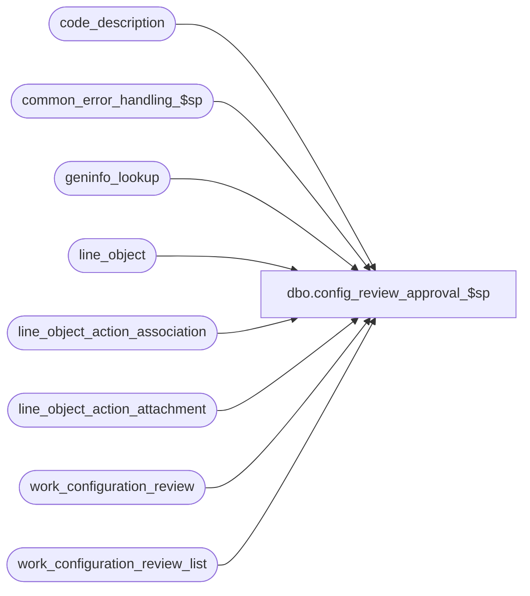

# dbo.config_review_approval_$sp

**Database:** auditworks_external  
**Server:** bedrockdb01  

## Architecture Diagram



## Table Dependencies

| Referenced Table |
|---|
| code_description |
| common_error_handling_$sp |
| geninfo_lookup |
| line_object |
| line_object_action_association |
| line_object_action_attachment |
| work_configuration_review |
| work_configuration_review_list |

## Stored Procedure Code

```sql
create proc [dbo].[config_review_approval_$sp] 

( @session_id binary(16) = @@spid)

AS  

/* 
PROC NAME: config_review_approval_$sp
     DESC: Called by PowerBuild Table Maintenance's Review Configurations pending approval, 
           providing a list of configuration to be approved marked with a selected-flag of 2
           in work_configuration_review_list.
           This proc will update the revalidation queue table, which will trigger a call to
           mass_correct_line_object_$sp in each peripheral.
           
	config_type:  1=line_object, 2=code_description, 3=geninfo_lookup, 4=line_object_action_attachment 
	selected_flag: 1=review, 2=approve, 3=copy 					
           
     	   
HISTORY:
Date     Name         Defect#  Description
Jan04,11 Paul          105313  Use unicode datatypes
Mar01,06 David        DV-1328  Changed message ID 203151 to 201692 to fit in reserved BE range.
                               Keep detail and summary and set auto_config_verified to 1 instead.
                               Move revalidate logic to triggers.
Dec08,05 David        DV-1319  Changed warning message ID.
Apr14,05 David        DV-1202  Review and add error trap. Update queue to revalidate S/A reject 18, 19.
Feb24,05 Vicci        DV-1202  Author

*/

DECLARE @errno			int,
	@errmsg			nvarchar(255),
	@message_id		int,
	@object_name		nvarchar(255),	
	@operation_name		nvarchar(100),
	@process_name		nvarchar(100),
	@process_no		smallint

IF @session_id = null --
  SELECT @session_id = @@spid 

SELECT @process_no = 292,
	@process_name = 'config_review_approval_$sp' 

-- If a line object is dependant on an auto-configured reference type that hasn't been approved yet,
-- do not approve the line object configuration, and raise an error saying that some reference types
-- need to be reviewed. Any other line objects should be approved, the verified flag set to 1.
SELECT DISTINCT x.line_object, x.reference_type, c.code_display_descr
  INTO #ref_type_not_approved
  FROM work_configuration_review_list w, line_object_action_association x, code_description c
 WHERE w.selected_flag = 2
   AND w.session_id = @session_id
   AND w.config_type = 1
   AND w.item_code = x.line_object
   AND x.reference_type <> 0
   AND c.code_type = 22
   AND x.reference_type = c.code
   AND c.auto_config_verified = 0

  SELECT @errno = @@error
  IF @errno != 0
  BEGIN
    SELECT @errmsg = 'Failed to populate #ref_type_not_approved.',
           @object_name = '#ref_type_not_approved',
           @operation_name = 'SELECT'     
    GOTO error
  END

UPDATE work_configuration_review_list
   SET selected_flag = 1
 WHERE work_configuration_review_list.selected_flag = 2
   AND work_configuration_review_list.session_id = @session_id
   AND work_configuration_review_list.config_type = 1
   AND work_configuration_review_list.item_code IN (SELECT line_object
						FROM #ref_type_not_approved)

  SELECT @errno = @@error
  IF @errno != 0
  BEGIN
    SELECT @errmsg = 'Failed to set selected_flag.',
           @object_name = 'work_configuration_review_list',
           @operation_name = 'UPDATE'     
    GOTO error
  END

UPDATE line_object
   SET auto_config_verified = 1,
       approval_status_date = getdate()
  FROM work_configuration_review_list
 WHERE work_configuration_review_list.selected_flag = 2
   AND work_configuration_review_list.session_id = @session_id
   AND work_configuration_review_list.config_type = 1
   AND work_configuration_review_list.item_code = line_object.line_object
   AND line_object.auto_config_verified in (0, 2)

  SELECT @errno = @@error
  IF @errno != 0
  BEGIN
    SELECT @errmsg = 'Failed to set auto_config_verified.',
           @object_name = 'line_object',
           @operation_name = 'UPDATE'     
    GOTO error
  END

UPDATE line_object_action_attachment
   SET auto_config_verified = 1,
       approval_status_date = getdate()
  FROM work_configuration_review_list
 WHERE work_configuration_review_list.selected_flag = 2
   AND work_configuration_review_list.session_id = @session_id
   AND work_configuration_review_list.config_type in (1, 4)
   AND work_configuration_review_list.item_code = line_object_action_attachment.line_object
   AND line_object_action_attachment.auto_config_verified in (0, 2)

  SELECT @errno = @@error
  IF @errno != 0
  BEGIN
    SELECT @errmsg = 'Failed to set auto_config_verified.',
       @object_name = 'line_object_action_attachment',
           @operation_name = 'UPDATE'     
    GOTO error
  END

UPDATE code_description
   SET auto_config_verified = 1,
       approval_status_date = getdate()
  FROM work_configuration_review_list
 WHERE work_configuration_review_list.selected_flag = 2
   AND work_configuration_review_list.session_id = @session_id
   AND work_configuration_review_list.config_type = 2
   AND work_configuration_review_list.item_type = code_description.code_type 
   AND work_configuration_review_list.item_code = code_description.code
   AND code_description.auto_config_verified in (0, 2)

  SELECT @errno = @@error
  IF @errno != 0
  BEGIN
    SELECT @errmsg = 'Failed to set auto_config_verified.',
           @object_name = 'code_description',
           @operation_name = 'UPDATE'     
    GOTO error
  END

UPDATE geninfo_lookup
   SET auto_config_verified = 1,
       approval_status_date = getdate()
  FROM work_configuration_review_list
 WHERE work_configuration_review_list.selected_flag = 2
   AND work_configuration_review_list.session_id = @session_id
   AND work_configuration_review_list.config_type = 3
   AND work_configuration_review_list.item_code = geninfo_lookup.form_code
   AND geninfo_lookup.auto_config_verified in (0, 2)

  SELECT @errno = @@error
  IF @errno != 0
  BEGIN
    SELECT @errmsg = 'Failed to set auto_config_verified.',
           @object_name = 'geninfo_lookup',
           @operation_name = 'UPDATE'     
    GOTO error
  END

-- To avoid rows from disappearing when FE refreshes the detail window, do not remove review list rows that have been approved.
-- Instead, set auto_config_verified to 1 and selected_flag back to 0. 
UPDATE work_configuration_review
   SET auto_config_verified = 1
  FROM work_configuration_review_list
 WHERE work_configuration_review_list.session_id = @session_id
   AND work_configuration_review_list.selected_flag = 2
   AND work_configuration_review_list.entry_id = work_configuration_review.work_list_entry_id

  SELECT @errno = @@error
  IF @errno != 0
  BEGIN
    SELECT @errmsg = 'Failed to update review list rows that have been approved.',
           @object_name = 'work_configuration_review',
           @operation_name = 'UPDATE'     
    GOTO error
  END

UPDATE work_configuration_review_list
   SET auto_config_verified = 1, selected_flag = 0
 WHERE session_id = @session_id 
   AND selected_flag = 2

  SELECT @errno = @@error
  IF @errno != 0
  BEGIN
    SELECT @errmsg = 'Failed to SET auto_config_verified = 1, selected_flag = 0.',
           @object_name = 'work_configuration_review_list',
           @operation_name = 'UPDATE'     
    GOTO error
  END
   
-- To re-evaluate the S/A rejects, the triggers on line_object and geninfo_lookup will update CHNG_RSPNS_QUEUE table. 
-- A SmartView process will wake up every 5 mins to check that table and call mass_auto_revalidate_$sp.
-- In the case of a scaleout environment, the master tables in TM are replicated to each peripheral and 
-- the triggers will be fired there and update the local CHNG_RSPNS_QUEUE table.


IF EXISTS (SELECT line_object FROM #ref_type_not_approved)
BEGIN
  -- RAISE warning
  SELECT @errmsg = 'Some line objects could not be approved, because they use auto-configured reference types that need to be reviewed first.',
         @errno = 201692, 
         @message_id = 201692
  GOTO error
END


RETURN


error:   /* Common error handler */

	EXEC common_error_handling_$sp @process_no, @errno, @errmsg, 0, @message_id,  
	  @process_name, @object_name, @operation_name, 0, 1, 0, null, 0, null, null, null,
	  null, null, null, 0, @session_id

	RETURN
```

