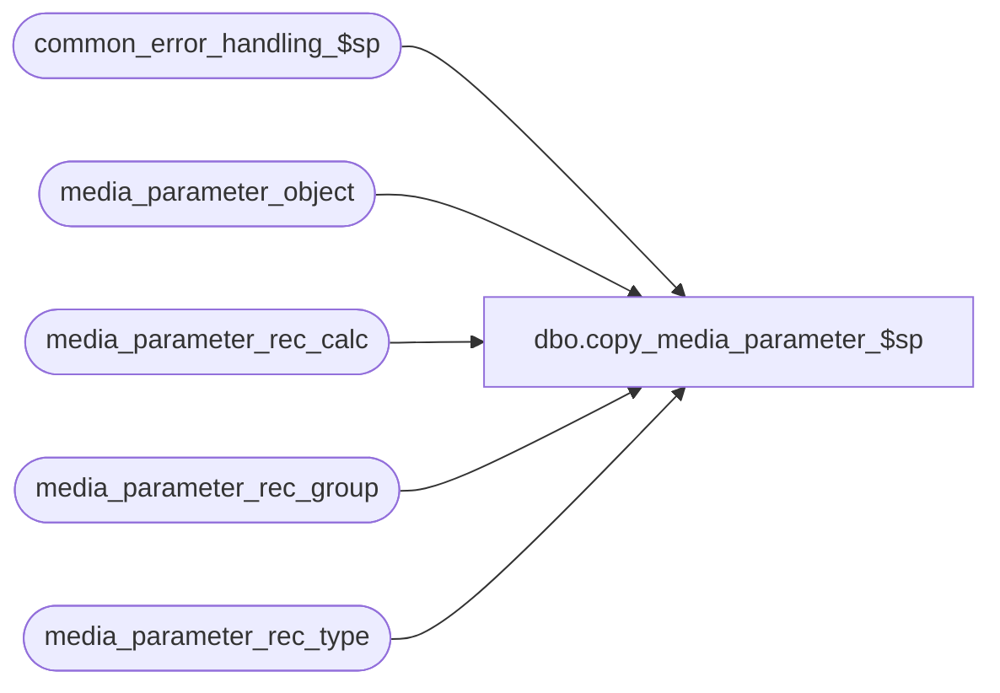

# dbo.copy_media_parameter_$sp

**Database:** auditworks_external  
**Server:** bedrockdb01  

## Architecture Diagram



## Table Dependencies

| Referenced Table |
|---|
| common_error_handling_$sp |
| media_parameter_object |
| media_parameter_rec_calc |
| media_parameter_rec_group |
| media_parameter_rec_type |

## Stored Procedure Code

```sql
create proc [dbo].[copy_media_parameter_$sp] 
@old_media_parameter_set_no     smallint,
@new_media_parameter_set_no     smallint,
@errmsg                         nvarchar(255)  OUTPUT

AS

/* 
PROC NAME: copy_media_parameter_$sp (rel 4.00 and higher)
     DESC: Makes a copy of media parameter tables for a new media parameter set no.
           Called by F/E tm.

HISTORY: 
Date      Name       Def#    Desc
Sep29,04  David    DV-1146   Only called by PB, so remove parameter @process_id and @user_name.
Jul09,04  ShuZ     DV-1071   Expand user_name to nvarchar(50)
Apr21,04  Maryam   DV-1071   Receive @process_id, @user_name and pass it to common_error_handling_$sp
Apr14,04  Sab	   DV-1068   Remove code for old media_parameter table
Oct03,03  Maryam     15869   Make sure the row does not exist in meida_parameter before inserting
                             into it.
Jul22,03  Maryam     11627   Author
*/

DECLARE
  @errno			int,
  @message_id			int,
  @object_name			nvarchar(255),
  @operation_name		nvarchar(100),
  @process_name			nvarchar(100)


SELECT        
       @process_name = 'copy_media_parameter_$sp',
       @message_id   = 201068

  INSERT media_parameter_object(
         media_parameter_set_no,
         line_object,
         rec_type,
         rec_group_line_object)
  SELECT @new_media_parameter_set_no,
         line_object,
         rec_type,
         rec_group_line_object
    FROM media_parameter_object
   WHERE media_parameter_set_no = @old_media_parameter_set_no 

  SELECT @errno = @@error
  IF @errno != 0 
    BEGIN
      SELECT @errmsg = 'Failed to insert into media_parameter_object',
             @object_name = 'media_parameter_object',
             @operation_name = 'INSERT'
      GOTO error
    END

  INSERT media_parameter_rec_calc(
         media_parameter_set_no,
         line_object,
         line_action,
         rec_side,
         rec_amount_type,
         rec_amount_subtype,
         rec_type,
         balancing_method,
         store_no_factor,
         register_no_factor,
         till_no_factor,
         cashier_no_factor,
         bank_no_factor,
         multiple_actual_handling_code,
         rec_group_line_object,
         contribution_sign,
         foreign_currency_id,
         convert_to_domestic,
         track_qty,
         short_tolerance_amount,
         short_tolerance_qty,
         short_tolerance_percent,
         unrec_tolerance_days,
         unrec_tolerance_amount)
  SELECT @new_media_parameter_set_no,
         line_object,
         line_action,
         rec_side,
         rec_amount_type,
         rec_amount_subtype,
         rec_type,
         balancing_method,
         store_no_factor,
         register_no_factor,
         till_no_factor,
         cashier_no_factor,
         bank_no_factor,
         multiple_actual_handling_code,
         rec_group_line_object,
         contribution_sign,
         foreign_currency_id,
         convert_to_domestic,
         track_qty,
         short_tolerance_amount,
         short_tolerance_qty,
         short_tolerance_percent,
         unrec_tolerance_days,
         unrec_tolerance_amount
    FROM media_parameter_rec_calc
   WHERE media_parameter_set_no = @old_media_parameter_set_no 

  SELECT @errno = @@error
  IF @errno != 0 
    BEGIN
      SELECT @errmsg = 'Failed to insert into media_parameter_rec_calc',
    @object_name = 'media_parameter_rec_calc',
             @operation_name = 'INSERT'
      GOTO error
    END

  INSERT media_parameter_rec_group(
         media_parameter_set_no,
         rec_type,
         rec_group_line_object,
         short_tolerance_amount,
         short_tolerance_qty,
         short_tolerance_percent,
         unrec_tolerance_days,
         unrec_tolerance_amount,
         rec_option,
         track_qty,
         foreign_currency_id,
         convert_to_domestic)
SELECT @new_media_parameter_set_no,
    rec_type,
         rec_group_line_object,
         short_tolerance_amount,
         short_tolerance_qty,
         short_tolerance_percent,
         unrec_tolerance_days,
         unrec_tolerance_amount,
         rec_option,
         track_qty,
         foreign_currency_id,
         convert_to_domestic
    FROM media_parameter_rec_group
   WHERE media_parameter_set_no = @old_media_parameter_set_no 

  SELECT @errno = @@error
  IF @errno != 0 
    BEGIN
      SELECT @errmsg = 'Failed to insert into media_parameter_rec_group',
             @object_name = 'media_parameter_rec_group',
             @operation_name = 'INSERT'
      GOTO error
    END
    
  INSERT media_parameter_rec_type(
         media_parameter_set_no,
         rec_type,
         balancing_method,
         multiple_actual_handling_code,
         dflt_short_tolerance_amount,
         dflt_short_tolerance_qty,
         dflt_short_tolerance_percent,
         dflt_unrec_tolerance_days,
         dflt_unrec_tolerance_amount,
         auto_populate_object)
  SELECT @new_media_parameter_set_no,
         rec_type,
         balancing_method,
         multiple_actual_handling_code,
         dflt_short_tolerance_amount,
         dflt_short_tolerance_qty,
         dflt_short_tolerance_percent,
         dflt_unrec_tolerance_days,
         dflt_unrec_tolerance_amount,
         auto_populate_object
    FROM media_parameter_rec_type
   WHERE media_parameter_set_no = @old_media_parameter_set_no 

  SELECT @errno = @@error
  IF @errno != 0 
    BEGIN
      SELECT @errmsg = 'Failed to insert into media_parameter_rec_type',
             @object_name = 'media_parameter_rec_type',
             @operation_name = 'INSERT'
      GOTO error
    END


RETURN

error:
 
	EXEC common_error_handling_$sp 0, @errno, @errmsg, 0, @message_id, 
	@process_name, @object_name, @operation_name
	
        RETURN
```

