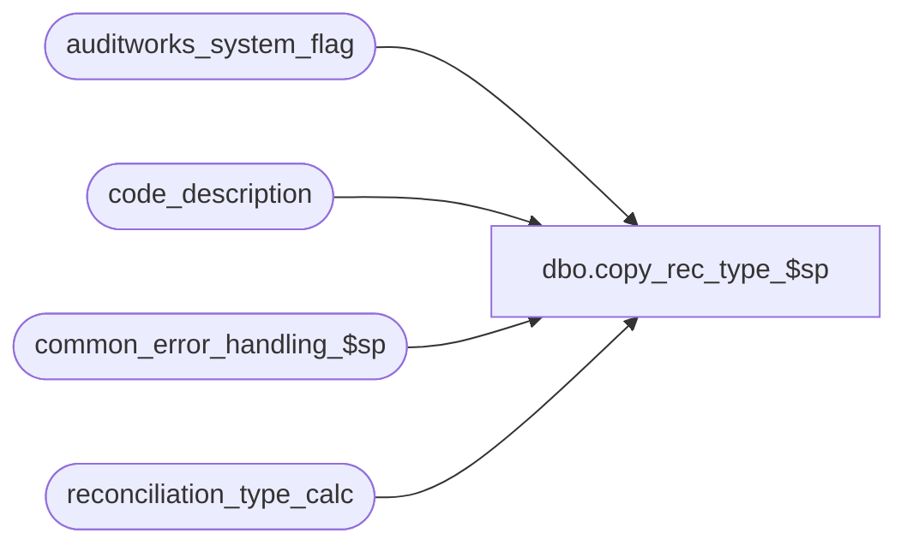

# dbo.copy_rec_type_$sp

**Database:** auditworks_external  
**Server:** bedrockdb01  

## Architecture Diagram



## Table Dependencies

| Referenced Table |
|---|
| auditworks_system_flag |
| code_description |
| common_error_handling_$sp |
| reconciliation_type_calc |

## Stored Procedure Code

```sql
create proc [dbo].[copy_rec_type_$sp] @new_description  nvarchar(255) = NULL,  --description of new rec-type to be created;  can be left null if if overlaying definition of a pre-existing defined user-defined rec-type
@old_rec_type     smallint = NULL,
@new_rec_type     smallint = NULL OUTPUT,  --Not passed in when creating a new rec-type, but may be specified if overlaying definition of a pre-existing defined user-defined rec-type 
@errmsg           nvarchar(255) = NULL  OUTPUT

AS
/* 
PROC NAME: copy_rec_type_$sp (rel 4.00 and higher)
     DESC: Makes a copy of the reconciliation_type_calc table entries under an old rec-type to a new reconciliation_type
           Called by F/E
           DECLARE @new_description  nvarchar(255),
                   @old_rec_type     smallint
           SELECT @new_description = 'TEST', 
                  @old_rec_type = 5
           EXEC copy_rec_type_$sp @new_description, @old_rec_type


HISTORY: 
Date      Name       Def#    Desc
Jul15,11  Vicci      128512  Don't overlay all preceding reconciliation types, just the one requested; treat -1 as NULL.
Jul20,08  Vicci      102933  Author
*/

DECLARE
  @errno			int,
  @message_id			int,
  @object_name			nvarchar(255),
  @operation_name		nvarchar(100),
  @process_name			nvarchar(100),
  @current_date			smalldatetime,
  @rows				int

SELECT        
       @process_name = 'copy_rec_type_$sp',
       @message_id   = 201068,
       @current_date = getdate()

IF @old_rec_type = -1
  SELECT @old_rec_type = NULL
IF @new_rec_type = -1
  SELECT @new_rec_type = NULL
  
IF @new_rec_type IS NULL
BEGIN
  INSERT into code_description(
         code_type,
         code,
         code_display_descr,
         code_meaning_control,
         approval_status_date)
  SELECT 82,
         MIN(code) + 1 code,
         IsNull(@new_description, convert(nvarchar, MIN(code) + 1)),
         'U',
         @current_date
    FROM code_description c
   WHERE code_type = 82
     AND code < 199
     AND code >= 20
     AND NOT EXISTS (SELECT 1
                       FROM code_description v
                      WHERE v.code_type = 82
                        AND v.code = c.code + 1)
  SELECT @errno = @@error
  IF @errno != 0 
  BEGIN
    SELECT @errmsg = 'Failed to create code_description entry for new code-type',
           @object_name = 'code_description',
           @operation_name = 'INSERT'
    GOTO error
  END

  SELECT @new_rec_type = MAX(code)
    FROM code_description
   WHERE code_type = 82
     AND code <= 199
     AND code > 20
     AND code_meaning_control = 'U'
     AND approval_status_date = @current_date
  SELECT @errno = @@error, @rows = @@rowcount
  IF @errno != 0 OR @rows = 0
  BEGIN
    SELECT @errmsg = 'Failed to determine new reconciliation type code',
           @object_name = 'code_description',
           @operation_name = 'SELECT'
    GOTO error
  END

END
ELSE  --of IF @new_rec_type IS NULL
BEGIN
  SELECT @new_rec_type = code  --to validate that they aren't trying to overlay a system rec-type
    FROM code_description
   WHERE code_type = 82
     AND code = @new_rec_type
     AND code_meaning_control = 'U'
  SELECT @errno = @@error, @rows = @@rowcount
  IF @errno != 0 OR @rows = 0
  BEGIN
    SELECT @errmsg = 'Failed to determine availability of destination reconciliation type code selected',
           @object_name = 'code_description',
           @operation_name = 'SELECT'
    GOTO error
  END
     
  UPDATE code_description
     SET code_display_descr = @new_description
   WHERE code_type = 82
     AND code = @new_rec_type
     AND code_meaning_control = 'U'
     AND @new_description IS NOT NULL
     AND @new_description <> ''
  SELECT @errno = @@error
  IF @errno != 0
  BEGIN
    SELECT @errmsg = 'Failed to set description of reconciliation type code selected',
           @object_name = 'code_description',
           @operation_name = 'UPDATE'
    GOTO error
  END
END  --ELSE of IF @new_rec_type IS NULL

DELETE reconciliation_type_calc
 WHERE rec_type = @new_rec_type
  SELECT @errno = @@error
IF @errno != 0 
BEGIN
  SELECT @errmsg = 'Failed to delete from reconciliation type calc',
         @object_name = 'reconciliation_type_calc',
         @operation_name = 'DELETE'
  GOTO error
END
 
IF @old_rec_type IS NOT NULL AND @new_rec_type IS NOT NULL
BEGIN
  INSERT into reconciliation_type_calc(
         rec_type,
         line_object_type,
         line_action,
         rec_side,
         rec_amount_type,
         rec_amount_subtype,
         contribution_sign,
         active_rec_type_required)
  SELECT @new_rec_type,
         line_object_type,
         line_action,
         rec_side,
         rec_amount_type,
         rec_amount_subtype,
         contribution_sign,
         active_rec_type_required
    FROM reconciliation_type_calc
   WHERE rec_type = @old_rec_type
  SELECT @errno = @@error
  IF @errno != 0 
  BEGIN
    SELECT @errmsg = 'Failed to insert into reconciliation type calc',
           @object_name = 'reconciliation_type_calc',
           @operation_name = 'INSERT'
    GOTO error
  END

  UPDATE auditworks_system_flag
     SET flag_alpha_value = '1'
   WHERE flag_name = 'rec_calc_rebuild_required' 
  SELECT @errno = @@error
  IF @errno != 0
  BEGIN
    SELECT @errmsg = 'Failed to update auditworks_system_flag.',
           @object_name = 'auditworks_system_flag',
           @operation_name = 'UPDATE'
    GOTO error
  END


END

RETURN

error:
 
	EXEC common_error_handling_$sp 0, @errno, @errmsg, 0, @message_id, 
	@process_name, @object_name, @operation_name
	
        RETURN
```

