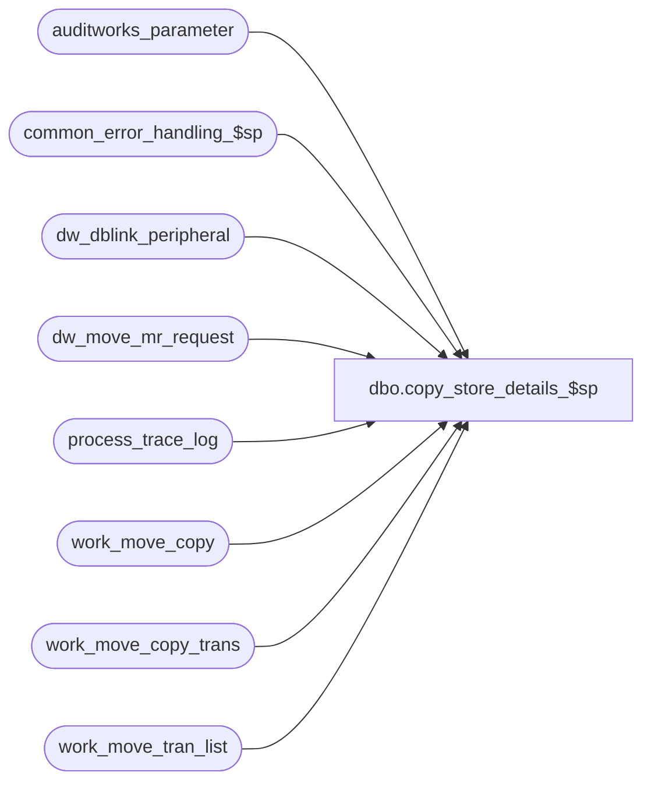

# dbo.copy_store_details_$sp

**Database:** auditworks_external  
**Server:** bedrockdb01  

## Architecture Diagram



## Table Dependencies

| Referenced Table |
|---|
| auditworks_parameter |
| common_error_handling_$sp |
| dw_dblink_peripheral |
| dw_move_mr_request |
| process_trace_log |
| work_move_copy |
| work_move_copy_trans |
| work_move_tran_list |

## Stored Procedure Code

```sql
CREATE proc  [dbo].[copy_store_details_$sp] 
 @from_store_no                  int,
 @from_transaction_date          smalldatetime,
 @from_instance_id               smallint,
 @parent_request_id              numeric(12,0),
 @copy_media_rec_detail          tinyint,
 @to_instance_id                 smallint,
 @to_store_no                    int,
 @to_transaction_date            smalldatetime 
       
AS

  /*
      Proc Name : copy_store_details_$sp 
      Description : Copy transaction details and media rec history from one peripheral db to another peripheral db
                    for one store-date at a time.
                    Table layouts are presumed to be identical since both db need to be on the same SA release.
                    The maximum batch size is all transactions within one store-date.
                    The input variables will all be populated, except @to_transaction_date (for future use).
                    When @to_transaction_date, it may be presumed that the copy is not changing the transaction_date.
                    Called from move_store_history_$sp.

HISTORY :
Date     Name         Defect# Description
Apr23,15 Kiri/Paul     110734 support scaleout load balancing function.


*/

DECLARE 
  @abort_flag        int,
  @balancing_entity_id int,
  @prev_balancing_entity_id int,
  @db_name           nvarchar(30),
  @dblink_name       nvarchar(128),
  @dest_path         nvarchar(60),
  @errmsg            nvarchar(2000),
  @errmsg2           nvarchar(2000),
  @errline           int,
  @errno             int,
  @message_id        int,
  @object_name       nvarchar(255),
  @operation_name    nvarchar(100),
  @process_name      nvarchar(100),
  @process_no        int,
  @process_timestamp int,
  @recovery_qty      int,
  @table_name        nvarchar(100),
  @rows_per_batch    int,
  @rows              int,
  @max_tran_id       int,
  @min_tran_id       int,
  @min_transaction_date   smalldatetime,
  @max_transaction_date   smalldatetime,
  @transaction_date	 smalldatetime,
  @rows_inserted     int,
  @row_found		 int,
  @process_start_time datetime,
  @subprocess1_start_time datetime,
  @subprocess2_start_time datetime,
  @subprocess3_start_time datetime,
  @SQL_QRY		nvarchar(max);
  
DECLARE
	move_store_media_rec_crsr2 CURSOR 
  FOR
   SELECT balancing_entity_id, from_transaction_date
     FROM dw_move_mr_request
      WHERE request_id = @parent_request_id
      ORDER BY balancing_entity_id, from_transaction_date;

  SELECT @process_name = 'copy_store_details_$sp',
      @process_no = 49,
      @process_timestamp = 0,
      @abort_flag = 0,
      @message_id = 201068;
      
BEGIN TRY

/*
The copy pocess will use insert queries that are built dynamically using the db/schema name and the dblink/linked server that is defined
 in table/view dw_dblink_peripheral. When the peripheral dbs/schemas are on the same rdbms server, then the dblink/linked server will not be 
 used when building the query.
  This also means that the login / user that is used to access each peripheral db/schema will require insert and delete privileges on the
   transaction detail tables, e.g. transaction_header, and on the history tables for which data will be moved. 

In copy_store_details_$sp, if the input parameter i_copy_media_rec_detail = 1, then also copy the contents of media_reconciliation_detail,
  media_unreconciliation and media_reconciliation_status for all values of balancing_entity that belong to the store that is being copied.
The design intent is that the move_store_history_$sp will call copy_store_details_$sp for the first transaction_date (the most recent 
 transaction_date) for a store and pass in i_copy_media_rec_detail = 1, and subsequent calls for the same move request, i.e. for different dates for the 
 same store, will pass in i_copy_media_rec_detail = 0 until the last (oldest) date is reached.

While it is intended that locking mechanisms will prevent the edit or auditors from touching media rec data and transaction data for a store
   while it is being moved, the precautions above will provide additional protection against possible data loss scenarios and timing scenarios
   for the media reconciliation data.

todo: 
1) add a status to indicate that media rec details have already been copied.

2) In copy_store_details_$sp , call create_store_status_$sp for the store-date (as a remote procedure call and passing in i_update_in_progress=1) in the destination 
db/schema and then update column scaleout_move_requested  to system datetime in table store_audit_status in the destination db/schema. That will create and lock 
the store-date in order to prevent auditors and the edit from touching it while the copy is in progress.

For debugging, insert rows to process_trace_log.

*/
--  IF @from_transaction_date IS NULL
--    SELECT @from_transaction_date = MIN(TRANSACTION_DATE) FROM transaction_header
--		WHERE store_no = @from_store_no;

  SELECT @process_start_time = getdate();
			
  IF @to_transaction_date IS NULL
    SELECT @to_transaction_date = @from_transaction_date;


  /* Get server connection information for destination peripheral db. @dblink_name is optional, depending on configuration */
     SELECT @errmsg = 'Failed to retrieve connection info for destination peripheral db',
	  @object_name = 'dw_dblink_peripheral',
	  @operation_name = 'SELECT';
  SELECT @dblink_name = COALESCE(dblink_name,' '),
	@db_name = database_name
    FROM dw_dblink_peripheral
   WHERE instance_id = @to_instance_id;

  SELECT @rows = @@rowcount;
  IF @rows = 0 OR @db_name IS NULL OR @db_name = ' '
     GOTO business_error;

  /* Get number of rows to process each time */
      SELECT @errmsg = 'Unable to select from auditworks_parameter (rows_per_batch)',
	     @object_name = 'auditworks_parameter',
	     @operation_name = 'SELECT';  
  SELECT @rows_per_batch = CONVERT(integer,ISNULL(par_value,'10000'))
    FROM auditworks_parameter
   WHERE par_name = 'rows_per_batch';

      SELECT @errmsg = 'Unable to select in and max tran id from work_move_tran_list',
	     @object_name = 'work_move_tran_list',
	     @operation_name = 'SELECT';  
  SELECT @min_tran_id = MIN(transaction_id),
         @max_tran_id = MAX(transaction_id)
    FROM work_move_tran_list WITH (NOLOCK);

  /* For this project, @to_store_no and @to_transaction_date will be equal to the from values, but the values are passed in for future use. 
     recommendation : code the inserts to use the @to_store_no and @to_transaction_date.
     
     The insert to table work_move_transaction_list (can truncate) */


  SET XACT_ABORT ON;
     
  /*
     Look for a list of transactions that may already exist in destination table, in the event of error recovery.
     This should normally find no rows. If no rows for the range exist in ex_transaction_header, then no
     rows can yet exist in the ex* detail tables either since header is inserted first.
     Using transaction_date in query for efficient partition search.
  */

     SELECT @errmsg = 'Unable to truncate table work_move_copy_trans',
           @object_name = 'work_move_copy_trans',
           @operation_name = 'TRUNCATE'; 
  TRUNCATE TABLE work_move_copy_trans;

     SELECT @errmsg = 'Unable to test transaction_header for duplicates',
           @object_name = 'transaction_header',
           @operation_name = 'SELECT'; 
           
  SET @SQL_QRY = N'INSERT INTO work_move_copy_trans (transaction_id)
    SELECT h.transaction_id
	    FROM ' + @dblink_name + '.' + @db_name + '.dbo.transaction_header h
     WHERE h.transaction_id IN (SELECT transaction_id FROM work_move_tran_list)
       AND h.store_no = @to_store_no
       AND h.transaction_date =  @to_transaction_date; 
       SELECT @recovery_qty = @@rowcount;';
       
  EXEC sp_executesql @SQL_QRY, N'@to_transaction_date smalldatetime, @to_store_no int, @recovery_qty int OUTPUT', @to_transaction_date, @to_store_no, @recovery_qty=@recovery_qty OUTPUT;

   /* If no existing rows were found in tran header, then there will be no need to search for existing rows in tran details */

-- log timings for this execution to system trace table
/*
  BEGIN
      SELECT @errmsg = 'Unable to insert process_trace_log (end)',
           @object_name = 'process_trace_log',
           @operation_name = 'INSERT'; 
                    
   INSERT INTO process_trace_log (
     process_start_time, process_no, process_end_time, subprocess1_start_time, subprocess2_start_time, subprocess3_start_time,
      transaction_count, process_status_flag, batch_process_id, process_comment, process_info) 
   VALUES(@process_start_time, @process_no, GETDATE(), @subprocess1_start_time, @subprocess2_start_time, @subprocess3_start_time,
      @recovery_qty, 1, 1, @process_name, CONVERT(VARCHAR(8), @to_store_no) + '/' + CONVERT(VARCHAR(10), GETDATE(), 120)
      + ' ' + CONVERT(VARCHAR(8),@from_instance_id) + '/' + CONVERT(VARCHAR(8),@to_instance_id));
  END;
*/

    
  /* Now insert the next batch of tran_header records */

  SELECT @rows_inserted = @rows_per_batch;

  WHILE @rows_inserted = @rows_per_batch
    BEGIN
    
      BEGIN TRANSACTION;   
      DELETE FROM work_move_copy;

       /* get a list of tran to insert, excluding those that already exist in external archive */
          SELECT @errmsg = 'Unable to get next batch from work_move_tran_list for transaction_header',
                 @object_name = 'transaction_header',
                 @operation_name = 'DELETE'  
      INSERT INTO work_move_copy (transaction_id)
      SELECT TOP (@rows_per_batch) transaction_id
      FROM work_move_tran_list w
       WHERE transaction_id NOT IN (SELECT transaction_id
                                         FROM work_move_copy_trans)
         AND transaction_id >= @min_tran_id -- use range query to improve query plan
         AND transaction_id <= @max_tran_id;
     
      SELECT @rows_inserted = @@rowcount;

      /* Post transaction details across to external database */
         SELECT @errmsg = 'Unable to insert into transaction_header ',
               @object_name = 'transaction_header',
               @operation_name = 'INSERT';   
                  
    SET @SQL_QRY = N'
      SET IDENTITY_INSERT  ' + @dblink_name + '.' + @db_name + '.dbo.transaction_header ON;             
      INSERT INTO ' + @dblink_name + '.' + @db_name + '.dbo.transaction_header (transaction_id, store_no,register_no,transaction_date,date_reject_id,transaction_series,transaction_no,entry_date_time,cashier_no,transaction_category,tender_total,transaction_void_flag,customer_info_exists,exception_flag,sa_rejection_flag,if_rejection_flag,deposit_declaration_flag,closeout_flag,media_count_flag,customer_modified_flag,tax_override_flag,pos_tax_jurisdiction,edit_progress_flag,edit_timestamp,employee_no,transaction_remark,copy_transaction_id,last_modified_date_time,in_use_timestamp,till_no,updated_by_user_id,move_source_date )
        SELECT ah.*
          FROM transaction_header ah
         WHERE ah.transaction_date =  @to_transaction_date
           AND ah.store_no = @to_store_no
           AND ah.transaction_id IN (SELECT transaction_id FROM work_move_copy);   
           ' ;
    EXEC sp_executesql @SQL_QRY, N'@to_transaction_date smalldatetime, @to_store_no int', @to_transaction_date, @to_store_no;
          
    /* Update transactions processed table with current records */
         SELECT @errmsg = 'Unable to update transactions processed table with current records-transaction_header',
               @object_name = 'work_move_copy_trans',
               @operation_name = 'INSERT';      
    INSERT INTO work_move_copy_trans (transaction_id)
      SELECT transaction_id
        FROM work_move_copy;
    COMMIT;
  END; -- @rows_inserted for header
 
  /* Set Identity on transaction_header ON to external database */
  SELECT @errmsg = 'Unable to Set Identity off dest transaction_header ',
         @object_name = 'transaction_header',
         @operation_name = 'SETIndentity';                 
  SET @SQL_QRY = N'                 
      SET IDENTITY_INSERT  ' + @dblink_name + '.' + @db_name + '.dbo.transaction_header OFF;' ;
  EXEC sp_executesql @SQL_QRY;

  SELECT @subprocess1_start_time = GETDATE();

  /* authorization_detail */

  /* Get list of any transactions already in external table so we do not reprocess them */

  TRUNCATE TABLE work_move_copy_trans;

  IF @recovery_qty > 0
  BEGIN
     SELECT @errmsg = 'Unable to test authorization_detail for duplicates',
           @object_name = 'authorization_detail',
           @operation_name = 'SELECT';
           
  SET @SQL_QRY = N'
  INSERT INTO work_move_copy_trans (transaction_id)
    SELECT DISTINCT transaction_id
      FROM ' + @dblink_name + '.' + @db_name + '.dbo.authorization_detail
     WHERE transaction_id IN (SELECT transaction_id FROM work_move_tran_list)
       AND transaction_id >= @min_tran_id 
       AND transaction_id <= @max_tran_id';    
  EXEC sp_executesql @SQL_QRY, N'@min_tran_id int, @max_tran_id int', @min_tran_id, @max_tran_id;
  
  END; -- recovery

  /* Now insert the next batch of authorization_detail records */

  SELECT @rows_inserted = @rows_per_batch;

  WHILE @rows_inserted = @rows_per_batch
    BEGIN
  
      BEGIN TRANSACTION;
      TRUNCATE TABLE work_move_copy;

           SELECT @errmsg = 'Unable to get next batch from work_move_tran_list for authorization_detail',
                 @object_name = 'authorization_detail',
                 @operation_name = 'DELETE';
      INSERT INTO work_move_copy (transaction_id)
      SELECT TOP (@rows_per_batch) transaction_id
        FROM work_move_tran_list wp
       WHERE NOT EXISTS (SELECT 1 FROM work_move_copy_trans we
                         WHERE wp.transaction_id = we.transaction_id)
         AND transaction_id >= @min_tran_id -- use range query to improve query plan
         AND transaction_id <= @max_tran_id;
         
      SELECT @rows_inserted = @@rowcount;
  
      /* Post authorization_detail across to external database */
        SELECT @errmsg = 'Unable to insert into authorization_detail ',
               @object_name = 'authorization_detail',
               @operation_name = 'INSERT'; 
               
      SET @SQL_QRY = N'             
        INSERT INTO ' + @dblink_name + '.' + @db_name + '.dbo.authorization_detail 
          SELECT ad.* 
            FROM authorization_detail ad
            WHERE transaction_id IN (SELECT transaction_id FROM work_move_copy)';      
      EXEC sp_executesql @SQL_QRY; 
             
      /* Update transactions processed table with current records */
        SELECT @errmsg = 'Unable to update transactions processed table with current records-authorization_detail',
               @object_name = 'work_move_copy_trans',
               @operation_name = 'INSERT';      
      INSERT INTO work_move_copy_trans (transaction_id)
      SELECT transaction_id
        FROM work_move_copy;
      COMMIT;
  END;

  /* customer */

  /* Get list of transactions already in external  table so we do not reprocess them */
  
  TRUNCATE TABLE work_move_copy_trans;

  IF @recovery_qty > 0
  BEGIN
     SELECT @errmsg = 'Unable to test Customer for duplicates',
           @object_name = 'customer',
           @operation_name = 'SELECT'; 
           
  SET @SQL_QRY = N'          
  INSERT INTO work_move_copy_trans (transaction_id)
    SELECT DISTINCT transaction_id
      FROM ' + @dblink_name + '.' + @db_name + '.dbo.customer h
     WHERE transaction_id IN (SELECT transaction_id FROM work_move_tran_list)
       AND transaction_id >= @min_tran_id 
       AND transaction_id <= @max_tran_id';     
  EXEC sp_executesql @SQL_QRY, N'@min_tran_id int, @max_tran_id int', @min_tran_id, @max_tran_id;
          
  END;
  /* Now insert the next batch of Customer records */

  SELECT @rows_inserted = @rows_per_batch;

  WHILE @rows_inserted = @rows_per_batch
    BEGIN
    
  BEGIN TRANSACTION;
  
      DELETE FROM work_move_copy;

          SELECT @errmsg = 'Unable to get next batch from work_move_tran_list for customer',
                 @object_name = 'work_move_copy',
                 @operation_name = 'INSERT';  
      INSERT INTO work_move_copy (transaction_id)
        SELECT TOP (@rows_per_batch) transaction_id
          FROM work_move_tran_list
          WHERE transaction_id NOT IN (SELECT transaction_id
                                         FROM work_move_copy_trans)
          AND transaction_id >= @min_tran_id -- use range query to improve query plan
          AND transaction_id <= @max_tran_id;
         
      SELECT @rows_inserted = @@rowcount;
  
      /* Post transaction details across to external database */
        SELECT @errmsg = 'Unable to insert into customer ',
               @object_name = 'customer',
               @operation_name = 'INSERT';  
               
      SET @SQL_QRY = N'         
        INSERT INTO ' + @dblink_name + '.' + @db_name + '.dbo.customer 
          SELECT  DISTINCT ac.* 
            FROM customer ac
           WHERE transaction_id IN (SELECT transaction_id
  	                                   FROM work_move_copy);';   
      EXEC sp_executesql @SQL_QRY; 
           
      /* Update transactions processed table with current records */
        SELECT @errmsg = 'Unable to update transactions processed table with current records ',
               @object_name = 'work_move_copy_trans',
               @operation_name = 'INSERT';      
      INSERT INTO work_move_copy_trans (transaction_id)
      SELECT transaction_id
        FROM work_move_copy;
        
      COMMIT;
   
  END; -- While

  
  /* customer_detail */

   /* Get list of transactions already in external  table so we do not reprocess them */
  
  TRUNCATE TABLE work_move_copy_trans;

  IF @recovery_qty > 0
  BEGIN
     SELECT @errmsg = 'Unable to test transaction_header for duplicates',
           @object_name = 'customer',
           @operation_name = 'SELECT'; 
           
           
  SET @SQL_QRY = N'          
	INSERT INTO work_move_copy_trans (transaction_id)
      SELECT transaction_id
         FROM ' + @dblink_name + '.' + @db_name + '.dbo.customer_detail h
       WHERE transaction_id IN (SELECT transaction_id FROM work_move_tran_list)
         AND transaction_id >= @min_tran_id 
         AND transaction_id <= @max_tran_id';   
  EXEC sp_executesql @SQL_QRY, N'@min_tran_id int, @max_tran_id int', @min_tran_id, @max_tran_id;     
       
  END;
  /* Now insert the next batch of customer records */

  SELECT @rows_inserted = @rows_per_batch;

  WHILE @rows_inserted = @rows_per_batch
    BEGIN
    
      BEGIN TRANSACTION;
  
      DELETE FROM work_move_copy;

          SELECT @errmsg = 'Unable to get next batch from work_move_tran_list for customer_detail',
                 @object_name = 'customer_detail',
                 @operation_name = 'DELETE';  
      INSERT INTO work_move_copy (transaction_id)
      SELECT TOP (@rows_per_batch) transaction_id
        FROM work_move_tran_list
       WHERE transaction_id NOT IN (SELECT transaction_id
                                         FROM work_move_copy_trans)
         AND transaction_id >= @min_tran_id -- use range query to improve query plan
         AND transaction_id <= @max_tran_id;
         
      SELECT @rows_inserted = @@rowcount;
  
      /* Post transaction details across to external database */
        SELECT @errmsg = 'Unable to insert into customer_detail ',
               @object_name = 'customer_detail',
               @operation_name = 'INSERT';  
               
    SET @SQL_QRY = N'            
    INSERT INTO ' + @dblink_name + '.' + @db_name + '.dbo.customer_detail 
        SELECT ac.* 
          FROM customer_detail ac
         WHERE transaction_id IN (SELECT transaction_id FROM work_move_copy)';   
    EXEC sp_executesql @SQL_QRY; 
        
      /* Update transactions processed table with current records */
        SELECT @errmsg = 'Unable to update transactions processed table with current records ',
         @object_name = 'work_move_copy_trans',
               @operation_name = 'INSERT';      
    INSERT INTO work_move_copy_trans (transaction_id)
      SELECT transaction_id
        FROM work_move_copy;
      
      COMMIT;        
  
  END; -- While

  /* discount_detail */

   /* Get list of transactions already in external  table so we do not reprocess them */
  
    TRUNCATE TABLE work_move_copy_trans;

  IF @recovery_qty > 0
  BEGIN  
      SELECT @errmsg = 'Unable to test discount_detail for duplicates',
           @object_name = 'discount_detail',
           @operation_name = 'SELECT';
           
  SET @SQL_QRY = N'        
    INSERT INTO work_move_copy_trans (transaction_id)
    SELECT DISTINCT transaction_id
      FROM ' + @dblink_name + '.' + @db_name + '.dbo.authorization_detail
     WHERE transaction_id IN (SELECT transaction_id FROM work_move_tran_list)
       AND transaction_id >= @min_tran_id 
       AND transaction_id <= @max_tran_id';   
  EXEC sp_executesql @SQL_QRY, N'@min_tran_id int, @max_tran_id int', @min_tran_id, @max_tran_id;
         
  END;
  /* Now insert the next batch of authorization_detail records */

  SELECT @rows_inserted = @rows_per_batch;

  WHILE @rows_inserted = @rows_per_batch
    BEGIN

      BEGIN TRANSACTION;
          SELECT @errmsg = 'Unable to get next batch from work_move_tran_list for discount_detail',
                 @object_name = 'discount_detail',
                 @operation_name = 'DELETE';  
      DELETE FROM work_move_copy;
    
      INSERT INTO work_move_copy (transaction_id)
      SELECT TOP (@rows_per_batch) transaction_id
        FROM work_move_tran_list
       WHERE transaction_id NOT IN (SELECT transaction_id
                                         FROM work_move_copy_trans)
         AND transaction_id >= @min_tran_id -- use range query to improve query plan
         AND transaction_id <= @max_tran_id;
         
      SELECT @rows_inserted = @@rowcount;
  
      /* Post transaction details across to external database */
        SELECT @errmsg = 'Unable to insert into discount_detail ',
               @object_name = 'discount_detail',
               @operation_name = 'INSERT';  
               
	  SET @SQL_QRY = N'        
      INSERT INTO ' + @dblink_name + '.' + @db_name + '.dbo.discount_detail 
        SELECT DISTINCT ad.* 
          FROM discount_detail ad
         WHERE transaction_id IN (SELECT transaction_id FROM work_move_copy)';    
      EXEC sp_executesql @SQL_QRY;      
             
      /* Update transactions processed table with current records */
        SELECT @errmsg = 'Unable to update transactions processed table with current records ',
               @object_name = 'work_move_copy_trans',
               @operation_name = 'INSERT';     
      INSERT INTO work_move_copy_trans (transaction_id)
      SELECT transaction_id
        FROM work_move_copy;
      
      COMMIT;        
  
  END; -- While
  
  SELECT @subprocess2_start_time = GETDATE();
  
  /* line_note */

   /* Get list of transactions already in external  table so we do not reprocess them */

  
  TRUNCATE TABLE work_move_copy_trans;

  IF @recovery_qty > 0
  BEGIN
    SELECT @errmsg = 'Unable to test discount_detail for duplicates',
           @object_name = 'work_move_copy_trans',
           @operation_name = 'INSERT'; 
           
    SET @SQL_QRY = N'     
    INSERT INTO work_move_copy_trans (transaction_id)
      SELECT transaction_id
  	    FROM ' + @dblink_name + '.' + @db_name + '.dbo.line_note h
      WHERE transaction_id IN (SELECT transaction_id FROM work_move_tran_list)
        AND transaction_id >= @min_tran_id 
        AND transaction_id <= @max_tran_id';   
    EXEC sp_executesql @SQL_QRY, N'@min_tran_id int, @max_tran_id int', @min_tran_id, @max_tran_id;
     
         
  END;
  /* Now insert the next batch of line_note records */

  SELECT @rows_inserted = @rows_per_batch;

  WHILE @rows_inserted = @rows_per_batch
    BEGIN
    
      BEGIN TRANSACTION;
  
      DELETE FROM work_move_copy;

          SELECT @errmsg = 'Unable to get next batch from work_move_tran_list for line_note',
                 @object_name = 'work_move_copy',
                 @operation_name = 'INSERT';   
      INSERT INTO work_move_copy (transaction_id)
      SELECT TOP (@rows_per_batch) transaction_id
        FROM work_move_tran_list
       WHERE transaction_id NOT IN (SELECT transaction_id
                                   FROM work_move_copy_trans)
         AND transaction_id >= @min_tran_id -- use range query to improve query plan
         AND transaction_id <= @max_tran_id;

      SELECT @rows_inserted = @@rowcount;
 
      /* Post transaction details across to external database */
        SELECT @errmsg = 'Unable to insert into line_note ',
               @object_name = 'line_note',
               @operation_name = 'INSERT'; 
                
      SET @SQL_QRY = N'   
        INSERT INTO ' + @dblink_name + '.' + @db_name + '.dbo.line_note 
          SELECT ln.* 
            FROM line_note ln
           WHERE transaction_id IN
            (SELECT transaction_id FROM work_move_copy)';     
      EXEC sp_executesql @SQL_QRY;
             
      /* Update transactions processed table with current records */
        SELECT @errmsg = 'Unable to update transactions processed table with current records-line_note',
               @object_name = 'work_move_copy_trans',
               @operation_name = 'INSERT';     
      INSERT INTO work_move_copy_trans (transaction_id)
      SELECT transaction_id
        FROM work_move_copy;
     
      COMMIT;        
  
  END; -- While
  
  /* payroll_detail */

   /* Get list of transactions already in external  table so we do not reprocess them */
  
  TRUNCATE TABLE work_move_copy_trans;

  IF @recovery_qty > 0
  BEGIN
      SELECT @errmsg = 'Unable to test discount_detail for duplicates',
           @object_name = 'payroll_detail',
           @operation_name = 'SELECT';  
    SET @SQL_QRY = N'       
    INSERT INTO work_move_copy_trans (transaction_id)
       SELECT transaction_id
  	     FROM ' + @dblink_name + '.' + @db_name + '.dbo.payroll_detail h
       WHERE transaction_id IN (SELECT transaction_id FROM work_move_tran_list)
         AND transaction_id >= @min_tran_id 
         AND transaction_id <= @max_tran_id';   
    EXEC sp_executesql @SQL_QRY, N'@min_tran_id int, @max_tran_id int', @min_tran_id, @max_tran_id;
         
  END;
  /* Now insert the next batch of payroll_detail records */

  SELECT @rows_inserted = @rows_per_batch;

  WHILE @rows_inserted = @rows_per_batch
    BEGIN
    
      BEGIN TRANSACTION;
  
      DELETE FROM work_move_copy;

          SELECT @errmsg = 'Unable to get next batch from work_move_tran_list for payroll_detail',
                 @object_name = 'payroll_detail',
                 @operation_name = 'DELETE';    
      INSERT INTO work_move_copy (transaction_id)
      SELECT TOP (@rows_per_batch) transaction_id
        FROM work_move_tran_list
       WHERE transaction_id NOT IN (SELECT transaction_id
                                         FROM work_move_copy_trans)
         AND transaction_id >= @min_tran_id -- use range query to improve query plan
         AND transaction_id <= @max_tran_id;
         
      SELECT @rows_inserted = @@rowcount;
 
      /* Post transaction details across to external database */
        SELECT @errmsg = 'Unable to insert into payroll_detail ',
               @object_name = 'payroll_detail',
               @operation_name = 'INSERT'; 
               
      SET @SQL_QRY = N'           
      INSERT INTO ' + @dblink_name + '.' + @db_name + '.dbo.payroll_detail 
        SELECT pd.* 
          FROM payroll_detail pd
         WHERE transaction_id IN (SELECT transaction_id FROM work_move_copy)'; 
      EXEC sp_executesql @SQL_QRY; 
     
      /* Update transactions processed table with current records */
        SELECT @errmsg = 'Unable to update transactions processed table with current records-payroll_detail',
               @object_name = 'work_move_copy_trans',
               @operation_name = 'INSERT';      
      INSERT INTO work_move_copy_trans (transaction_id)
      SELECT transaction_id
        FROM work_move_copy;
     
      COMMIT;        
  
  END; -- While
 

  /* post_void_detail */

   /* Get list of transactions already in external  table so we do not reprocess them */

  TRUNCATE TABLE work_move_copy_trans;

  IF @recovery_qty > 0
  BEGIN
    SELECT @errmsg = 'Unable to test discount_detail for duplicates',
           @object_name = 'post_void_detail',
           @operation_name = 'SELECT'; 
           
    SET @SQL_QRY = N'   
    INSERT INTO work_move_copy_trans (transaction_id)
      SELECT transaction_id
  	    FROM ' + @dblink_name + '.' + @db_name + '.dbo.post_void_detail h
       WHERE transaction_id IN (SELECT transaction_id FROM work_move_tran_list)
         AND transaction_id >= @min_tran_id 
         AND transaction_id <= @max_tran_id';
    EXEC sp_executesql @SQL_QRY, N'@min_tran_id int, @max_tran_id int', @min_tran_id, @max_tran_id;
    
  END;
  /* Now insert the next batch of post_void_detail records */

  SELECT @rows_inserted = @rows_per_batch;

 WHILE @rows_inserted = @rows_per_batch
    BEGIN
      BEGIN TRANSACTION;
  
      DELETE FROM work_move_copy;
    
          SELECT @errmsg = 'Unable to get next batch from work_move_tran_list for post_void_detail',
                 @object_name = 'work_move_copy',
                 @operation_name = 'INSERT';
      INSERT INTO work_move_copy (transaction_id)
      SELECT TOP (@rows_per_batch) transaction_id
        FROM work_move_tran_list
       WHERE transaction_id NOT IN (SELECT transaction_id
                                         FROM work_move_copy_trans)
         AND transaction_id >= @min_tran_id -- use range query to improve query plan
         AND transaction_id <= @max_tran_id;
         
      SELECT @rows_inserted = @@rowcount;
  
      /* Post transaction details across to external database */
        SELECT @errmsg = 'Unable to insert into post_void_detail ',
         @object_name = 'post_void_detail',
               @operation_name = 'INSERT'; 
               
      SET @SQL_QRY = N'         
      INSERT INTO ' + @dblink_name + '.' + @db_name + '.dbo.post_void_detail 
        SELECT pv.* 
          FROM post_void_detail pv
         WHERE transaction_id IN (SELECT transaction_id FROM work_move_copy)'; 
      EXEC sp_executesql @SQL_QRY;   
            
      /* Update transactions processed table with current records */
        SELECT @errmsg = 'Unable to update transactions processed table with current records ',
               @object_name = 'work_move_copy_trans',
               @operation_name = 'INSERT';      
      INSERT INTO work_move_copy_trans (transaction_id)
      SELECT transaction_id
        FROM work_move_copy;
     
      COMMIT;        
  
  END; -- While
  
 
  /* return_detail */

   /* Get list of transactions already in external  table so we do not reprocess them */

  TRUNCATE TABLE work_move_copy_trans;

  IF @recovery_qty > 0
  BEGIN
    SELECT @errmsg = 'Unable to test return_detail for duplicates',
           @object_name = 'work_move_copy_trans',
           @operation_name = 'INSERT'; 
           
    SET @SQL_QRY = N'       
    INSERT INTO work_move_copy_trans (transaction_id)
      SELECT transaction_id
  	    FROM ' + @dblink_name + '.' + @db_name + '.dbo.return_detail h
       WHERE transaction_id IN (SELECT transaction_id FROM work_move_tran_list)
        AND transaction_id >= @min_tran_id 
        AND transaction_id <= @max_tran_id';   
    EXEC sp_executesql @SQL_QRY, N'@min_tran_id int, @max_tran_id int', @min_tran_id, @max_tran_id;
     
  END;
  /* Now insert the next batch of return_detail records */

  SELECT @rows_inserted = @rows_per_batch;

  WHILE @rows_inserted = @rows_per_batch
    BEGIN
    
      BEGIN TRANSACTION;
  
      DELETE FROM work_move_copy;

          SELECT @errmsg = 'Unable to get next batch from work_move_tran_list for return_detail',
                 @object_name = 'return_detail',
                 @operation_name = 'INSERT';   
      INSERT INTO work_move_copy (transaction_id)
      SELECT TOP (@rows_per_batch) transaction_id
        FROM work_move_tran_list
       WHERE transaction_id NOT IN (SELECT transaction_id
                                         FROM work_move_copy_trans)
         AND transaction_id >= @min_tran_id -- use range query to improve query plan
         AND transaction_id <= @max_tran_id;
         
      SELECT @rows_inserted = @@rowcount;
  
      /* Post transaction details across to external database */
     SELECT @errmsg = 'Unable to insert into return_detail ',
               @object_name = 'return_detail',
               @operation_name = 'INSERT';  
                
      SET @SQL_QRY = N'     
      INSERT INTO ' + @dblink_name + '.' + @db_name + '.dbo.return_detail 
        SELECT rd.* 
          FROM return_detail rd 
         WHERE transaction_id IN (SELECT transaction_id FROM work_move_copy)';
      EXEC sp_executesql @SQL_QRY; 
    
      /* Update transactions processed table with current records */
        SELECT @errmsg = 'Unable to update transactions processed table with current records-return_detail',
               @object_name = 'work_move_copy_trans',
               @operation_name = 'INSERT';     
      INSERT INTO work_move_copy_trans (transaction_id)
      SELECT transaction_id
        FROM work_move_copy;

      COMMIT;        
  
  END; -- While
 

  /* special_order_detail */

   /* Get list of transactions already in external  table so we do not reprocess them */

  TRUNCATE TABLE work_move_copy_trans;

  IF @recovery_qty > 0
  BEGIN
       SELECT @errmsg = 'Unable to test special_order_detail for duplicates',
           @object_name = 'special_order_detail',
           @operation_name = 'SELECT';  
           
  SET @SQL_QRY = N'      
    INSERT INTO work_move_copy_trans (transaction_id)
      SELECT transaction_id
  	    FROM ' + @dblink_name + '.' + @db_name + '.dbo.special_order_detail h
       WHERE transaction_id IN (SELECT transaction_id FROM work_move_tran_list)
        AND transaction_id >= @min_tran_id 
        AND transaction_id <= @max_tran_id';  
    EXEC sp_executesql @SQL_QRY, N'@min_tran_id int, @max_tran_id int', @min_tran_id, @max_tran_id;
         
  END;
  /* Now insert the next batch of special_order_detail records */

  SELECT @rows_inserted = @rows_per_batch;

  WHILE @rows_inserted = @rows_per_batch
    BEGIN
    
      BEGIN TRANSACTION;
  
      DELETE FROM work_move_copy;

          SELECT @errmsg = 'Unable to get next batch from work_move_tran_list for special_order_detail',
                 @object_name = 'work_move_copy',
                 @operation_name = 'INSERT';    
      INSERT INTO work_move_copy (transaction_id)
      SELECT TOP (@rows_per_batch) transaction_id
        FROM work_move_tran_list
       WHERE transaction_id NOT IN (SELECT transaction_id
                         FROM work_move_copy_trans)
         AND transaction_id >= @min_tran_id -- use range query to improve query plan
         AND transaction_id <= @max_tran_id;
         
      SELECT @rows_inserted = @@rowcount;
  
      /* Post transaction details across to external database */
         SELECT @errmsg = 'Unable to insert into special_order_detail ',
               @object_name = 'special_order_detail',
               @operation_name = 'INSERT'; 
               
      SET @SQL_QRY = N'          
      INSERT INTO ' + @dblink_name + '.' + @db_name + '.dbo.special_order_detail 
        SELECT so.* 
          FROM special_order_detail so
         WHERE transaction_id IN (SELECT transaction_id FROM work_move_copy)';   
      EXEC sp_executesql @SQL_QRY; 
      
      /* Update transactions processed table with current records */
        SELECT @errmsg = 'Unable to update transactions processed table with current records ',
               @object_name = 'work_move_copy_trans',
               @operation_name = 'INSERT';      
      INSERT INTO work_move_copy_trans (transaction_id)
      SELECT transaction_id
        FROM work_move_copy;
       
      COMMIT;   
  
  END; -- While
  
  /* stock_control_detail */

   /* Get list of transactions already in external  table so we do not reprocess them */

  TRUNCATE TABLE work_move_copy_trans;

  IF @recovery_qty > 0
  BEGIN
    SELECT @errmsg = 'Unable to test stock_control_detail for duplicates',
           @object_name = 'work_move_copy_trans',
           @operation_name = 'INSERT'; 
           
    SET @SQL_QRY = N'   
      INSERT INTO work_move_copy_trans (transaction_id)
        SELECT transaction_id
  	      FROM ' + @dblink_name + '.' + @db_name + '.dbo.stock_control_detail h
         WHERE transaction_id IN (SELECT transaction_id FROM work_move_tran_list)
          AND transaction_id >= @min_tran_id 
          AND transaction_id <= @max_tran_id';
    EXEC sp_executesql @SQL_QRY, N'@min_tran_id int, @max_tran_id int', @min_tran_id, @max_tran_id;
        
         
  END;
  /* Now insert the next batch of stock_control_detail records */

  SELECT @rows_inserted = @rows_per_batch;

  WHILE @rows_inserted = @rows_per_batch
    BEGIN
    
      BEGIN TRANSACTION;
  
      DELETE FROM work_move_copy;

          SELECT @errmsg = 'Unable to get next batch from work_move_tran_list for stock_control_detail',
                 @object_name = 'work_move_copy',
                 @operation_name = 'INSERT';   
      INSERT INTO work_move_copy (transaction_id)
       SELECT TOP (@rows_per_batch) transaction_id
        FROM work_move_tran_list
       WHERE transaction_id NOT IN (SELECT transaction_id
                                         FROM work_move_copy_trans)
         AND transaction_id >= @min_tran_id -- use range query to improve query plan
         AND transaction_id <= @max_tran_id;
         
      SELECT @rows_inserted = @@rowcount;
  
      /* Post transaction details across to external database */
        SELECT @errmsg = 'Unable to insert into stock_control_detail ',
               @object_name = 'stock_control_detail',
               @operation_name = 'INSERT';   
               
      SET @SQL_QRY = N'         
      INSERT INTO ' + @dblink_name + '.' + @db_name + '.dbo.stock_control_detail 
        SELECT sc.* 
          FROM stock_control_detail sc
         WHERE transaction_id IN (SELECT transaction_id FROM work_move_copy)';   
      EXEC sp_executesql @SQL_QRY;  
          
      /* Update transactions processed table with current records */
        SELECT @errmsg = 'Unable to update transactions processed table with current records-stock_control_detail',
               @object_name = 'work_move_copy_trans',
               @operation_name = 'INSERT';     
      INSERT INTO work_move_copy_trans (transaction_id)
      SELECT transaction_id
        FROM work_move_copy;
     
      COMMIT;        
  
  END; -- While

  /* tax_override_detail */

   /* Get list of transactions already in external  table so we do not reprocess them */

  TRUNCATE TABLE work_move_copy_trans;

  IF @recovery_qty > 0
  BEGIN
      SELECT @errmsg = 'Unable to test tax_override_detail for duplicates',
           @object_name = 'work_move_copy_trans',
           @operation_name = 'INSERT';
           
    SET @SQL_QRY = N'    
    INSERT INTO work_move_copy_trans (transaction_id)
      SELECT transaction_id
  	    FROM ' + @dblink_name + '.' + @db_name + '.dbo.tax_override_detail h
       WHERE transaction_id IN (SELECT transaction_id FROM work_move_tran_list)
        AND transaction_id >= @min_tran_id 
        AND transaction_id <= @max_tran_id';   
    EXEC sp_executesql @SQL_QRY, N'@min_tran_id int, @max_tran_id int', @min_tran_id, @max_tran_id;
         
  END;
  /* Now insert the next batch of tax_override_detail records */

  SELECT @rows_inserted = @rows_per_batch;

  WHILE @rows_inserted = @rows_per_batch
    BEGIN
    
      BEGIN TRANSACTION;
  
      DELETE FROM work_move_copy;

          SELECT @errmsg = 'Unable to get next batch from work_move_tran_list for tax_override_detail',
                 @object_name = 'work_move_copy',
            @operation_name = 'INSERT'; 
      INSERT INTO work_move_copy (transaction_id)
      SELECT TOP (@rows_per_batch) transaction_id
        FROM work_move_tran_list
       WHERE transaction_id NOT IN (SELECT transaction_id
                                         FROM work_move_copy_trans)
         AND transaction_id >= @min_tran_id -- use range query to improve query plan
         AND transaction_id <= @max_tran_id;
         
      SELECT @rows_inserted = @@rowcount;
 
      /* Post transaction details across to external database */
        SELECT @errmsg = 'Unable to insert into tax_override_detail ',
               @object_name = 'tax_override_detail',
               @operation_name = 'INSERT'; 
      SET @SQL_QRY = N'           
        INSERT INTO ' + @dblink_name + '.' + @db_name + '.dbo.tax_override_detail 
          SELECT td.* 
            FROM tax_override_detail td
            WHERE transaction_id IN (SELECT transaction_id FROM work_move_copy)';  
      EXEC sp_executesql @SQL_QRY; 
            
      /* Update transactions processed table with current records */
        SELECT @errmsg = 'Unable to update transactions processed table with current records-tax_override_detail',
              @object_name = 'work_move_copy_trans',
               @operation_name = 'INSERT';      
      INSERT INTO work_move_copy_trans (transaction_id)
      SELECT transaction_id
        FROM work_move_copy;
      
      COMMIT;        
  
  END; -- While

  SELECT @subprocess3_start_time = GETDATE();
  
  /* tax_detail */

   /* Get list of transactions already in external  table so we do not reprocess them */

  TRUNCATE TABLE work_move_copy_trans;

  IF @recovery_qty > 0
  BEGIN
      SELECT @errmsg = 'Unable to test tax_detail for duplicates',
           @object_name = 'work_move_copy_trans',
           @operation_name = 'INSERT';
           
    SET @SQL_QRY = N'      
    INSERT INTO work_move_copy_trans (transaction_id)
      SELECT transaction_id
  	    FROM ' + @dblink_name + '.' + @db_name + '.dbo.tax_detail h
      WHERE transaction_id IN (SELECT transaction_id FROM work_move_tran_list)
        AND transaction_id >= @min_tran_id 
        AND transaction_id <= @max_tran_id';  
    EXEC sp_executesql @SQL_QRY, N'@min_tran_id int, @max_tran_id int', @min_tran_id, @max_tran_id;
 
  END;
  /* Now insert the next batch of tax_detail records */

  SELECT @rows_inserted = @rows_per_batch;

  WHILE @rows_inserted = @rows_per_batch
    BEGIN
    
      BEGIN TRANSACTION;
  
      DELETE FROM work_move_copy;

          SELECT @errmsg = 'Unable to get next batch from work_move_tran_list for tax_detail',
                 @object_name = 'work_move_copy',
                 @operation_name = 'INSERT';    
      INSERT INTO work_move_copy (transaction_id)
      SELECT TOP (@rows_per_batch) transaction_id
        FROM work_move_tran_list
       WHERE transaction_id NOT IN (SELECT transaction_id
                                         FROM work_move_copy_trans)
         AND transaction_id >= @min_tran_id -- use range query to improve query plan
         AND transaction_id <= @max_tran_id;
         
      SELECT @rows_inserted = @@rowcount;

      /* Post transaction details across to external database */
         SELECT @errmsg = 'Unable to insert into tax_detail ',
               @object_name = 'tax_detail',
               @operation_name = 'INSERT';   
               
      SET @SQL_QRY = N'           
      INSERT INTO ' + @dblink_name + '.' + @db_name + '.dbo.tax_detail 
        SELECT td.* 
          FROM tax_detail td
         WHERE transaction_id IN (SELECT transaction_id FROM work_move_copy)'; 
      EXEC sp_executesql @SQL_QRY; 
      
      /* Update transactions processed table with current records */
         SELECT @errmsg = 'Unable to update transactions processed table with current records-tax_detail',
               @object_name = 'work_move_copy_trans',
               @operation_name = 'INSERT';      
      INSERT INTO work_move_copy_trans (transaction_id)
      SELECT transaction_id
        FROM work_move_copy;

      COMMIT;        
  
  END; -- While

  
 /* transaction_line_link */

   /* Get list of transactions already in external  table so we do not reprocess them */

  TRUNCATE TABLE work_move_copy_trans;

  IF @recovery_qty > 0
  BEGIN
      SELECT @errmsg = 'Unable to test transaction_line_link for duplicates',
           @object_name = 'work_move_copy_trans',
           @operation_name = 'INSERT'; 
           
    SET @SQL_QRY = N'      
      INSERT INTO work_move_copy_trans (transaction_id)
        SELECT transaction_id
  	      FROM ' + @dblink_name + '.' + @db_name + '.dbo.transaction_line_link h
         WHERE transaction_id IN (SELECT transaction_id FROM work_move_tran_list)
        AND transaction_id >= @min_tran_id 
        AND transaction_id <= @max_tran_id';
    EXEC sp_executesql @SQL_QRY, N'@min_tran_id int, @max_tran_id int', @min_tran_id, @max_tran_id;
         
         
  END;
  /* Now insert the next batch of transaction_line_link records */

  SELECT @rows_inserted = @rows_per_batch;

  WHILE @rows_inserted = @rows_per_batch
    BEGIN
    
      BEGIN TRANSACTION;
  
      DELETE FROM work_move_copy;

          SELECT @errmsg = 'Unable to get next batch from work_move_tran_list for transaction_line_link',
                 @object_name = 'transaction_line_link',
                 @operation_name = 'DELETE';    
      INSERT INTO work_move_copy (transaction_id)
      SELECT TOP (@rows_per_batch) transaction_id
         FROM work_move_tran_list
       WHERE transaction_id NOT IN (SELECT transaction_id
                                         FROM work_move_copy_trans)
         AND transaction_id >= @min_tran_id -- use range query to improve query plan
         AND transaction_id <= @max_tran_id;
 
      SELECT @rows_inserted = @@rowcount;
  
  /* Post transaction details across to external database */
         SELECT @errmsg = 'Unable to insert into transaction_line_link ',
               @object_name = 'transaction_line_link',
               @operation_name = 'INSERT'; 
               
      SET @SQL_QRY = N'            
        INSERT INTO ' + @dblink_name + '.' + @db_name + '.dbo.transaction_line_link 
          SELECT tll.* 
            FROM transaction_line_link tll
           WHERE transaction_id IN (SELECT transaction_id FROM work_move_copy)';   
      EXEC sp_executesql @SQL_QRY; 
            
      /* Update transactions processed table with current records */
         SELECT @errmsg = 'Unable to update transactions processed table with current records-transaction_line_link',
               @object_name = 'work_move_copy_trans',
               @operation_name = 'INSERT';     
      INSERT INTO work_move_copy_trans (transaction_id)
      SELECT transaction_id
        FROM work_move_copy;

   COMMIT;        
  
  END; -- While


 /* transaction_line */

   /* Get list of transactions already in external  table so we do not reprocess them */

  TRUNCATE TABLE work_move_copy_trans;

  IF @recovery_qty > 0
  BEGIN
      SELECT @errmsg = 'Unable to test transaction_line for duplicates',
           @object_name = 'work_move_copy_trans',
           @operation_name = 'INSERT'; 
           
    SET @SQL_QRY = N'
    INSERT INTO work_move_copy_trans (transaction_id)
      SELECT transaction_id
  	    FROM ' + @dblink_name + '.' + @db_name + '.dbo.transaction_line h
       WHERE transaction_id IN (SELECT transaction_id FROM work_move_tran_list)
        AND transaction_id >= @min_tran_id 
        AND transaction_id <= @max_tran_id';  
    EXEC sp_executesql @SQL_QRY, N'@min_tran_id int, @max_tran_id int', @min_tran_id, @max_tran_id;    
         
  END;
  /* Now insert the next batch of transaction_line records */

  SELECT @rows_inserted = @rows_per_batch;

  WHILE @rows_inserted = @rows_per_batch
    BEGIN
    
      BEGIN TRANSACTION;
  
      DELETE FROM work_move_copy;

          SELECT @errmsg = 'Unable to get next batch from work_move_tran_list for transaction_line',
                 @object_name = 'work_move_copy',
                 @operation_name = 'INSERT';    
      INSERT INTO work_move_copy (transaction_id)
      SELECT TOP (@rows_per_batch) transaction_id
        FROM work_move_tran_list
       WHERE transaction_id NOT IN (SELECT transaction_id
                                         FROM work_move_copy_trans)
         AND transaction_id >= @min_tran_id -- use range query to improve query plan
         AND transaction_id <= @max_tran_id;
         
      SELECT @rows_inserted = @@rowcount;
  
      /* Post transaction details across to external database */
         SELECT @errmsg = 'Unable to insert into transaction_line ',
               @object_name = 'transaction_line',
        @operation_name = 'INSERT';
        
      SET @SQL_QRY = N'    
      INSERT INTO ' + @dblink_name + '.' + @db_name + '.dbo.transaction_line 
      SELECT tl.* 
        FROM transaction_line tl
       WHERE transaction_id IN (SELECT transaction_id FROM work_move_copy)';
      EXEC sp_executesql @SQL_QRY; 
             
      /* Update transactions processed table with current records */
         SELECT @errmsg = 'Unable to update transactions processed table with current records-transaction_line',
               @object_name = 'work_move_copy_trans',
               @operation_name = 'INSERT';     
      INSERT INTO work_move_copy_trans (transaction_id)
      SELECT transaction_id
        FROM work_move_copy;

      COMMIT;        
  
  END; -- While

 /* interface_control */

   /* Get list of transactions already in external table so we do not reprocess them */

  TRUNCATE TABLE work_move_copy_trans;

  IF @recovery_qty > 0
  BEGIN
    SELECT @errmsg = 'Unable to test interface_control for duplicates',
           @object_name = 'work_move_copy_trans',
           @operation_name = 'INSERT';  
           
    SET @SQL_QRY = N'
    INSERT INTO work_move_copy_trans (transaction_id)
      SELECT transaction_id
  	    FROM ' + @dblink_name + '.' + @db_name + '.dbo.interface_control h
       WHERE transaction_id IN (SELECT transaction_id FROM work_move_tran_list)
        AND transaction_id >= @min_tran_id 
        AND transaction_id <= @max_tran_id';
    EXEC sp_executesql @SQL_QRY, N'@min_tran_id int, @max_tran_id int', @min_tran_id, @max_tran_id;
       
  END;
  /* Now insert the next batch of interface_control records */

  SELECT @rows_inserted = @rows_per_batch;

  WHILE @rows_inserted = @rows_per_batch
    BEGIN
    
      BEGIN TRANSACTION;
  
      DELETE FROM work_move_copy;

           SELECT @errmsg = 'Unable to get next batch from work_move_tran_list for interface_control',
                 @object_name = 'work_move_copy',
                 @operation_name = 'INSERT';   
      INSERT INTO work_move_copy (transaction_id)
      SELECT TOP (@rows_per_batch) transaction_id
        FROM work_move_tran_list
       WHERE transaction_id NOT IN (SELECT transaction_id
                                         FROM work_move_copy_trans)
         AND transaction_id >= @min_tran_id -- use range query to improve query plan
         AND transaction_id <= @max_tran_id;
         
      SELECT @rows_inserted = @@rowcount;
  
      /* Post transaction details across to external database */
         SELECT @errmsg = 'Unable to insert into interface_control ',
               @object_name = 'interface_control',
               @operation_name = 'INSERT';  
               
      SET @SQL_QRY = N'          
      INSERT INTO ' + @dblink_name + '.' + @db_name + '.dbo.interface_control 
        SELECT ic.* 
          FROM interface_control ic
         WHERE transaction_id IN (SELECT transaction_id FROM work_move_copy)';  
      EXEC sp_executesql @SQL_QRY;        
           
      /* Update transactions processed table with current records */
         SELECT @errmsg = 'Unable to update transactions processed table with current records-interface_control',
               @object_name = 'work_move_copy_trans',
               @operation_name = 'INSERT';     
      INSERT INTO work_move_copy_trans (transaction_id)
      SELECT transaction_id
        FROM work_move_copy;
     
      COMMIT;        
  
  END; -- While
  

 /* exception_reason */

   /* Get list of transactions already in external  table so we do not reprocess them */

  TRUNCATE TABLE work_move_copy_trans;

  IF @recovery_qty > 0
  BEGIN
    SELECT @errmsg = 'Unable to test exception_reason for duplicates',
           @object_name = 'work_move_copy_trans',
           @operation_name = 'INSERT'; 
    SET @SQL_QRY = N'       
      INSERT INTO work_move_copy_trans (transaction_id)
        SELECT transaction_id
  	      FROM ' + @dblink_name + '.' + @db_name + '.dbo.exception_reason h
         WHERE transaction_id IN (SELECT transaction_id FROM work_move_tran_list)
        AND transaction_id >= @min_tran_id 
        AND transaction_id <= @max_tran_id';   
    EXEC sp_executesql @SQL_QRY, N'@min_tran_id int, @max_tran_id int', @min_tran_id, @max_tran_id;
    
  END;
 /* Now insert the next batch of exception_reason records */

  SELECT @rows_inserted = @rows_per_batch;

  WHILE @rows_inserted = @rows_per_batch
    BEGIN
    
      BEGIN TRANSACTION;
  
      DELETE FROM work_move_copy;

           SELECT @errmsg = 'Unable to get next batch from work_move_tran_list for exception_reason',
                 @object_name = 'work_move_copy',
                 @operation_name = 'INSERT';   
      INSERT INTO work_move_copy (transaction_id)
      SELECT TOP (@rows_per_batch) transaction_id
        FROM work_move_tran_list
       WHERE transaction_id NOT IN (SELECT transaction_id
                                         FROM work_move_copy_trans)
         AND transaction_id >= @min_tran_id -- use range query to improve query plan
         AND transaction_id <= @max_tran_id;
   
      SELECT @rows_inserted = @@rowcount;
  
      /* Post transaction details across to external database */
         SELECT @errmsg = 'Unable to insert into exception_reason ',
               @object_name = 'exception_reason',
               @operation_name = 'INSERT';  
              
      SET @SQL_QRY = N'         
      INSERT INTO ' + @dblink_name + '.' + @db_name + '.dbo.exception_reason 
        SELECT er.* 
          FROM exception_reason er
         WHERE transaction_id IN (SELECT transaction_id FROM work_move_copy)'; 
      EXEC sp_executesql @SQL_QRY; 
              
      /* Update transactions processed table with current records */
         SELECT @errmsg = 'Unable to update transactions processed table with current records -exception_reason',
               @object_name = 'work_move_copy_trans',
               @operation_name = 'INSERT';     
      INSERT INTO work_move_copy_trans (transaction_id)
      SELECT transaction_id
        FROM work_move_copy;
    
      COMMIT;        
  
  END; -- While

 /* if_rejection_reason */

   /* Get list of transactions already in external  table so we do not reprocess them */

  TRUNCATE TABLE work_move_copy_trans;

  IF @recovery_qty > 0
  BEGIN
      SELECT @errmsg = 'Unable to test if_rejection_reason for duplicates',
           @object_name = 'work_move_copy_trans',
           @operation_name = 'INSERT'; 
           
    SET @SQL_QRY = N'          
    INSERT INTO work_move_copy_trans (transaction_id)
      SELECT transaction_id
 	    FROM ' + @dblink_name + '.' + @db_name + '.dbo.if_rejection_reason h
       WHERE transaction_id IN (SELECT transaction_id FROM work_move_tran_list)
        AND transaction_id >= @min_tran_id 
        AND transaction_id <= @max_tran_id';
    EXEC sp_executesql @SQL_QRY, N'@min_tran_id int, @max_tran_id int', @min_tran_id, @max_tran_id;
  
  END;
  /* Now insert the next batch of if_rejection_reason records */

  SELECT @rows_inserted = @rows_per_batch;

  WHILE @rows_inserted = @rows_per_batch
    BEGIN

      BEGIN TRANSACTION;
  
      DELETE FROM work_move_copy;

            SELECT @errmsg = 'Unable to get next batch from work_move_tran_list for if_rejection_reason',
                 @object_name = 'work_move_copy',
                 @operation_name = 'INSERT';  
      INSERT INTO work_move_copy (transaction_id)
      SELECT TOP (@rows_per_batch) transaction_id
        FROM work_move_tran_list
       WHERE transaction_id NOT IN (SELECT transaction_id
                                         FROM work_move_copy_trans)
         AND transaction_id >= @min_tran_id -- use range query to improve query plan
         AND transaction_id <= @max_tran_id;
         
      SELECT @rows_inserted = @@rowcount;
  
      /* Post transaction details across to external database */
         SELECT @errmsg = 'Unable to insert into if_rejection_reason ',
               @object_name = 'if_rejection_reason',
               @operation_name = 'INSERT'; 
               
      SET @SQL_QRY = N'       
      INSERT INTO ' + @dblink_name + '.' + @db_name + '.dbo.if_rejection_reason 
        SELECT ir.* 
          FROM if_rejection_reason ir
         WHERE transaction_id IN (SELECT transaction_id FROM work_move_copy)'; 
      EXEC sp_executesql @SQL_QRY; 

          
      /* Update transactions processed table with current records */
         SELECT @errmsg = 'Unable to update transactions processed table with current records-if_rejection_reason',
               @object_name = 'work_move_copy_trans',
               @operation_name = 'INSERT';     
      INSERT INTO work_move_copy_trans (transaction_id)
      SELECT transaction_id
        FROM work_move_copy;

      COMMIT;        
  
  END; -- While

 /* sa_rejection_reason */

   /* Get list of transactions already in external  table so we do not reprocess them */

  TRUNCATE TABLE work_move_copy_trans;

  IF @recovery_qty > 0
  BEGIN
      SELECT @errmsg = 'Unable to test sa_rejection_reason for duplicates',
           @object_name = 'work_move_copy_trans',
           @operation_name = 'INSERT'; 
           
    SET @SQL_QRY = N'          
    INSERT INTO work_move_copy_trans (transaction_id)
      SELECT transaction_id
 	    FROM ' + @dblink_name + '.' + @db_name + '.dbo.sa_rejection_reason h
       WHERE transaction_id IN (SELECT transaction_id FROM work_move_tran_list)
        AND transaction_id >= @min_tran_id 
        AND transaction_id <= @max_tran_id';
    EXEC sp_executesql @SQL_QRY, N'@min_tran_id int, @max_tran_id int', @min_tran_id, @max_tran_id;
  
  END;
  /* Now insert the next batch of sa_rejection_reason records */

  SELECT @rows_inserted = @rows_per_batch;

  WHILE @rows_inserted = @rows_per_batch
    BEGIN

      BEGIN TRANSACTION;
  
      DELETE FROM work_move_copy;

            SELECT @errmsg = 'Unable to get next batch from work_move_tran_list for sa_rejection_reason',
                 @object_name = 'work_move_copy',
                 @operation_name = 'INSERT';  
      INSERT INTO work_move_copy (transaction_id)
      SELECT TOP (@rows_per_batch) transaction_id
        FROM work_move_tran_list
       WHERE transaction_id NOT IN (SELECT transaction_id
                                         FROM work_move_copy_trans)
         AND transaction_id >= @min_tran_id -- use range query to improve query plan
         AND transaction_id <= @max_tran_id;
         
      SELECT @rows_inserted = @@rowcount;
  
      /* Post transaction details across to external database */
         SELECT @errmsg = 'Unable to insert into sa_rejection_reason ',
               @object_name = 'if_rejection_reason',
               @operation_name = 'INSERT'; 
               
      SET @SQL_QRY = N'       
      INSERT INTO ' + @dblink_name + '.' + @db_name + '.dbo.sa_rejection_reason 
        SELECT sr.* 
          FROM sa_rejection_reason sr
         WHERE transaction_id IN (SELECT transaction_id FROM work_move_copy)'; 
      EXEC sp_executesql @SQL_QRY; 

          
      /* Update transactions processed table with current records */
         SELECT @errmsg = 'Unable to update transactions processed table with current records-sa_rejection_reason',
               @object_name = 'work_move_copy_trans',
               @operation_name = 'INSERT';     
      INSERT INTO work_move_copy_trans (transaction_id)
      SELECT transaction_id
        FROM work_move_copy;

      COMMIT;        
  
  END; -- While
  
  
    /* Media Reconciliation Trans
    
    Get list of transactions already in destination db so we do not reprocess them */

  TRUNCATE TABLE work_move_copy_trans;

  BEGIN
      SELECT @errmsg = 'Unable to test media_reconciliation_trans for duplicates',
           @object_name = 'media_reconciliation_trans',
           @operation_name = 'SELECT'; 
           
    SET @SQL_QRY = N'          
    INSERT INTO work_move_copy_trans (transaction_id)
      SELECT transaction_id
 	    FROM ' + @dblink_name + '.' + @db_name + '.dbo.media_reconciliation_trans h
       WHERE h.store_no = @to_store_no
         AND h.transaction_date = @to_transaction_date';
    EXEC sp_executesql @SQL_QRY, N'@to_transaction_date smalldatetime, @to_store_no int', @to_transaction_date, @to_store_no; 
  
  END;


  SELECT @rows_inserted = @rows_per_batch;

  WHILE @rows_inserted = @rows_per_batch
    BEGIN
      BEGIN TRANSACTION;
      DELETE FROM work_move_copy;

       /* get a list of tran to insert, excluding those that already exist in external archive */
          SELECT @errmsg = 'Unable to get next batch from work_move_tran_list for media_reconciliation_trans',
                 @object_name = 'media_reconciliation_trans',
                 @operation_name = 'DELETE'  
      INSERT INTO work_move_copy (transaction_id)
      SELECT TOP (@rows_per_batch) transaction_id
      FROM work_move_tran_list w
       WHERE transaction_id NOT IN (SELECT transaction_id
                                         FROM work_move_copy_trans)
         AND transaction_id >= @min_tran_id -- use range query to improve query plan
         AND transaction_id <= @max_tran_id;
     
      SELECT @rows_inserted = @@rowcount;

      /* Post transaction details across to external database */
         SELECT @errmsg = 'Unable to insert into media_reconciliation_trans ',
               @object_name = 'media_reconciliation_trans',
               @operation_name = 'INSERT';   
                  
      SET @SQL_QRY = N'                 
      INSERT INTO ' + @dblink_name + '.' + @db_name + '.dbo.media_reconciliation_trans
        SELECT am.* 
          FROM media_reconciliation_trans am
         WHERE am.transaction_id IN (SELECT transaction_id
  	                                   FROM work_move_copy)
           AND am.transaction_date =  @to_transaction_date
           AND am.store_no = @to_store_no;' ;
      EXEC sp_executesql @SQL_QRY, N'@to_transaction_date smalldatetime, @to_store_no int', @to_transaction_date, @to_store_no;
          
      /* Update transactions processed table with current records */
         SELECT @errmsg = 'Unable to update transactions processed table with current records-media_reconciliation_trans',
               @object_name = 'work_move_copy_trans',
               @operation_name = 'INSERT';      
      INSERT INTO work_move_copy_trans (transaction_id)
      SELECT transaction_id
        FROM work_move_copy;
      COMMIT;
  END; -- media_reconciliation_trans
 

  IF @copy_media_rec_detail = 1
      /* copy all media_reconciliation_detail rows for the store using balancing_entity_id and transaction_date.
       copy media_unreconciliation and media_reconciliation_status rows for the store
        using balancing_entity_id */
    BEGIN
      SELECT @prev_balancing_entity_id = NULL;
         SELECT @errmsg = 'Unable to open cursor move_store_media_rec_crsr2 for media_reconciliation_trans',
                 @object_name = 'move_store_media_rec_crsr2',
                 @operation_name = 'OPEN'  
      OPEN move_store_media_rec_crsr2;

      WHILE 4=4
      BEGIN
         FETCH move_store_media_rec_crsr2
            INTO @balancing_entity_id, @transaction_date;
		 IF @@fetch_status <> 0
		   BREAK;

         BEGIN TRANSACTION;
         
         IF (@balancing_entity_id <> @prev_balancing_entity_id) OR @prev_balancing_entity_id IS NULL
         BEGIN
           BEGIN
			 SELECT @row_found = 0;
				SELECT @errmsg = 'Failed to check media_reconciliation_status',
					@object_name = 'media_reconciliation_statu',
					@operation_name = 'SELECT';   
                  
			SET @SQL_QRY = N'                 
			SELECT @row_found=COUNT(1) FROM ' + @dblink_name + '.' + @db_name + '.dbo.media_reconciliation_status
				WHERE balancing_entity_id =  @balancing_entity_id;';
			EXEC sp_executesql @SQL_QRY, N'@balancing_entity_id int, @row_found int OUTPUT', @balancing_entity_id, @row_found=@row_found output;
           END;

--		 IF @rows_found = 0 
		   BEGIN
		         /* Post media rec details across to destination db */
				SELECT @errmsg = 'Unable to insert into media_reconciliation_status',
					@object_name = 'media_reconciliation_status',
					@operation_name = 'INSERT';   
                  
			SET @SQL_QRY = N'                 
			INSERT INTO ' + @dblink_name + '.' + @db_name + '.dbo.media_reconciliation_status
			   SELECT h.* 
				FROM media_reconciliation_status h 
				WHERE h.balancing_entity_id =  @balancing_entity_id;';
			EXEC sp_executesql @SQL_QRY, N'@balancing_entity_id int', @balancing_entity_id;
			-- COMMIT;
		   END;  -- @rows_found = 0 

           BEGIN
			 SELECT @rows = 0;
				SELECT @errmsg = 'Failed to check media_unreconciliation',
					@object_name = 'media_unreconciliation',
					@operation_name = 'SELECT';   
                  
			SET @SQL_QRY = N'                 
			SELECT @rows=COUNT(1) FROM ' + @dblink_name + '.' + @db_name + '.dbo.media_unreconciliation
				WHERE balancing_entity_id =  @balancing_entity_id;';
			EXEC sp_executesql @SQL_QRY, N'@balancing_entity_id int, @rows OUT', @balancing_entity_id, @rows=@rows OUTPUT;
           END;

		   IF @rows = 0 
		   BEGIN
		         /* Post media rec details across to destination db */
				SELECT @errmsg = 'Unable to insert into media_unreconciliation',
					@object_name = 'media_unreconciliation',
					@operation_name = 'INSERT';   
                  
			SET @SQL_QRY = N'                 
			INSERT INTO ' + @dblink_name + '.' + @db_name + '.dbo.media_unreconciliation
			   SELECT h.* 
				FROM media_unreconciliation h 
				WHERE h.balancing_entity_id =  @balancing_entity_id;';
			EXEC sp_executesql @SQL_QRY, N'@balancing_entity_id int', @balancing_entity_id;
			-- COMMIT;
		   END;  -- @rows = 0 

		   SET @prev_balancing_entity_id = @balancing_entity_id;
         END -- IF @balancing_entity_id <> @prev_balancing_entity_id) OR @prev_balancing_entity_id IS NULL

         /* Media Reconciliation Details */
    
         BEGIN
			 SELECT @rows = 0;
				SELECT @errmsg = 'Failed to media_reconciliation_detail',
					@object_name = 'media_reconciliation_detail',
					@operation_name = 'SELECT';   
                  
			SET @SQL_QRY = N'                 
			SELECT @rows=COUNT(1) FROM ' + @dblink_name + '.' + @db_name + '.dbo.media_reconciliation_detail
				WHERE transaction_date = @transaction_date
				  balancing_entity_id =  @balancing_entity_id;';
			EXEC sp_executesql @SQL_QRY, N'@transaction_date smalldatetime, @balancing_entity_id int, @rows OUTPUT', @transaction_date, @balancing_entity_id, @rows=@rows OUTPUT;
         END;

		 IF @rows = 0 
		   BEGIN
		         /* Post media rec details across to destination db */
				SELECT @errmsg = 'Unable to insert into media_reconciliation_detail',
					@object_name = 'media_reconciliation_detail',
					@operation_name = 'INSERT';   
                  
			SET @SQL_QRY = N'                 
			INSERT INTO ' + @dblink_name + '.' + @db_name + '.dbo.media_reconciliation_detail
			   SELECT h.* 
				FROM media_reconciliation_detail h 
				WHERE transaction_date = @transaction_date
				   h.balancing_entity_id =  @balancing_entity_id;';
			EXEC sp_executesql @SQL_QRY, N'@transaction_date smalldatetime, @balancing_entity_id int', @transaction_date, @balancing_entity_id;
            -- COMMIT;
		 END;  -- @rows = 0 

         COMMIT;
         FETCH move_store_media_rec_crsr2
            INTO @balancing_entity_id, @transaction_date;
      END; -- WHILE 4=4
      
      CLOSE move_store_media_rec_crsr2;
      DEALLOCATE move_store_media_rec_crsr2;
      
   END; -- i_copy_media_rec_detail = 1

 /*  insert audit_status
  
    Get list of rows already in destination db so we do not reprocess them */
    
  TRUNCATE TABLE work_move_copy_trans;

  BEGIN
      SELECT @errmsg = 'Unable to test audit_status for duplicates',
           @object_name = 'work_move_copy_trans',
           @operation_name = 'INSERT'; 
           
    SET @SQL_QRY = N'          
    INSERT INTO work_move_copy_trans (store_no, transaction_date, date_reject_id, transaction_id)
      SELECT DISTINCT store_no, sales_date, date_reject_id, 0
 	    FROM ' + @dblink_name + '.' + @db_name + '.dbo.audit_status h
       WHERE h.store_no = @to_store_no
         AND h.sales_date = @to_transaction_date';
    EXEC sp_executesql @SQL_QRY, N'@to_transaction_date smalldatetime, @to_store_no int', @to_transaction_date, @to_store_no; 
  END;

      /* Post audit status transaction details across to destination db */
  BEGIN
      SELECT @errmsg = 'Unable to insert into audit_status',
           @object_name = 'audit_status',
           @operation_name = 'INSERT'; 
           
     SET @SQL_QRY = N'                 
     INSERT INTO ' + @dblink_name + '.' + @db_name + '.dbo.audit_status
        SELECT h.* 
          FROM audit_status h
         WHERE h.store_no = @to_store_no
          AND h.sales_date = @to_transaction_date
          AND NOT EXISTs ( SELECT 1 FROM work_move_copy_trans w
			WHERE h.sales_date = w.transaction_date
              AND h.store_no = w.store_no
              AND h.date_reject_id = w.date_reject_id)';
    EXEC sp_executesql @SQL_QRY, N'@to_transaction_date smalldatetime, @to_store_no int', @to_transaction_date, @to_store_no; 
  END;

  /*  insert store_audit_status
  
    Get list of rows already in destination db so we do not reprocess them */
  TRUNCATE TABLE work_move_copy_trans;

  BEGIN
      SELECT @errmsg = 'Unable to test store_audit_status for duplicates',
           @object_name = 'store_audit_status',
           @operation_name = 'SELECT'; 
           
    SET @SQL_QRY = N'          
    INSERT INTO work_move_copy_trans (store_no, transaction_date, date_reject_id, transaction_id)
      SELECT DISTINCT store_no, sales_date, date_reject_id, 0
 	    FROM ' + @dblink_name + '.' + @db_name + '.dbo.store_audit_status h
       WHERE h.store_no = @to_store_no
         AND h.sales_date = @to_transaction_date';
    EXEC sp_executesql @SQL_QRY, N'@to_transaction_date smalldatetime, @to_store_no int', @to_transaction_date, @to_store_no; 
  END;

      /* Post store_audit_status transaction details across to destination db */
  BEGIN
      SELECT @errmsg = 'Unable to insert into store_audit_status',
           @object_name = 'audit_status',
           @operation_name = 'INSERT'; 
           
     SET @SQL_QRY = N'                 
     INSERT INTO ' + @dblink_name + '.' + @db_name + '.dbo.store_audit_status
        SELECT h.* 
          FROM store_audit_status h
         WHERE h.store_no = @to_store_no
          AND h.sales_date = @to_transaction_date
          AND NOT EXISTs ( SELECT 1 FROM work_move_copy_trans w
			WHERE h.sales_date = w.transaction_date
              AND h.store_no = w.store_no
              AND h.date_reject_id = w.date_reject_id)';
    EXEC sp_executesql @SQL_QRY, N'@to_transaction_date smalldatetime, @to_store_no int', @to_transaction_date, @to_store_no; 
  END;
   
-- log timings for this execution to system trace table

  BEGIN
      SELECT @errmsg = 'Unable to insert process_trace_log (end)',
           @object_name = 'process_trace_log',
           @operation_name = 'INSERT'; 
                  
   INSERT INTO process_trace_log (
     process_start_time, process_no, process_end_time, subprocess1_start_time, subprocess2_start_time, subprocess3_start_time,
      transaction_count, process_status_flag, batch_process_id, process_comment, process_info) 
   VALUES(@process_start_time, @process_no, GETDATE(), @subprocess1_start_time, @subprocess2_start_time, @subprocess3_start_time,
      @recovery_qty, 1, 1, @process_name, CONVERT(VARCHAR(8), @to_store_no) + '/' + CONVERT(VARCHAR(10), GETDATE(), 120)
      + ' ' + CONVERT(VARCHAR(8),@from_instance_id) + '/' + CONVERT(VARCHAR(8),@to_instance_id));
  END;


  SET XACT_ABORT OFF;
 
  RETURN;
 

business_error:   /* Business Rule handler. */

	SELECT @errmsg2 = @errmsg;

	/* Could include similar cleanup code to system error trap when needed (example is from move_store_$sp).
	   However, could also exclude the cleanup code here since the outer system error catch should fire again after the exec below. */

	EXEC common_error_handling_$sp @process_no, @errno, @errmsg, 0, @message_id, 
	    @process_name, @object_name, @operation_name, 1;
	  /* Note: when the exec above raises an error, that action also fires the system error trap (below) */
	RETURN;
END TRY

BEGIN CATCH; -- trap system errors
    /* common error handling. Appending proc name here because a rollback could occur if called within a transaction. */

        SELECT @errno = ERROR_NUMBER(),
		@errline = ERROR_LINE();

        SELECT @errmsg = CONVERT(nvarchar, @errno) + ':' + @process_name + ':' + CONVERT(nvarchar, @errline) + ':'
               + COALESCE(@errmsg, ' ') + ':' + ERROR_MESSAGE();

	 /* this condition will only be true when raise error in traps above fire this general catch */
	IF @errmsg2 IS NOT NULL
	  SELECT @errmsg = @errmsg2;

	EXEC common_error_handling_$sp @process_no, @errno, @errmsg, 0, @message_id, 
	    @process_name, @object_name, @operation_name, 1;

	RETURN;
END CATCH;
```

