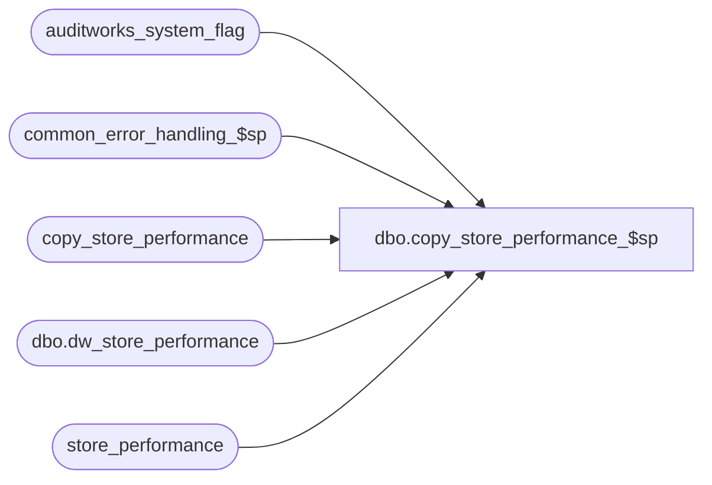

# dbo.copy_store_performance_$sp

**Database:** auditworks_external  
**Server:** bedrockdb01  

## Architecture Diagram



## Table Dependencies

| Referenced Table |
|---|
| auditworks_system_flag |
| common_error_handling_$sp |
| copy_store_performance |
| dbo.dw_store_performance |
| store_performance |

## Stored Procedure Code

```sql
create proc [dbo].[copy_store_performance_$sp] AS

/*********************************************************************************
Proc name:	copy_store_performance_$sp

Description:	To copy the store_performance data to the consolidated server. A cursor will travers
		the table copy_store_performance and post the data by store/date to the consolidated
		server using a view which uses a database link (linked server).
Called by Server Monitor as a scheduled job.
*********************************************************************************
HISTORY

Date     Name		Def#    Desc
Jan21,05 Sab		DV-1203 Author
*/

DECLARE
  @cursor_open			tinyint,
  @errmsg			nvarchar(255),
  @errno			int,
  @message_id			int,
  @object_name			nvarchar(255),
  @operation_name		nvarchar(100),
  @process_name			nvarchar(100),
  @process_no			smallint,
  @rows				int,
  @scaleout_flag		int,
  @store_no			int,
  @transaction_date		smalldatetime

SELECT	@cursor_open = 0,
	@process_name = 'copy_store_performance_$sp',
	@message_id = 201068,
	@process_no = 270

SELECT @scaleout_flag = CONVERT(int,flag_numeric_value)
  FROM auditworks_system_flag
 WHERE flag_name = 'scaleout_flag'

SELECT @rows = @@rowcount, @errno = @@error
IF @errno != 0
  BEGIN
    SELECT @errmsg = 'Failed to select scaleout_flag from auditworks_system_flag',
           @object_name = 'auditworks_system_flag',
          @operation_name = 'SELECT'
    GOTO error
  END

IF @rows = 0
  BEGIN
    SELECT @errmsg = 'Invalid setup. Missing scaleout_flag.',
	   @object_name = 'auditworks_system_flag',
	   @operation_name = 'SELECT'
    GOTO error
  END

IF @scaleout_flag = 0
  RETURN

CREATE TABLE #str_date (
	store_no		int not null,
	transaction_date	smalldatetime not null)

INSERT INTO #str_date (
	store_no,
	transaction_date)
SELECT 	store_no,
	transaction_date
  FROM  copy_store_performance

SELECT @errno = @@error
IF @errno != 0
 BEGIN
   SELECT @errmsg = 'Failed to INSERT #str_date',
	  @object_name = '#str_date',
	  @operation_name = 'INSERT'
   GOTO error
 END

/*  cursor on copy_store_performance to post the store performance data to the consolidated server */
DECLARE str_date_crsr CURSOR FAST_FORWARD FOR
 SELECT store_no, transaction_date
   FROM #str_date

OPEN str_date_crsr

SELECT @errno = @@error
IF @errno != 0
 BEGIN
   SELECT @errmsg = 'Failed to open str_date_crsr on #str_date',
	  @object_name = 'str_date_crsr',
	  @operation_name = 'OPEN'
   GOTO error
 END

SELECT @cursor_open = 1

WHILE 1=1
BEGIN
  FETCH str_date_crsr INTO
	@store_no,
	@transaction_date

  IF @@fetch_status <> 0
    BREAK

  /* First delete any rows that exist for that store/date on the consolidated server */
  DELETE FROM dbo.dw_store_performance
   WHERE store_no = @store_no
     AND transaction_date = @transaction_date

  SELECT @errno = @@error
  IF @errno != 0
   BEGIN
     SELECT @errmsg = 'Failed to DELETE linked server store_performance',
	    @object_name = 'store_performance',
	    @operation_name = 'DELETE'
     GOTO error
   END

  /* Then we can insert the row to the consolidated server */
  INSERT INTO dbo.dw_store_performance (
	 store_no,
	 transaction_date,
	 net_sales_amount,
	 gross_discountable_amount,
	 gross_sales_units,
	 gross_sales_qty,
	 discount_amount,
	 net_return_amount,
	 net_fee_amount,
	 net_sales_return_amount,
	 units_per_transaction,
	 net_sales_avg,
	 discount_pct,
	 net_return_pct,
	 net_fee_pct,
	 net_revenue_amount,
	 first_date_of_week)
  SELECT store_no,
	 transaction_date,
	 net_sales_amount,
	 gross_discountable_amount,
	 gross_sales_units,
	 gross_sales_qty,
	 discount_amount,
	 net_return_amount,
	 net_fee_amount,
	 net_sales_return_amount,
	 units_per_transaction,
	 net_sales_avg,
	 discount_pct,
	 net_return_pct,
	 net_fee_pct,
	 net_revenue_amount,
	 first_date_of_week
    FROM store_performance
   WHERE store_no = @store_no
     AND transaction_date = @transaction_date

  SELECT @errno = @@error
  IF @errno != 0
   BEGIN
     SELECT @errmsg = 'Failed to INSERT linked server store_performance',
	    @object_name = 'store_performance',
	    @operation_name = 'INSERT'
     GOTO error
   END

  DELETE FROM copy_store_performance 
   WHERE store_no = @store_no
     AND transaction_date = @transaction_date

  SELECT @errno = @@error
  IF @errno != 0
   BEGIN
     SELECT @errmsg = 'Failed to DELETE local store_performance',
	    @object_name = 'store_performance',
	    @operation_name = 'DELETE'
     GOTO error
   END
END -- WHILE 1=1

CLOSE str_date_crsr
DEALLOCATE str_date_crsr
SELECT @cursor_open = 0

RETURN

error:	/* Common error handler */
	IF @cursor_open = 1
	BEGIN
	  CLOSE str_date_crsr
	  DEALLOCATE str_date_crsr
	END

	EXEC common_error_handling_$sp @process_no, @errno, @errmsg, 0, @message_id, 
					@process_name, @object_name, @operation_name
	RETURN
```

